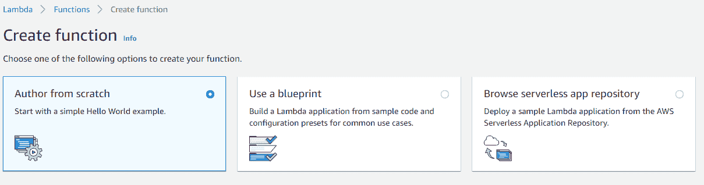

# 如何使用 AWS 免费构建自动化数据管道

> 原文：<https://medium.com/analytics-vidhya/how-to-build-an-automated-data-pipeline-for-free-using-aws-8976350f006b?source=collection_archive---------14----------------------->

昆腾·德格拉夫在 [Unsplash](https://unsplash.com?utm_source=medium&utm_medium=referral) 上的照片

数据管道只不过是数据从一个系统流向另一个系统。作为一名数据工程师，我们经常需要构建或维护传统上称为 ETL 管道的数据管道。

在本文中，我将展示 ETL 过程，以及如何使用 AWS 无服务器服务(如 Lambda)和存储服务(如 S3)来实现自动化。

我是一个初学者，想利用这次全球疫情期间在家的时间从头开始创建一个数据管道。

我将使用来自外部 API 的 Covid19 数据集(您需要有 API 主机和密钥)

[https://新冠肺炎-冠状病毒-statistics . p . rapidapi . com/v1/stats](https://covid-19-coronavirus-statistics.p.rapidapi.com/v1/stats)

由于数据很少，AWS 中的大多数服务都是免费的。本文的主要目的是通过调用一个外部 API 来提取数据，将原始的 JSON 响应存储到一个 S3 桶中，并将提炼后的数据转换和存储到 S3 中。我们还将安排流水线，使其完全自动化。

**注意**:我们需要一个 **AWS** 账户(需要一张信用卡)和一点 python 知识。

在弄脏我们的手之前，让我们看看我们的架构。

这是我们的数据管道，它使用 AWS Lambda Python 函数从 API 提取数据，并将其存储到 S3 原始文件夹中。然后，我们使用另一个 Lambda 函数从原始文件夹中读取信息，并将其转换为更有组织性的 CSV 格式，然后存储到 S3 rfnd 文件夹中。然后，我们利用 AWS Quicksight 快速创建一个可视化仪表板。

**创建 Lambda 函数的步骤:**

转到 AWS 控制台，键入 AWS Lambda。点击**创建功能**

我们可以从头开始选择一项功能，或者使用现有蓝图，或者从无服务器应用存储库中浏览。我们将从头开始创建一个函数。

因为我们正在创建一个 python 函数，所以我们将选择 python3.6 作为环境。给一个函数名。

说到角色，我们可以创建一个具有基本 lambda 权限的新角色，它创建所有日志并上传到 Amazon CloudWatch 日志。我们还可以创建新的自定义角色或从现有角色中选择。对于这个项目，我们将创建一个具有基本 lambda 权限和 s3 读写权限的新角色，因为我们的 lambda 函数将在 s3 中读写对象。*(花了大约 4-5 个小时才发现我们需要 s3 权限来访问我们的 s3 存储桶:p)*

此外，如果您无法从 lambda function 创建角色，请转到 IAM，创建一个具有[awslambdabasiceexecutionrole](https://console.aws.amazon.com/iam/home?#/policies/arn%3Aaws%3Aiam%3A%3Aaws%3Apolicy%2Fservice-role%2FAWSLambdaBasicExecutionRole)和 [AmazonS3FullAccess](https://console.aws.amazon.com/iam/home?#/policies/arn%3Aaws%3Aiam%3A%3Aaws%3Apolicy%2FAmazonS3FullAccess) 权限的新角色。

现在，从选项中选择“使用现有角色”并选择您刚刚创建的角色。

创建一个函数后，你可以内联编辑代码或者压缩整个包并上传到这里。因为我们使用 python 中的 requests 模块来发送 HTTP 请求，所以我们将使用“pip install requests -t”下载文件夹中的“requests”模块。我们所有的包和 lambda 函数必须在我们的根文件夹中，所以复制所有的内容并粘贴到我们的根文件夹中，然后删除那个文件夹。

新的文件夹结构如下所示。

现在粘贴你的 python 代码，它将 HTTP 请求发送到 lambda_function.py 中的外部 API。

通过点击“**选择一个测试事件**和“**配置测试事件**，创建一个测试功能。可以只给“test”:“test”JSON。

**注:**

*   上传 zip 文件夹时最常见的错误是代码有缩进问题。您可以重新键入所有内容，或者再次使用制表符来更正缩进。
*   每次你修改代码时，确保通过 ctrl+s 保存你的代码，同时保存你的 lambda 函数。

如果一切正常，您可以看到 200 响应，您的响应 JSON 将存储在 s3 bucket raw 文件夹中。

**创建另一个 Lambda 函数以转换并存储为 CSV:**

按照上述步骤创建另一个 Lambda 函数，该函数以 CSV 格式读取数据并将其存储到 rfnd 文件夹中。完成这项工作的代码如下。

**使用 AWS CloudWatch 事件和 Lambda 触发器实现管道自动化。**

现在，如果希望 lambda 函数定期执行，可以使用 AWS CloudWatch 事件来调度 cron 作业。单击触发器并选择 AWS CloudWatch 事件。

创建新规则。给出规则名称和规则描述。选择计划表达式作为规则类型

我安排我的 lambda 在每天下午 07:00 运行" **cron(0 19 1/1 *？*)** ”。您可以使用 [Cron Maker](http://www.cronmaker.com/?1) 来生成您的表达式并添加触发器。

下一部分是每当这个 lambda 函数执行并将原始信息存储到 raw 文件夹时，我希望我的第二个 lambda 函数触发。

添加触发器并选择 S3 服务，并提供存储桶信息以及前缀和后缀参数。

**使用 AWS Quicksight 进行可视化:**

现在，您的 rfnd 文件夹中已经有了 CSV 文件，是时候使用 Quicksight 可视化数据了。转到 Quicksight 并单击 new analysis。添加新数据集。选择您的数据源，在本例中是 s3。

输入数据源的名称，并上传包含 S3 存储桶位置和文件格式信息的清单文件。

选择地理空间视觉类型，并将城市的地理空间字段和确认(总和)作为您的大小。

最终的可视化看起来像这样

***恭喜*** ，您已经使用 AWS 免费层免费创建了自己的自动化数据管道。

> 我知道你可能会很高兴与你的朋友分享你的想象，但不幸的是， ***Quicksight*** 不会让你这么做。Quicksight 没有任何免费层，因此不要共享或添加任何人到此控制面板，因为 Quicksight 定价模式是基于“每个用户”的

**注**:

这是我第一次使用 AWS 和无服务器模型从头开始创建数据管道。在这方面我学到了很多东西。请让我知道你对这个或任何其他更好的方法的想法。