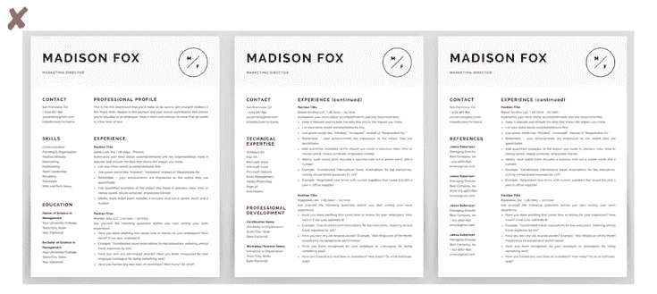
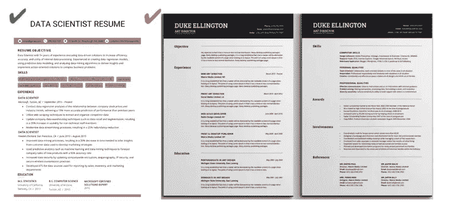
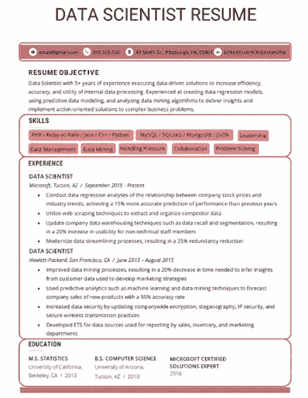
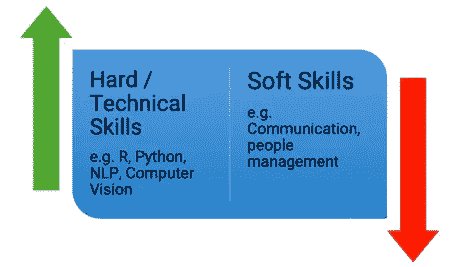

# 如何打造一份有效的数据科学简历？决定你的应用成败的 4 个关键因素

> 原文：<https://medium.com/analytics-vidhya/how-to-build-an-effective-data-science-resume-fde1785ba46e?source=collection_archive---------3----------------------->

# 概观

*   你如何建立一份有效的、强有力的数据科学简历来赢得招聘人员的青睐？这里有 4 个你应该知道的关键方面
*   我们分析了数以千计的数据科学简历，并与多个招聘人员交谈，以了解如何制作理想的简历
*   这是“ [Ace 数据科学面试](https://courses.analyticsvidhya.com/courses/ace-data-science-interviews?utm_source=blog&utm_medium=how-to-build-effective-data-science-resume-4-key-aspects)课程的一部分，我们将指导您如何登陆并通过下一次面试

# 介绍

你正在申请[数据科学](https://courses.analyticsvidhya.com/courses/introduction-to-data-science-2?utm_source=blog&utm_medium=how-to-build-effective-data-science-resume-4-key-aspects)的工作，但是没有接到任何你想要的职位的电话吗？这是有抱负的数据科学专业人士最大的抱怨之一。不管你申请的是什么职位(数据科学家、数据工程师、数据分析师等等。)—清除第一个障碍是一个重大障碍。

如果你发现自己处于类似的位置，很有可能招聘人员会忽略你的简历。这是获得数据科学面试最重要的一个方面。一份糟糕的简历或者太多不相关的细节会让你的简历被拒绝。

好消息是，制作完美的数据科学简历是一项你可以学习的技能！一旦你知道如何熟练地更新你的简历，你就能在申请下一份数据科学工作时有效地推销你的技能。

现在，我将带您一步一步地构建一份出色的数据科学简历。如果你真诚地遵循这个过程，你的简历很有可能会给潜在的招聘者留下好印象。

*如果你正在努力获得或通过数据科学面试，我们已经为你策划了完美的课程。“* [*王牌数据科学面试*](https://courses.analyticsvidhya.com/courses/ace-data-science-interviews?utm_source=blog&utm_medium=how-to-build-effective-data-science-resume-4-key-aspects) *”课程融合了我们参加数百次面试的经验，可帮助您获得梦想中的数据科学职位。*

# 目录

1.  你的数据科学简历的结构
    1.1 简历的合适长度是多少？
    1.2 创建差异化区域
2.  向您的数据科学简历添加内容和信息
    2.1 信息优先排序
    2.2 让您的内容清晰明了
3.  从行业专家那里获得反馈
4.  构建您的数字形象

# 思考你的简历的一个好方法是把它看做一个不动产

这是一种非常直观的制作简历的方式。让我解释一下。在任何房子里，你都有一个固定的区域和一个平面图。你需要确保所有的东西都整齐地摆放在你可用的空间里。

> 同样， ***你的简历空间有限，你应该明智地使用它，有效地讲述你的故事。***

当我们完成下面的步骤时，请记住这个类比。

# 1.数据科学简历的结构

首先要考虑简历的整体结构。这将帮助我们计划我们应该包括的不同部分，以及这些部分应该有多长(或多短)。

# 简历的合适长度是多少？

在制作简历时，最常见的一个难题是简历的长度应该是多少？理想情况下，**一页就足够了**。如果你的简历简明扼要，就能确保面试官或招聘人员阅读的是你希望他们阅读的内容。

推荐一页的简历，两页的也可以。任何超过两页的内容都会增加你的简历被拒绝的几率。以我的经验来看，制作一份多页简历通常会被招聘人员浏览一遍——这不是一个理想的情况。

看看下面的简历。它一直延伸到 3 页。这是非常不可取的，会给招聘人员或面试官留下不好的印象:

现在，看看下面的简历。这正是数据科学招聘人员想要的。浏览一下，了解一下你的技能和能力变得非常容易。考虑到招聘人员每周要分析数百份简历，这就是他们关注的事情。

所以，尽量只保留简历上的相关信息。例如，如果你申请的是 NLP 职位，就没有必要提及你在大学时是如何学习会计学的。空间绝对重要——明智地使用它。

但是，如果你所取得的成就和所做的事情对于一页纸来说太多了呢？我的建议是——不要犹豫删减内容，只保留那些与你申请的工作相符的细节。

# 创建差异化区域

一旦你选择了你想在简历上显示的信息，是时候在简历上确定合适的部分或区域来放置你的经历和信息了。

以下是您在准备数据科学简历时应该考虑的几个要点:

*   确保联系方式尽可能少占空间，并提及你当前所在的城市，而不是你的完整地址
*   你的简历也应该有一个目标，但不应该超过 2 到 3 行
*   简历中其他你不应该错过的领域有:
    -你的工作经历
    -项目
    -教育
    -技能组合
    -奖项和成就
*   您还可以包括一些可选部分，如:
    -您在数据科学黑客马拉松中的表现
    -对开源项目的贡献
    -社区参与
    -爱好和兴趣
    -参考资料
*   你可以在简历中省去的东西:
    -软技能
    -你的照片

# 2.向简历添加内容和信息

简历的核心部分来了——你在数据科学方面的经验和项目。同样，将所有内容放入一个页面的能力将会派上用场。但是你怎么能这样做呢？我们来看看吧！

## **信息优先级**

让我们注意一下你应该在上面讨论的每一个部分放什么。这个练习至关重要，因为你想尽可能多地讲述自己，而不包括任何不相关的信息。最重要的是，由于简历上的空间限制，你甚至可能不得不牺牲一些相关和重要的信息。

因此，区分简历上应该显示什么和不应该显示什么是至关重要的一步。这不仅取决于你的知识和工作经验，还取决于你希望申请的工作的性质。

例如，假设你从事一个[自然语言处理(NLP)](https://courses.analyticsvidhya.com/courses/natural-language-processing-nlp?utm_source=blog&utm_medium=how-to-build-effective-data-science-resume-4-key-aspects) 问题，你申请了一个 NLP 数据科学家的职位。然而，你简历中提到的大多数项目都与基本的机器学习挑战有关。这对你来说是一个非常危险的情况，因为招聘人员很可能会拒绝你的简历，因为他不会知道你甚至可以处理 NLP 任务。

我完全理解遗漏信息是很困难的。但这是我们想要得到梦想角色时必须付出的代价。所以，让我们看看在简历的不同部分，我们应该包括什么样的信息，不包括什么:

*   在中，你应该专注于你的技术技能或硬技能(而不是软技能)。如今，几乎每个求职门户网站都会根据硬技能或与硬技能相关的关键词来筛选简历

*   同样，在**经验部分**，查看你过去做过的项目，选择与你申请的职位最相关的项目或职位。如果你需要围绕这些项目添加细节，只需用一两句话或要点来解释。 ***注意:不要添加任何不涉及数据科学或分析问题解决的项目。从招聘者的角度来看，这几乎没有增加任何价值***
*   您还应该添加相关认证、您的博客(如果有)、学术成就或在数据科学竞赛中的表现

厉害！简历的基本模板准备好了。那么，下一步是什么？你的简历应该充满冲击力，所以让我们来看看如何让它更有影响力。

## 让你的内容清晰明了

为了让你的简历在众多候选人中脱颖而出，请结合我提到的以下几点:

*   用**主动语态**代替被动语态。这有助于保持句子更短，更容易阅读。这会让简历看起来更注重行动
*   你应该在简历中量化你在每个项目中所取得成就的独特性和益处。例如，你可以提到你的项目对业务的影响，比如收入的**增加**、成本的**减少**或者投资的**回报**。这一点很重要，因为作为数据科学专业人员，这是你经常要做的事情。你将把模糊的问题转化为数据科学问题——所以用你的简历展示你的行业准备心态

# 3.从行业专家那里获得反馈

现在你的简历已经完成并准备好了，还有最后一步需要你去执行——在你的简历上获得实用的、有经验的反馈。这一点很重要，因为当我们全心全意、真诚地做某件事时，我们往往会忽略它的缺陷和不足。这是人类的趋势。纠正这个问题的唯一方法是让合适的人来检查你的工作。

例如，在 Analytics Vidhya，一旦我写了一篇关于某个项目的博客文章，我会让我的队友反复检查和审阅。这给我的想法增加了一个新的视角，我收到的反馈对我进一步为社区改进文章帮助很大。

因此，要创建一份可靠的数据科学简历，必须让行业专家、数据科学家、主题专家等审阅。这就是你的网络技能有用的地方。与业内人士分享你的简历，并听取他们的反馈。

向这些人提出具体的问题。例如，你可以问五个项目中的哪三个应该出现在你的简历上。或者你如何量化你在大学或以前的组织中完成的某项任务。

# 4.构建您的数字形象

到目前为止，我们已经看到了创建优秀数据科学简历的基本要素。然而，在当今世界，仅仅有一份好的简历可能还不足以获得梦寐以求的面试机会。尤其是如果你申请的是数据科学家的职位。

> 你的简历应该补充你的 ***数字简介*** *为好。*

我们生活在一场数字革命中，并且正在蓬勃发展。很显然，招聘过程也会包括这一点，对吗？

让我给你举个例子。我每周都参加相当多的数据科学面试。在我打电话或进入面试室之前，我总是检查两件事:

*   候选人的 GitHub 简介，以及
*   他/她的 LinkedIn 个人资料

我另外查看了这两个平台上提到的项目。项目与当前角色相关吗？这有助于我想象候选人的个人资料，这样我就可以以某种方式组织我的问题。我还可以判断候选人在简历中提到的技能是否反映在他们的 GitHub 个人资料中。

要建立一个令人印象深刻和强大的数字档案，你可以从以下想法中得到启示:

1.  你需要在 LinkedIn 上有良好的形象。大多数面试官更喜欢在面试前查看你的 LinkedIn 个人资料(我们与多个招聘人员交谈过，可以证实这一点)
2.  构建一个 GitHub 概要文件。在这个平台上分享你的个人项目和全部代码
3.  维护关于数据科学的博客。与数据科学社区分享您的知识。这有助于建立你自己的品牌
4.  定期在 Discuss、StackOverflow 和 Quora 等平台上回答和解决与数据科学相关的问题

这不是一个详尽的列表。也可能有其他方法和工具来增强你的数字形象。然而，请记住，你正在建立这个数字档案，以确保当你去面试时，它应该反映你的专业知识。

> *在每个主要平台维护你的个人资料也是不可行的。因此，在塑造你的数字档案时，你必须有所选择。*

但是现在让我们来解决这个问题——LinkedIn 和 GitHub 个人资料是强制性的。毫无疑问。除了这两个，你也可以出现在博客、播客或 YouTube 上(但最好是有个人资料，而不是强制性的)。

# 结束注释

这篇文章应该是你的数据科学工作申请过程的一个很好的起点。正如我前面提到的，如果你想得到梦寐以求的数据科学工作，拥有一份可靠、相关和有影响力的简历是必不可少的。

但这是整个数据科学面试过程中的一步。有多轮你应该知道(并做好准备)，如:

*   电话采访
*   分配
*   现场面试(通常有几轮)
*   面试后

诸如此类。我们已经在全面的“ [Ace 数据科学面试](https://courses.analyticsvidhya.com/courses/ace-data-science-interviews?utm_source=blog&utm_medium=how-to-build-effective-data-science-resume-4-key-aspects)课程中涵盖了这些步骤。本课程还有一些讲义来补充你的学习，包括一份包含 240 多个问题的综合面试指南。所以今天就开始你的面试准备吧！

*原载于 2019 年 7 月 8 日*[*【https://www.analyticsvidhya.com*](https://www.analyticsvidhya.com/blog/2019/07/how-to-build-effective-data-science-resume-4-key-aspects/)*。*