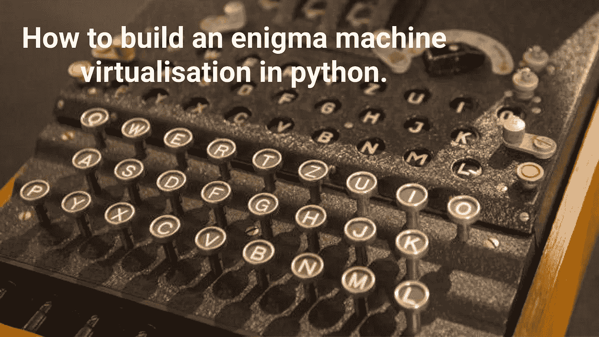
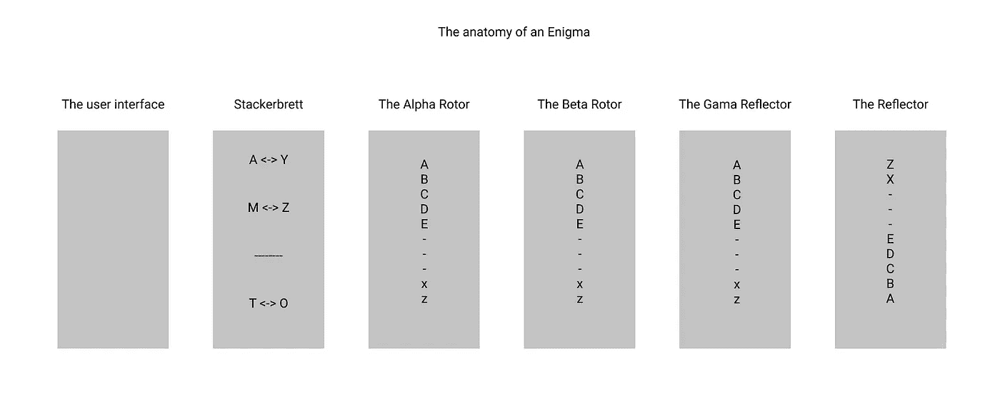
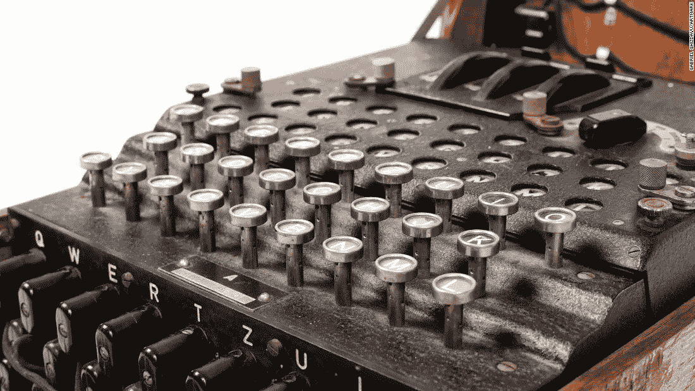
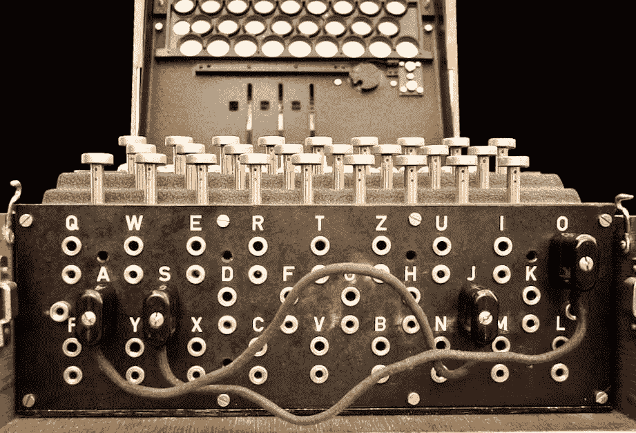
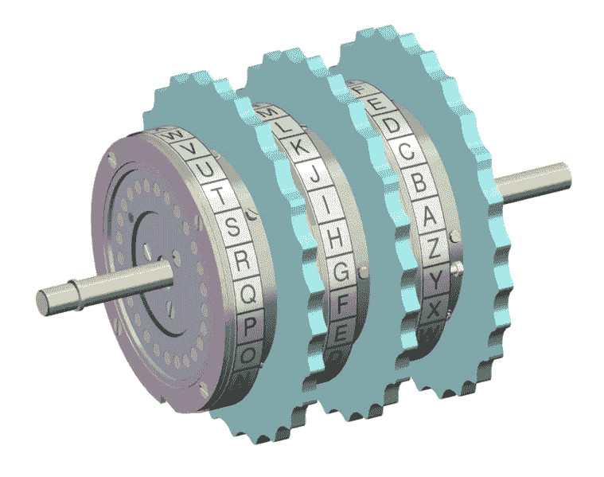
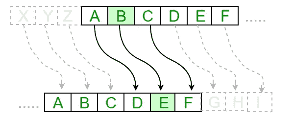
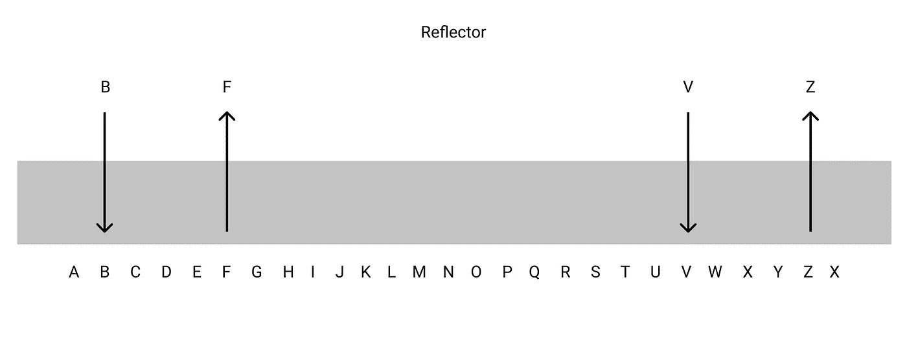
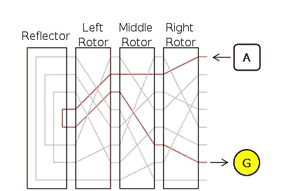

# 如何用 python 构建一个 enigma 机器虚拟化？

> 原文：<https://medium.com/analytics-vidhya/how-to-build-an-enigma-machine-virtualisation-in-python-b5476a1fd922?source=collection_archive---------1----------------------->



1939 年至 1944 年是人类历史上的黑暗时期。第二次世界大战杀死了 6000 万人。但是如果盟军没有破解纳粹德国制造的最强大的机器之一——英格玛，这可能需要 5 年多的时间。

恩尼格玛——那个时期最强大的加密设备之一。由亚瑟·谢尔比乌斯和 T2·理查德·里特发明，起初德国海军并没有注意到它的发明。但是在 1926 年，海军开始建造自己的“谜”。这给了德国军队在这场血腥战争中的巨大优势。

恩尼格玛有一套非常复杂的加密和解密信息的方法。打破它花费了大量的时间和脑力。但最有趣的事实是，它基于一种最脆弱的加密算法——**凯撒密码**。

## 因此，在这篇文章中，我想解释一下 enigma 是如何以一个 3 转子的 enigma 为例工作的，同时展示你如何用 python 自己创建一个 Enigma。

# 对谜的剖析

基本上，英格玛由 4 个主要部分组成——一个用户界面，一个 *Steckerbrett，* 3 转子(可能更多)和一个反射器。每一部分都在做一个特定的任务，但是把它们放在一起，它们就可以加密一条信息，如果不知道恩尼格玛密码机的初始设置，就不可能解密这条信息。



对谜的剖析

恩尼格玛的主要特征之一是，为了正确解密，用户需要恩尼格玛在信息加密时的初始设置。如果一个设置不同，那么整个任务就变得不可能。

让我们开始吧。

# 用户界面



英格玛键盘。

用户界面非常简单——由 26 个字母的键盘表示。它用于在机器中插入输入。而且，按下的键激活改变第一转子状态的机构，使其旋转一个单元，因此在每次按下某个按钮后改变加密密钥。

# **斯特克尔布雷特**



斯特克尔布雷特

stackerbrett 是套接字的表格，是另一种机制，它被创建来使解密机制更加困难。但实际上这是机器最薄弱的部分。它是一种连接两个字母的机制，一个来自输入层，另一个来自输出层。把输入的字母编码成与之相连的输出层，而不使用机器的下一部分。然而，即使按下这样一个字母，转子还是会转动。

# **转子**



英格玛转子。

转子是带有 26 个销的特殊齿轮。每一枚别针都与一个英文字母有关。当电信号(在机械机器中)到达一个转子时，它将被传递到同一位置的下一个转子。在位置(0，0，0)处，每个字母将被编码为其自身。但是在状态(1，0，0)下，字母 A 将被编码为 B，B 被编码为 C，依此类推。但是等等，为什么？

答案在于加密的凯撒密码算法。让我们来看看它是如何工作的。

首先我们需要一个有序的字母表→ A B C D E F G H …

现在，为了加密，我们需要一个密钥 K，我们将用它来加密我们的消息。K 是一个正整数，它将每个字母编码为第一个字母之后 K 步之后的字母。在下图中，K = 3。



K = 3 时的凯撒密码

在上面的例子中，A 将被 D 代替，B 被 E 代替，C 被 F 代替，依此类推。

这样，每个转子加密信息。算法中置换的变量 K 实际上是从 0 状态开始的圈数。

但这还不是结束，在第一个转子每旋转 26 次后，第二个转子也旋转一次。

第三个转子也是如此，第二个转子每转 26 圈，它就转一圈，但第一对转子不太可能，当第三个转子转一圈时，第二个转子也转一圈。

# **反射器**

反射器是谜的另一部分。它实际上给了机器使用相同的加密和解密设置的机会。它的工作方式如下:



反射器的结构。

# **这一切是如何运作的？**

有很多部分，每一个都有自己的工作原理，你可能会弄不清楚它们是如何协同工作的。这比你想象的要容易，所以让我们从头开始。

假设我们在键盘上按一个字母。如果它连接到 stackerbrett，那么它将被编码为这个连接的结束字母。如果没有，它将通过转子，在每个转子后改变自己。当字母从第三个转子出来后，它进入反射器，在那里它随着它的反射而改变。然后反射进入 3 号转子，然后改变它，第二个和第一个转子也会改变它，给出新的加密。



谜究竟是如何诠释一个角色的？

现在让我们用代码实现它。

# Python 代码。

首先，我们需要导入必要的库和包。

```
# Importing all libraries
# We need ascii_lowercase from string to get the english alphabet
from string import ascii_lowercase
# We need json library to add the possibility for enigma to import settings from a json format
import json
```

*   From string — ascii_lowercase —用于生成字母表。
*   json-用于从 JSON 格式的文件中上传 enigma 设置。

之后，我们创建一个类——enigma，它将代表我们的 enigma，以及用于设置 enigma 的 __init__ 函数，其中我们必须设置字母表( **self.alphabet** )和 stecker Brett(**self . stecker Brett**)。有三种方法:

*   从文件—从 json 文件导入所有设置。

```
def __init__(self, steckerbrett = {" ":" "}, settings_file=None, alpha=None, beta=None, gama=None):
    *''' The initial setting of enigma before the encryption '''* # Creating a list of all alphabet letters
    self.alphabet = list(ascii_lowercase)

    '''
        Steckerbrett is a system of sockets that connects pairs of letters that are interchanged between them,
        without going throw all the rotors of enigma
    '''
    self.steckerbrett = steckerbrett
    if settings_file != None:
        ''' If the setting sites is got then we load the setting from it as a json format '''
        try:
            # I verify if there is a such file with setting that we got
            self.settings = json.load(open(settings_file, 'r'))[0]
        except IOError as e:
            # The first enigma error - There is no such a settings file
            print("Enigma Error 1: There is no such setting file")
        finally:
            # steckerbratt -> a dictionary with pairs of interchangeable pairs of letters
            self.steckerbrett = self.settings['steckerbrett']
            # Setting the states of rotors
            self.alpha = self.settings['alpha']
            self.beta = self.settings['beta']
            self.gama = self.settings['gama']
```

*   手动设置。

```
elif alpha != None and beta != None and gama != None and steckerbrett != None:
    ''' Setting the rotors and the steckerbrett manually '''
    if type(steckerbrett) is not dict:
        self.steckerbrett = {" " : " "}
    self.alpha = alpha
    self.beta = beta
    self.gama = gama
```

*   所有转子的默认设置。

```
else:
    # Setting all rotors to base states and steckerbrett to have only space case
    if type(steckerbrett) is not dict:
        self.steckerbrett = {" " : " "}
    rotors = [self.alpha, self.beta, self.gama]
    for rotor in rotors:
        if rotor == None or type(rotor) is not int or type(rotor) is not float:
            rotor = 0
        else:
            rotor = rotor % 26
    self.alpha = rotors[0]
    self.beta = rotors[1]
    self.gama = rotors[2]
```

在 __init__ 函数中，我们必须做的下一件事是在 stackerbrett 中进行最后的更改，并设置反射器。

```
# Making the steckerbrett interchangeable and removing these pairs from the alphabet
for letter in list(self.steckerbrett.keys()):
    if letter in self.alphabet:
        self.alphabet.remove(letter)
        self.alphabet.remove(self.steckerbrett[letter])
        self.steckerbrett.update({self.steckerbrett[letter]:letter})
# Setting the reflector
self.reflector = [leter for leter in reversed(self.alphabet)]
```

排列的下一个功能。加密算法的核心。所有的转子——阿尔法、贝塔和伽马——决定着凯撒密码的密钥——K。

```
def permutate(self, rotor):
    *''' This function is permutatting the alphabet depending on the rotors settings '''* new_alphabet = ''.join(self.alphabet)
    new_alphabet = list(new_alphabet)
    for iter in range(rotor):
        new_alphabet.insert(0, new_alphabet[-1])
        new_alphabet.pop(-1)
    return new_alphabetdef inverse_permutation(self, rotor):
    *''' This function is permutatting the alphabet depending on the rotors settings on the back way '''* new_alphabet = ''.join(self.alphabet)
    new_alphabet = list(new_alphabet)
    for iter in range(rotor):
        new_alphabet.append(new_alphabet[0])
        new_alphabet.pop(0)
    print(self.alphabet)
    print(new_alphabet)
    return new_alphabet
```

# 最重要的部分是加密过程。

首先，我们将文本中的每个字母转换成 lower，并将其转换成一个列表。

```
def encrypt_text(self, text):
    *''' This function encrypts a string '''* encrypted_text = []
    # Text preprocessing
    text = text.lower()
    text.split()
```

之后，我们会仔细检查名单，处理每一封信。如果字母在栈中，那么我们只返回它所连接的值。当然，它会经历一个在英格玛系统中旋转转子的过程。

```
for letter in text:
    # Checking if the letter is in steckerbrett
    if letter in self.steckerbrett:
        # If it is, the we encrypt it as it's pair
        encrypted_text.append(self.steckerbrett[letter])
        # Turning the rotors
        self.alpha += 1
        if self.alpha % 26 == 0:
            self.beta += 1
            self.alpha = 0
        if self.beta % 26 == 0 and self.alpha % 26 != 0 and self.beta >= 25:
            self.gama += 1
            self.beta = 1
```

否则，我们通过每个转子的设置来加密每个字母，我们在字母表中找到该字母的对应索引(当然是在我们从 stackerbrett 中移除字母之后)。我们对每个转子重复这个过程，使用每个前面转子的输出。

```
else:
        # Encrypting throw rotors
        # Letter is encrypted by first rotor
        temp_letter = self.permutate(self.alpha)[self.alphabet.index(letter)]
        # Letter is encrypted by second rotor
        temp_letter = self.permutate(self.beta)[self.alphabet.index(temp_letter)]
        # Letter is encrypted by third rotor
        temp_letter = self.permutate(self.gama)[self.alphabet.index(temp_letter)]
```

在最后一个转子— gamma 返回字母后，它被反射器“反射”,返回该字母的镜像。

```
# Reflector is returning the inverse of that letter
temp_letter = self.reflector[self.alphabet.index(temp_letter)]
```

在那里，我们开始以相反的方式通过转子，按照下一个顺序——伽马、贝塔、阿尔法。

```
# Back way
# Letter is encrypted by third rotor
temp_letter = self.inverse_permutation(self.gama)[self.alphabet.index(temp_letter)]
print("gama - {}".format(temp_letter))
# Letter is encrypted by second rotor
temp_letter = self.inverse_permutation(self.beta)[self.alphabet.index(temp_letter)]
print("beta - {}".format(temp_letter))
# Letter is encrypted by first rotor
temp_letter = self.inverse_permutation(self.alpha)[self.alphabet.index(temp_letter)]
print("alpha - {}".format(temp_letter))
encrypted_text.append(temp_letter)
print(temp_letter)
```

之后，我们只需将列表中所有加密的字母连接起来，就可以得到加密的文本。

现在让我们看一个例子:

```
Enigma = enigma({"b":'a', ' ':' ', 'e':'z'}, alpha=5, beta=17, gama=24)
```

我用手动设置创建了一个 enigma，但是从一个文件设置它也可以。现在让我们加密一个字符串，我选择了一个从我的一个同事那里得到的短语— **“没有时间”。**

```
print(Enigma.encrypt_text('there is no time'))
```

结果是:

```
iuzkz tj on itpz
```

当我向后试的时候，我得到同样的短语:

```
print(Enigma.encrypt_text('iuzkz tj on itpz'))
>>>there is no time
```

成功了，成功了。

# 结论

这个项目对我来说有点挑战性，即使我只用了两天就完成了。首先，我必须理解 enigma 的数学逻辑，然后用 python 实现它。

我想说的另一件事是，使用 python 你可以很容易地虚拟化几乎所有东西，甚至是一台花了 4 年时间解密的机器。我真的邀请你在我的 [github](https://github.com/ScienceKot/Enigma.git) 上研究 enigma 的全部代码。还有一个功能——如何加密一个. txt 文件。

谢谢大家。