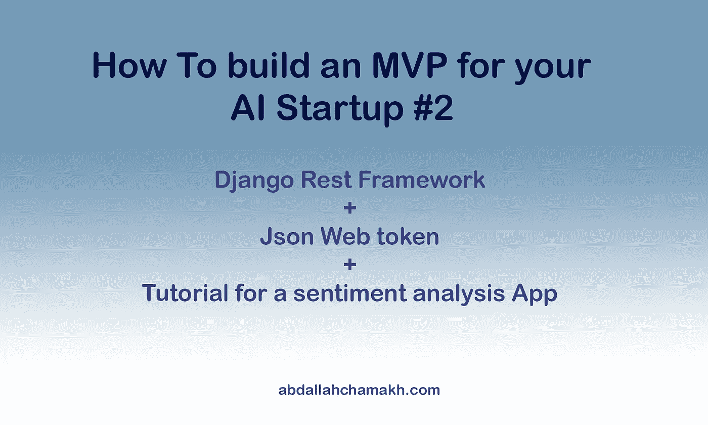

# 如何为你的人工智能创业公司建立 MVP # 2(DRF+JWT+情绪分析应用教程)

> 原文：<https://medium.com/analytics-vidhya/how-to-build-an-mvp-for-your-ai-startup-2-drf-jwt-authentication-f5179dd537a8?source=collection_archive---------15----------------------->

嘿，伙计们，我们又回到了另一篇关于为你的人工智能初创公司构建 MVP 的文章，在这篇文章中，我们学习了 Restful API，它是你的 web 应用程序中远程访问你的人工智能模型的关键组件。我们还将看到如何用 DjangoRestFramework 和 DjangoRestFramework-JWT 建立一个认证系统

摘要

*   什么是 restful API，为什么它首先对我很重要？
*   理解 Django Rest 框架
*   什么是 JWT？什么是 DjangoJsonWebToken
*   如何构建一个 restful API 来访问带有 jwt 身份验证系统的情感分析模型，并使用 python 客户端脚本来连接它

## 什么是 restful API，为什么它首先对我很重要？

作为一个概念，API 是一种接口函数的方式，而不知道它是如何工作的，这很奇怪？我明白，但请耐心听我说。请注意，你是在没有正确理解你的眼睛是如何工作的情况下用你的眼睛来阅读这篇文章的，同样的概念也适用于软件世界，尤其是在 web 开发中，开发人员总是使用外部 restful APIs 来为其他服务(如 stripe)在其 web 应用程序中添加支付功能，而不知道 Stripe 系统内部是如何工作的，但他们也可以创建自己的 API，用于内部目的，使他们的应用程序可以跨许多平台(浏览器、android、iOS、桌面)使用，或用于外部目的，让其他开发人员访问它。

API 实际上是一组端点，让您通过 HTTP 调用以 JSON 格式在应用程序的数据库中执行 CRUD(创建、检索、更新、删除)

为你的 MVP 创建一个 restful API 是至关重要的，让你的用户通过一个客户端应用程序进行交互，比如 React 应用程序，我们将在下一篇文章中讨论

## 理解 Django Rest 框架

在我们开始之前，我希望你熟悉 Django，否则我鼓励你看看我在这个系列的第一篇文章，我详细解释了 Django，然后回来，DRF，它是一个第三方库，帮助你尽快为你的 Django 应用程序创建一个 restful API，还有一个你应该知道的关于 DRF 的组件，它是序列化器，而不是你所知道的关于 Django 的其他组件**那么什么是序列化器呢？**

如你所知，restful APIs CRUD 使用 JSON 格式创建数据库，但问题是，Django 应用程序中的模型(Django 中的数据库表)实例是 python 对象，在这里，序列化程序将 python 对象序列化为 JSON，它们还根据自己的规则验证每个字段，这是一个使用 review 应用程序的示例

关于模型. py

on serializers.py

除了序列化器，Django Rest 框架还附带了自己的 ApiViews 来处理 CRUD，对于每个视图，您可以附加一个权限来限制对这个特定视图的访问

## 什么是 JWT？

JWT 来自 JsonWebToken，这是一种向服务器安全认证用户的流行方法，下面是它的工作原理，客户端在检查用户数据后向服务器发送其凭据，他生成一个令牌，然后将其发送回来，每当用户想要进行需要认证的 Http 调用时，他只需在头上显示令牌即可。

## 如何构建一个 restful API 来访问带有 jwt 身份验证系统的情感分析模型，并使用 python 客户端脚本来连接它

在这个项目中，我们将在一个服务于情感分析模型的真实应用程序上实现我们刚刚学到的关于 DjangoRestFramework 和 jwt 的所有内容

首先，你应该在你的机器上安装 python 3.6 或更高版本，你可以在这里查看官方 python 网站并从那里安装，如果你准备好了，只需遵循以下步骤

*   创建一个 python 虚拟环境，将应用程序的所有相关依赖项打包

`virtualenv venv`

*   激活这个虚拟环境

`venv\scripts\activate`

*   安装应用程序所需的所有依赖项

`pip install django==3.0 DjangoRestFramework Djangojwt pillow`

*   创建您的第一个 Django 应用程序

`Django-admin start project MyApp`

*   创建管理员用户

`python manage.py createsuperuser`

*   创建一个应用程序，并将其命名为推理，这个应用程序的工作是让用户提交一段文本，对其进行预测，并将推理结果保存到数据库中。

`python manage.py startup Inference`

关于模型. py

on serializers.py

关于 permissions.py

on views.py

在 urls.py 上

*   然后，在根 Django 应用程序的 URL 文件中，包括推理应用程序的 URL，还添加了两个与 jwt 相关的路径，一个用于提交您的凭证以获得令牌，另一个用于刷新这个令牌(如果您愿意的话)。

在 MyApp/urls.py 上

*   添加一些配置来完美地运行应用程序

*   运行您的应用程序

`python manage.py makemigrations`

`python manage.py migrate`

`python run server`

*   现在是时候整理 python 脚本来安全地使用这个 API 了，所以创建一个文件名 client.py，并在上面添加以下代码

您可以在这个 [repo](https://github.com/aballah-chamakh/SentimentAnalysisApp) 上拥有客户端和后端的完整应用程序代码

在下一篇文章中，我们将学习如何将芹菜和 Redis 包括在推理的管道中，一如既往，我希望这篇文章鼓励你走出舒适区，开始考虑建立自己的人工智能创业公司。