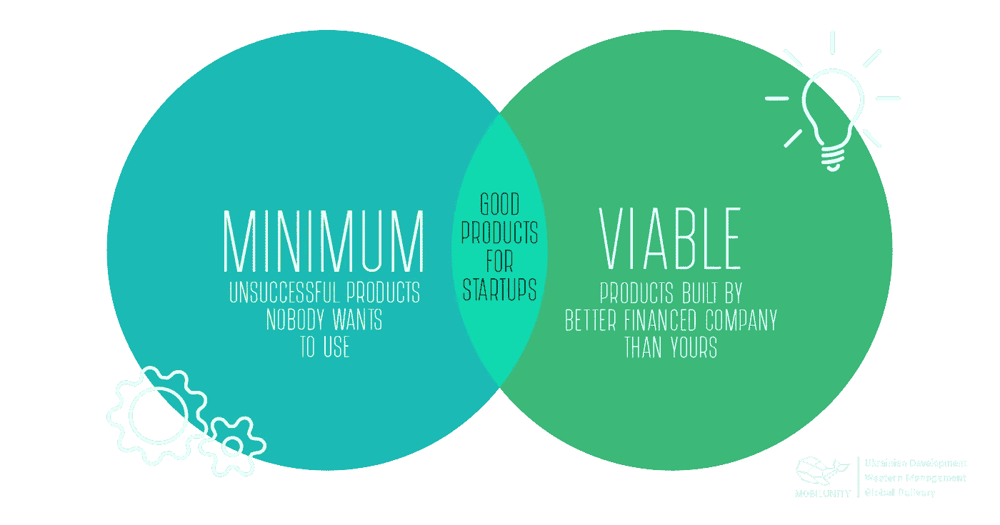
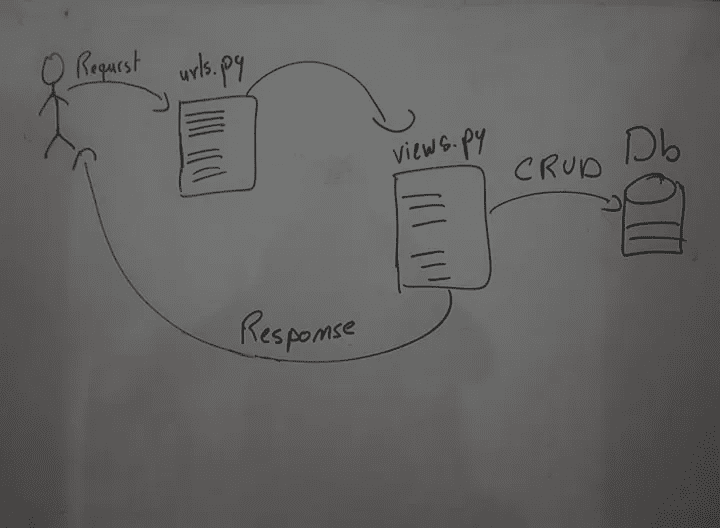

# 如何为你的人工智能创业公司建立一个 MVP(Django+一个图像分类应用的教程)

> 原文：<https://medium.com/analytics-vidhya/how-to-build-an-mvp-for-your-ai-startup-django-tutorial-for-an-image-classification-app-8945d4b8277d?source=collection_archive---------6----------------------->

没有人能充分强调数据科学家的工作有多重要，尤其是在我们这个数据成为新石油的时代，但你的人工智能模型不能独自在你的 jupyter 笔记本上对其他人的生活产生重要影响，这就是为什么你应该学习如何将你的模型包装在 web 应用程序上，部署在服务器上，并提供给你的潜在客户。因此，如果你是一名具有企业家血统的数据科学家，我邀请你关注我的新系列“如何为你的人工智能初创公司建立 MVP”，每周我都会发表一篇新文章，解释关于 web 开发的新概念，以帮助你更接近建立 MVP(最小价值产品)的目标，以在市场上验证你的想法。

在本系列中，我们将使用 Django 作为后端，Django Rest 框架用于设计 restful APIs，Redis & Celery 用于处理异步任务，React js 用于前端，这种组合是 web 开发世界中最流行的堆栈之一，在这篇介绍性的文章中，我将开始解释 Django

## 总结:

*   姜戈是什么
*   姜戈哲学
*   Django 请求-响应周期
*   姜戈建筑
*   用 Django 创建图像分类

## 姜戈是什么？

Django 是一个 python web 框架，在 python 社区中很受欢迎，因为它提供了大量现成的功能，可以让您快速开发应用程序。

## Django 哲学:

*   将你的 web 应用程序分成多个模块，每个模块应该关注你的应用程序的一个单独的功能部分
*   继承 Django 提供的类，并定制它们以满足您的应用程序需求

## Django 应用架构:

您的 Django 应用程序由多个应用程序组成，一个应用程序只是一个 python 模块，每个模块至少包含以下 4 个文件:

models.py:在这里，您以面向对象的编程风格设计数据库表。

py:这里列出了这个应用程序响应的所有 URL，每个 URL 都附带了一个查看功能，每当用户向这个特定的 URL 发出 HTTP 请求时，就会执行这个功能。

views.py:在这里你可以放置你所有的视图，一个包含你的应用程序的业务逻辑的函数或类，它由数据库上的 CRUD(创建、检索、更新、删除)操作组成。

admin.py:您可能不知道 Django 附带了一个管理面板，其中包含您的所有模型，它允许您对这些模型执行 CRUD(模型是您在 models.py 文件上设计的表)，在这个文件上，您应该注册这些模型，以便将它们放在您的 Django 管理面板上。

## Django 请求-响应周期:

关于 Django，你应该学习的一件重要的事情是你的应用程序的请求-响应周期，这将帮助你在开发你的 Django 应用程序时正确地推理。

我在上面的图片中总结了这个循环，因此每当客户端向您的 web 应用程序发出 HTTP 请求时，您的应用程序就会开始将请求的链接与列出的 URL 之一进行比较，当找到匹配的 URL 时，它会运行该 URL 的附加视图，然后当这个函数完成时，它会呈现一个 HTML 页面或 JSON 响应

## 关于姜戈你应该知道的更多事情:

**自动生成的应用程序:**在您创建包含 4 个文件的 Django 应用程序后，默认情况下会生成此应用程序，其中 2 个文件在此阶段对您并不重要，但其他 2 个文件您应该了解更多:

py:这与常规应用程序中的 URL 文件相同，但不同之处在于它作为代理将请求转发给其他 URL 应用程序

settings.py:这个文件包含应用程序完美运行 web 应用程序所需的所有配置。

**templates:** 是一个文件夹，你可以在这里为你的应用组织所有的 Html 页面

**媒体&静态:**两者都是文件夹，一个用于存储动态文件，如个人资料图片，另一个用于存储静态文件，如 js、CSS

## 与 Django 一起开发图像分类应用程序:

如果这是你第一次学习 Django，你肯定还有一些困惑，这就是为什么我们将使用 Django 开发一个图像分类应用程序，并实现我们一直在学习的所有概念，所以让我们开始吧

首先你要在你的机器上安装 python 3.6 以上版本，你可以在这里查看 python 官方网站，从那里安装。

*   创建一个 python 虚拟环境，将应用程序的所有相关依赖项打包

`virtualenv venv`

*   激活这个虚拟环境

`venv\scripts\activate`

*   安装应用程序所需的所有依赖项

`pip install django==2.2 pillow`

*   创建您的第一个 Django 应用程序

django-管理启动项目 MyApp

*   以这种方式在 django 应用程序中创建模板、媒体、静态和静态文件文件夹:

//图像

*   创建一个应用程序，并命名为推理，这个应用程序的工作是让用户提交一个图像，对这个图像进行预测，并将结果保存到数据库中。

`python manage.py startapp Inference`

关于模型. py

on forms.py

在这里，图像预测发生在 create 函数内部

on views.py

在 urls.py 上

在 admin.py

*   创建推理应用程序所需的所有模板

list.html

detail.html

create.html

update.html

delete.html

*   做一些配置，让 app 完美运行。

在 MyApp/urls.py 上

在 settings.py 上

保持其他设置变量不变，只需更改上面的设置

*   运行您的应用程序

`python manage.py makemigrations`

`python manage.py migrate`

`python run server`

搞定了。！

在下一篇文章中，我们将尝试 Django rest 框架，学习如何创建一个 restful API 并使用 Django Rest 框架进行认证，最后，我希望这篇文章能鼓励你走出舒适区，开始考虑构建自己的 AI 初创公司。