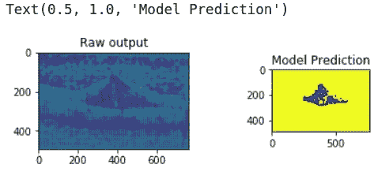

# 如何在 PyTorch 中为自己的数据集构建自定义数据加载器

> 原文：<https://medium.com/analytics-vidhya/how-to-build-custom-dataloader-for-your-own-dataset-ae7fd9a40be6?source=collection_archive---------1----------------------->

## 这篇文章将为你简化数据加载。希望您将学会如何轻松地制作定制的数据加载器，并能够在任何类型的数据集中实现。

图片:[谷歌](https://www.google.com/url?sa=i&rct=j&q=&esrc=s&source=images&cd=&ved=2ahUKEwjCq5Ge_KPkAhUnIbcAHQdkAe4QjRx6BAgBEAQ&url=https%3A%2F%2Fslideslive.com%2F38917690%2Fmultitask-learning-in-the-wilderness&psig=AOvVaw0VNdt9Ejig18GAFXnXGxe5&ust=1567026896623996)

当我第一次开始我的计算机视觉之旅时，自定义数据加载也让我大吃一惊&现在我想起来，这里似乎缺少了一些细节&这可以在理解上产生很大的差异，这显然会反映在代码中。因此，我决定策划一个小帖子来总结我所学到的一切&如果它对你有所帮助，哪怕是最小的帮助，我也会认为这个帖子是一个胜利。

那么，让我们开始吧。

我将在 Pytorch 做一个多标签分类。这里使用的数据集来自 http://people.duke.edu/~sf59/Chiu_BOE_2014_dataset.htm

数据集已被调整为具有以下模式:

**数据集:**

*   **训练→图像|标签(1 类-2 类-3 类)**
*   **测试→图像|标签(1 类-2 类-3 类)**

现在让我们创建自己的定制数据加载器，

首先，**我们将加载图像的&标签路径。**然后我们将创建对应于每一类&图像的矩阵，这样我们将有 n 数组给定形状、顺序和数据类型的 0。
因此，因为我有 3 个类，所以我为标签创建了 3 个矩阵&我有一组原始图像(即我们的基本事实)，因此我们将为其创建一个矩阵。

***还有，你一定注意到了这些值(61，496，768)，它们是什么意思*** *？*

→你一定已经猜到 496*768 是图像的尺寸&我在每个文件夹中都有 61 张图像。

现在，我们需要做的就是遍历每张图片并存储它们的文件路径，这样我们以后就可以很容易地访问它们。
所以，这里我有图像的路径&所有 3 个类的标签路径，正如你可以看到我们的自定义数据集加载器将返回图像，标签 1，标签 2，标签 3

imread()将读取图像。图像应位于工作目录中，或者应给出图像的完整路径，如[文档](https://docs.opencv.org/3.0-beta/doc/py_tutorials/py_gui/py_image_display/py_image_display.html)中所示。

现在，您可以通过将路径传递给数据集中的 train & test 集合来加载您的 train & test 集合。

我使用这个定制数据加载器创建的模型的最终产品

接下来，您需要做的就是加载您自己的模型或者使用预先训练好的模型&代码训练和测试部分！

我希望这篇文章能让你的概念有点清晰&帮助你理解如果提供了自定义数据集，如何加载数据。最后，您可以查看 PyTorch 数据实用程序文档页面，其中有其他的类和函数可供练习，这是一个很有价值的实用程序库。