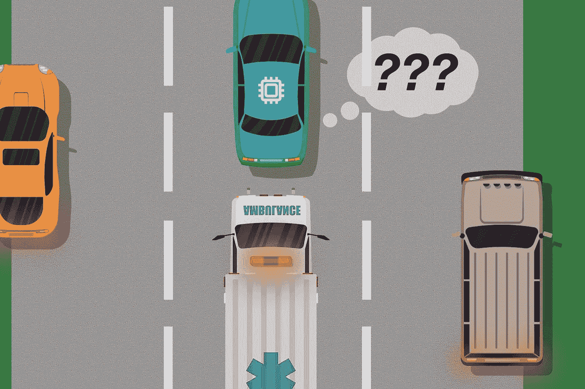
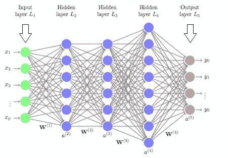
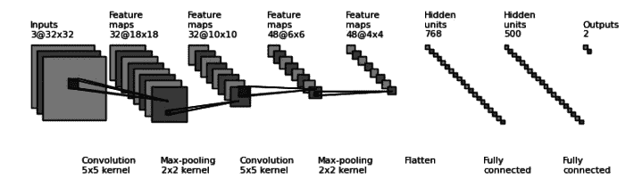
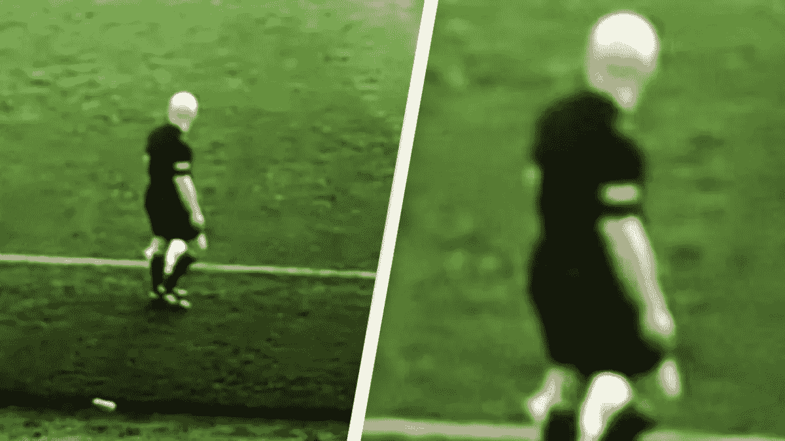
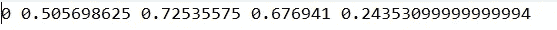
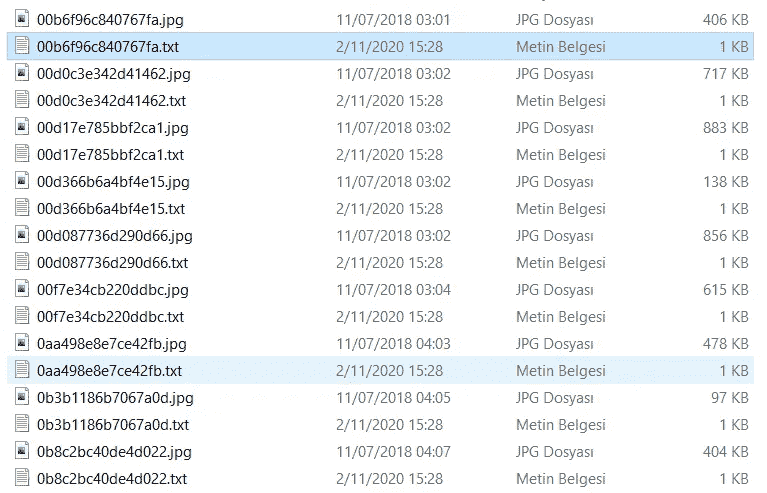
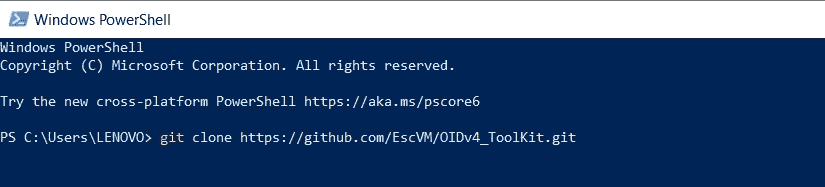
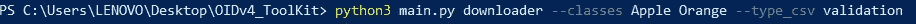

# 如何建立自己的计算机视觉模型？第 1 部分

> 原文：<https://medium.com/analytics-vidhya/how-to-build-own-computer-vision-model-part-1-de9e9d04a5e4?source=collection_archive---------6----------------------->

如何建立自己的计算机视觉模型？让我们通过理解深度学习来回答这个问题。

## 它是如何工作的？

深度学习通过模仿正常的神经网络来工作。在人类大脑中，这一过程是由来自突触的小电流提供的。
人工神经网络也在通过模仿它们而创建的层的帮助下执行这些操作。我们创建的模型像婴儿看到的那样工作，保存在内存中，然后识别它。例如，如果我们想要一个图像处理过程，我们首先上传我们想要识别的物体的照片到我们的模型中。然后，当我们用同一物体展示不同的照片进行测试时，我们希望它能认出它。我将在下一篇文章中详细讨论这个识别过程。

上面以最简单的形式显示了层和模型架构。深度学习基本上与这种架构一起工作。隐藏图层，其中输入图层数据被加载到模型中，然后进行处理。我们输出的最后一个输出层。这里的基础是通过更新 W(重量)值找到正确的重量。简单提了一下这个，我们来看看在计算机视觉中是如何对图片进行操作的。

当一个图像给了模型，机器就把它分成像素，转换成单行(1 * n)数组。由于这是一个介绍，我们将在第二篇文章中谈论细节..

## 为什么它知道错了？

 [## 人工智能摄像机错误地跟踪裁判的光头而不是足球

### 随着世界开始慢慢将一切控制权让给人工智能，肯定会有一些不断增长的…

gizmodo.com](https://gizmodo.com/ai-camera-mistakenly-tracks-referee-s-bald-head-instead-1845548314) 

最新消息之一。人工智能把裁判的光头和球搞混了，跟着裁判的光头而不是球走。
你认为这可能是什么原因？是的，预上传到模型的照片中缺少球的照片。或者是缺乏各方面的人类照片。不幸的是，计算机是有史以来最愚蠢的生物。如果你想告诉他什么，你必须解释得非常详细。

## 数据集是如何创建的？

为此，您可以从一个非常好的大型数据库中拍摄照片。

> https://storage.googleapis.com/openimages/web/index.html

您可以通过链接访问它。这里有下载照片的有用工具。
EscVM 开源创建的 OIDv4_ToolKit 对此非常有用。在这个系列中，我们将使用 darknet 的 yolo 框架。这个工具还允许我们下载和转换 yolo 格式的图像。首先，我们来考察一下这个格式是怎样的。

Yolo(你只看一次)希望 txt 文件与图片同名。比如 picture1.txt 和 picture1.txt，那么这些 txt 文件里是什么呢？我们要引入模型的对象有坐标和类别号。类别的数量可以从 0 开始增加到类别的数量。坐标是在[0，1]之间归一化形成的。比如左，上，右，下。OIDv4_ToolKit 没有以这种方式给我们 txt 文件，我们通过将 python 代码放在同一个目录中来创建它。示例 txt 内容应该如下所示。

“0”表示类别。其他四个值是对象的坐标。

使用上面的块，您可以将 txt 文件转换成这种形式，并将它们放入与图像相同的目录中。最终版本应该如下所示。

> 克隆和下载的步骤应该如下:

您可以通过运行 git clone 命令来下载它。

用上面的命令下载需求。

最后，如上所述，您可以使用 main.py 文件下载您想要的类的文件和照片。**注意:**记住！数据集越大，这个模型就越成功。

运行 **convert_annotations.py** 文件后，目录如上图所示。这意味着它适合于 yolo 格式。

## 结论

在这篇文章中，深度学习的工作逻辑被肤浅地触及，并且检查了用于计算机视觉的数据集的下载和创建。在下一篇文章中，我们将讨论创建模型和处理数据集。