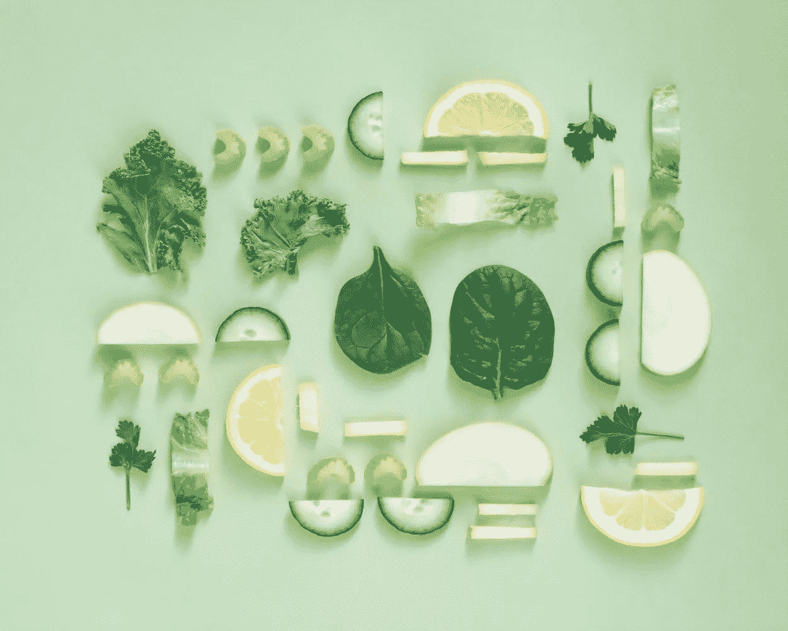

# 如何从零开始建立个性化推荐:来自 Food.com 的食谱

> 原文：<https://medium.com/analytics-vidhya/how-to-build-personalized-recommendation-from-scratch-recipes-from-food-com-c7da4507f98?source=collection_archive---------12----------------------->

信用:[剂量果汁](https://unsplash.com/@dosejuice)

本文以我最近的一个项目为例，讲述了如何从头开始构建推荐系统。你可以在网上找到的阅读或论文的数量是无穷无尽的，因为它是当今 it 界广泛使用的系统，仅举几个公司的例子:谷歌、脸书、YouTube、亚马逊等。

因此，对于初学者来说，从他们的第一个推荐系统项目开始总是势不可挡的。在本文中，我将尽可能简单地解释概念，并尽可能使用例子。

**#数据**

数据来源于 [Kaggle](https://www.kaggle.com/shuyangli94/food-com-recipes-and-user-interactions#interactions_validation.csv) 感谢李，它由超过 23 万的食谱数据，超过 22 万的用户和超过 100 万的食谱评论组成。关于可视化和数据探索的更多讨论，请参考我的另一篇博客文章，这是该项目的第一阶段。

**#协同过滤**

当我们谈论推荐系统时，人们不能回避协同过滤这个术语。简单来说，协同过滤就是根据用户的偏好或产品的特性进行预测(过滤)。返回的预测是我们的建议。

在这个项目中，我们将讨论两种类型的协作系统，即基于记忆的和基于模型的。最后，我们将看看混合方法如何帮助我们改进建议。你可以在这里找到我的代码[的完整库。](https://github.com/ZeeTsing/Recipe_reco)

**#模型 1:潜在狄利克雷分配(LDA)特征提取+基于记忆**

为了构建我们的第一个模型，我们首先假设用户喜欢与他们过去喜欢和/或查看过的食谱相似的食谱。换句话说，如果用户喜欢巧克力蛋糕，那么很可能用户也喜欢巧克力馅饼(考虑它们是相似的)。

下午吃点巧克力蛋糕吗？信用: [@heftiba](https://unsplash.com/@heftiba)

我们的第一个模型使用 LDA 作为食谱成分的特征提取:每个食谱被转换成由单词袋模型表示的矩阵，然后 LDA 模型将处理并生成对主题有贡献的可能单词的线性组合。推荐模型计算数据库中每个食谱之间的距离或“相似度”，并“记住”它(内存)。

你也可以在我的另一个博客中阅读更多关于 LDA 的内容。

然而，当我们主要使用主题来计算食谱之间的距离时，如果它们属于同一个主题，我们会期望很多相似的食谱。例如，我们认为法国香草焦糖布丁的配方与巧克力焦糖布丁的配方相似。这是我们在给出推荐时尽量避免的:相似但不太相似作为同一物品的变体。因此，我们在代码中添加了一个转折，以确保一旦生成某个组的推荐，该推荐会计算不同主题组中的相似度。

**优点:**方法通俗易懂；

**缺点:**时间和计算效率低，当有百万或万亿字节的数据时，会非常慢；

**#模型 2:用户特征+基于模型(SVD)**

第二个模型以不同的方式假设用户行为:现在我们假设用户喜欢与他们相似的用户喜欢的食谱。例如，如果用户 A 喜欢炸鸡、薯条和汉堡食谱，而用户 B 喜欢炸鸡和薯条食谱，我们的模型说用户 B 可能也喜欢汉堡。

还有炸鸡？信用:[哈苏卜·贾米尔](https://unsplash.com/@haseebjkhan)

该模型首先构建一个用户-产品矩阵，代表用户对配方的评论和评论历史。每个用户由单行表示，而列表示用户与配方的交互历史。为了实现过滤，我们选择使用一种称为奇异值分解(SVD)的技术。简而言之，SVD 试图将原始矩阵中的信息压缩成一个更小的矩阵，同时也将相似的条目聚集在一起。

**优点:** SVD 算法通过给出有效的推荐而在推荐系统中工作良好。

**缺点:**当数据太多时，算法可能很昂贵；解释不是直截了当的。

**#模型 3:配方特征+基于模型(SVD)**

模型 3 做出了与模型 1 相同的假设，模型 1 侧重于配方。在这个模型中，我们使用了食谱所有可能的属性，而不仅仅是配料。这应该会让我们对食谱有一个全面的了解。

用户-产品矩阵现在变成了“配方-属性”矩阵，而配方由行表示，属性由列表示。然后使用奇异值分解算法实现该模型。

**优点&缺点:**与模型 2 相同

**#车型 4:混合动力车型**

如果你读过像 Netflix 推荐系统奖这样的推荐系统中的著名案例，你会意识到优秀的系统通常会采用混合方法来提高推荐准确度。

用简单的话来说，一个混合模型可以跟踪人群的预测能力。在我们的混合模型中，我们将模型 2 和模型 3 的结果结合起来，这样我们就可以同时捕获食谱的特征和用户的历史。最后的推荐是由两个模型产生的推荐的简单平均值。

**优点:**比单一模型更好的预测能力，可以泛化，减少过拟合；

**缺点:**很难解释。

**#结果**

我们对所有四个模型都尝试了相同的输入，以便您可以判断我们的模型表现如何。

模型 1 和 2 产生的建议

模型 3 和 4 产生的建议

有四个输入项目:黄油蛋糕，奶酪卷，鸡胸肉 Saltimbocca 和瑞士蟹融化。四种菜肴中有三种使用奶酪，所以当我发现有人推荐比萨饼或奶酪相关的食谱时，我不会感到惊讶。黄油蛋糕是一种甜点，所以蛋糕或甜点推荐似乎也很自然。

为了评估我们的模型性能，我们需要在没有实际用户输入的情况下使用 precision@k，recall@k。我们还没有实现评估，但我们把它作为读者探索的下一步。

**#讨论**

除了用正确的标准完成项目。还可以部署在真实的生产环境中以收集更多信息。

推荐系统的领域是巨大而深刻的。如果熟悉深度学习，还可以考虑用编解码算法构建推荐系统。

感谢您的阅读，希望您喜欢！