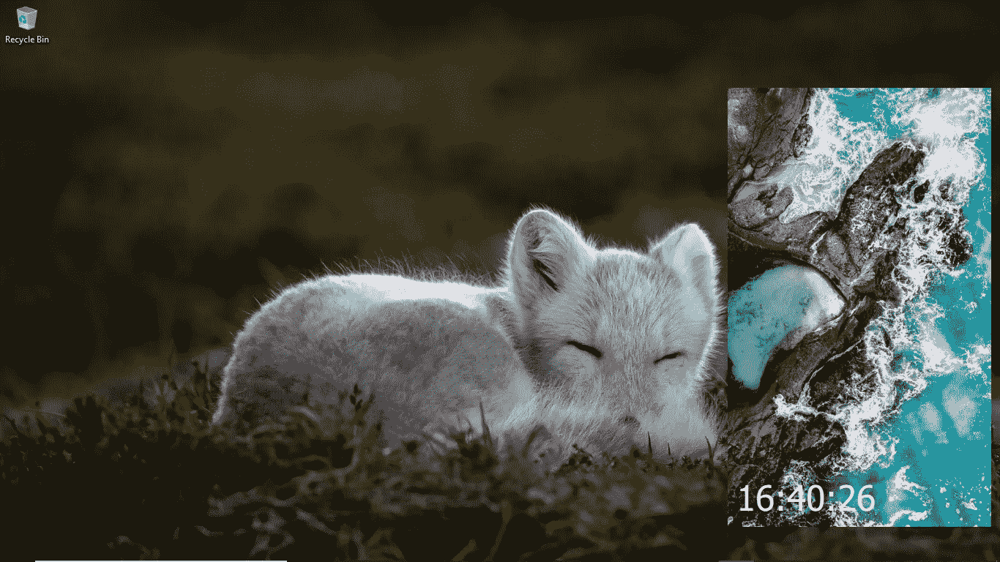
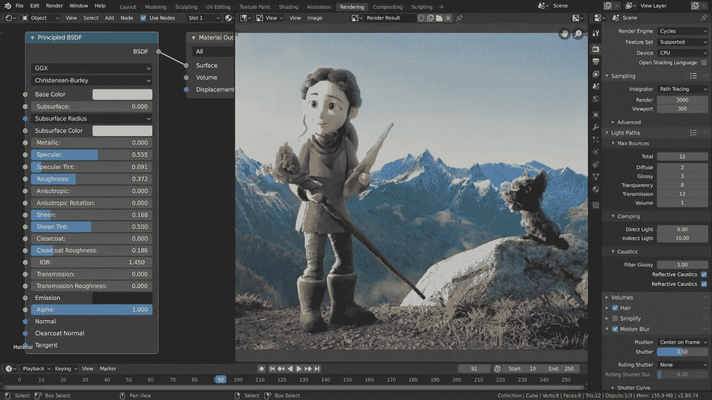
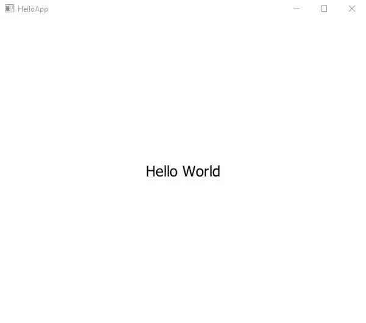
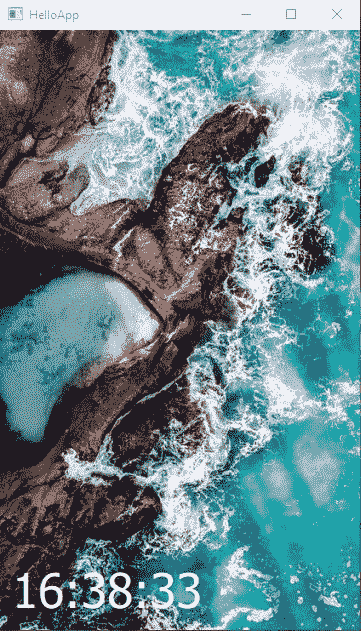

# 如何用 Python 构建您的第一个桌面应用程序

> 原文：<https://medium.com/analytics-vidhya/how-to-build-your-first-desktop-application-in-python-7568c7d74311?source=collection_archive---------0----------------------->



在整个互联网上搜索 python 编程语言的用法，他们会列出那些被标记为不太适合 Python 的桌面应用程序。但是几年前的 2016 年，当我希望从 web 开发转向软件开发时，Google.com 告诉我应该选择 python，因为它用于构建一些现代和先进的科学应用程序，然后他们提到了 blender3d。我知道 blender3d，它是一个很棒的 3d 创作软件。爱



blender3d 截图(图片来源:blender.org)

但这不是他们的错，人们用来展示 python 图形用户界面的丑陋的东西是可憎的，太老了，看起来太过时了，没有年轻人会喜欢这样。我希望通过这个简单的桌面应用教程来改变这种观念。我们走吧。

我们将使用 PyQt(很快会有更多的介绍)来代替 Tkinter，Tkinter 因为过时而几乎从 python 标准库列表中删除。

PyQt 是什么(发音:pie-cute)。它是一个框架的两个端口之一，来自 C++，Qt(发音:cute)。该框架被认为是 C++开发人员的必备框架。它是 blender3d、Tableau、Telegram、Anaconda Navigator、IPython、Jupyter Notebook、VirtualBox、VLC 等软件背后的框架。我们会用它来代替尴尬的 Tkinter。

Qt 的两个端口是 PySide 和 PyQt。他们 99%都一样。PyQt 是两者中最容易安装的。

# 先决条件

1.  您应该已经了解了一些 python 基础知识
2.  您应该知道如何用 pip 安装软件包或库
3.  当然，您应该已经安装了 python。

# 装置

我们唯一需要安装的是 PyQt。因此，打开您的终端，在 windows 上将是命令提示符或 Powershell。

在您的终端中键入以下命令

```
>>> pip install PyQt6
```

因为我们正在下载 PyQt 的第 6 版。等待安装完成，这将只需要一两分钟。

# 项目文件和文件夹

现在我们已经完成了安装。我们应该从我们的项目开始。为这个应用程序创建一个项目文件夹，我们称之为:helloApp。你可以在电脑上的任何地方创建它，但最好是有条理的。

## 让我们做一个“你好，世界”

打开 main.py，最好是在 vscode 中，并输入以下代码

> main.py

```
import sys
import osfrom PyQt6.QtGui import QGuiApplication
from PyQt6.QtQml import QQmlApplicationEngine
from PyQt6.QtQuick import QQuickWindow QQuickWindow.setSceneGraphBackend('software')app = QGuiApplication(sys.argv)engine = QQmlApplicationEngine()
engine.quit.connect(app.quit)
engine.load('./UI/main.qml')sys.exit(app.exec())
```

*在代码上面；我们导入 sys、os、QGuiApplication 和 QQmlApplication 模块。*

****qquickwindow . setscenegraphback end(' software ')****应该包含在您的代码中，作为使用旧硬件规格的后备选项，除此之外，它们会看到如下所示的错误信息:**

```
**>>> Failed to create vertex shader: Error 0x80070057: The parameter is incorrect.
>>> Failed to build graphics pipeline state**
```

**代码还调用了****qgui Application****和****QQmlApplicationEngine****，它们将使用 Qml 而不是 QtWidgets 作为 Qt 应用程序的 UI 层。然后，它将 UI 层退出功能与应用程序的主退出功能连接起来。因此当用户关闭 UI 时，两者都可以关闭。接下来，它加载 qml 文件作为 qml UI 的 Qml 代码。****app . exec()****运行应用程序，它位于****sys . exit****内，因为它返回应用程序的退出代码，该代码被传递到退出 python 系统的****sys . exit****中。**

*将此代码添加到 **main.qml***

> *main.qml*

```
*import QtQuick
import QtQuick.Controls.BasicApplicationWindow {
    visible: true
    width: 600
    height: 500
    title: "HelloApp" Text {
        anchors.centerIn: parent
        text: "Hello World"
        font.pixelSize: 24
    }}*
```

**上面的代码创建了一个窗口，其中* ***可见*** *代码非常重要，如果没有这些，UI 将会运行但会不可见，用* ***宽度*** *和* ***高度*** *作为指定，用* ***标题*** *作为" HelloApp "。而在* ***父*** *居中的一段文字(恰好是窗口)，则* ***文字*** *显示的是“Hello World”，像素大小为 24px。**

**在之前的 Qt5 中，上述导入代码将包含版本号**

```
*import QtQuick 2.15
import QtQuick.Controls 2.15*
```

**此外，在 Qt6 中，我们明确地将控件的样式声明为**

```
*import QtQuick.Controls.Basic*
```

**稍后更多关于控件样式的信息**

*如果你有以上，你可以运行它，看看你的结果。*

*导航到您的 helloApp 文件夹*

```
*>>> cd helloApp*
```

*现在通过执行以下操作来运行它:*

```
*>>> python main.py*
```

*如果您的代码运行，您应该看到:*

**

*显示文本“Hello World”的应用程序窗口*

# *更新用户界面*

*现在让我们稍微更新一下用户界面，让我们添加一个图像作为背景和一个有时间的文本*

```
*import QtQuick
import QtQuick.Controls.BasicApplicationWindow {
    visible: true
    width: 400
    height: 600
    title: "HelloApp" Rectangle {
        anchors.fill: *parent* Image {
            sourceSize.width: *parent*.width
            sourceSize.height: *parent*.height
            source: "./images/playas.jpg"
            fillMode: Image.PreserveAspectCrop } Rectangle {
            anchors.fill: *parent* color: "transparent" Text {
                text: "16:38:33"
                font.pixelSize: 24
                color: "white"
            } } }
}*
```

**上面有一个****application window****类型，里面有一个* ***矩形*** *类型，那实际上是填满了窗口的所有空间。有一个* ***图像*** *在它的里面，还有一个另外的* ***矩形*** *看起来像是它的旁边，但是因为不存在一个布局类型，它实际上在* ***图像*** *类型的上面。* ***矩形*** *有一个***的透明矩形因为默认情况下是白色的，所以有一个* ***文本*** *在里面，上面写着 16:38:33，用来模拟时间。***

**如果您运行该应用程序，文本将出现在窗口的左上角。我们不喜欢这样，所以我们要让它出现在左下角，并留一些空白。**

**在您的 qml 代码中，更新**文本**类型以包含**锚**，如下所示:**

```
 **... Text {
                anchors {
                    bottom: parent.bottom
                    bottomMargin: 12
                    left: parent.left
                    leftMargin: 12 }
                text: "16:38:33"
                font.pixelSize: 24
                ...
            } ...**
```

**现在通过做来运行它**

```
**>>> python main.py**
```

**您应该会看到类似这样的内容。**

****

**现在我想要更新的时间**

## **使用实时**

**让我们用一个真实的时间。Python 为我们提供了原生函数，这些函数为我们提供了各种与时间和日期相关的函数。我们需要一个带有当前时间的字符串。 **gmtime** 为您提供了包含各种信息的全局时间结构，而 **strftime** 使用 **gmtime** 函数将时间的某些部分构造为字符串**

**导入 **strftime** 和 **gmtime** 函数**

> **main.py**

```
**import sys
import os
from time import strftime, gmtimefrom PyQt6.QtGui import QGuiApplication
...**
```

**然后在文件中的任何地方，在导入下面构造您的时间字符串**

> **main.py**

```
**curr_time = strftime("%H:%M:%S", gmtime())**
```

***% H、%M、%S 告诉****strftime****，我们要查看小时(24 小时制)、分钟和秒。(点击***strftime**[*了解更多格式代码)。*该变量将被传递到 qml 层。](https://docs.python.org/3/library/datetime.html?highlight=strftime#strftime-and-strptime-format-codes)****

*让我们在 qml 中创建一个属性，我们可以用它来接收时间字符串。这个变量使得改变时间变得更容易。让我们把这个属性叫做 ***当前时间****

> *main.qml*

```
*...ApplicationWindow {
    ...
    title: "HelloApp" property string currTime: "00:00:00"
    ...*
```

*在 qml 中使用这个属性，所以当这个值改变时，所有其他使用它的地方也会改变。*

> *main.qml*

```
*...Text {
    ...
    text: *currTime  // used to be; text: "*16:38:33*"* font.pixelSize: 48
    color: "white"
}...*
```

*现在，通过将我们在 python 中创建的 **curr_time** 变量设置为 **currTime** qml 属性，将其发送到 qml。*

> *main.py*

```
*...engine.load('./UI/main.qml')
engine.rootObjects()[0].setProperty('currTime', curr_time)...*
```

**上面的代码将 qml 属性***设置为****curr _ time****python 属性的值。这是我们将信息从 python 传递到 UI 层的一种方式。***

**运行应用程序，你应该不会看到任何错误，还会有当前时间。万岁！！！前进！！！**

# **更新时间**

**来更新我们的时间。我们将需要使用线程。python 中的线程简单明了，我们将使用它来代替 Qt 的线程。线程使用函数或线程调用函数。我更喜欢我们在 Qt 中使用一种叫做 signals 的技术，这是一种专业的方法，学习它会让你喜欢得更好更容易。让我们将当前时间代码放入一个函数中，使用下划线(_)作为文件名。稍后我会解释原因。这不是一个要求或任何东西，它只是一个好的做法**

**要使用信号，我们必须简单明了地子类化 **QObject** 。**

**创建一个 **QObject 的子类，**随便你怎么称呼它。我将称之为后端。**

> **main.py**

```
**...
from PyQt6.QtQuick import QQuickWindow
from PyQt6.QtCore import QObject, pyqtSignal class Backend(QObject): def __init__(self):
        QObject.__init__(self)QQuickWindow.setSceneGraphBackend('software')...**
```

***上面的代码导入了****q object****和****pyqtSignal****，在 pyside 这叫做****Signal****。这是 pyqt 和 pyside 为数不多的区别之一。***

**形式上，我们有一个从 python 接收我们的 **curr_time** 字符串的属性字符串，现在我们创建一个属性 **QtObject** 来从 python 接收**后端**对象。没有那么多类型。Qml 将 python 基础类型转换成 **bool** 、 **int** 、 **double** 、 **string** 、 **list** 、 **QtObject** 和 **var** 。var 可以处理所有的 python 类型，但是它是最不受欢迎的。**

> **main.qml**

```
**...
property string currTime: "00:00:00"
property QtObject backend
...**
```

***上面的代码创建了一个****Qt object*******back end****来存放我们的 python 对象* ***back_end。*** *使用的名字都是我的，随便你怎么改****

**在 python 中传递它**

> **main.py**

```
**...
engine.load('./UI/main.qml')
back_end = Backend()
engine.rootObjects()[0].setProperty('backend', back_end)
...**
```

***在上面的代码中一个对象* ***back_end*** *是从类****back end****中创建的。然后我们将其设置为名为* ***后端*** 的 qml 属性**

**在 Qml 中，一个 **QtObject** 可以从做许多事情的 python 接收许多函数(称为信号),但是它们必须被组织在那个 **QtObject** 下。**

**创建**连接**类型并将其定位到**后端**。现在，在**连接**类型中可以有我们想要为**后端**接收的众多函数。**

> **main.qml**

```
**...
Rectangle {
    anchors.fill: *parent* Image {
    ...
    }
    ...}Connections {
    target: *backend* }
...**
```

**这就是我们与 python 信号联系的方式。**

**如果我们不使用线程，我们的用户界面将冻结。很明显，我们这里需要的是线程而不是多重处理。**

**创建两个函数，一个用于线程，一个用于实际函数。这就是下划线派上用场的地方。**

> **main.py**

```
**...
import threading
from time import sleep
... class Backend(QObject): def __init__(self):
        QObject.__init__(self) def bootUp(self):
        t_thread = threading.Thread(target=self._bootUp)
        t_thread.daemon = True
        t_thread.start() def _bootUp(self):
        while True:
            curr_time = strftime("%H:%M:%S", gmtime())
            print(curr_time)
            sleep(1)...**
```

***上面的代码有一个下划线函数，它创建一个更新的时间。***

**创建一个名为 **updated** 的 pyqtsignal，并从名为 **updater** 的函数中调用它**

> **main.py**

```
**...
from PyQt6.QtCore import QObject, pyqtSignal... def __init__(self):
        QObject.__init__(self) updated = pyqtSignal(str, arguments=['updater']) def updater(self, curr_time):
        self.updated.emit(curr_time) ...**
```

**在上面代码中的*pyqtSignal、* ***updated、*** *中，已经为它的****arguments****parameter 列表中包含了函数名‘updater’。从这个* ***更新器*** *函数，qml 将接收数据。在****updater****函数中我们调用(****emit****)signal****updated****并向它传递数据(****curr _ time****)***

**更新 qml，通过创建信号处理程序接收信号，信号处理程序名称是信号名称的大写形式，前面加“on”。所以，‘我的信号’变成了‘on my signal’，‘我的信号’变成了‘on my signal’。**

> **main.qml**

```
**...
    target: *backend* function onUpdated(msg) {
        *currTime* = *msg*;
    }
...**
```

***在上面的代码中你可以看到* ***更新后的*** *信号被称为* ***更新后的*** *。它还将****curr _ time****作为****msg****传递给它。***

**一切都很好，但是我们还没有调用 **updater** 函数。对于这样的小应用程序，没有必要使用单独的函数来调用信号。但是在一个大的应用程序中，这是推荐的方法。将延迟秒数更改为 1/10 秒。我发现这个数字最好更新时间。**

> **main.py**

```
 **...
            curr_time = strftime("%H:%M:%S", gmtime())
            self.updater(curr_time)
            sleep(0.1)
...**
```

**在 UI 加载后，应该立即调用**启动**函数。**

```
**...
engine.rootObjects()[0].setProperty('backend', back_end)back_end.bootUp()sys.exit(app.exec())**
```

****一切都结束了！！！****

**运行代码:**

```
**>>> python main.py**
```

****

**你的秒针现在应该正在更新**

# **奖金:**

# **使窗口无框架**

**你可以把窗口做成无框的，贴在屏幕右下方。**

> **main.qml**

```
**...
height: 600
x: *screen*.desktopAvailableWidth - *width* - 12
y: *screen*.desktopAvailableHeight - *height* - 48
title: "HelloApp"flags: *Qt*.FramelessWindowHint | *Qt*.Window...**
```

***上面的代码为窗口设置****【x】*******【y】****，并添加* ***标志*** *，使窗口无框架。* ***Qt。窗口*** *标志确保即使窗口是无框架的，我们仍然得到一个任务按钮****

**运行它，你应该对你所看到的感到高兴。**

```
**>>> python main.py**
```

****

**终于，编码结束了，这是最终的代码。**

> **main.py**

```
**import sys
import os
from time import strftime, gmtime
import threading
from time import sleepfrom PyQt6.QtGui import QGuiApplication
from PyQt6.QtQml import QQmlApplicationEngine
from PyQt6.QtQuick import QQuickWindow
from PyQt6.QtCore import QObject, pyqtSignal class Backend(QObject): def __init__(self):
        QObject.__init__(self) updated = pyqtSignal(str, arguments=['updater']) def updater(self, curr_time):
        self.updated.emit(curr_time) def bootUp(self):
        t_thread = threading.Thread(target=self._bootUp)
        t_thread.daemon = True
        t_thread.start() def _bootUp(self):
        while True:
            curr_time = strftime("%H:%M:%S", gmtime())
            self.updater(curr_time)
            sleep(0.1) QQuickWindow.setSceneGraphBackend('software')app = QGuiApplication(sys.argv)
engine = QQmlApplicationEngine()
engine.quit.connect(app.quit)
engine.load('./UI/main.qml')back_end = Backend()engine.rootObjects()[0].setProperty('backend', back_end)back_end.bootUp()sys.exit(app.exec())** 
```

> **main.qml**

```
**import QtQuick
import QtQuick.Controls.BasicApplicationWindow {
    visible: true
    width: 360
    height: 600
    x: *screen*.desktopAvailableWidth - *width* - 12
    y: *screen*.desktopAvailableHeight - *height* - 48
    title: "HelloApp" flags: *Qt*.FramelessWindowHint | *Qt*.Window property string currTime: "00:00:00"
    property QtObject backend Rectangle {
        anchors.fill: *parent* Image {
            sourceSize.width: *parent*.width
            sourceSize.height: *parent*.height
            source: "./images/playas.jpg"
            fillMode: Image.PreserveAspectFit
        } Text {
            anchors {
                bottom: parent.bottom
                bottomMargin: 12
                left: parent.left
                leftMargin: 12
            }
            text: *currTime* font.pixelSize: 48
            color: "white"
        } } Connections {
        target: *backend* function onUpdated(msg) {
            *currTime* = *msg*;
        }
    }}** 
```

**除了您可能更改的名称之外，所有内容都应该是相似的。**

# **构建和后续步骤**

**构建 pyqt 应用程序可能是最简单的，因为它广为人知。**

**要建造，安装 **pyinstaller** ，由于建造是加成部分的一部分，我们之前没有安装。**

```
**>>> pip install pyinstaller**
```

**我们可以很容易地在 applications 文件夹(helloApp)中运行下面的代码，但是我们必须注意我们使用的资源。**

```
**>>> pyinstaller main.py**
```

**相反，首先要做:**

```
**>>> pyi-makespec main.py**
```

**它首先为您生成一个 spec 文件进行更新，然后您可以再次运行 pyinstaller**

****数据**参数可用于将数据文件包含在您的应用程序或应用程序文件夹中。它是一个元组列表，元组总是有两个项目，目标路径，我们将包括在内，以及目的地路径，它应该存储在应用程序的文件夹中。目标路径必须是相对路径。如果你想把它和应用程序的可执行文件放在一起，你可以把它设置成一个空字符串(')，如果你想把它放在应用程序文件夹的嵌套文件夹中，你可以指定嵌套文件夹(' nest/nested/really_nested ')**

**更新**数据**参数，如下图所示，以匹配您电脑上 hello app UI 文件夹的路径。**

**将**控制台**参数设置为**假**，因为这是一个 Gui，我们没有测试它。**

> **主规格**

```
**...
a = Analysis(['main.py'],
             ...
             datas=[('I:/path/to/helloApp/UI', 'UI')],
             hiddenimports=[],
...
exe = EXE(pyz,
          a.scripts,
          [],
          ...
          name='main',
          debug=False,
          ...
          console=False )
coll = COLLECT(exe,
               ...
               upx_exclude=[],
               name='main')**
```

****EXE** 调用中的**名称**参数是可执行文件本身的名称。例如，main.dmg 或 main.dmg，但 **COLLECT** 调用中的**名称**参数是用于存储可执行文件及其所有附带文件的文件夹名称，两者都可以更改。但是名称是基于我们用来生成规范的文件，记住:**‘main . py’****

**最后，使用**

```
**>>> pyinstaller main.spec**
```

**现在，您应该看到一个名为“dist”的文件夹，其中包含另一个名为“main”的文件夹，其中包含应用程序文件。搜索 main.exe 或主可执行文件并运行它。TADAAA！一切都很好。**

****

# **后续步骤**

**除了在应用程序中包含和使用 UI 文件夹的方式之外，我们讨论的所有东西都在生产中使用。资源在部署到生产中之前是捆绑在一起。**

**但是信号，背景图像是如何使用的，无框窗口都是在生产中使用的技术，可以说，在现实世界中。这只是有更多的东西。是的，无框窗口有更多的功能，如果你不打算把它作为闪屏使用，你必须处理标题栏、窗口的大小调整和拖动等，这并不复杂，但这超出了本教程的范围。**

**Qml 不仅仅是图片，矩形和文本，布局系统是四种类型。它们很容易学习，但是实用的方法是最好的，所以我不想解释它们。**

**继续学习 PyQt 和 Qml，它将引领你进入软件开发、嵌入式系统和未来数据可视化的职业生涯。比起 TKinter，我更喜欢它，它的受欢迎程度与日俱增。**

**点击 ***跟随*** 按钮了解更多。**

**阅读下一个教程:[如何用 Python 创建文件转换器](https://amohgyebiampofo.medium.com/create-a-file-converter-in-python-6fefeb747434)**

**更多资源可在以下网址找到:**

*   **PyQt/PySide—[Python GUIs](https://martinfitz.dev/b/nv2Zt/af63c96d69567cf)，[Python 代码](http://thepythoncode.com)， [Qt 官方文档](https://wiki.qt.io/Qt_for_Python)，[河堤计算](https://www.riverbankcomputing.com/static/Docs/PyQt6/)**
*   **evileg.com， [Qt 官方文件](https://doc.qt.io/qt-6/qtqml-index.html)**

**下次见。**