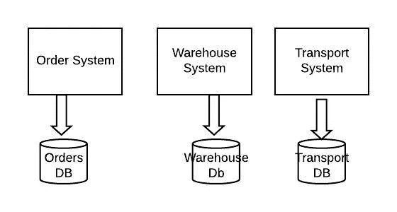
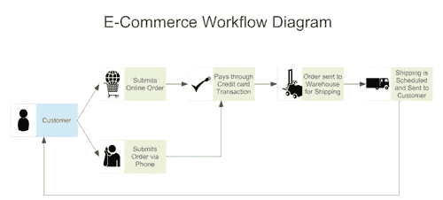

# 如何构建您的第一个实时流(CDC)系统(简介-第 1 部分)

> 原文：<https://medium.com/analytics-vidhya/how-to-build-your-first-real-time-streaming-cdc-system-introduction-part-1-5d61b2d9d511?source=collection_archive---------8----------------------->

# 介绍

随着数据的指数级增长和大量业务转移到网上，**设计能够以**实时**或接近实时的方式做出任何业务决策的系统**已经变得势在必行。因此，在多年从事多个后端项目后，我终于开始构建一个**实时流媒体平台**。在做这个项目的时候，我开始尝试不同的技术来处理这个问题。因此，我试图在一系列文章中分享我的心得。这是其中的第一个。

此外，在本系列中，主要焦点将是如何做而不是如何做。我们将花大部分时间学习如何实现我们的用例。然而，我会在需要的时候讲述一些理论。

# 目标受众:

这篇文章的目标读者是那些已经熟悉微服务、java 编程语言，并希望构建他们的第一个实时流管道的工程师。为了便于阅读，本 POC 分为 4 篇文章。它们如下:-

*   **第一篇文章(当前文章)**包含基本概念、问题陈述、技术堆栈和我们需要了解的关于我们正在构建的东西的一切。
*   [**第 2 篇(系统设置)**](/@rohan.mudaliar/how-to-build-your-first-real-time-streaming-cdc-system-setup-part-2-bac2c5397d5e) 将包含为 Binlogs 和 docker 基础设施设置设置 MySql 数据库的步骤。我们还将介绍如何使用 Kafka connect 创建 Kafka 主题。
*   [**第 3 条(Kafka 流和聚合)**](/analytics-vidhya/how-to-build-your-first-real-time-streaming-cdc-system-kafka-steams-and-aggregation-part-3-8a331e98961d) 将包含 java 后端代码，我们在其中监听 Kafka 主题以创建/更新 Elasticsearch 中的聚合指数。
*   **第 4 篇文章(验证和运行您的代码)**将包含使用 Kibana 下载最终汇总报告、在本地运行代码以及使用 Kibana 验证实时流系统的步骤。

# 期待什么:

关于如何构建实时流(CDC)管道的概念验证。需要在优化方面做出努力，以使其为生产做好准备。

# 问题陈述

假设你在一家销售时尚产品的电子商务公司工作。您的业务团队希望根据后端系统上的实时更新做出一些决策。他们希望查看一些仪表板和视图。因此，让我们假设后端构建在微服务架构上，在任何用户操作期间，您都有多个系统相互交互，并且每个系统都与不同的数据库交互。

让我们考虑一下 POC 中的三个系统。

对于这个例子，业务团队想要创建一个出站仪表板。其中包含订单数量、售出商品的类型、每件商品的成本以及商品的运输成本。这将在多个系统中基于用户和真实世界的动作在任何时间点不断更新，如下所示。

一旦客户做出选择并付款，订单就被送到仓库，商品从那里被发送给客户。考虑在每个动作之后，一个系统将被实时更新。

让我们看看业务团队需要的数据类型

*   每个仓库每个物料类型每天的发货单位。
*   每个快递公司每天发货的订单。
*   每个仓库每天装运的物品的总成本。

我们知道这些数据存在于订单服务、仓储服务和物流服务中。假设他们都在使用 MySQL 数据库，并且都是实时更新的。现在，我们已经看了用例，让我们思考一下如何解决这个问题。

**可能的解决方案**:我们需要找到一种方法来捕获发生在不同服务的不同数据库中的所有更新/插入，并将其放在一个地方，从那里我们可以构建一些报告并进行一些分析。所以这就是 **Kafka Connect 和 Debezium** 的用武之地。

# 了解 CDC、Mysql Binlogs、Debezium 和一些基本概念:

因此，在我们开始实现这个系统之前，我们需要理解几个概念。它们如下:-

**更改数据捕获:**

变更数据捕获( [CDC](https://en.wikipedia.org/wiki/Change_data_capture) )跟踪数据变更(通常接近实时)。CDC 可用于各种任务，如审计、将数据复制到另一个系统或处理(和响应)事件。在 MySQL 中，跟踪数据变化最简单也可能是最有效的方法是使用二进制日志。

**MySQL Binlogs**

二进制日志是一组日志文件，包含有关对 MySQL 服务器实例进行的数据修改的信息。通过使用`--log-bin`选项启动服务器来启用日志。

MySQL 3.23.14 中引入了二进制日志。它包含所有更新数据的语句。除非使用基于行的日志记录，否则它还包含可能更新它的语句(例如，不匹配任何行的`DELETE`)。语句以描述修改的“事件”的形式存储。

**作战日志:**

与 MySQL Binlogs 类似，MongoDB 有一个叫做 Oplogs 的东西，它与 Binlogs 类似，用于 CDC。

**Debezium:**

Debezium 是一组分布式服务，用于捕获数据库中的变化，以便您的应用程序可以看到这些变化并做出响应。Debezium 在一个*变更事件流*中记录每个数据库表中的所有行级变更，应用程序只需读取这些流，就可以按照事件发生的顺序查看变更事件。

**流处理、实时处理和复杂事件处理**

在我们深入问题陈述之前，我想提出的一件事是，在这个概念验证中，我正在构建一个复杂事件处理(CEP)系统。流处理、实时处理和复杂事件处理之间有非常细微的差别。它们如下:-

*   **流处理:**流处理对于欺诈检测和网络安全等任务非常有用。如果交易数据是流处理的，欺诈性交易甚至可以在完成之前就被识别和阻止。
*   **实时处理:**如果事件时间非常相关，并且秒范围内的延迟完全不可接受，则称之为实时(后方实时)处理。太空计划的飞行控制系统
*   **复杂事件处理(CEP):** CEP 利用逐个事件的处理和聚合(例如，来自各种来源的潜在无序事件，通常具有大量规则或业务逻辑)。

这更多地取决于业务用例。相同的技术栈可以用于流处理以及实时处理。

# **技术堆栈:**

现在，我们已经对我们想要实现的目标和所涉及的概念有了一个总体的了解，下一步是了解总体的技术任务和我们将用来构建系统的技术堆栈。我们来看看同样的。

让我们深入了解一下我们将在本次概念验证中使用的技术。它们如下:-

*   MySQL 8.0.18
*   阿帕奇卡夫卡连接 1.1
*   阿帕奇卡夫卡
*   阿帕奇卡夫卡流 2.3.1
*   弹性搜索 7.5.1
*   基巴纳语 7.5.1
*   19.03.5
*   Swagger UI
*   邮递员 7.18.1

# 总体技术任务:

因此，就整体任务而言，我们将把它们划分如下

1.  使用 docker 设置本地基础设施。
2.  使用 Kafka connect 将数据从 MySQL 数据库摄取到 Kafka。
3.  在 Java 后端使用 Kafka 流读取数据。
4.  为聚集视图创建弹性搜索索引。
5.  实时收听事件并更新事件。
6.  设置本地并运行 java 代码

# **总结和后续步骤:**

所以在这篇文章中，我们看了下面的内容

*   我们理解了问题陈述，并研究了可能的解决方案。
*   了解我们的解决方案所需的不同概念。
*   我们查看了解决方案的技术堆栈

**接下来的步骤:**在**的下一篇文章**中，我们将看看**如何**到**设置 MySQL 数据库**以编写 BinLogs，以及 **docker 设置**以在我们的本地系统中创建所需的基础设施。

> 如果你喜欢这篇文章，请阅读后面的文章并分享你的反馈。在领英上 [***找我 rohan _ LinkedIn***](https://www.linkedin.com/in/rohanganesh0506/)***。***