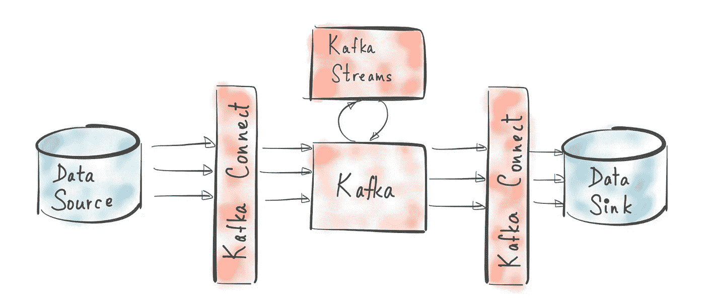
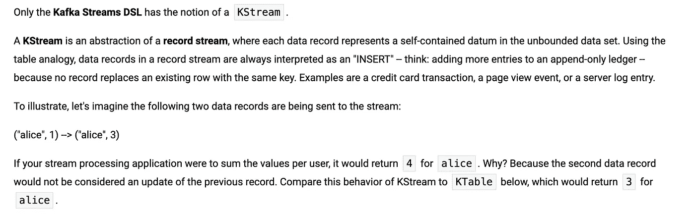
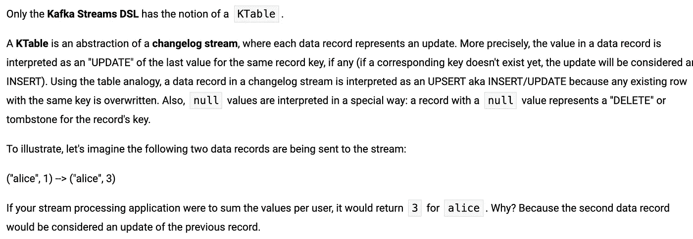
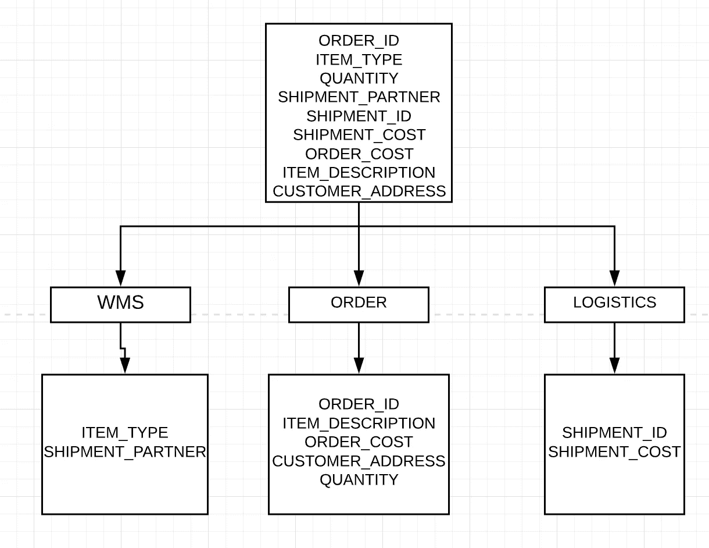
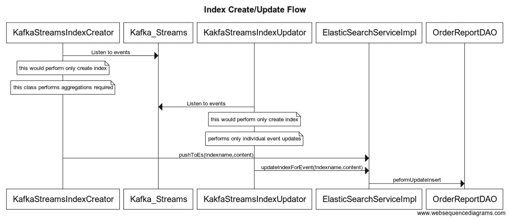

# 如何构建你的第一个实时流(CDC)系统

> 原文：<https://medium.com/analytics-vidhya/how-to-build-your-first-real-time-streaming-cdc-system-kafka-steams-and-aggregation-part-3-8a331e98961d?source=collection_archive---------9----------------------->



在本概念验证的第[篇文章第 1](/@rohan.mudaliar/how-to-build-your-first-real-time-streaming-cdc-system-introduction-part-1-5d61b2d9d511) 中，我们了解了构建实时流系统所需的关键概念，在第[篇文章第 2](/@rohan.mudaliar/how-to-build-your-first-real-time-streaming-cdc-system-setup-part-2-bac2c5397d5e) 中，我们了解了 MySql 设置和本地基础设施设置。在本文中，我们将查看使用 **Kafka streams 获取的**实时数据**，**对其执行一些**聚合**，并在弹性搜索中创建**索引。我们将像往常一样从一些基本概念开始，然后看看我们的技术任务，然后是系统的最终实现。**

**注:**如果您需要更好地理解整个问题，请阅读文章的第[部分](/@rohan.mudaliar/how-to-build-your-first-real-time-streaming-cdc-system-introduction-part-1-5d61b2d9d511)和第[部分](/@rohan.mudaliar/how-to-build-your-first-real-time-streaming-cdc-system-setup-part-2-bac2c5397d5e)，其中包含了关于问题陈述、架构、基础设施和 MySQL 设置的详细信息。

# 卡夫卡流的基本概念:

因此，在我们深入问题的实现之前，让我们了解一些 Kafka streams 的基础知识:-

**什么是卡夫卡溪流？**

Kafka Streams 是一个用于构建应用程序和微服务的客户端库，其中的输入和输出数据存储在 Kafka 集群中。

**卡夫卡流 DSL**

为了在 Java 中与流进行交互，Kafka 提供了 Kafka Streams DSL(领域特定语言)。

我们从 streams DSL 中使用的两个主要抽象如下

## [KStream](https://kafka.apache.org/24/documentation/streams/developer-guide/dsl-api.html#streams_concepts_kstream)

我将引用 apache 官方文档中提供的例子来说明以上两个问题。



## [k 表](https://kafka.apache.org/24/documentation/streams/developer-guide/dsl-api.html#streams_concepts_ktable)



# 总体技术任务:

就总体技术任务而言，我们的任务如下

1.  使用 docker 建立本地基础设施。
2.  **使用 Kafka connect 将数据从 MySQL 数据库摄取到 Kafka。**
3.  在 Java 后端使用 Kafka 流读取数据。
4.  为聚集视图创建弹性搜索索引。
5.  实时收听事件并更新事件。
6.  设置本地并运行 java 代码

我们已经完成了本系列第一篇文章中的任务 1 和任务 2，并详细了解了解决该问题所需的不同概念。现在让我们跳到其余的任务:-

# 3.在 Java 后端使用 Kafka 流读取数据，用于第一次创建索引。

现在我们已经创建了 Kafka 主题，下一步是读取流数据，根据需要使用 Kafka 流执行一些聚合，并将其存储在弹性搜索中。

因此，在继续编写任何代码之前，让我们看看我们希望最终的索引包含什么及其来源。



为了达到以上目的，让我把它分成几个步骤

1.  **决定**你想听的话题，这些将被用来创建聚合视图。
2.  **决定**您必须对表(主题)执行的**连接或转换**以获得最终的聚合表。
3.  一旦构建了**最终聚合视图**，调用弹性搜索来创建索引。

让我们通过代码来看看第 1 点和第 2 点。

我们从 logisticsTopic、orderTopic 和 wmsTopic 开始。

我们正在初始化一个新的 streambuilder，并根据相应的主题创建一个 orderKtable、logisticsKtable 和 wmsKtable。到目前为止，我们没有对流式数据做任何事情。

因此，为了构建最终的聚合视图，我们需要创建一些中间聚合。

我们首先处理 orderKTable 和 wmsKTable，首先将 orderId 设置为键。

订单流

WmsStream

船运流

现在我们已经准备好了单个的表，下一步是创建中间的聚合表。我们首先用 orderId 连接 order 和 wms 表，以创建一个以 shipmentId 为关键字的聚合视图。

**createOrderWmsStream** 方法采用合并后的流，并将 shipmentId 设置为 key。流的合并在**赋值**方法中完成。

**createOrderWmsStream**

**赋值**

AssignValues 接受两个输入流，从它们中提取 JSON，我们用它来创建结果 DTO 对象。

现在，我们的下一步是将这个表合并到 shipmentKtable 中，以得到最终的聚合流。

这里的 apendValues 方法用于构造最终的聚合视图

apendvalue

**assignValues** 和 **apendValue** 方法纯粹用于为聚合视图设置值。

这样，我们就有了最终的汇总表。

# 4.为聚集视图创建弹性搜索索引。

让我们看看控制器类方法

我们读取最终的聚合流，并根据它在控制器中创建一个映射，映射的键是 DTO 的列，值是 DTO 值。在 Elasticsearch 中存储数据需要此地图。

一旦我们创建了一个地图，我们就调用服务类并提供我们想要创建的索引。这是在下面的行中完成的。

```
elasticSearchService.pushToEs(ElasticSearchTopics.OURBOUND_REPORT_TOPIC, inputMap);
```

让我们看看服务和 DAO 类，它用于将数据持久化到弹性搜索中。

ElasticsearchService 创建索引

我们检查索引是否已经存在，如果存在，我们不创建文档。

OrderReportDAO.insertindex

Elastic search 有一个 java 高级 rest API，可用于操作以与 elastic search 协同工作。这里我们使用 IndexRequest 在弹性搜索中创建新的索引。

```
IndexRequest indexRequest = new IndexRequest(tableName + "_es")
     .id(payloadMap.get("id").toString())
    .type("_doc").id(id).source(payloadMap);
```

以上语句用于创建一个新的请求，以创建一个 elasticsearch 索引。如前所述，我们创建了一个 RestHighLevelClient 的实例来与来自 java 的弹性搜索进行交互。

```
restHighLevelClient.index(indexRequest, RequestOptions.DEFAULT);
```

上面的语句基本上是在弹性搜索中创建索引。

# 5.对系统进行基于事件的实时更新

既然我们已经编写了创建业务所需的聚合视图的代码，下一步就是根据单个事件的实时更新来更新创建的索引。让我们来看看我们该怎么做。让我们来看看我们是如何为 wms 系统中的一个事件执行此操作的。我们也可以为其他系统复制同样的方法。

我们首先监听 wmstopic 并从中创建一个流。

一旦我们有了这个流，我们需要检查这个流是更新还是插入，我们通过检查这个流在对象之前是否有一个来解决这个问题。before 对象的存在意味着当前记录是一个更新。

我们现在遍历每个记录，并调用服务类来进行更新。

我们在上面这段代码中做了 3 件事，

*   收听 wms 事件，
*   一旦我们有了事件，我们就用来自事件的新信息更新现有文档
*   更新 Elasticsearch 中的特定文档。

以上是处理更新的控制器。让我们看看刀的相同之处。

更新索引 DAO

所以我在这里使用的是 UpdateRequest，这是一个 java 高级客户端类，用于更新 Elasticsearch 索引。我们再次使用 **RestHighLevelClient** 来更新索引。

# **让我们想象一下**

我们现在已经从流中读取了数据，执行了一些聚合，创建了一个索引，并执行了一些更新。现在让我们想象一下整个事情。



# **总结:**

**现在我们已经到了最后一步，让我们回顾一下我们在本练习中所做的一切:-**

*   我们首先在 MySQL 数据库上启用了 Binlogs。
*   我们使用 docker 在本地为应用程序创建了所需的服务。
*   接下来，我们使用 Debezium-Kafka connect 创建了一个连接器，它将监听 MySQL 数据库中的创建/更新，并将更改推送到 Kafka。
*   我们编写了一个 Kafka streams 应用程序，它可以实时监听 Kafka 事件并创建聚合视图。
*   我们使用 RestHighLevelClient 在 Elasticsearch 上创建了一个索引。
*   我们使用 Kafka 流编写了另一个监听器，监听单个 Kafka 事件并推送更新。

我们的最后一步是在 Elasticsearch 中验证代码。我还包括代码设置在我们的本地为那些想尝试这一点。

> 如果您确实喜欢这篇文章，请务必阅读后续文章并分享您的反馈。在 LinkedIn 上找到我，地址是 [rohan_linkedIn](https://www.linkedin.com/in/rohanganesh0506/) 。