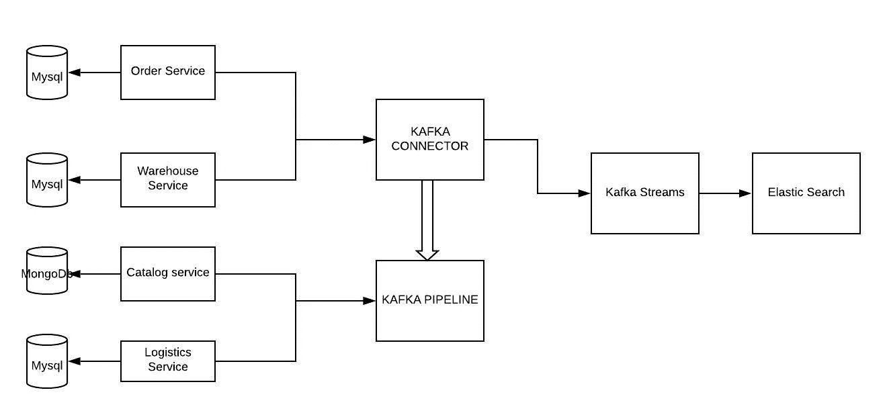

# 如何构建您的第一个实时流(CDC)系统(设置-第 2 部分)

> 原文：<https://medium.com/analytics-vidhya/how-to-build-your-first-real-time-streaming-cdc-system-setup-part-2-bac2c5397d5e?source=collection_archive---------5----------------------->


在此概念证明的第[篇第 1](/@rohan.mudaliar/how-to-build-your-first-real-time-streaming-cdc-system-introduction-part-1-5d61b2d9d511) 中，我们看了我们正在看的问题陈述、关键概念和我们用来解决问题的技术堆栈。让我们快速回顾一下。

**注:**如果您需要更好地了解整个问题，请阅读文章的第一部分，它包含了关于上述细节的详细信息。

# 问题陈述摘要

我们有一家电子商务公司，该公司的业务团队需要包含一些实时更新的报告来做出决策。我们的后端是用 java 构建的，它使用微服务。架构如下所示:



系统图

业务团队希望使用这些数据构建一个仪表板，并利用它做出一些营销决策。所有这些数据都存在于 3 个不同的数据库中，分别用于我们需要获取信息的 3 个不同的系统。我们决定采用以下技术:

# 技术堆栈:

我们决定将以下技术用于该项目:-

*   Mysql 8.0.18
*   阿帕奇卡夫卡连接
*   阿帕奇卡夫卡
*   阿帕奇卡夫卡溪流
*   弹性搜索。
*   码头工人
*   Swagger UI
*   邮递员

# 总体技术任务:

就总体技术任务而言，我们的任务如下

1.  使用 docker 设置本地基础设施。
2.  使用 Kafka connect 将数据从 MySQL 数据库摄取到 Kafka。
3.  在 Java 后端使用 Kafka 流读取数据。
4.  为聚集视图创建弹性搜索索引。
5.  实时收听事件并更新事件。
6.  设置本地并运行 java 代码

**注意:**本文假设用户已经在他们的系统上安装了 MySQL、docker 和其他基本组件，并且只涵盖了这个项目的设置。需要注意的一点是，我使用的是 mac 系统，windows 系统的设置可能略有不同。有关安装 docker 和 MySQL 的详细步骤，请参考以下链接:-

*   [安装 MySql](https://www.toolsqa.com/sql/how-to-install-mysql-server/)
*   [安装对接器](https://docs.docker.com/install/)

# 1.使用 docker 设置本地基础设施。


对于不知道 docker 是什么的读者来说，“Docker 是一个用于开发、发布和运行应用程序的开源平台。Docker 使您能够将应用程序从基础架构中分离出来，以便快速交付软件。”如需更多信息，请查看

因此，我使用 docker 在我的本地创建以下图像:-

*   弹性搜索 7.5.1
*   基巴纳语:7.5.1
*   动物园管理员:1.0
*   卡夫卡:1.0
*   卡夫卡连接 1.0

我附上以下参考文件:

```
version: "3.5"
services:
  # Install ElasticSearch
  elasticsearch:
    container_name: elasticsearch
    image: docker.elastic.co/elasticsearch/elasticsearch:7.5.1
    environment:
      - discovery.type=single-node
    ports:
      - 9200:9200
      - 9300:9300
  kibana:
    container_name: kibana
    image: docker.elastic.co/kibana/kibana:7.5.1
    environment:
      - elasticsearch.url= [http://localhost:9200](http://localhost:9200)
    ports:
      - 5601:5601
​
#debezium
  zookeeper:
      image: debezium/zookeeper:1.0
      hostname: zookeeper
      container_name: zookeeper
      ports:
        - 2181:2181
        - 2888:2888
      environment:
        ZOOKEEPER_CLIENT_PORT: 2181
        ZOOKEEPER_TICK_TIME: 2000
  kafka:
      image: debezium/kafka:1.0
      ports:
        - 9092:9092
      links:
        - zookeeper
      environment:
        - ZOOKEEPER_CONNECT=zookeeper:2181
        - ADVERTISED_HOST_NAME=192.168.0.250
        # If we wanted to connect to Kafka from outside of a Docker container, then we’d want Kafka to advertise its address via the Docker host,
        # which we could do by adding -e ADVERTISED_HOST_NAME= followed by the IP address or resolvable hostname of the Docker host,
        # which on Linux or Docker on Mac this is the IP address of the host computer (not localhost).
​
​
  schema-registry:
      image: confluentinc/cp-schema-registry
      ports:
        - 8181:8181
        - 8081:8081
      environment:
        - SCHEMA_REGISTRY_KAFKASTORE_CONNECTION_URL=zookeeper:2181
        - SCHEMA_REGISTRY_HOST_NAME=schema-registry
        - SCHEMA_REGISTRY_LISTENERS=http://schema-registry:8081
      links:
        - zookeeper
  connect:
    image: debezium/connect:1.0
    ports:
      - 8083:8083
    links:
      - kafka
      - schema-registry
    environment:
      - BOOTSTRAP_SERVERS=kafka:9092
      - GROUP_ID=1
      - CONFIG_STORAGE_TOPIC=my_connect_configs
      - OFFSET_STORAGE_TOPIC=my_connect_offsets
      - STATUS_STORAGE_TOPIC=my_connect_statuses
      - INTERNAL_KEY_CONVERTER=org.apache.kafka.connect.json.JsonConverter
      - INTERNAL_VALUE_CONVERTER=org.apache.kafka.connect.json.JsonConverter
```

假设您已经在本地安装了 docker，您需要在终端中运行下面的命令。

```
docker-compose up
```

这将创建图像并调出上述服务。为了验证这一点，我们可以手动检查服务是否启动:-

卡夫卡连接- `curl -H "Accept:application/json" localhost:8083/`

基巴纳应该可以通过下面的网址。

```
[http://localhost:5601/app/kibana#/management/kibana/index_pattern](http://localhost:5601/app/kibana#/management/kibana/index_pattern)
```

您可以通过检查是否有活动的进程运行各个端口来手动检查其他服务(例如 Kafka-9092、zookeeper-2181、elastic search-9200)

# 2.使用 Kafka connect 将数据从 MySQL 数据库摄取到 Kafka。


在第一步中，我们创建了所需的基础设施，并连接了 Kafka。在此步骤中，我们需要执行以下子任务:-

*   **准备 Mysql 进行实时更新，并给予用户访问数据库的适当权限**

因此，对于实时更新，如果我们只是从不同的数据库获得数据是不够的，我们还需要获得在不同系统上执行的不同更新、删除等的快照。

Mysql 有一个叫 Binlogs 的东西可以帮助解决这个问题，MongoDb 有一个叫 oplog 的东西。

```
([https://docs.mongodb.com/manual/core/replica-set-oplog/](https://docs.mongodb.com/manual/core/replica-set-oplog/)).
```

MySQL 的设置是一个数据库任务，我附上一篇文章的参考，我发现这将有助于你:

```
[https://www.anicehumble.com/2016/12/enabling-mysql-binary-logging-on-macos.html](https://www.anicehumble.com/2016/12/enabling-mysql-binary-logging-on-macos.html)
```

必须定义一个 MySQL 用户，该用户对连接器将监视的所有数据库拥有以下所有权限:

*   `[SELECT](http://dev.mysql.com/doc/refman/5.7/en/privileges-provided.html#priv_select)` [-使连接器能够从数据库的表中选择行；仅在执行快照时使用](http://dev.mysql.com/doc/refman/5.7/en/privileges-provided.html#priv_select)
*   `[RELOAD](http://dev.mysql.com/doc/refman/5.7/en/privileges-provided.html#priv_reload)`[——使](http://dev.mysql.com/doc/refman/5.7/en/privileges-provided.html#priv_reload) `[FLUSH](http://dev.mysql.com/doc/refman/5.7/en/flush.html)` [语句的连接器清除或重新加载各种内部缓存，刷新表，或获取锁；仅在执行快照时使用](http://dev.mysql.com/doc/refman/5.7/en/flush.html)
*   `[SHOW DATABASES](http://dev.mysql.com/doc/refman/5.7/en/privileges-provided.html#priv_show-databases)` [-通过发出](http://dev.mysql.com/doc/refman/5.7/en/privileges-provided.html#priv_show-databases) `[SHOW DATABASE](http://dev.mysql.com/doc/refman/5.7/en/privileges-provided.html#priv_show-databases)` [语句，使连接器能够查看数据库名称；仅在执行快照时使用](http://dev.mysql.com/doc/refman/5.7/en/privileges-provided.html#priv_show-databases)
*   `[REPLICATION SLAVE](http://dev.mysql.com/doc/refman/5.7/en/privileges-provided.html#priv_replication-slave)`[——使连接器能够连接并读取其 MySQL 服务器的 binlog 连接器](http://dev.mysql.com/doc/refman/5.7/en/privileges-provided.html#priv_replication-slave)始终需要
*   `[REPLICATION CLIENT](http://dev.mysql.com/doc/refman/5.7/en/privileges-provided.html#priv_replication-client)` [-启用](http://dev.mysql.com/doc/refman/5.7/en/privileges-provided.html#priv_replication-client)`[SHOW MASTER STATUS](http://dev.mysql.com/doc/refman/5.7/en/privileges-provided.html#priv_replication-client)``[SHOW SLAVE STATUS](http://dev.mysql.com/doc/refman/5.7/en/privileges-provided.html#priv_replication-client)``[SHOW BINARY LOGS](http://dev.mysql.com/doc/refman/5.7/en/privileges-provided.html#priv_replication-client)`[；连接器](http://dev.mysql.com/doc/refman/5.7/en/privileges-provided.html#priv_replication-client)始终需要

[在官方的 debezium MySQL 文档(](http://dev.mysql.com/doc/refman/5.7/en/privileges-provided.html#priv_replication-client)T2)上阅读更多关于 MySQL 的配置的信息

*   **使用 Kafka Connect 创建一个 MySQL 连接器。**

一旦在 MySQL 服务器上启用了 Binlogs，下一步就是创建一个连接器。简单来说，connector 从源系统创建一个连接，并将要读取的数据发送到 Kafka sink，或者从 Kafka 源读取数据，并将其推送到接收系统。

我们使用 Debezium 连接器([https://www . confluent . io/hub/Debezium/Debezium-connector-MySQL](https://www.confluent.io/hub/debezium/debezium-connector-mysql))来实现我们的目的。这将从 MySQL 的 binlogs 中读取所有的 DDL 和 DML，并推入 Kafka，创建 Kafka 主题。

最简单的方法是通过邮递员。使用下面的示例请求点击 localhost:8083/connectors/

```
{ 
"name":"test-order-connector",
"config":{ 
"connector.class":"io.debezium.connector.mysql.MySqlConnector",
"tasks.max":"1",
"database.hostname":"localhost",
"database.port":"3306",
"database.user":"root",
"database.password":"password",
"database.server.id":"1",
"database.server.name":"test",
"database.whitelist":"wms",
"database.history.kafka.bootstrap.servers":"kafka:9092",
"database.history.kafka.topic":"test.wms"
}
}
```

在上面的 JSON 中，大多数关键字都是不言自明的，需要注意的一点是，每次创建新的连接器主题时，您都需要更改 database.server.id、database.server.name 和 name。

因此，在 postman/curl 上运行上面的 JSON 之后，运行下面的命令来列出您本地的 Kafka 主题

```
kafka-topics --zookeeper localhost:2181 --list
```

新创建的主题的类型是。

```
**<database.server.name>. < databasename >.< tablename >**
```

对于我们的例子，我们的表名应该是这样的

```
**test.wms.order**
```

当您运行上面的命令时，您应该会看到上面格式的表格。

# Kafka 事件示例:

如果设置完成，Kafka 事件将采用下面的格式，检查 Kafka 事件中标签之前和之后的**。Before 对于插入为 null，对于更新为 not null。**

```
“payload”: {
 “before”: null,
 “after”: {
 “id”: 2,
 “wmsrecord_id”: “1”,
 “item_type”: null,
 “shipment_cost”: “24.5”,
 “created_at”: 1580774645000000,
 “courier”: “FETCHR”,
 “order_id”: “1”
 },
 “source”: {
 “version”: “1.0.3.Final”,
 “connector”: “mysql”,
 “name”: “localtest15031242pm”,
 “ts_ms”: 0,
 “snapshot”: “last”,
 “db”: “wms”,
 “table”: “logistics_demo”,
 “server_id”: 0,
 “gtid”: null,
 “file”: “mysql-bin-changelog.248436”,
 “pos”: 511,
 “row”: 0,
 “thread”: null,
 “query”: null
 },
 “op”: “c”,
 “ts_ms”: 1584342852164
 }
```

**故障排除提示:**

有时候，主题不是以给定的格式创建的，这意味着数据没有从 MySQL 流向 Kafka 主题。因此，这可能有以下原因

*   MySQL bin 日志尚未正确配置。手动检查 MySQL 中的二进制日志，以验证是否写入了二进制日志。
*   数据库用户没有访问 bin 日志所需的权限。这是我遇到的另一个常见问题。查看 Debezium 文档([https://Debezium . io/documentation/reference/1.0/connectors/MySQL . html](https://debezium.io/documentation/reference/1.0/connectors/mysql.html))了解所需的特定权限。
*   Database.serverid 每次都必须是唯一的。

# 任务概述:

下面是我们在这篇文章中所做的总结

*   为 Binlog 事件设置 MySQL 数据库。
*   使用 Debezium Kafka Connect 在本地 Kafka 中创建主题。

下一步是读取事件，在弹性搜索上创建索引，并构建我们的实时系统。让我们看看如何在第 3 篇文章中做到这一点。

> 如果您确实喜欢这篇文章，请务必阅读后续文章并分享您的反馈。在 LinkedIn 上找到我，地址是 [rohan_linkedIn](https://www.linkedin.com/in/rohanganesh0506/) 。