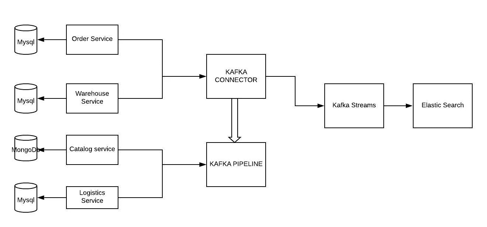
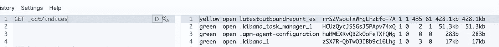
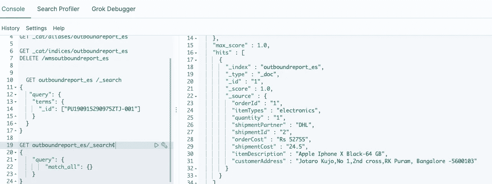
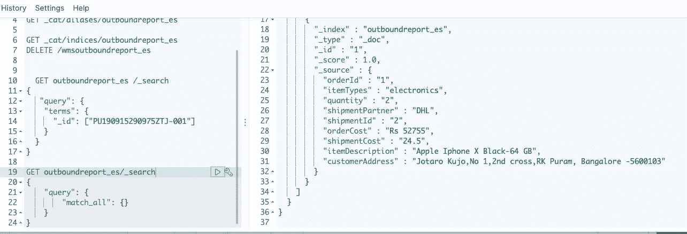
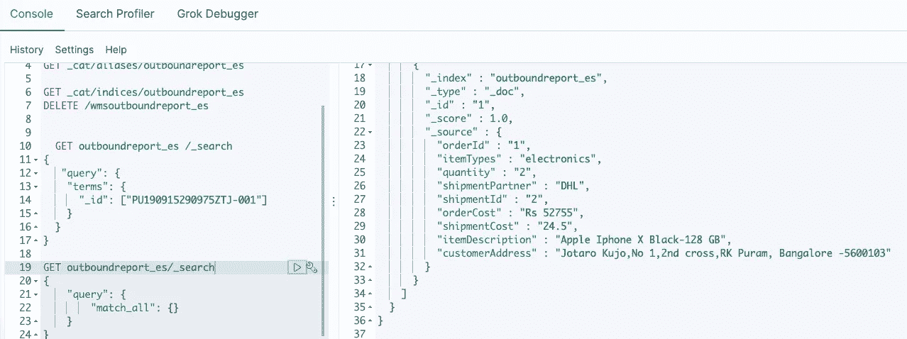
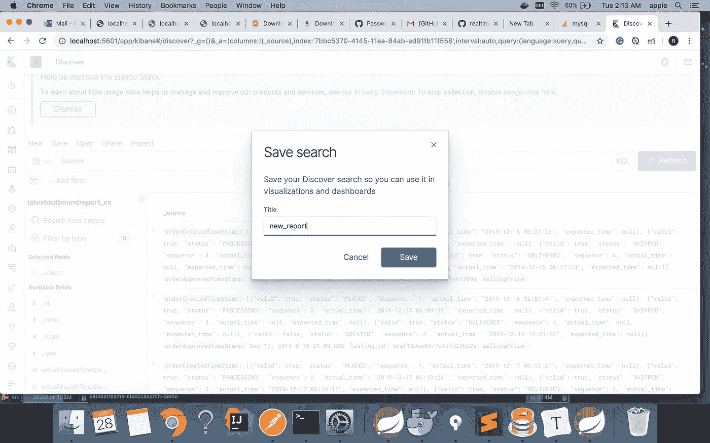
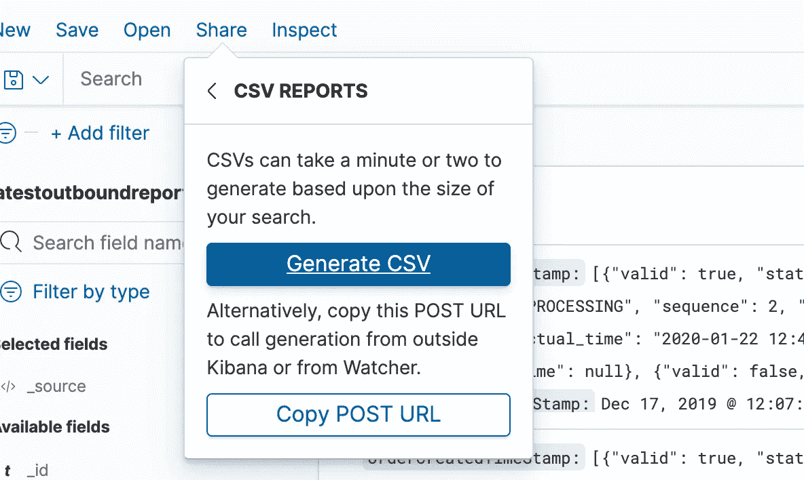
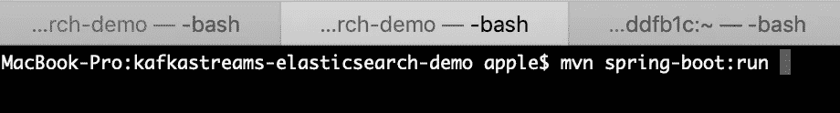

# 如何构建您的第一个实时流(CDC)系统(验证-第 4 部分)

> 原文：<https://medium.com/analytics-vidhya/how-to-build-your-first-real-time-streaming-cdc-system-verification-part-4-295399f78edd?source=collection_archive---------17----------------------->


本文是我们关于 Kafka streams 的系列文章的继续，在该系列文章中，我们着手构建了一个实时流系统。在本概念验证的第[篇第 1](/@rohan.mudaliar/how-to-build-your-first-real-time-streaming-cdc-system-introduction-part-1-5d61b2d9d511) 中，我们了解了构建系统所需的关键概念，在第[篇第 2](/@rohan.mudaliar/how-to-build-your-first-real-time-streaming-cdc-system-setup-part-2-bac2c5397d5e) 中，我们了解了 MySql 设置和本地基础架构设置。在[第 3 篇](/analytics-vidhya/how-to-build-your-first-real-time-streaming-cdc-system-kafka-steams-and-aggregation-part-3-8a331e98961d)中，我们使用 Kafka stream 和 Elasticsearch 构建了 java 后端。让我们快速回顾一下我们已经解决的问题。

# 问题陈述摘要

我们有一家电子商务公司，该公司的业务团队需要包含一些实时更新的报告来做出决策。我们的后端是用 java 构建的，它使用微服务。架构如下所示:



系统图

业务团队希望使用这些数据构建一个仪表板，并利用它做出一些营销决策。所有这些数据都存在于 3 个不同的数据库中，分别用于我们需要获取信息的 3 个不同的系统。我们决定使用 Debezium 和 Kafka Connect 来传输这些变化。

# 总体技术任务:

因此，就整体任务而言，我们将把它们划分如下

1.  **使用 docker 建立本地基础设施。**
2.  **使用 Kafka connect 将数据从 MySQL 数据库提取到 Kafka。**
3.  **在 Java 后端使用 Kafka 流读取数据。**
4.  **为聚集视图创建弹性搜索索引。**
5.  **实时监听事件并更新事件。**
6.  验证 elasticSearch 中的更新
7.  设置本地并运行 java 代码

# 6.查看创建的索引，验证 Kibana 中的更新并提取报告:

现在我们已经创建了我们的索引，下一步是验证这些索引是通过 Kibana 创建的，并提取一个 pdf 文件提供给业务用户。让我们看看我们怎样才能做得差不多。

从浏览器前往基巴纳:

```
<http://localhost:5601/app/kibana#/dev_tools/console?_g=()
```

点击开发工具(**带有螺丝刀符号**的工具)，您可以在此执行您的命令。

**查看创建的索引:**

下面是用于验证索引是否已创建的命令。

```
GET _cat/indices
```



在我的例子中，latestoutboundreport_es 是创建的索引。

接下来，我们需要验证索引中是否有数据，运行以下命令:-

```
GET latestoutboundreport_es/_search
{
    "query": {
        "match_all": {}
    }
}
```



# 测试更新

为了测试事件流和实时更新，我们需要模拟这个场景。我们可以通过对用于创建聚集索引的三个表进行更新来测试这一点。

使用的 SQL 查询如下:

```
update wms_demo set item_qty=4 where id =1;
update order_demo set order_description='Apple Iphone X Black-64 GB' where id=1;
update logistics_demo set shipment_cost=25.5 where id=2;
```

**更新前:**



**更新后**



我正在更新数量(1 到 2)和项目描述(64 GB 到 128 GB)。

**导出 CSV:**

现在我们有了记录，下一步是将这些数据导出到 pdf 中，幸运的是，Kibana 确实有导出 CSV 的选项。

单击 discover 选项卡，这将显示正在接收的连续数据流。现在您可以提供您的搜索过滤器，一旦您的搜索结果出现。

点击保存并导出 CSV。参考下面的截图:-



**总结:**

**现在我们已经到了最后一步，让我们回顾一下我们在本练习中所做的一切:-**

*   我们首先在 MySQL 数据库上启用了 Binlogs。
*   我们使用 docker 在本地为应用程序创建了所需的服务。
*   接下来，我们使用 Debezium-Kafka connect 创建了一个连接器，它将监听 MySQL 数据库中的创建/更新，并将更改推送到 Kafka。
*   我们编写了一个 Kafka streams 应用程序，它可以实时监听 Kafka 事件并创建聚合视图。
*   我们使用 RestHighLevelClient 在 Elasticsearch 上创建了一个索引。
*   我们使用 Kafka 流编写了另一个监听器，监听单个 Kafka 事件并推送更新。

# 7.在本地运行代码库。：

该代码可从以下网址获得

```
[rohan_gitrepo](https://github.com/rohan-mudaliar/big_data_pocs/tree/master/kafkastreams-elasticsearch-demo)
```

感兴趣的项目是**kafk streams-elastic search-demo**。一旦您获得了代码，下一步就是做同样的 maven 构建。

**SQL 设置:**

我们需要在三个不同的数据库中创建三个表 wms_demo、order_demo 和 logistics_demo。相同的 SQL 脚本存在于项目中，如下所示。

**创建脚本:**

**WMS_DEMO**

```
CREATE TABLE `wms_demo` (
  `id` bigint(20) NOT NULL AUTO_INCREMENT,
  `order_id` varchar(255) COLLATE utf8mb4_unicode_ci DEFAULT NULL,
  `item_type` varchar(255) COLLATE utf8mb4_unicode_ci DEFAULT NULL,
  `courier` varchar(255) COLLATE utf8mb4_unicode_ci DEFAULT NULL,
  `item_qty` varchar(255) COLLATE utf8mb4_unicode_ci DEFAULT NULL,
  `item_localtion` varchar(255) COLLATE utf8mb4_unicode_ci DEFAULT NULL,
  `shipment_id` varchar(255) COLLATE utf8mb4_unicode_ci DEFAULT NULL,
  `created_at` datetime(6) DEFAULT NULL,
  PRIMARY KEY (`id`)
) ENGINE=InnoDB AUTO_INCREMENT=2 DEFAULT CHARSET=utf8mb4 COLLATE=utf8mb4_unicode_ci;
```

**订单 _ 演示**

```
CREATE TABLE `order_demo` (
  `id` bigint(20) NOT NULL AUTO_INCREMENT,
  `order_id` varchar(255) COLLATE utf8mb4_unicode_ci DEFAULT NULL,
  `order_date` datetime(6) DEFAULT NULL,
  `order_description` varchar(255) COLLATE utf8mb4_unicode_ci DEFAULT NULL,
  `order_value` varchar(255) COLLATE utf8mb4_unicode_ci DEFAULT NULL,
  `customer_address` varchar(255) COLLATE utf8mb4_unicode_ci DEFAULT NULL,
  `created_at` datetime(6) DEFAULT NULL,
  PRIMARY KEY (`id`)
) ENGINE=InnoDB AUTO_INCREMENT=2 DEFAULT CHARSET=utf8mb4 COLLATE=utf8mb4_unicode_ci;
```

**物流 _ 演示**

```
CREATE TABLE `logistics_demo` (
  `id` bigint(20) NOT NULL AUTO_INCREMENT,
  `wmsrecord_id` varchar(255) COLLATE utf8mb4_unicode_ci DEFAULT NULL,
  `item_type` datetime(6) DEFAULT NULL,
  `shipment_cost` varchar(255) COLLATE utf8mb4_unicode_ci DEFAULT NULL,
  `created_at` datetime(6) DEFAULT NULL,
  `courier` varchar(40) COLLATE utf8mb4_unicode_ci NOT NULL,
  `order_id` varchar(255) COLLATE utf8mb4_unicode_ci DEFAULT NULL,
  PRIMARY KEY (`id`)
) ENGINE=InnoDB AUTO_INCREMENT=3 DEFAULT CHARSET=utf8mb4 COLLATE=utf8mb4_unicode_ci;
```

注意:所有这三个表都是在不同的数据库中创建的。

**插入脚本:**

**WMS_DEMO**

```
INSERT INTO `wms_demo` (`id`, `order_id`, `item_type`, `courier`, `item_qty`, `item_localtion`, `shipment_id`, `created_at`)
VALUES(1,'1','electronics','DHL','2','RACK12BA3','2','2020-02-03 12:28:44.000000');
```

**订单 _ 演示**

```
INSERT INTO `order_demo` (`id`, `order_id`, `order_date`, `order_description`, `order_value`, `customer_address`, `created_at`)
VALUES
    (1,'1','2020-02-02 12:23:25.000000','Apple Iphone X Black-128 GB','Rs 52755','Jotaro Kujo,No 1,2nd cross,RK Puram, Bangalore -5600103','2020-02-02 12:23:25.000000');
INSERT INTO `wms_demo` (`id`, `order_id`, `item_type`, `courier`, `item_qty`, `item_localtion`, `shipment_id`, `created_at`)
VALUES(1,'1','electronics','DHL','2','RACK12BA3','2','2020-02-03 12:28:44.000000');
```

**物流 _ 演示:**

```
INSERT INTO `logistics_demo` (`id`, `wmsrecord_id`, `item_type`, `shipment_cost`, `created_at`, `courier`, `order_id`)
VALUES(2,'1','0000-00-00 00:00:00.000000','24.5','2020-02-04 00:04:05.000000','FETCHR','1');
​
```

出于概念验证的目的，我只有 5 个订单，其中 5 个记录在 wms 表中，5 个记录在 logistics 表中。您可以使用 insert 语句在本地添加更多记录。

**运行代码:**

完成 SQL 设置后，要使用 docker 设置基础设施，请遵循以下步骤

1.  将 *docker-compose.yml* 中的“ **ADVERTISED_HOST_NAME** ”编辑为您机器的 IP
2.  运行'`docker-compose up -d`'
3.  运行`curl -H "Accept:application/json" localhost:8083/`检查 Kafka connect 是否启动
4.  在本地创建一个连接器(参考步骤**使用 Kafka connect 创建一个 MySQL 连接器**)。
5.  一旦 Kafka connect 启动`curl -H "Accept:application/json" localhost:8083/connectors/`,检查您的连接器是否启动
6.  运行“`kafka-topics --zookeeper localhost:2181 --list`”以获取已创建主题的列表
7.  使用'【T3]'阅读主题

注意:

1.  我们用于连接的用户应该拥有**重新加载**和**复制**权限。
2.  如果您的任何 docker 容器意外关闭，最可能的原因之一是 docker 内存不足。按照以下步骤进行纠正:

a)打开 docker 桌面偏好设置

b)转到高级

c)将滑块设置为 **4GB RAM**

一旦基础设施建立起来，进入终端，输入下面的命令。



这将运行应用程序，并在 Elasticsearch 中创建初始索引。下一步是通过在 MySql 终端上执行脚本并在 Elasticsearch 中进行验证来检查更新。

# 总而言之:

# **问题/拦路虎:**

现在我们已经建立了我们的系统，我想谈的一件事是我确实面临挑战和解决方法的一般地方。

*   **数据库设置-** 对于 amazon rds 和独立服务器，Binlogs 设置有所不同。所以权限也不同。根据 debezium 文档，必须注意这一点。
*   **连接器问题-** 连接器的许多问题都与配置有关。所以理解 Kafka connect 和 debezium 的配置参数将会节省您很多时间。
*   **生产中的主题创建问题-** 我们经常面临的一个问题是连接器最初读取一些数据，然后停止，并显示如下错误消息。

```
*connector stopped after creating 880 topics with Got error produce response with correlation id 1895609 on topic-partition testdeb04030642pm.catalog.catalog_optical_frame_eav-0, retrying (2147483646 attempts left). Error: KAFKA_STORAGE_ERROR*
```

*   问题是 debezium 从数据库中读取的速度比写入的速度快。所以你必须调整配置。

# 我学到的:

我想说，对我来说，这个练习最大的收获是卡夫卡 和卡夫卡生态系统 中的 [**事件流的想法。所以我们可能都读过或读过卡夫卡。因此，在我建立这个平台的过程中，我确实更好地理解了为什么 Kafka 要在 LinkedIn 上建立，Kafka Connect、Kafka streams 是如何以及为什么被添加到这个平台以及它们的功能。更上一层楼，我也可以理解大数据、物联网和处理海量数据的一切是如何联系在一起的。对于那些对事件流感兴趣的人，我留下了下面我觉得有趣的链接:-**](https://www.confluent.io/blog/event-streaming-platform-1/)

[https://www.confluent.io/blog/event-streaming-platform-1/](https://www.confluent.io/blog/event-streaming-platform-1/)

[https://www.confluent.io/blog/event-streaming-platform-2/](https://www.confluent.io/blog/event-streaming-platform-2/)

接下来是关于理解平台中使用的各个组件、它们背后的故事以及它们的功能

*   [卡夫卡-连接](https://docs.confluent.io/current/connect/index.html)
*   [卡夫卡——溪流](https://kafka.apache.org/documentation/streams/)
*   [ElasticSearch-Java-API 的](https://www.elastic.co/guide/en/elasticsearch/client/java-rest/master/java-rest-high.html)
*   Debezium

**进一步范围:**

*   目前，在这个项目中，我们只在构建数据管道项目的数据工程方面进行了工作，业务所需的最终报告需要进行一些分析工作。
*   目前，我们只处理了三个表，这可以扩展到多个表，我们可以创建复杂的聚合视图。
*   这个技术栈的一个特点是没有 ml，如果 java 需要，我们可以使用 java 中的 spark MLlib 功能来完成 ML 任务。
*   将 Debezium 与部署在 AWS/cloud 上的 MySql 一起使用的一个挑战是，它会创建一个读锁。这可能会影响性能。

> 如果您确实喜欢这篇文章，请务必阅读后续文章并分享您的反馈。在 LinkedIn 上找到我，地址是 [rohan_linkedIn](https://www.linkedin.com/in/rohanganesh0506/) 。