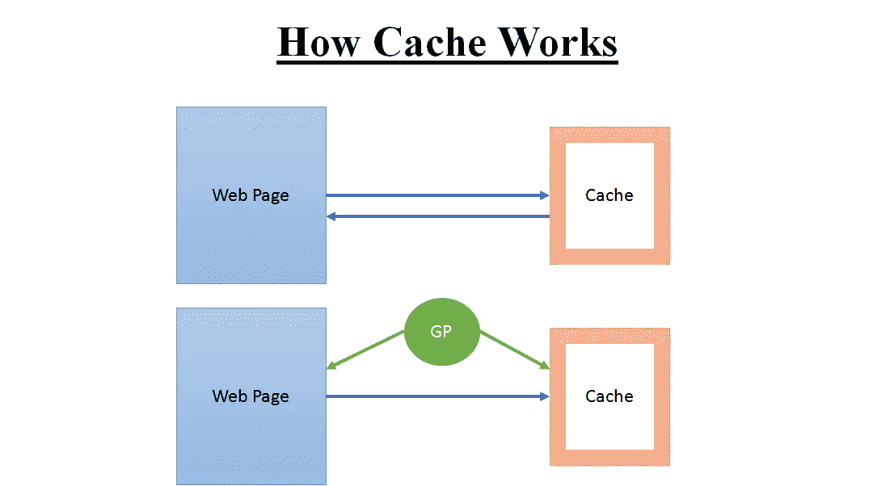
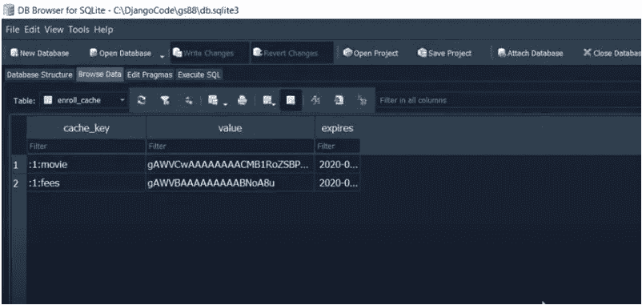

# 如何使用 Django-Python 缓存网站？

> 原文：<https://medium.com/analytics-vidhya/how-to-cache-website-using-django-python-421d9b6c7c31?source=collection_archive---------7----------------------->

**缓存**

缓存是一种信息技术，用于临时存储(缓存)Web 文档，如网页、图像和其他类型的 Web 多媒体，以减少服务器延迟。

缓存是网站实现更快速度的方法之一。它具有成本效益，并节省 CPU 处理时间。

Django 提供了一个健壮的缓存系统，可以让你保存动态页面，这样就不必为每个请求计算它们了。

您可以缓存特定视图的输出，可以只缓存难以生成的部分，也可以缓存整个站点。

以下是缓存选项:-

数据库缓存

文件系统缓存

*   本地内存缓存

**如何实现缓存**

以下是缓存的类型:

*   每个站点的缓存-一旦设置了缓存，使用缓存的最简单方法就是缓存整个站点。

每视图缓存——使用缓存框架的一种更细粒度的方法是缓存各个视图的输出。

*   模板片段缓存——这让您可以更好地控制要缓存的内容。并且只缓存 HTML 模板的特定部分。
*   低级缓存——这使您可以控制只缓存一个小的数据结构，如列表、字典等。可以腌制/序列化。

在这个博客中，我们将讨论如何缓存整个网站(因此可以将其视为缓存系列的第 1 部分)。

**逐站点缓存**

一旦设置了缓存，使用缓存最简单的方法就是缓存整个站点。

以下是需要遵循的步骤:

1.  转到 django 项目的 settings.py 文件，添加以下中间件。请注意，应该保持中间件的顺序。(强制)

> 中间件= [
> 
> ' django . middleware . cache . updatecachemiddleware '，
> 
> ' django . middleware . common . common middleware '，
> 
> ' django . middleware . cache . fetchfromcachemiddleware '，
> 
> ]

以下是可以添加到 settings.py 文件(可选)中的一些变量

缓存中间件别名—用于存储的缓存别名。

CACHE_MIDDLEWARE_SECONDS —每页应该缓存的秒数。

CACHE _ MIDDLEWARE _ KEY _ PREFIX——如果缓存在使用相同 Django 安装的多个站点之间共享，则将它设置为站点的名称，或者对于这个 Django 实例唯一的其他字符串，以防止密钥冲突。不在乎就用空字符串。

**缓存系统的类型:**

如前所述，我们可以在三种类型的系统中存储缓存数据:

*   数据库缓存—数据存储在 RDBMS 表中
*   文件系统缓存-数据存储在文件中
*   本地内存缓存-数据存储在服务器/计算机的本地内存中

**数据库缓存**

Django 可以将其缓存数据存储在您的数据库中。如果您有一个快速、索引良好的数据库服务器，这种方法效果最好。

在 Django 项目的 settings.py 文件中添加以下字典

> 缓存= {
> 
> 默认':{
> 
> 后端':' django . core . cache . backends . db . database cache '，
> 
> 位置':'我的缓存表'，
> 
> }
> 
> }
> 
> # my_cache_table:表示在数据库中创建的表的名称。

在使用数据库缓存之前，必须使用以下命令创建缓存表:

> *python manage . py createcachetable*

这将在数据库中创建一个表，其格式符合 Django 的数据库缓存系统的要求。表名取自 LOCATION，即字典的 LOCATION 键。

如果使用多个数据库缓存，createcachetable 会为每个缓存创建一个表。

**缓存参数**

可以为每个缓存后端提供额外的参数来控制缓存行为。

**超时**:用于缓存的默认超时，以秒为单位。该参数默认为 300 秒(5 分钟)。您可以将 TIMEOUT 设置为 None，这样在默认情况下，缓存键永远不会过期。值为 0 会导致密钥立即过期(实际上是“不缓存”)。

**选项**:应该传递给缓存后端的任何选项。有效选项的列表会因每个后端而异，由第三方库支持的缓存后端会将其选项直接传递给底层缓存库。

实施自己的剔除策略的缓存后端(即 locmem、文件系统和数据库后端)将支持以下选项:

**MAX_ENTRIES** :删除旧值之前，缓存中允许的最大条目数。该参数默认为 300。

**剔除频率**:达到 MAX_ENTRIES 时被剔除的条目比例。实际比率是 1 / CULL_FREQUENCY，因此将 CULL_FREQUENCY 设置为 2，以便在达到 MAX_ENTRIES 时剔除一半的条目。该参数应为整数，默认值为 3。

CULL_FREQUENCY 的值为 0 意味着当达到 MAX_ENTRIES 时将转储整个缓存。在一些后端(特别是数据库)，这使得剔除速度更快，但代价是更多的缓存未命中。

> 缓存= {
> 
> 默认':{
> 
> 后端':' django . core . cache . backends . db . database cache '，
> 
> 位置':'注册缓存'，
> 
> '超时':60，
> 
> 选项':{
> 
> “最大条目数”:1000
> 
> }
> 
> }
> 
> }

通过添加上面提到的步骤，我们将可以观察到两件事情:

1.  在数据库中创建一个高速缓存表，其名称在位置中提及
2.  每当用户打开我们的网站时，都会插入新行。
3.  如果用户在超时时间内打开同一个网站，即使实际网站的内容发生了变化，用户也会看到相同的视图。

缓存表

基于表的缓存系统速度最快，也更有组织性。

**注意:**即使在缓存过期或超时后，这些缓存也会将所有记录保留在内存中。添加一个可以删除旧缓存的系统。

对于基于文件的高速缓存和基于本地存储器的高速缓存，可以遵循类似的步骤。请遵循以下步骤(可选):

**文件系统缓存**

基于文件的后端将每个缓存值序列化并存储为一个单独的文件。

对于基于文件的系统，我们也需要按照上面的步骤添加中间件，然后在 settings.py 文件中添加下面的字典

> 缓存= {
> 
> 默认':{
> 
> 后端':' django . core . cache . backends . file based . filebasedcache '，
> 
> 位置':' c:/Django 代码/gs80 '，
> 
> }
> 
> }

确保此设置指向的目录存在，并且运行 Web 服务器的系统用户可以读写该目录。

> 缓存= {
> 
> 默认':{
> 
> 后端':' django . core . cache . backends . file based . filebasedcache '，
> 
> 位置':'/var/tmp/django_cache '，
> 
> }
> 
> }

**本地内存缓存**

如果您的设置文件中没有指定其他缓存，这是默认缓存。这种缓存是基于进程和线程安全的。

每个进程都有自己的私有缓存实例，这意味着不可能进行跨进程缓存。这显然也意味着本地内存缓存不是特别高效的内存。

对于生产环境来说，这可能不是一个好的选择。对发展有好处。

按照上述步骤添加中间件后，在 Django 项目的 setting.py 文件中添加以下字典。

> 缓存= {
> 
> 默认':{
> 
> 后端':' django . core . cache . backends . locmem . locmemcache '，
> 
> 位置':'独特的雪花'，
> 
> }
> 
> }

Django 中**缓存的第 1 部分到此结束，即缓存整个网站**。

请给掌声和评论，如果你需要这个概念的 git 中心源代码。

稍后见，在下一篇博客中，我们将介绍按视图缓存、模板片段缓存和低级数据结构缓存。