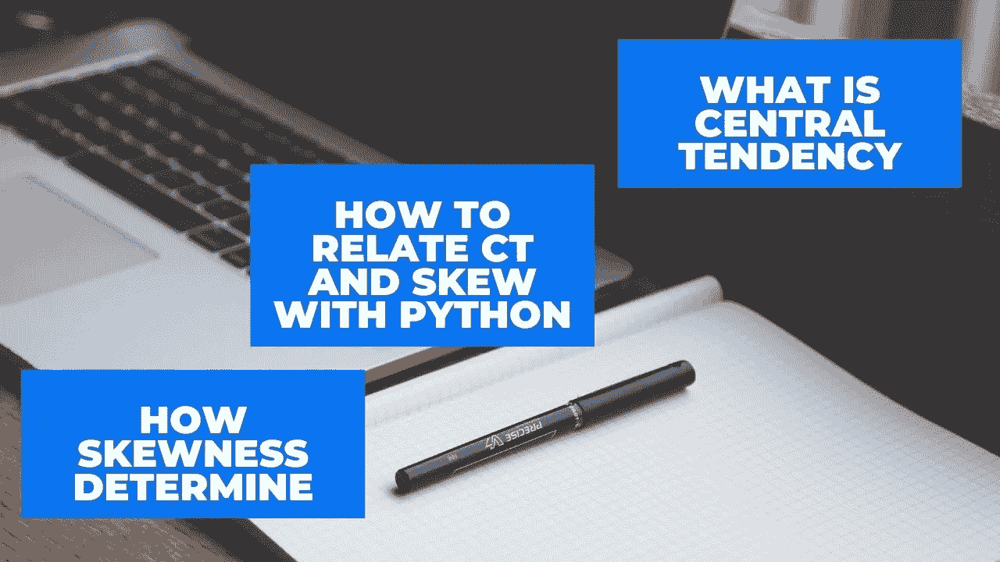

# 如何在统计学和 Python 中计算集中趋势和不对称度量

> 原文：<https://medium.com/analytics-vidhya/how-to-calculate-central-tendency-and-asymmetry-measures-in-statistics-and-python-28b2bc10407d?source=collection_archive---------13----------------------->

作者图片

在这篇博客中，我将通过使用 Python 来谈论集中趋势、不对称性和可变性。如果你错过了我之前关于 Python 描述性统计的博客，请点击下面的链接。[https://medium . com/analytics-vid hya/descriptive-statistics-with-python-part-1-9f 34 e 48 ABC 05](/analytics-vidhya/descriptive-statistics-with-python-part-1-9f34e48abc05)