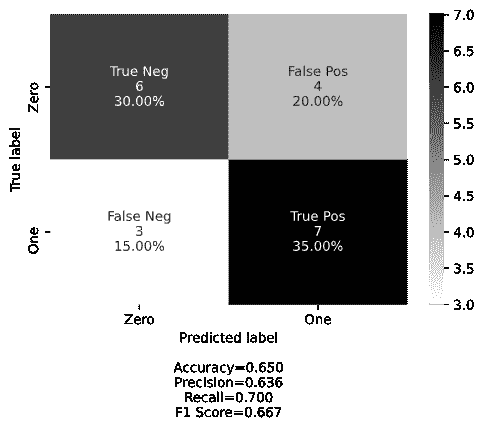
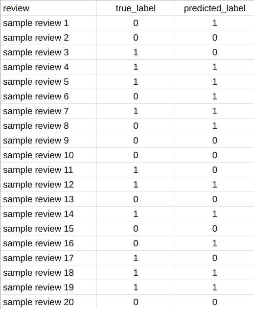
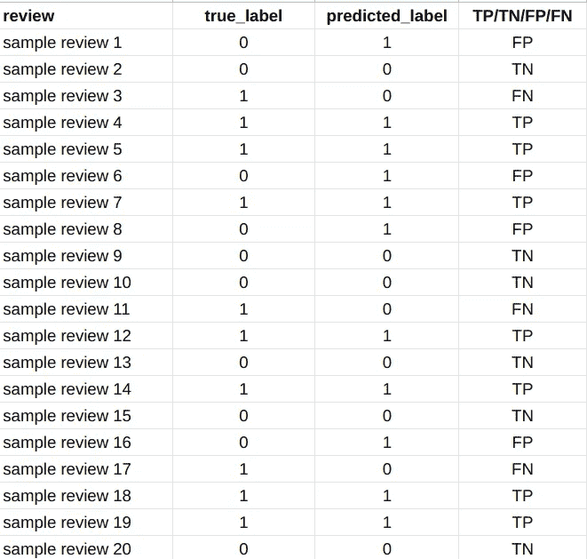
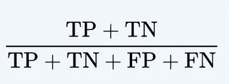
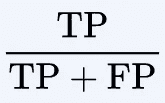
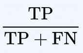
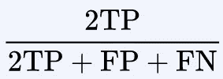

# 如何手动计算混淆矩阵？

> 原文：<https://medium.com/analytics-vidhya/how-to-calculate-confusion-matrix-manually-14292c802f52?source=collection_archive---------3----------------------->

混淆矩阵图

为了正确理解这些术语，我将举一个简单的二元分类问题。比方说，我们的数据集包含一个电子商务网站的产品评论。每个评论都有一个标签，要么是正面的(1)，要么是负面的(0)。我们的任务是分类一个评论是正面的还是负面的。让我们假设，使用不同的 NLP 技术，我们已经建立了一个好的/坏的模型，可以以某种方式预测标签。例如，下面的 CSV 文件快照是我们的模型做出预测后，我们的**实际**和**预测**标签的样本。

**图 1:** 我们的样本产品根据实际标签审查预测

在这个数据集中， **0** 表示负面评价， **1** 表示正面评价。这里，我们使用机器学习模型获得了我们预测的标签。在本文中，我不会解释任何机器学习模型或训练/测试阶段。

如果你计算一下`true_label`，你会发现有 10 个正面评价( **1** )和 10 个负面评价( **0** )。在下一列(`predicted_label`)，我们有我们的机器学习模型做出的预测。这些值与实际标签不完全相同(`true_label`)。

你可能已经在别的地方看到过我们计算混淆矩阵使用:
**TP** (真正)
**TN** (真负)
**FP** (假正)
**FN** (假负)

这些价值是什么？

## 真阳性(TP)

当实际标签(`true_label`)为正(1)，并且你的机器学习模型也预测该标签为正(1)。
在我们的 CSV 文件快照中，在`**sample review 4**,`中，我们的实际标签为正(1)，我们的模型也预测审核为正(1)。所以，它是一个 **TP** 值。

## 真阴性(TN)

当实际标签(`true_label`)为负(0)，而你的机器学习模型也预测该标签为负(0)时。
在我们的 CSV 文件快照中，在`**sample review 2**,`中，我们的实际标签为负(0)，我们的模型也预测该评论为负(0)。所以，它是一个 **TN** 值。

## 假阳性

当实际标签(`true_label`)为负(0)，但你的机器学习模型预测该标签为正(1)。
在我们的 CSV 文件快照中，在`**sample review 1**,`中，我们的实际标签为负(0)，但我们的模型预测该评论为正(1)。所以，它是一个 **FP** 值。

## 假阴性(FN)

当实际标签为正(1)，但您的机器学习模型预测该标签为负(0)时。
在我们的 CSV 文件快照中，在`**sample review 3**,`中，我们的实际标签(`true_label`)为正(1)，但我们的模型预测该审查为负(0)。所以，它是一个 **FN** 值。

# 计算混淆矩阵

现在，你知道哪些值是什么了！

**图 2:** 我们模型预测的 TP、TN、FP、FN 值

当你理解了这一点，剩下的事情就只是简单的数学了。

在我们的例子中，(根据图 2 计算):
TP 的总值:7
TN 的总值:6
FP 的总值:4
FN 的总值:3

## 计算准确度

计算模型精度的公式:

计算精度的公式

如果您将这些项的值放入上面的公式中，并进行简单的数学计算，您将获得精确度数字。在我们的例子中，它是: **0.65** 这意味着准确率是 65%。

## 计算精度

计算模型精度的公式:

计算精度的公式

替换这些项的值，并计算简单的数学，它将是 **0.636**

## 计算召回率|敏感度|真阳性率— TPR

计算召回率或敏感度的公式

替换这些项的值，并计算简单的数学，它将是 **0.70**

## 计算 F1 分数

计算 F1 分数的公式

替换这些项的值，并计算简单的数学，它将是 **0.667**

## 计算误报率-FPR

计算 FPR 的公式

替换这些项的值，并计算简单的数学，它将是 **0.4**

## 受试者工作特征曲线

它是通过在 X 轴绘制假阳性率(FPR ),在 y 轴绘制真阳性率(TPR)而生成的图。

作者:萨德曼·卡比尔·苏米克
领英:[https://www.linkedin.com/in/sksoumik](https://www.linkedin.com/in/sksoumik/)