# 如何从数据包络分析模型中计算特征重要性

> 原文：<https://medium.com/analytics-vidhya/how-to-calculate-feature-importances-from-a-dea-model-c2d6ca1a3ccd?source=collection_archive---------10----------------------->


关于优化和数据科学的比较，我的一个体会在这篇文章中实现了。在研究处理表单提交的数据科学时，我遇到了 DEA(数据包络分析)的 [CCR 模型](https://personal.utdallas.edu/~ryoung/phdseminar/CCR1978.pdf)。我模拟的表单提交具有不同的输入和输出维度，并且它可以是任意的，以便在输入端和输出端都保持顺序参数的行为。

# **数据科学中使用的三种变量**

分类的:那些使用数据进行分类的类别数量有限的变量。分类变量可以是:

*   **序数**:这些变量有顺序或排名，大多数情况下 kendall tau 用于序数参数的关联。
*   **名义**:这些变量没有任何顺序，因为它们可以是布尔型或非等级分类变量，可以用数据类别来表示

**连续**:这些变量是连续的，也可以是浮点变量。

Charnes 等人。艾尔。(1978)指出，将一组加权输入变量转换为一组加权输出变量的效率可以使用线性规划来表示，该线性规划使加权和的比率最大化。DEA 方法通过为我们提供权重的解决方案，使用决策单元(DMU)来正式确定转移的效率。

另一篇关于使用 DMU(s)的 DEA 的论文通过考虑加权和来考虑加权和的比率的正则化，如果可能的话，在域中包括任何布尔变量。

**使用形状组合评估特征重要性**

上面的代码是因子模型的代码，该模型分析发送到期望最大化模型和因子模型的重要性和整个输出域组合。我在这里使用了 [shap](https://github.com/slundberg/shap) 来生成所有这些特性组合的重要性，并理解它们是如何分层表示的。

在这里，我使用的特性已经在下面详细说明了它们与表单提交的关系:

我们有 n 个输入和 m 个输出域组合，我们的目标是通过学习输出域来映射出输入组合。

*输出域(4 个箱中的 m 个组合—* ***w1，w2，w3，w4*** *)*

*输入域(n 个加权输入)*

由于它们是加权输入，因此采用 DEA 的线性规划方法来评价特征的重要性。DEA 增加了额外的线性约束，并最大化了加权和的比率。在这个问题中，假设输入域的权重相等，因此如果有 10 个输入值，则比例取为 1/10 = **0.1**

# **因子模型和来自因子分析的噪声**

在定义域和定义域的表示问题中，具有最小噪声的因子模型对于理解输入定义域和输出定义域之间的关系具有重要意义。在当前示例中，我通过进行因子分析获得了这些值:

我们可以观察到权重 **w2** 具有最小的噪声，并且可以使用[形状值](https://github.com/slundberg/shap)显示出**权重 2** 最不重要，因为输出密码子的行为受权重 **w2** 的影响最小。事实上，映射到其后验概率的 4×4 矩阵的因子模型对于权重 2 是正相关的，这意味着其对散度最大化的贡献最小，而 w4、w3、w1 与它们的后验概率是负相关的，这反映了由于那些权重导致的 KL 散度。

# 数据包络分析

一种优化技术，采用输出和输入的加权和，使净比率最大化，这样在决策单元(DMU)的情况下，比率不会超过 1。

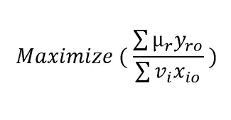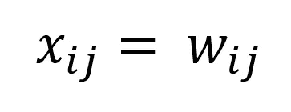

```
MinMaxScaler(feature_range=(0,1)).fit_transform(values)
```

为了突出上面的代码，我们将相关值从 0 转换为 1，因为在这种情况下，我们惩罚绝对不相关的向量，奖励高度相关的向量。总的来说，我们获得的结果类似于本文的 [**扩展版本**](/@aswinkvj/data-envelopment-analysis-using-decision-making-units-an-analytical-approach-d234475df92a) 中所示的斑点权重。这种数据转换的层次结构如下所示:

# **-保留 MinMaxScaler 值，意味着高度不相关表现为无效值**

> -保持相关值不变，意味着高度不相关的行为与不相关的 DMU 相同
> 
> -保留相关性的绝对值，这给出了双峰分布，意味着高度不相关值的行为与高度相关值相同

**将 DEA 问题转化为拉格朗日最小化问题**

假设拉格朗日乘数α和β分别为 1 / vi 和 vi。在拉格朗日最小化中，最大化项是往复的，并且使用乘数添加约束项，该乘数被表示为输入域的权重。在我们的拉格朗日问题中，我们需要确定两者:

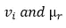

**在 DEA 中确定这些权重**

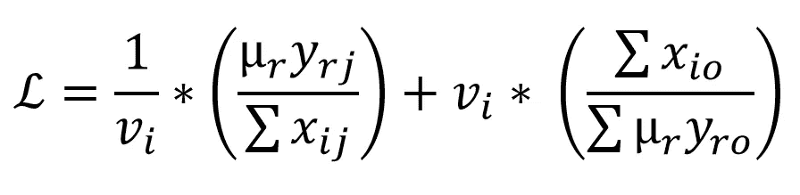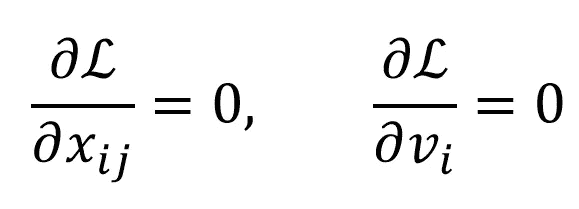

**使用支持向量机将特征重要性映射到输出域**

我们需要知道输入端的权重映射将如何影响输出域。因此，我在 Scikit Learn 中创建了一个支持向量回归机，并发现使用推断的特征重要性对支持向量进行分类的分数并没有那么差。

**使用 np.isclose 方法，我们可以将支持向量的数量减少到显著的最小值，这反映了推断的特征重要性**

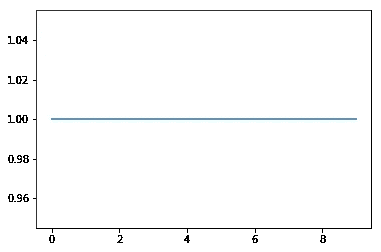

拉格朗日六点法

```
vi = \
[9.48953131e-08 9.48953131e-08 0.00000000e+00 9.48953131e-08
 9.48953131e-08 9.48953131e-08 9.48953131e-08 0.00000000e+00
 0.00000000e+00 0.00000000e+00]
```

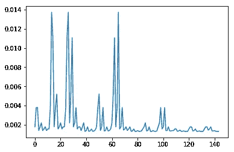

拉格朗日绘制的特征重要性图

# **如何将 DEA 模型扩展为广义 SVM 模型**

在构建 SVM 模型时，您可以使用拉格朗日方法或 DEA 凸优化技术，使用多个合成数据集，也可以使用此处提供的 excel 表和 Jupyter 笔记本作为参考( [solver.xlsx](https://drive.google.com/open?id=18NDnXLf71h2PTSxqpCWMBTrwhxbP3pZ2) 、 [SVM_DEA_Solver.ipynb](https://notebooks.azure.com/anon-hixsea/projects/svm-dea/html/SVM_DEA_Solver.ipynb) )。

# **用于推断特征重要性的形状值**

> 我使用联盟博弈论中的 [shap 值来推断特性的重要性。我将每个 shap 组合归类为一个 python 函数，在这里描述。](http://homepages.inf.ed.ac.uk/scohen/features+nc.pdf)

```
**pip install shap**
```

这反映了使用因子分析对权重 w1、w2、w3 和 w4 进行的初步研究。这里发现 w2 是最不重要的，因为它的域范围。在上述函数中，w4 和 w1 被排除在外，因此该函数的形状特征重要性将非常低，如下所示。

**问题值是指 cvxpy 中的优化最大值，mean_r.value 是指 DMU 和输出值的系数，或简称为特征重要性**

此处显示的片段是关闭不同权重后所有形状特征重要性的平均值。

```
(0.04301583009989807,
 0.02558938157631804,
 0.04301583009989809,
 0.04301583009989807,
 0.02558938157631804,
 0.02558938157631811,
 0.04301583009989807,
 0.04301583009989809,
 0.02558938157631811,
 0.02558938157631804,
 0.04301583009989809,
 0.02558938157631811)
```

决策树通过定制的可调用函数来适应输出域和形状特征的重要性。下面给出的模型不是机器学习模型，因为该模型没有测试数据来进行交叉验证。正如你所看到的，分割决策树然后降低 mse(均方误差)的节点都是 shap 特征。

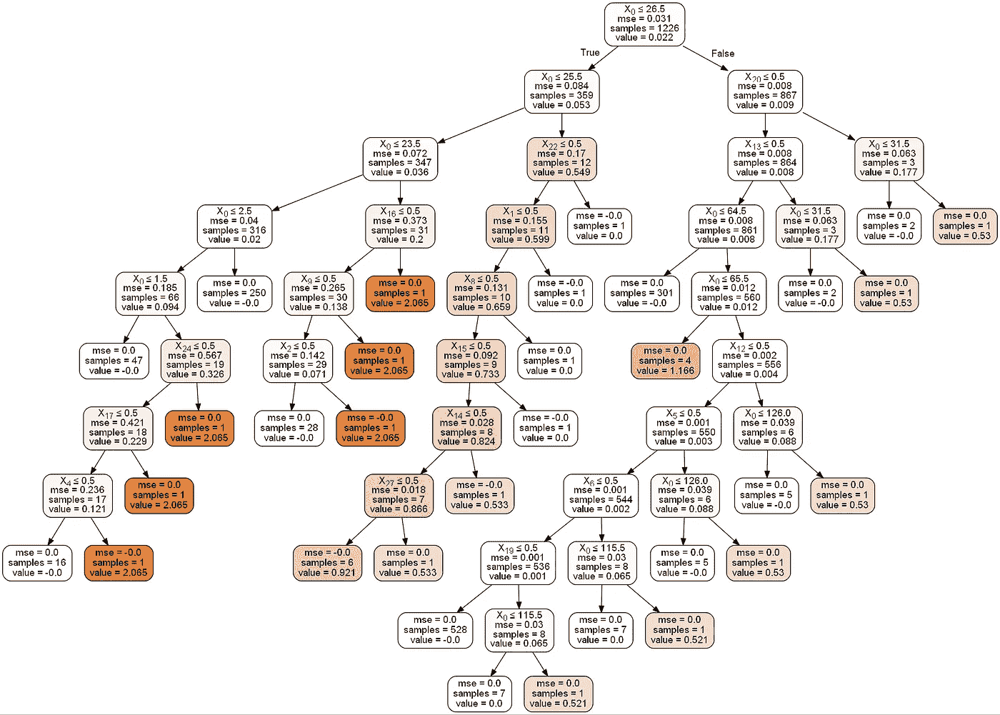

决策树回归器，使用输出共域的外观索引来分离数据

# 结论

在将 DEA 模型扩展到大型 SVM 模型时，使用带有适当运算符的等式。


在决策树算法中，Shap 库解释节点的拆分，因为它本身有一些算法来解释决策树，如下所示:

> **部分图片/情节经过精心挑选，对图片的改动敬请谅解**

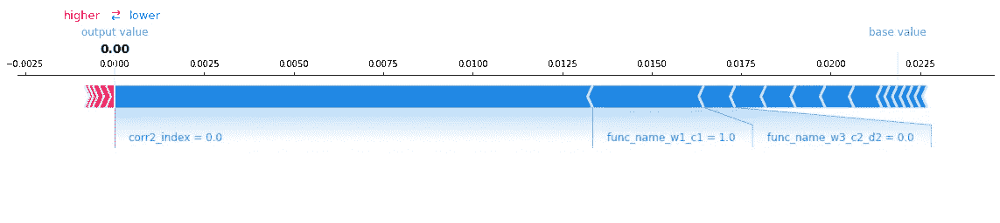

**第 0 指数的 SHAP 值**

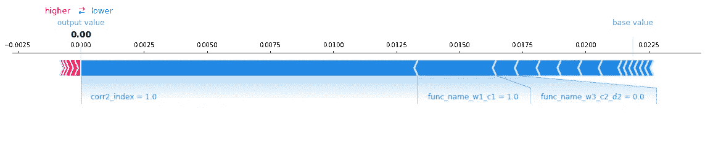

【1STINDEX 的 SHAP 值

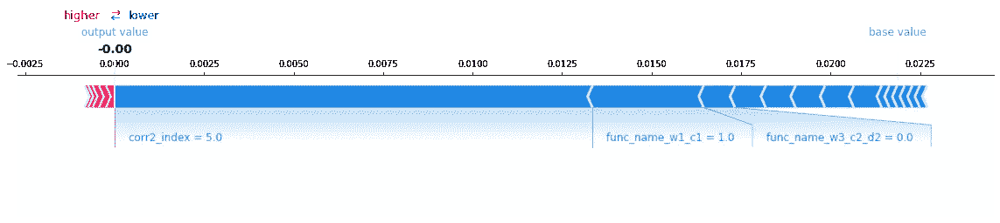

**第 5 个指标的 SHAP 值**

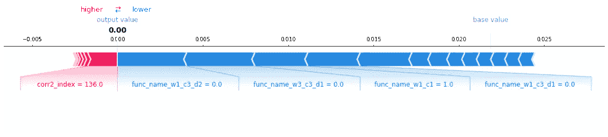

**SHAP 值为第 136 指数**

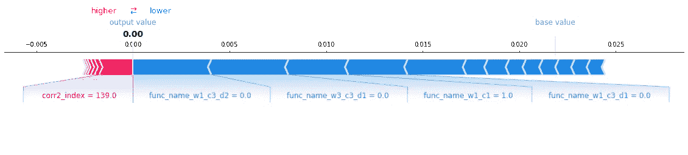

**SHAP 值为第 139 指数**

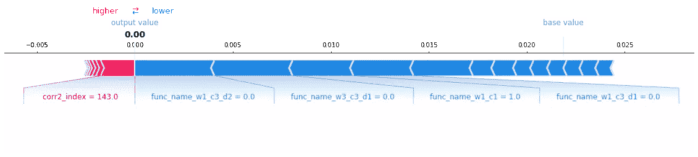

**第 143 项指标的 SHAP 值**