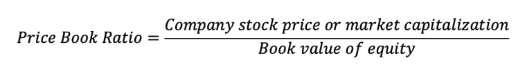
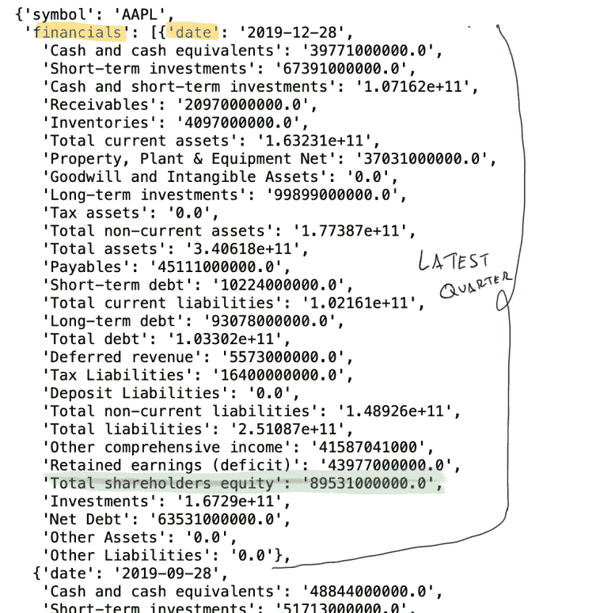
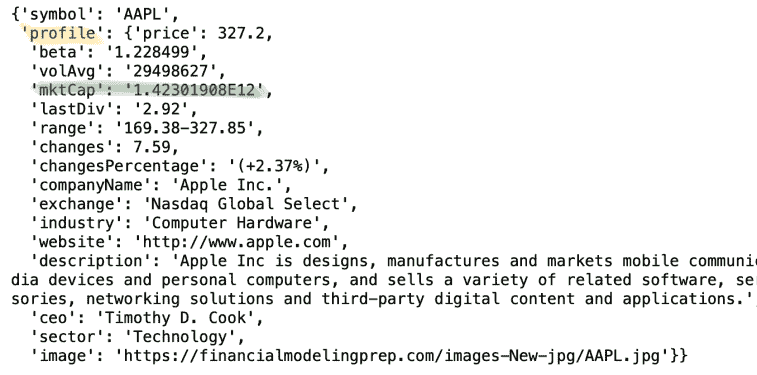

# 如何用 Python 计算市净率— Python for Finance

> 原文：<https://medium.com/analytics-vidhya/how-to-calculate-price-book-ratio-with-python-python-for-finance-725286f11e?source=collection_archive---------13----------------------->

市净率(PB)是分析公司相对价值的一个非常有用的指标。PB 有助于确定与类似公司相比，一家公司的价格目前是被低估还是被高估。在本文中，我们将学习如何使用 Python**计算价格账面价值(PB)。**


照片由[艾萨克·史密斯](https://unsplash.com/@isaacmsmith?utm_source=unsplash&utm_medium=referral&utm_content=creditCopyText)在 [Unsplash](https://unsplash.com/s/photos/financial?utm_source=unsplash&utm_medium=referral&utm_content=creditCopyText) 拍摄

# 什么是市净率？

在转向 Python 之前，对我们想要做什么有一个清晰的想法总是好的。在这种情况下，我们需要知道什么是市净率，它是如何计算的。



市净率

**价格账面价值**是一个财务比率，它可以给投资者一个公司价格与其他类似公司价格的良好指示。它是由一家**公司的市值** **除以**股权的账面价值**计算出来的。**

**计算 PB 比率的另一种方法是以每股为基础，用股票价格除以权益的账面价值。在我们的例子中，我们将使用第一种方法。**

**计算**价格书比率只需要两个要素:****

*   ****公司市值:**从任何交易所或[财经网站](https://finance.yahoo.com/)都可以轻松获得。它是每股股票的报价乘以发行在外的股票数量。**
*   ****权益账面价值**:可以从上市公司公布的财务报告中提取。它位于资产负债表的权益部分，在*股东权益总额*的标签下。账面价值就是一家公司的净资产，是一种过去的衡量标准。即它考虑了历史交易，如以前期间的损益、股息等。**

# **如何解读价格账面比？**

**市净率可能是一个很好的指标，可以用来了解一家公司与同行公司相比是被高估还是被低估。**高市净率**可能表明公司很贵，或者市场对公司的未来前景非常乐观。成长中的公司往往有很高的市净率。**

**另一方面，具有低市净率的公司被称为价值股。这可能表明一家公司被低估了，因为账面价值高于市值。然而，我们需要对低市净率的公司保持谨慎，因为这也可能是财务困境或预期未来收益下降的迹象。**

**技术行业的公司是一个具有很高市净率的成长型公司的明显例子。**

**让我们用 Python 通过计算技术领域公司的比率来检查 PB 比率。**

# **用 Python 计算价格手册比率**

**为了获得计算所需的财务数据，我将使用一个免费的 [API，其中包含股票和财务数据](https://financialmodelingprep.com/developer/docs/)。我建议你看一下文档。**

**我们将创建一个函数， *getpricetobook* ，它将把我们想要提取数据的公司的股票作为参数。在我们的例子中，我们将通过 *AAP* L 来获取*苹果*的财务数据。**

**我们向我们的财务 API 的[端点发出请求，以检索资产负债表报表数据。然后，我们将响应存储在变量 call *BS* 中。](https://financialmodelingprep.com/api/v3/financials/balance-sheet-statement/AAPL?period=quarter)**

```
import requests

def getpricetobook(stock):
    BS = requests.get(f"https://financialmodelingprep.com/api/v3/financials/balance-sheet-statement/{stock}?period=quarter")
    BS = BS.json()
    print(BS)

getpricetobook('AAPL')
```

**如果我们打印我们的 BS 变量，我们会看到我们有一个 *json* 对象需要解析。用 Python 来做这件事很简单。 *BS* 包含一个有两个键的字典。第二个关键字，*财务，*包含季度资产负债表报表列表:**

****

**苹果的资产负债表**

**首先，我们需要提取 th *e* ***股东总权益价值*** ，因为这将代表我们 ***权益账面价值*** (即价格账面比率的分母)。**

**我们可以通过解析 BS 并获取*[‘financials’]*关键字内的列表 *[0]* 的第一个元素中包含的 ***股东权益总额****[‘股东权益总额’]*来提取它:**

```
book_value_equity_now = float(BS['financials'][0]['Total shareholders equity'])  
print(book_value_equity_now)

#returned number: 89531000000.0
```

**请注意，我们在 API 返回的字符串前面包含了 *float* ，以便将其转换为 *float* 。**

**接下来，我们要检索**苹果的市值**。我们可以通过向各自的 [API 端点](https://financialmodelingprep.com/api/v3/company/profile/aapl)发出请求来轻松做到这一点:**

```
company_info = requests.get(f"https://financialmodelingprep.com/api/v3/company/profile/{stock}")

company_info = company_info.json()
market_cap =  float(company_info['profile']['mktCap'])
print(market_cap)

#market_cap value is 1423019080000.0
```

****

**苹果简介**

**正如我们之前所做的，我们在配置文件字典中提取 ***mktCap*** 值。请注意，该值基于最新的股票价格，而我们的权益账面价值基于最新的资产负债表。**

**最后，我们可以计算我们的市净率:**

```
price_to_book = market_cap/book_value_equity_nowreturn (price_to_book)
```

# **将 Python 脚本放在一起**

**现在，我们已经准备好了我们的 **Python** 脚本。我们可以通过任何一个[公司股票代码](https://en.wikipedia.org/wiki/Ticker_symbol)，Python 将为我们计算价格书比率。请看下面完整的代码，以及 *Appl* e、*微软*、*福特*和*特斯拉*的 PB 比率计算:**

```
import requests 

def getpricetobook(stock):
    BS = requests.get(f"https://financialmodelingprep.com/api/v3/financials/balance-sheet-statement/{stock}?period=quarter")
    BS = BS.json()

    book_value_equity_now = float(BS['financials'][0]['Total shareholders equity'])  

    company_info = requests.get(f"https://financialmodelingprep.com/api/v3/company/profile/{stock}")
    company_info = company_info.json()
    market_cap =  float(company_info['profile']['mktCap'])
    price_to_book = market_cap/book_value_equity_now
    return (price_to_book)

print('AAPL:', getpricetobook('AAPL') )
print('MSFT:', getpricetobook('MSFT') )

print('Ford:', getpricetobook('F') )
print('TSLA:', getpricetobook('TSLA') )

#Return:
AAPL: 15.89414928907306
MSFT: 12.47125039733355
Ford: 0.9288292681546861
TSLA: 22.989353311258277
```

# **总结和其他相关评估方法**

**太好了，我们现在有一个脚本来计算我们的市净率。它很容易建立，并且可能有助于了解与同行或行业集团相比，某些公司是否可能被高估/低估。**

**接下来，我鼓励你自己计算一些其他的相对估值指标，如[价格销售比率](https://www.investopedia.com/terms/p/price-to-salesratio.asp)和[价格收益比率](https://www.investopedia.com/terms/p/price-earningsratio.asp)。**

**如果你喜欢这篇文章，我推荐你阅读我最新的一篇关于如何用 Python 计算股本回报率(ROE)的文章，因为它可以与价格账面价值结合使用。高 PB 和低 ROE 可能是公司估值过高的明显标志。低市净率和高净资产收益率对于一家前景广阔的廉价公司来说可能是一个好兆头。**

**感谢您的阅读！**

***原载于 2020 年 2 月 13 日*[*https://codingandfun.com*](https://codingandfun.com/how-to-calculate-price-book-ratio-with-python/)*。***