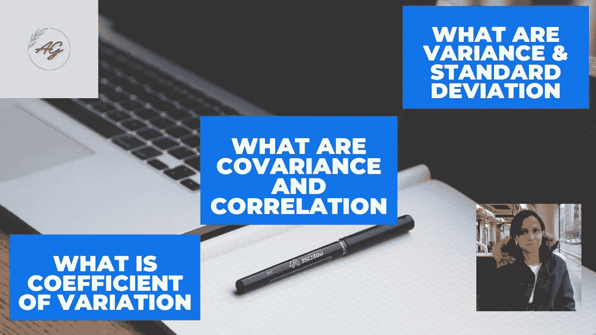

# 如何在统计学和 Python 中计算可变性测量(方差 SD 等)

> 原文：<https://medium.com/analytics-vidhya/how-to-calculate-variability-measures-variance-sd-etc-in-statistics-and-python-8cb10202f131?source=collection_archive---------15----------------------->

作者图片

在这篇博客中，我将亲自用 python 来讨论可变性测量。如果你错过了我之前关于 Python 的集中趋势和不对称度量的博客，请点击下面的链接。[https://medium . com/analytics-vid hya/how-to-calculation-central-trend-and-asymmetry-measures-in-statistics-and-python-28 b2bc 10407d](/analytics-vidhya/how-to-calculate-central-tendency-and-asymmetry-measures-in-statistics-and-python-28b2bc10407d)