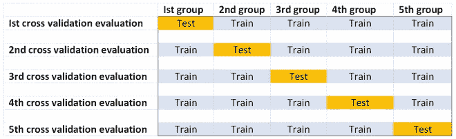
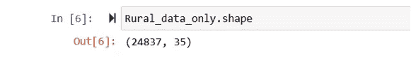
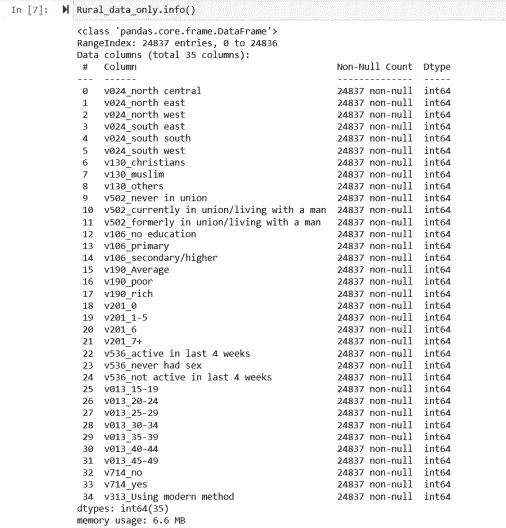
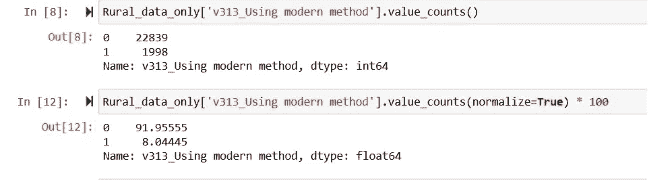
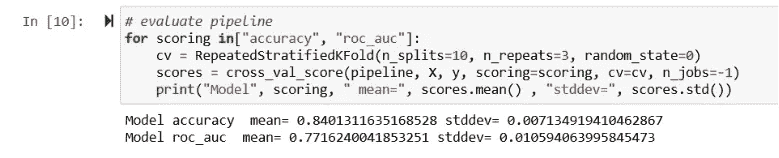

# 如何对不平衡分类问题进行 K 重交叉验证

> 原文：<https://medium.com/analytics-vidhya/how-to-carry-out-k-fold-cross-validation-on-an-imbalanced-classification-problem-6d3d942a8016?source=collection_archive---------2----------------------->


**来源:**【megapixl.com】T2

在本文中，我们将陈述在不平衡类分布问题上应用 k-fold 交叉验证的适当标准；并演示如何通过 Jupyter notebook 用 python 实现它。

本文将涵盖以下几个部分:

> **K 倍交叉验证的快速概述**
> 
> **数据源概述**
> 
> **在不平衡类别分布模型上正确应用 K-Fold 交叉验证的规则**
> 
> **如何在 Python 中对不平衡分类问题应用 K-Fold 交叉验证**

## **K 倍交叉验证的快速概述**

仅评估一次模型的性能在统计上是不可靠的。最好是多次重复性能评估，以创建性能评估值的分布，然后对该分布进行汇总统计(比如均值和标准差)。这确保了我们获得模型的真实性能值的真实的代表性估计，以及方差。这个概念叫做重复随机抽样。

**k-fold 交叉验证** (k-fold cv)利用重复随机抽样技术，通过将数据分成 5 个或 10 个等份，然后在每个等份上评估模型的性能，来评估模型的性能。具体来说，它通过执行以下有序步骤来评估模型的性能:

1.  打乱主要数据，
2.  将主数据分成 k 组而不替换，
3.  取第一组作为测试数据，剩下的 k-1 组作为训练数据集，然后进行模型性能评估，
4.  每隔一组(第二组，第三组…第 k 组)重复上述步骤 3，例如将第二组作为测试数据，剩余的 k-1 组作为训练数据集，然后执行模型性能评估。
5.  对每个 k 倍交叉验证评估的模型性能(准确性、roc_auc 等)进行评分，以及
6.  取分数分布的均值和方差来估计模型的整体性能。

下图突出显示了交叉验证评估的数量(进行了 5 次评估),这些评估是在 5 倍分割的基础上进行的，以评估模型性能:



一般来说，从上图可以看出，在模型性能交叉验证评估期间，k 组拆分的每个组都将是一个测试组**一次**，以及一个训练数据集 **k-1 次**的成员。

有四种类型的 k-fold 交叉验证，即:训练/测试分割、LOOCV、分层和重复。

## **数据源概述**

本文中使用的数据是尼日利亚人口与健康调查(DHS)的免费二手数据，名为 NDHS 2018。它是在 2018 年进行的，因此得名。DHS 是在发展中国家进行的一项具有全国代表性的调查。本文使用的数据是整个数据集中农村受访者的样本。这个子样本来源于我的文章中进行的预处理— [**机器学习预测的基本示例**](/analytics-vidhya/basic-example-of-a-machine-learning-model-prediction-predicting-modern-contraceptive-use-in-rural-c5e35e8aa877)

要从 DHS 项目中获取任何国家级的免费数据，请访问 [**DHS 项目**](https://dhsprogram.com/data/dataset_admin/login_main.cfm?CFID=6656492&CFTOKEN=ce6ca5b288d60002-2AFF6515-C723-702A-D46EDCBB32A8BDBD) ，注册并申请。

## **在不平衡类分布模型上正确应用 K-Fold 交叉验证的规则**

使用 k 倍交叉验证的经验法则是直接将数据分成 10 或 5 倍或组。一般来说，k-fold 交叉验证性能评估方法依赖于这样的假设——每个 fold 数据都是主数据的代表性样本，并反映主数据中目标特征的类别分布。最终，它假设主数据中目标特征的类别分布是 50:50。

然而，将此规则应用于不平衡分类问题会产生一个分布问题，可能会导致**有偏估计或**过度拟合而有利于多数类。在不平衡类别分布问题中正确使用 k-fold 交叉验证需要:

1.  每个 k 倍数据被分层以捕捉主数据中目标特征的不平衡类别分布。这可以通过使用**分层 k 倍交叉验证**来实现；
2.  在每次交叉验证评估时，只有训练集被过采样(使用合成少数过采样技术或其他类别平衡技术)。这可以通过使用**机器学习流水线**来实现。设置管道有助于防止数据泄漏；
3.  在每次交叉验证评估中，测试数据不会被过采样，即不受过采样的影响，尽管它保持了主数据中目标特征的不平衡类别分布；
4.  在每次 k 倍交叉验证评估期间，不会对主数据进行**过采样，而是对训练数据集进行过采样。**

> 作为一个例子，让我们假设我们正在处理一个避孕药具使用二元分类问题，样本大小为 5000 个观察值或指数。如果使用避孕药具的比例为 10%(样本值为 500)，不使用的比例为 90%(样本值为 4500)；那么我们就会有一个 1:9 比例不平衡的分类问题。

在这种情况下，我们将应用分层 k-fold 交叉验证，将 5000 分为 10 个折叠，每个折叠的样本量为 500。

分层 k-fold 交叉验证确保每个 fold 的样本是随机选择的，没有替换，以反映主要数据中目标特征的 1:9 比例不平衡分布。

在每个交叉验证评估(其中一组用作测试数据，其余 9 组用作训练数据，以评估模型的性能)期间，仅训练数据集被过采样。虽然测试数据没有被过采样，但是它保持了主数据中目标特征的继承的 1:9 不平衡比率分布。

此外，在每次交叉验证评估时，不会对主数据进行过采样，而是对训练数据集进行过采样。此外，部署流水线以确保仅在对训练数据的每次交叉验证评估期间进行过采样。使用管道有助于防止数据泄漏。

## **如何在 Python 中对不平衡分类问题应用 K-Fold 交叉验证**

在本节中，我们将对不平衡的二元分类数据进行 k 重交叉验证评估

首先，我们将通过 Jupyter notebook 将数据导入并加载到 python 中

```
path=r'B:\Rural_Nig_data_only.csv'Rural_data_only=pd.read_csv(path)
```

数据的样本大小为 24，837，总列数为 35。

```
Rural_data_only.shape
```



“v313 _ 使用现代方法”是该数据集的目标功能。这一特征表明了被调查者使用现代避孕药具的状况

```
Rural_data_only.info()
```



“v313 _ 使用现代方法”有 2 个响应类别，即—“目前使用现代避孕方法”，表示为 1；和“目前没有使用现代避孕药”，表示为 0。“使用现代方法”的 v313 有一个不平衡分类，如下所示:

```
Rural_data_only['v313_Using modern method'].value_counts()Rural_data_only['v313_Using modern method'].value_counts(normalize=True) * 100
```



让我们定义数据集并选择 X(预测要素)和 y(目标要素)

```
# define dataset
array=Rural_data_only.values#select the X, and y 
X=array[:,0:34]  
y=array[:,34]
```

接下来，我们将在每个交叉验证评估过程中定义一个管道来设置训练数据的过采样(使用 SMOTE)。

```
steps = [('over', SMOTE()), ('model', LogisticRegression())]
pipeline = Pipeline(steps=steps)
```

然后我们将使用分层的 k-fold 交叉验证将我们的主要数据分成具有代表性的 10 个折叠。分层 k-fold 交叉验证确保每一个 fold 中的训练和测试数据反映了目标特征在主数据中的不平衡分布。回想一下，在每次交叉验证评估中，将仅对训练数据组进行过采样，而不对测试数据进行过采样。

我们将使用管道和分层 k-fold 交叉验证在不平衡数据集上评估逻辑模型的性能，如下所示:

```
# evaluate pipeline
for scoring in["accuracy", "roc_auc"]:
    cv = RepeatedStratifiedKFold(n_splits=10, n_repeats=3, random_state=0)
    scores = cross_val_score(pipeline, X, y, scoring=scoring, cv=cv, n_jobs=-1)
    print("Model", scoring, " mean=", scores.mean() , "stddev=", scores.std())
```



根据以上所述，逻辑模型的估计平均准确度值为 84%±0.7，并且在控制分类的不平衡特征时，受试者操作特征曲线下的面积(ROC_AUC)具有 77±1.1 的估计平均值。

用于此分析的 Jupyter 笔记本可从 [**此处**](https://github.com/ayobamiakiode/My-projects/blob/master/k_fold_CV_imbalance_class.ipynb) 获得

**这就对了。**希望你觉得这有用？请放下您的评论，在 LinkedIn 上关注我，地址为 [Ayobami Akiode LinkedIn](https://www.linkedin.com/in/ayobami-akiode-38528839/)

**参考文献**

[](https://machinelearningmastery.com/smote-oversampling-for-imbalanced-classification/) [## 使用 Python 实现不平衡分类的 SMOTE 机器学习掌握

### 不平衡分类涉及在具有严重类别的分类数据集上开发预测模型…

machinelearningmastery.com](https://machinelearningmastery.com/smote-oversampling-for-imbalanced-classification/) 

[https://sci kit-learn . org/0.15/modules/cross _ validation . html # layered-k-fold](#stratified-k-fold)

[https://www.bmc.com/blogs/create-machine-learning-pipeline/](https://www.bmc.com/blogs/create-machine-learning-pipeline/)

[https://machine learning mastery . com/cross-validation-for-unbalanced-class ification/](https://machinelearningmastery.com/cross-validation-for-imbalanced-classification/)