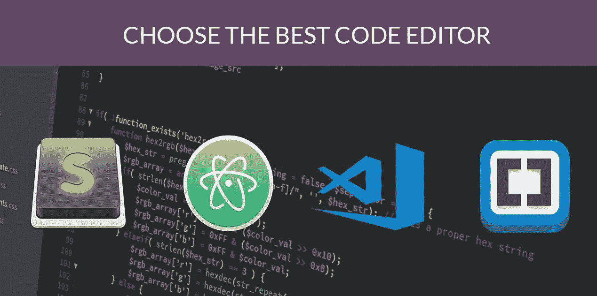
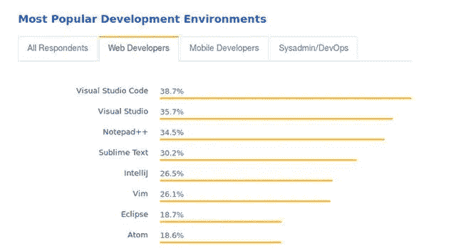

# 如何为 web development 2020 选择代码编辑器

> 原文：<https://medium.com/analytics-vidhya/how-to-choose-a-code-editor-for-web-development-2020-733865ce7ff0?source=collection_archive---------14----------------------->

程序员的基本工作就是编码，所以你的大部分工作时间都在和代码编辑器打交道。当你决定学习前端开发时，首先要做的是选择一个适合你感觉的代码编辑器。

本文分析了各种代码编辑器，允许您选择一个适合您的，一个适合前端开发的。

**文本编辑器**

文本编辑器最基本的功能就是让你写纯文本(不是自动添加陶冶)，最好的例子就是 windows 系统自带的记事本，word 或者 WPS 都达不到这个基本要求。

但基本上没有人选择用简单的文本编辑器编写代码，因为它不会简化或自动编辑格式化的代码。

**在线编辑**

有一些专门编写代码的文本编辑器。这些统称为代码编辑器。代码编辑器可以是独立的程序，也可以内置在集成开发环境(IDE)中。

有很多优秀的在线代码编辑器。例如，CodePen、Web Maker 和 Plunker 不仅仅是在线编辑器，还是可以浏览其他大人物编写的代码的开发社区。你可能习惯使用在线编辑器，因为很多在线学习编程平台，比如 freeCodeCamp，都自带在线编辑器。

然而，如果你想让你的编码更上一层楼，你需要熟悉一个桌面代码编辑器。

如果你问其他人他们使用的代码编辑器，问五个人你可能会有五个答案，因为编辑器太多了。

## 如果你刚刚开始学习编程，你需要选择一个容易使用的编辑器&给你信心。

# **Visual Studio 免费代码**

Visual Studio Code，简称 VS Code，是目前使用最多的编辑器。虽然它是由微软在 2015 年发布的，与其他流行的编辑器相比，它看起来很年轻，但在过去几年中，它一直在更新，在最新的 Stack Stack 调查中，它被选为最受 Web 开发者欢迎的文本编辑器。

VS 代码不仅仅是一个基本的代码编辑器。有人说它更像一个 IDE 而不是一个代码编辑器，因为它提供了许多通常只有在 IDE 中才有的功能。关键特性包括内置调试工具、智能代码提示、集成终端和简单的 Git 操作(微软刚刚收购了 GitHub)。作为初学者，您可以利用这些特性来大大提高编程效率。

定制是程序员喜欢的 VS 代码的另一个特性。它支持数以千计的插件和主题，您可以安装这些插件和主题来进一步增强它们的功能。

# **崇高正文 3**

Sublime Text 3 是我第一次学前端开发以来用的第一个编辑器，所以我很喜欢。由于其易用性，很受前端开发工程师的欢迎。

尽管与 VS 代码相比，它对 JavaScript 的支持并不是现成的，但您可以通过安装插件来扩展它。它运行速度非常快，不会占用很多内存，这就是为什么如果你的电脑内存小于 4GB，我推荐它。

尽管 Sublime 的单用户许可费用高达 80 美元，但它是免费下载和使用的。您只会收到一条弹出消息，提醒您购买许可证。

# 无原子的

2014 年 GitHub 推出的 Atom 是开源的，可以免费使用，所以最初受到前端工程师的追捧，但一直没有 Sublime 那么受欢迎，现在被 VS Code 赶超。

这并不是说 Atom 是一个糟糕的编辑器。也适合初学者，无需配置即可使用。与 VS 代码一样，它也可以通过安装插件来扩展，并支持许多类似 IDE 的功能。

# **网络风暴——每年 129 美元**

WebStorm 是很多前端开发工程师的另一个选择，虽然它是一个成熟的 IDE 而不仅仅是一个编辑器。

大多数用户喜欢它对 JavaScript 及其生态系统的深度支持。另一方面，它具有比上面提到的编辑器更陡峭的学习曲线，以及许多初学者不需要的功能。

我认为当你有很多开发经验时，WebStorm 可以成为提高你生产力的工具，所以你一开始就不应该用它来编程。

# **好的手感是最好的。**

学编程选择哪个编辑器？选择适合自己的，用起来舒服。所有这些都为前端开发创造了一个良好的编程环境，都是为了提高你的开发效率

不建议花太多时间学习 Vim 或者 WebStorm 这样的复杂工具。作为初学者，你更应该关注编程本身，这也是我在这里介绍 Visual Studio 代码、Sublime Text、Atom 的原因，因为它们都是欢迎新手使用的。建议你试试这三个，挑一个手感最好的。

让我知道你现在用的是哪个代码编辑器