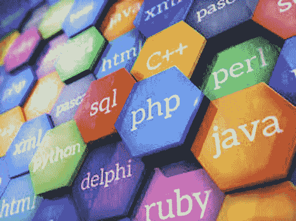
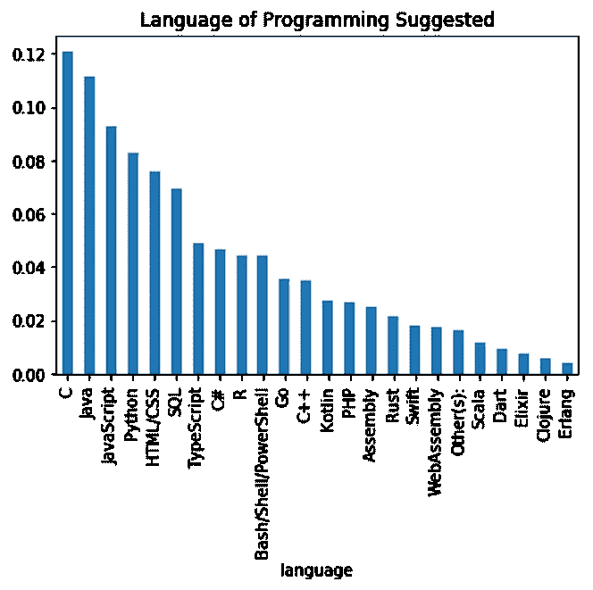
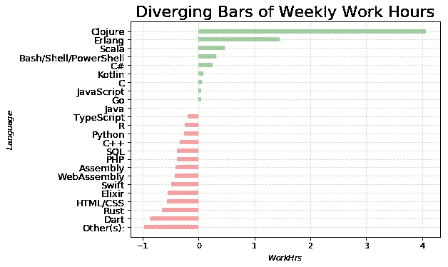
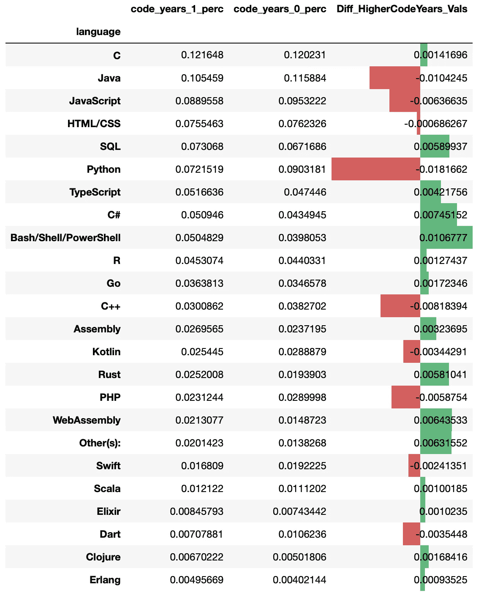

# 如何选择下一年的编程语言

> 原文：<https://medium.com/analytics-vidhya/how-to-choose-a-programming-language-for-the-next-year-b893238d2aa5?source=collection_archive---------13----------------------->

## 一种基于数据的方法，使用 Stack Overflow 2019 年的开发者调查数据

# 介绍

当我们讨论哪种语言是未来的理想语言时，肯定有很多选择，特别是当新的编程语言启动时。

我们可能听过类似“PHP 是世界上最好的语言”、“Java 永远不会过时”、“我们正在进入 Python 时代”等说法。

现在，我们对这些陈述都有自己的观点，尽管它们可能不尽相同。但是数据说明了什么呢？未来的 desire 程序语言是基于已经在该领域表现良好的程序员。也就是说，当前的程序员将决定这些陈述在未来的真实性。

因此，我使用了 stack overflow 2019 年度开发者调查的数据，来仔细研究这个问题。

调查数据涵盖了来自 200 多个国家和地区的 88，883 篇评论。该调查旨在了解与软件开发和数据分析相关的工作的多个方面。作为调查的一部分，共有 80 多个问题，包括:

> "你觉得开源软件的质量如何？"
> 
> "你主要或最重要的研究领域是什么？"
> 
> "你工作的公司或组织大约雇用了多少人？"

# 第一部分:未来一年最渴望的语言是哪一种？

但我最感兴趣的问题是:

> 在过去的一年中，您使用了以下哪种编程、脚本和标记语言进行了大量的开发工作？在接下来的一年中，您希望使用哪种语言？(如果你们都使用过该语言，并且希望继续使用，请勾选该行中的两个框。)'

在这里，您可以看到选择特定编程语言的人的比例在下一年按降序排列。明显的领导者是 C 语言、Java 语言和 T2 语言。

略多于 8%的受访者建议使用 **Python** ，约 7%的人建议使用 **HTML/CSS** 和 **SQL** 。在上面提到的第一节课中，有许多语言被推荐。得到 4%以上建议的分别是 **TypeScript、C#、R、Bash/Shell/PowerShell** 。

这里的数据是对调查中所有开发人员的汇总，但更有趣的是了解每周的工作时间，或者开发人员如何适应开发领域的编程语言。

# 第二部分:不同的编程语言与每周工作时间有什么关系？

在下面的图表中，我感兴趣的是选择用某些语言编程会导致更长的工作时间还是更短的工作时间。蓝色条表示工作时间高于所有人的平均值(以 0.00 表示)，而红色条表示工作时间低于平均值。

在讨论这个可视化的结果之前，值得注意的是 x 轴上的*原始*值意义很小。缩放是为了能够容易地将一个组与下一个组进行比较，这种方式保持了视觉与类别相互比较的数学真理的一致性。

也就是说，我从这张照片中得到了一个很大的收获:

**工时最高**的人的建议是选择 **Clojure** 或者**二郎**。工作时间**最低的**建议选择**镖**或**锈、**或图表中未列出的一些**其他**。

这一发现很有趣，像 Clojure 或 Erlang 这样的冷门语言可能会导致更多的工作时间，而另一方面，其他一些冷门语言如 Rust 或 Dart 可能会导致更少的工作时间。因此，像 C 语言、Java 语言或 Python 语言等流行语言只是导致平均工作时间。

# 第三部分:回答者在建议不同的编程语言时有什么偏见？

最后，我想知道对于那些代码年数较高的人来说，是否会有偏见，认为作为一种语言来选择用于将来的工作。

为了更深入地了解这一点，我将数据分为两组。其中一组是标注自己代码年数超过 10 年的一组。编码年数少于 10 年的人属于第二组。

在这里，我们可以看到那些代码年数少于 10 年的人比那些代码年数超过 10 年的人多提议 Python 作为语言几乎 2%。

由于 **Python** 是越来越受欢迎的语言之一(感谢机器学习和数据科学)，最近进入该领域的编码人员更喜欢建议它。这说明了个人倾向于建议他人选择他们熟悉的语言。

# 结论

在这篇文章中，我们根据 Stack Overflow 2019 调查数据，了解了如何选择明年要使用的编程语言 desire。

1.  我们收集了大众关于如何选择下一年语言的建议，这表明像 C、Java 或 Python 这样的常见语言(被大量编码人员使用)可能是下一年的理想语言。
2.  然后我们看了不同的语言是如何与 T2 的工作时间联系起来的。这表明**不受欢迎的语言可能导致更多或更少(而不是平均)的工作时间。**
3.  最后，我们研究了与这个建议相关的偏见。我们发现最近进入这个领域的人更有可能提出新的语言。

这里的发现是观察性的，不是正式研究的结果。所以真正的问题仍然是:

> *你将如何选择下一年的编程语言？*