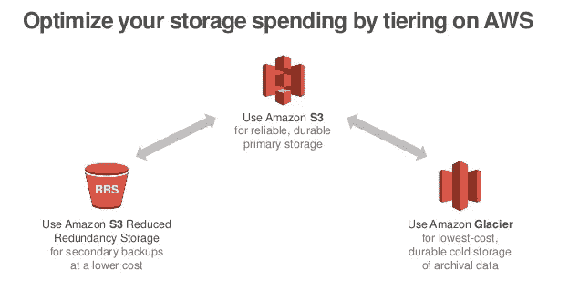
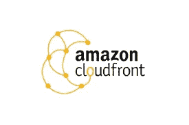
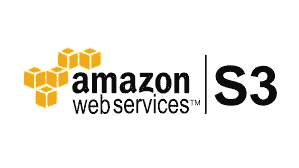
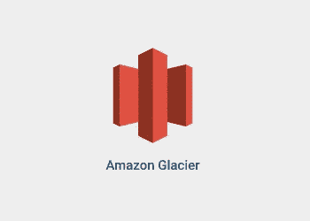
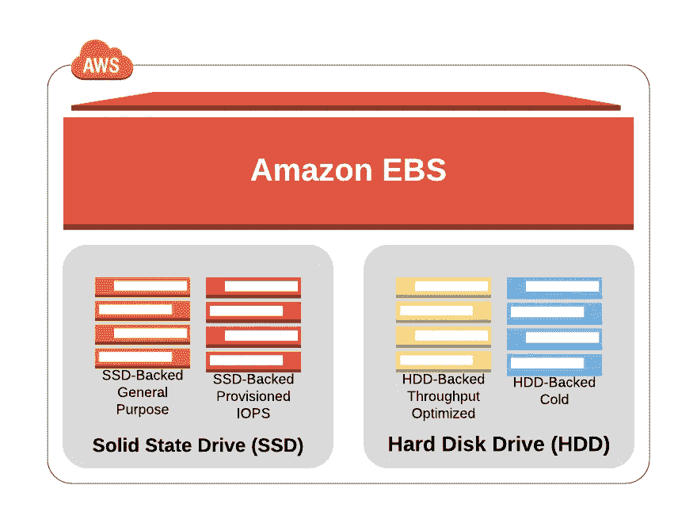

# 如何选择合适的 AWS 存储解决方案？

> 原文：<https://medium.com/analytics-vidhya/how-to-choose-appropriate-aws-storage-solutions-dfb6f46e3d9d?source=collection_archive---------15----------------------->

# **AWS:存储设计**

在 AWS 中，存储有多种选择，因此了解各种可用的存储服务非常重要，这样您就可以根据自己的需求选择合适的存储服务。有简单存储服务(S3)，冰川，CloudFront，弹性块存储(EBS)，存储网关和雪族。

如果你见过 S3，想知道它意味着什么？只有三个 S，简单的存储服务。这是亚马逊有史以来通过 AWS 提供的首批存储服务之一。我们还有冰川。Glacier 是用于存档数据。一个存放大量数据的地方，您希望长期保存这些数据，但您不必担心频繁或立即访问这些数据。

然后我们还有 CloudFront。现在，CloudFront 就是要得到这些东西

接近你的用户。因此，使用 CloudFront，通常您所做的只是确保 web 信息，这种由网站访问者频繁访问的数据，被缓存在靠近客户的边缘位置。

然后我们也有弹性块存储，或 EBS。当您希望实例具有非常快的访问速度时，弹性块存储是用于实例的最佳存储解决方案，因为我们讨论的是块级访问，而不是对象级访问。S3 是对象级的，而 EBS 是块级的。

存储网关基本上是您放在本地网络上的一个设备，可以是软件设备，也可以是硬件设备，充当连接到 Amazon 云的 VPN。以便您可以像访问本地存储一样访问您的存储。现在，Snow 系列实际上是三个主要产品的集合，当您需要移动大量数据时，可以使用这些产品将数据从本地数据存储迁移到云中。我们稍后还会更详细地讨论这些问题。您真正拥有的最终存储服务是您的数据库。

让我们来看看每一个细节:

***亚马逊简单存储服务(S3):*** 这是亚马逊有史以来通过 AWS 提供的首批存储服务之一。

亚马逊 S3

*   S3 是关于对象存储的。
*   S3 的数据分布在除 1A 以外的至少 3 个可用性区域(1 个区域最便宜)
*   S3 支持加密和自动数据分类。
*   大数据分析可以直接针对存储的数据运行。

**将数据输入 S3:**

1.  应用程序接口
2.  Amazon Direct Connect:创建一个从我们的网络到 AWS 的 VPN 连接，然后数据可以通过该 VPN 连接。
3.  存储网关:数据可以存储在本地，然后复制到 S3 存储桶中。
4.  Kinesis Firehose:这是将大量分析数据放入 S3 水桶的一种方式。
5.  传输加速:它基于 CloudFront 技术工作。
6.  Snow Family:雪球(petabyte)或雪球边缘(100TB)

**普通 S3 操作**

*   创建和删除存储桶
*   书写对象
*   阅读对象
*   删除对象
*   管理对象属性

**S3 进阶功能:**

*   前缀和分隔符:用于层次
*   存储类别:S3 标准、S3 非频繁存取(IA)、S3 减少冗余存储(RRS)和冰川。
*   对象生命周期管理:如果长期不使用，数据会自动从标准迁移到 IA，再迁移到 Glacier，但仍在我们的存储桶中。
*   加密:服务器端的 256 AES 加密。
*   多因素认证

**Glacier:** 不经常访问的数据存储在 Glacier 中，这是最便宜的存储服务。

亚马逊冰川

*   在 S3 我们有桶，在这里我们有拱顶。
*   也称为档案数据存储
*   有三种访问方法

o 加急:可在 3-5 分钟内访问，并且最贵。

o 标准:可在 3-5 小时内访问

o 批量:可在 5-12 小时内访问

*   这里我们可以定义数据存储的区域。
*   使用 AES-256 位加密存储的数据。

**冰川整合:**

1.S3 冷数据可以自动移入冰川。

2.Snow 设备可用于导入数据。

3.存储网关可以连接到 glacier。

**冰川特征:**

*   数据检索:每月有高达 5%的数据被免费检索。
*   可以配置保险库以限制成本。
*   单个 AWS 帐户可以在每个区域创建多达 1000 个保管库。
*   只能删除空的保管库。
*   Glacier 支持归档文件的多部分上传，因此不需要一次性上传大型归档文件。

**弹性块存储(EBS):** 当您希望实例具有非常快的访问速度时，弹性块存储是用于这些实例的最佳存储解决方案，因为我们讨论的是块级访问，而不是对象级访问。S3 是对象级的，EBS 是块级的**。**

**EBS 概述:**

*   它必须只附加一个实例。
*   它用于 EC2 实例中的持久存储。
*   从一个 AWS 服务到另一个 AWS 服务的块级存储。

**EBS 卷类型:**

1.磁性:成本最低，速度最慢。

2.SSD(固态硬盘):它具有快速的性能和非常快速的基于芯片的数据存储。

a.通用固态硬盘

b.供应 IOPS

**保护 EBS 数据:**

快照:在另一个实例中创建实例的精确副本，以便在以后的某个时间将 EBS 恢复到那个状态，以便进行恢复。

卷恢复:将卷从一个实例附加到另一个实例。

加密方法

**弹性文件系统(EFS):** EFS 对于云来说就像是云内的 NAS(网络附加存储)存储。

EFS 是可共享的:多个实例可以访问它。

可以通过 NFSv4(网络文件系统)访问 EFS。

EC2 实例可以使用 EFS 共享。

在 EFS 配置过程中，我们需要 VPC(虚拟私有云)，VPC 是这些云中的资源集合，您可以在自己的空间(即您自己的私有空间)中管理这些资源。

***存储网关:*** 存储网关基本上是一个放在本地网络上的设备，可以是软件设备，也可以是硬件设备，充当连接到亚马逊云的 VPN。以便您可以像访问本地存储一样访问您的存储。它属于在 AWS 中集成内部存储。

**存储解决方案类型:**

1.基于文件(NFS)

2.基于体积

3.基于磁带

**结论**:云存储是云计算的重要组成部分，因为它保存了应用程序使用的信息。大数据分析、数据仓库、物联网(IoT)、数据库以及备份和归档应用程序都依赖于某种形式的数据存储架构。

云存储通常比传统的内部存储系统更加可靠、可扩展和安全。AWS 提供完整的云存储服务，以支持应用程序和归档合规性要求。概述并描述了这些云存储服务的使用模式、性能、耐用性和可用性、可扩展性和弹性、安全性、接口和成本模型。虽然这有助于您更好地了解这些云服务的特性和特征，但了解您的工作负载和要求，然后决定哪种存储服务最适合您的需求，这一点至关重要。