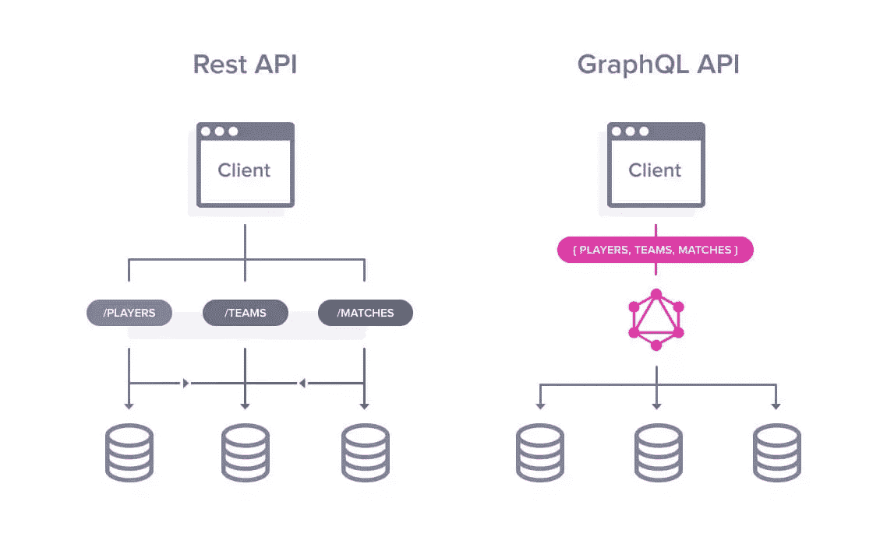
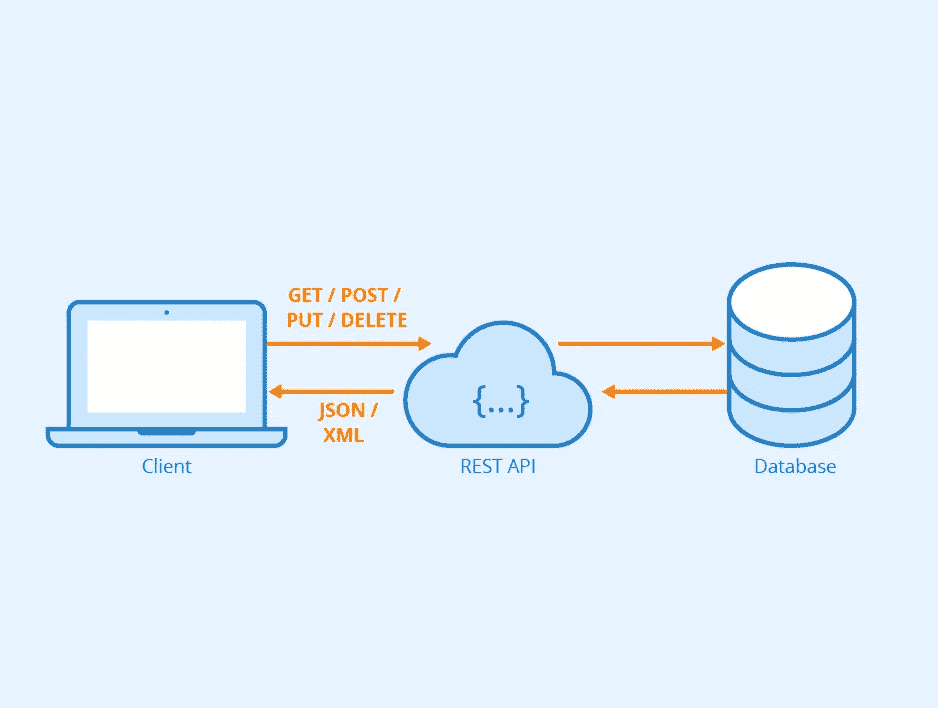
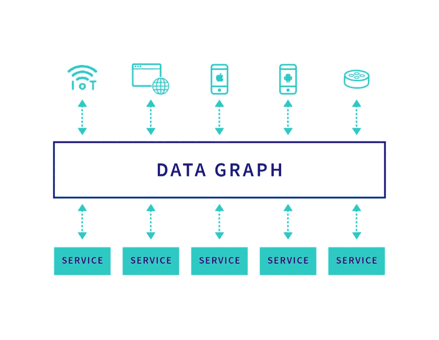

# REST & GraphQL 如何选择？

> 原文：<https://medium.com/analytics-vidhya/how-to-choose-between-rest-graphql-f09edbf3a69c?source=collection_archive---------13----------------------->

## 什么是 REST 和 GraphQL？

你已经读过， **GraphQL** 替换 **REST** ，但我认为这不是真的。在这篇文章中，我们将看到为什么使用一个和另一个。

# **休息**

REST(表述性状态转移)是一个软件架构，它定义了一组用于创建 Web 服务的约束。REST 允许访问所有资源来调用您的 API。 **RESTful** 是一个带有 **REST** 架构约束的 Web 服务 API。允许定义设计，你必须如何使用你的 API 资源。

当你使用 RESTful 时，你使用 HTTP 方法:

*   **GET** :方法请求指定资源的表示。使用 GET 的请求应该只检索数据。
*   **POST** :方法用于将实体提交给指定的资源，经常会引起状态的改变或者对服务器产生副作用。
*   **PUT** :方法用请求负载替换目标资源的所有当前表示。
*   **补丁**:方法用于对资源进行部分修改。
*   **删除**:方法删除指定的资源。
*   …

> Restful 是无状态的，如果出现故障，无状态组件可以自由地重新部署。

# **图表 QL**

**GraphQL** 是一种**数据查询语言**，它允许操纵你的 API。它提供了一种开发 web API 的方法，并与 **REST** 和其他 web 服务架构进行了比较和对比。

和 REST 一样，你必须调用你的 API，使用你的 API 的所有资源。GraphQl 有一种不同的方法，它是你的客户决定使用的资源和你需要的字段。例如，如果您需要像' id '，' lastName '，' firstName' …这样的字段，您可以将它添加到您的请求中，并将其发送到您的 API。API 返回所有被询问信息。

GraphQl 的强大之处在于你可以通过一个请求获得很多资源。

> 重要信息， **GraphQl** 使用 POST 方法 HTTP，之后你就会明白为什么它很重要:D！

# REST vs GrphQL

## 为什么要用 REST？

*   当你使用 **REST** API 时，你使用的资源具有一致性和透明性。每个客户端都有相同的结果，很容易在缓存中为其他客户端添加一个结果。**您的缓存策略更加简单！**对于 GraphQL，这可能会变得复杂，因为每个查询都可能不同。
*   你使用 GET 方法，你的后端或前端有一个简单的缓存特性。现在每个浏览器都缓存 HTTP 方法 GET。
*   当您开发 API 时，您只需在后端开发控制器，并使用一个简单的请求从前端获取数据。**如果你使用 GraphQL，你必须开发两次:**在你的后端 API 像**休息**，但也在你的前端有你需要的请求字段。**所以如果不是你的需求，你会损失很多时间。**

> 如果你有一个前端使用你的 API，你的数据是简单的。宁静是给你的。它快速、简单，并且在许多框架中有更多的工具可以使用它。

## 为什么要使用 GraphQL？

*   您只能使用您需要的字段。如果你公开你的 API，你的客户就可以选择数据，并且很容易就有一个模式来使用它。如果使用 RESTful**RESTful**，就会得到每个被调用的资源域。这将是最简单快捷的。
*   您可以**监控所有字段以升级或创建新版本**。允许就仍在使用的领域进行交流，并允许您进行更改。如果您的 API 被所有不同的客户端使用，那么如果您使用 GraphQL，您可以赢得许多时间和生产力。
*   **GraphQL 使用强类型系统来定义 API 的功能**。您公开的所有类型都是您的 API 的一个 schema。这个模式可以作为客户端和服务器之间的契约，定义如何访问数据。

> 如果您有更多的前端或客户端可以使用您的 API，您的数据模式是复杂的，并且您需要监控 API， **GraphQl** 适合您。您可以公开模式，并用简单的版本管理封装您的 API。

# 结论

当您决定您的架构时，您必须问自己一个好问题。 **GraphQL** 不要代替 **REST** ，这是另一种哲学，有其他约束。

> 永远不要忘记，是你的需求定义了你的架构，而不是相反！

谢谢你的时间，:D