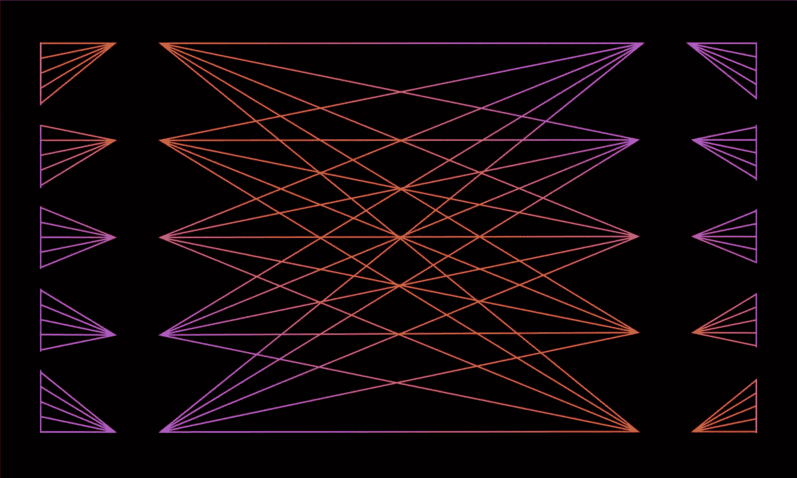

# CNN 如何选择卷积滤波器的大小或核的大小？

> 原文：<https://medium.com/analytics-vidhya/how-to-choose-the-size-of-the-convolution-filter-or-kernel-size-for-cnn-86a55a1e2d15?source=collection_archive---------0----------------------->

深度学习的基础设施

卷积基本上是相同大小的图像(局部感受野)的核(或滤波器)和补丁的点积。卷积非常类似于相关性，并表现出平移等变的特性，这意味着如果我们移动或平移输入并对其应用卷积，它将与我们首先应用卷积然后平移图像的方式相同。

在 CNN 的学习过程中，你会在代码的不同位置发现不同的核大小，那么这个问题就会出现在你的脑海中*是否有一个特定的方法来选择这样的维度或大小*。所以，答案是否定的。在当前的深度学习世界中，我们正在使用每个深度学习实践者都在使用的最受欢迎的选择，那就是 3x3 内核大小。现在，另一个问题出现在你的脑海中，为什么只有 3x3，而不是 1x1，2x2，4x4 等等。继续读下去，你会在接下来的几分钟内找到这背后最清晰的原因！！

基本上，我们将内核大小分为较小的和较大的。较小的内核大小由 1x1、2x2、3x3 和 4x4 组成，而较大的内核大小由 5x5 组成，以此类推，但是我们使用直到 5x5 来进行 2D 卷积。2012 年，当 **AlexNet** CNN 架构推出时，它使用了 11x11，5x5 这样更大的内核大小，花费了两到三周的训练时间。因此，由于训练时间过长和昂贵，我们不再使用如此大的内核。

与全连接网络相比，更喜欢小内核大小的原因之一是，它降低了计算成本和权重共享，最终导致反向传播的权重更小。因此，2015 年出现了 **VGG** 卷积神经网络，它用 **3x3** 卷积层取代了如此大的卷积层，但使用了许多滤波器。从那以后，3x3 大小的内核成为一种流行的选择。但是， ***为什么不把 1x1，2x2 或者 4x4 作为更小的内核呢？***

1.  **1x1** 核大小仅用于旨在减少通道数量的降维。它仅在特征图的一个像素中捕获输入通道的交互。因此，消除了 1x1，因为提取的特征将是细粒度的和局部的，也没有来自相邻像素的信息。
2.  **2x2** 和 **4x4** 通常**不是优选的**，因为奇数大小的过滤器对称地划分输出像素周围的前一层像素。如果这种对称性不存在，那么在使用偶数大小的内核(即 2x2 和 4x4)时，各层之间会发生失真。所以，这就是我们不使用 2x2 和 4x4 内核大小的原因。

因此， ***3x3 是迄今为止修行者遵循的最优选择*** 。但它仍然是最昂贵的部分！

**奖励:**进一步挖掘，我发现了另一种**有趣的方法**，这种方法在 *Google* 在 *ImageNet 识别挑战*期间推出的 **Inception V3 CNN 架构**中使用，即**用 1x3 层替换 3x3 卷积层，然后是 3x1 卷积层**，这实际上是将 3x3 卷积分解成一系列一维卷积层。而且出来还挺划算的！！

谢谢你阅读它。我发现这是深度学习新手(包括我在内)最常提出的问题。；)，因为使用特定内核大小背后的清晰明了的原因在大多数学习课程中都没有涉及。这是我第一篇关于媒体的文章，所以如果你喜欢，别忘了鼓掌！！祝您愉快！！