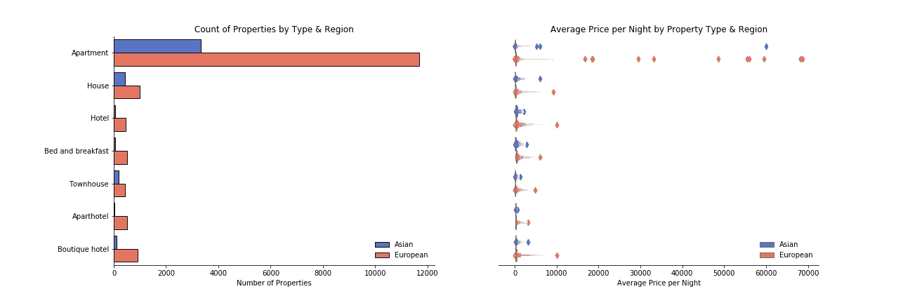
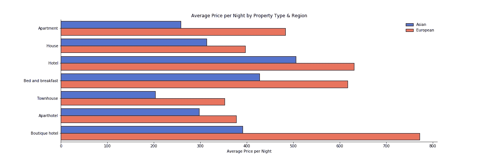
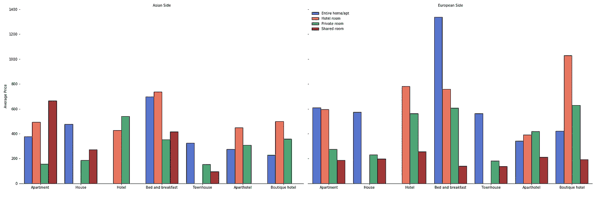
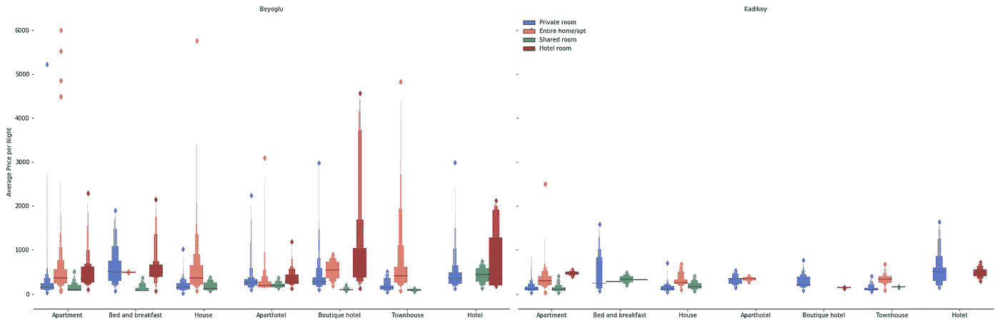
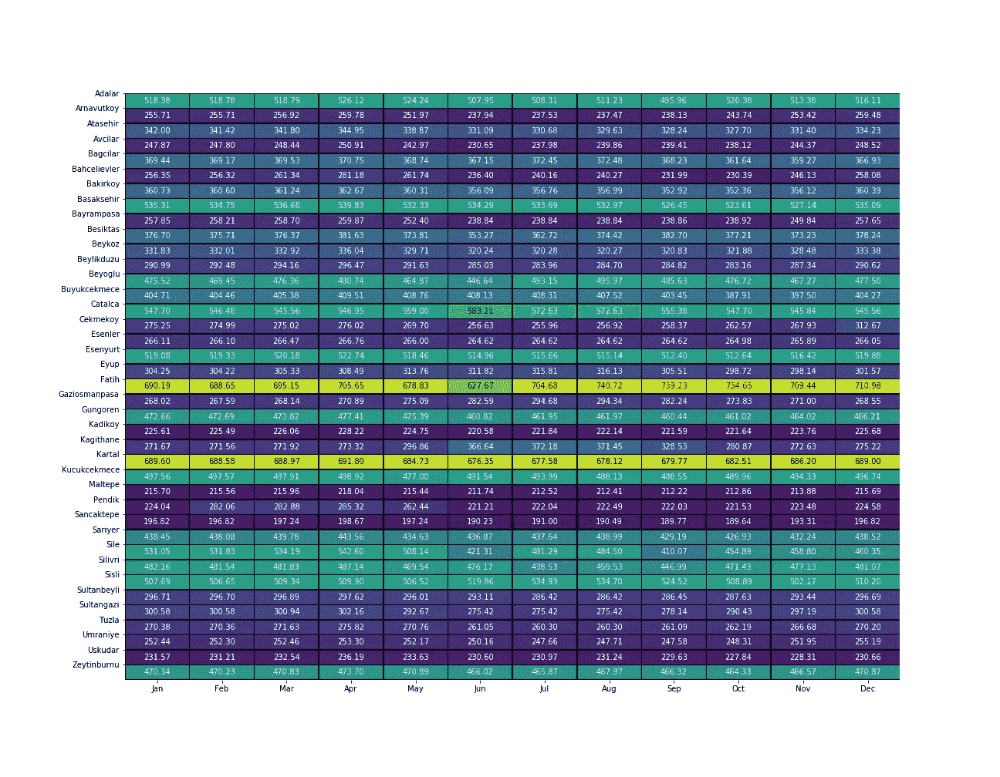
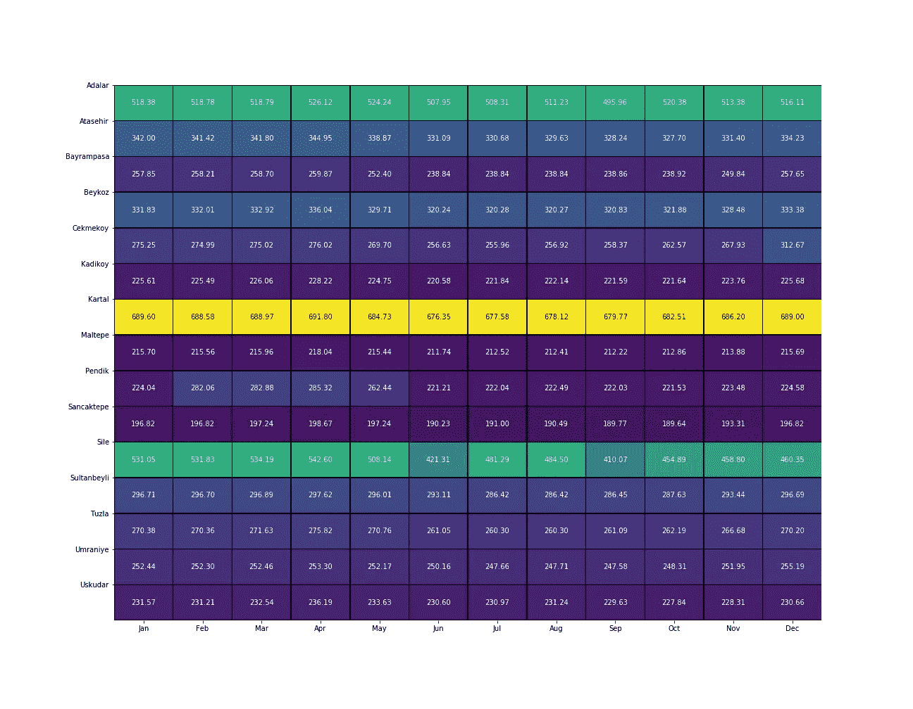
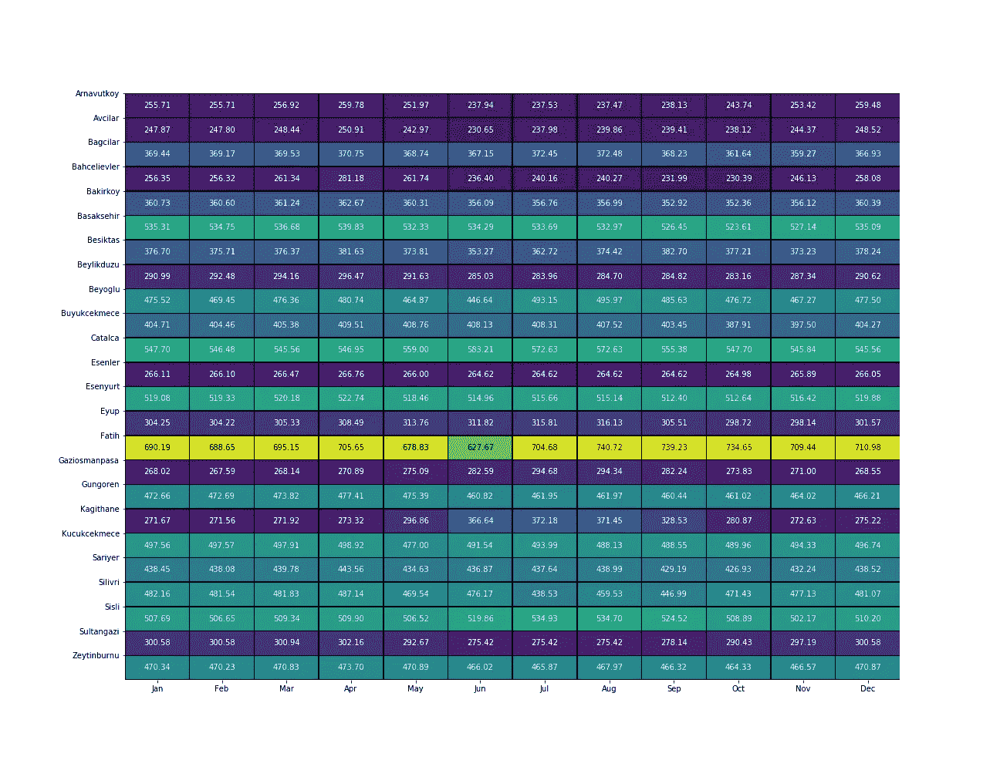
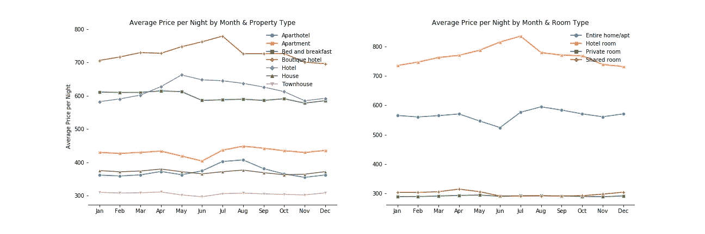
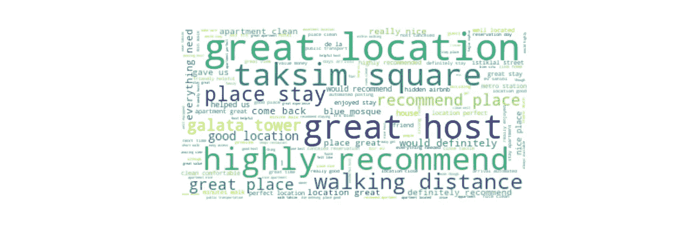

# 如何选择下次 Airbnb 度假的住宿

> 原文：<https://medium.com/analytics-vidhya/how-to-choose-your-accommodation-on-your-next-airbnb-getaway-7e0711eae51b?source=collection_archive---------12----------------------->

## 利用 Airbnb 数据分析伊斯坦布尔


伊斯坦布尔卡迪科伊

# 介绍

几千年来，伊斯坦布尔一直被认为是世界的中心。在这里，东方与西方相遇。希腊、拜占庭、罗马和奥斯曼的影响融合在一起，创造了这个星球上最具文化多样性的人口之一。因此，不难理解为什么这座城市是地球上游客最多的地方之一。因此，这篇文章揭示了一些见解，帮助你选择理想的住宿，在这个多元化和永恒的城市。在本帖中，我们将关注以下内容:

*   城市的哪边有更便宜的住宿？
*   一年中哪个月的住宿最便宜？
*   顾客在住宿评论中说了些什么？

为了帮助回答这些问题，我们根据以下条件对数据进行了筛选:

*   仅考虑最短住宿时间少于五天的列表。这是为了将更多的注意力放在游客身上，而不是长期出租。

仅考虑以下财产类型:

*   公寓(包括酒店式公寓)
*   住宅
*   酒店(包括公寓式酒店和精品酒店)
*   联排别墅
*   住宿和早餐

这些房产类型占所有房源的 92%以上，公寓占 70%以上。

用于分析的 airbnb 数据将伊斯坦布尔分为 39 个街区。数据来源于 http://insideairbnb.com/，这是一个维护良好的 airbnb 全球城市数据网站。应该指出的是，该网站不以任何方式隶属于 airbnb，而是由一个开源社区维护。

在进入分析之前，值得指出的是，帖子中显示的所有价格都是以土耳其里拉计算的，截至 2020 年 6 月 13 日，1 里拉= 0.12 GBP = 0.15 美元。我还在本文底部提供了我在完成分析时发现有用的资源的链接，以及我的 GitHub 存储库的链接，所有与分析相关的代码都存储在那里。

# 城市的哪边有更便宜的住宿？

数据集中的清单分布在 39 个不同的街区，其中大多数位于博斯普鲁斯海峡的欧洲一侧。博斯普鲁斯海峡的对面，也就是东面，通常被称为城市的亚洲区。一些居民区也位于博斯普鲁斯海峡以北，向外延伸至黑海。

*   欧洲的上市数量是亚洲的近四倍。
*   该市最受 airbnb 房源欢迎的地区是 Beyoglu 街区。这个街区位于欧洲一侧，从伊斯坦布尔的主要中心穿过金角湾，在这里可以找到著名的地标，如塔克西姆广场和加拉塔。
*   下图左侧的图像显示了不同类型 airbnb 房源的数量，这些房源根据所在城市的位置进行了颜色编码。
*   右手边的可视化用于识别是否有任何列表可以被认为是基于每晚平均价格的异常值。



*   公寓是城市两边最常见的上市房源。
*   菱形点被视为异常值，因为与这些房源相关的每晚平均价格相对高于其他类似的物业类型，这取决于它们位于城市的哪一侧。
*   有一些公寓被认为是离群值，其每晚的平均价格高达数万里拉。

当调查在上面显示的视觉分析期间识别的“异常值”属性时，发现这些列表的每晚价格( *ppn* )在 12 个月的数据中变化很大。

*   标准偏差用于衡量一个列表的 ppn 与该列表的平均 ppn 之间的差异。
*   在所有房产列表中，十二个月数据中 ppn 的平均标准偏差为 43TL(在本次分析时约为 5.16)。这意味着，平均而言，一个物业的 ppn 将在该物业的 12 个月平均 ppn 的 43 倍之内。
*   在 12 个月的数据中，一些房源的每晚价格平均偏离超过 1000 英镑(120 英镑)。
*   有两个列表的 ppn 标准偏差远远超过 10，000TL。进一步检查怀疑被列了不准确的价格。这可能是该属性的宿主的数据输入错误，也可能是数据收集中的错误。



上图显示了不同酒店类型的平均 ppn。除了房子之外，城市欧洲一侧的房产平均比亚洲一侧的至少贵 100 吨。研究发现，位于城市亚洲一侧的精品酒店的平均价格比位于欧洲一侧的酒店低近一半。

下图显示了酒店的平均 ppn，包括酒店类型、区域和广告中的房间类型。这里最明显的细节是，城市欧洲一侧的住宿和早餐(以整间房/公寓为房型)房源的平均价格远远超过该地块的其他可比价格。这可能是因为只有五个列表符合列表描述，并且其中一个列表的 ppn 相对较高。



从视觉上看，纽约亚洲一侧的房产价格似乎比欧洲一侧的要低。对平均 ppn 和区域之间相关性的统计分析发现，数据中的这些变量之间几乎没有相关性。

*   点双列统计被用作相关措施。这是一个合适的统计量来衡量一个连续变量和一个离散二分变量之间的相关性。该统计将返回两个值；一个是 *r* 系数，它衡量一个变量可以用另一个变量解释多少方差；第二个是报告检验统计的显著性的 p 值(在这种情况下，是 *r* 系数)。如果 p 值小于 0.05，这表明测试统计结果是随机的可能性小于 5%，这意味着我们可以对报告的结果有很高的把握。较大的 p 值意味着我们对检验统计不是随机的不太有信心，因此不是具有统计学意义的结果。
*   平均 ppn 和上市公司所在城市的相关度为 0.06(p 值小于 0.05)。
*   这意味着平均 ppn 中只有 6%的可变性可以用一个上市公司是在城市的欧洲一侧还是亚洲一侧来解释。

然而，当比较 Beyoglu(欧洲人)和 Kadikoy(亚洲人)社区的平均 ppn 之间的关系时，相关性为-0.15(p 值小于 0.05)。Beyoglu 和 Kadikoy 被选中进行比较，因为它们包含了他们所在城市的大部分房产列表。

*   这意味着平均 ppn 的 15%的变化可以用一个列表是否位于 Beyoglu 或 Kadikoy 来解释。
*   负值表示具有高平均 ppn 的列表与 Beyoglu 街区更相关。对于相关性分析，Beyoglu 编码为 0，Kadikoy 编码为 1。
*   这意味着每晚平均价格的 85%的变化可以由数据中的其他变量来解释，如房间数量/房间类型/评论分数等。
*   相比之下，平均 ppn 的变化率为 6%，这可以用一个上市公司是在亚洲还是在欧洲来解释。
*   后一点可以用这样一个事实来解释，即城市的欧洲一侧比亚洲一侧有更多的居民区。许多欧洲居民区离市中心更远，在那里挂牌的平均价格比亚洲的更有可比性。

当考虑到不同的物业类型和房间类型时，城市亚洲一侧的住宿价格比欧洲一侧的价格相对更低。当然，许多旅游景点位于城市的欧洲一侧，这意味着相对靠近这些景点的街区所包含的列表的 ppn 比伊斯坦布尔几乎任何其他街区都要高。因此，许多游客可能更愿意支付更高的价格来获得更接近这些景点的位置。

然而，伊斯坦布尔的公共交通如此便宜，博斯普鲁斯海峡的渡口频繁地运送乘客往返于两岸之间，可以说，城市的亚洲一侧是游客在住宿方面找到更好交易的地方。在这里，他们还可能会体验到伊斯坦布尔提供的更多文化，更不用说有机会体验穿越博斯普鲁斯海峡的旅行，这是这座坐落在七座小山上的古城的最佳景观。

下图显示了博斯普鲁斯海峡两岸两个热门街区的平均 ppn。



*   这里要做的最大比较是精品酒店的价格差异。Beyoglu 中列出了更多的这些属性类型，因此平均 ppn 的分布范围更大。
*   这两个社区的许多物业和房间类型的平均 ppn 具有可比性。
*   然而，Beyoglu 的房产和房型比 Kadikoy 的贵得多，但其中一些被视为异常值，因此数量相对较少。

# 一年中哪个月的住宿最便宜？

因此，我们发现伊斯坦布尔的亚洲区有更好的价格(当对远离市中心的欧洲社区打折时)，但是**什么时候**是整个城市最好的交易？

下面的热图显示了每个街区全年的平均房源 ppn。颜色越浅，平均价格越高。乍看之下，法提赫和卡尔塔尔的房源似乎平均比其他街区更贵。这并不奇怪，因为 Fatih 是伊斯坦布尔许多最著名地标的所在地，而 Kartal 是一个沿海(亚洲一侧)街区，近年来经过了大规模的重新开发，通往市中心的交通便利。



上面的热图被分解成两个独立的图像，一个是欧洲居民区，一个是亚洲居民区。

下面的热图显示了亚洲地区各社区的平均 ppn。



*   Kartal 似乎有最高的平均 ppn。
*   乐思是一个沿海地区，位于伊斯坦堡北部的黑海上。这个街区是伊斯坦布尔居民夏季度假的热门去处。令人惊讶的是，在旅游旺季的夏季，这个街区的 ppn 值较低。
*   总的来说，在夏季的几个月里，似乎许多社区都有 ppn 较低的房源。

下面的热图显示了欧洲地区的邻近地区。

*   在博斯普鲁斯海峡的这一边，有更多的社区平均 ppn 比亚洲这边高。
*   与亚洲居民区类似，夏季的几个月里，房价似乎有所下降。

这些想象可能表明，如果寻找最好的住宿条件，夏季可能是最好的选择。然而，也应该注意到，伊斯坦布尔这几个月的温度会让探索这座城市变得非常不舒服。这可能是这几个月价格趋于下降的原因吗？可以通过分析一年中不同时间的预订数量来做进一步的分析，以了解游客数量在夏季是否会下降。



我们进行了分析，以深入了解在过去 12 个月的数据中，是否可以通过物业和房间类型观察到季节性趋势。

*   下面右侧的可视化显示，酒店房型价格在 1 月至 7 月期间逐月上涨，然后在秋季下降。
*   然而，根据左边的形象化显示，从 5 月份开始，酒店类价格有所下降。
*   这是因为，正如我们在上一节的可视化中所看到的，一些主人将酒店的房间列为私人房间或共享房间，甚至整个家庭。这些其他类型的房间也用于其他不同类型的财产清单。这可能会影响以下地块的结果。



对于何时是游览伊斯坦布尔的最佳时间，没有明确的答案。这似乎取决于客人喜欢什么样的住宿。在夏季的几个月里，一些街区的整体价格似乎有所下降。但是基于房产和房间类型的价格分析似乎提供了相互矛盾的观点。进一步分析全年的预订量可能会为回答何时是游览伊斯坦布尔的最佳时间这一问题提供更多的见解。

# 顾客在住宿评论中说了些什么？

当你决定度假时住在哪里时，看看其他人对你的候选名单上的住宿的评论会决定你是否点击预订按钮。有时你可能没有时间坐下来一篇接一篇地阅读评论。相反，你可能只是想要一个特定住宿的一大堆评论的摘要版本。



在研究如何最好地识别评论中的主题时，考虑并测试了几种方法。

*   主题建模技术，如非负矩阵分解和潜在判别分析进行了测试，但这些都不能确定不同的审查主题。
*   评论也有许多不同的语言，因此在考虑如何对数据建模时必须考虑到这一点。

最后，在其他大媒体帖子(见下面的链接)的帮助和启发下，选择了一个涉及 K-means 聚类和 Word2Vec 建模多个阶段的过程。这种方法可以总结为以下步骤:

1.  使用标准方法(转换为小写，删除停用字词和标点符号等)清理评论。)
2.  识别经常出现的二元模型。
3.  开发一个 Word2Vec 模型，并将其应用到清理后的评论中。我们可以称之为多语言 Word2Vec 模型。
4.  将 K-means 聚类应用于所得到的单词向量，以将英语评论与法语、德语和土耳其语评论区分开。
5.  应用早期 Word2Vec 模型的“受限”版本，以便它只包含英语词汇表中的单词。我们姑且称之为英语单词 2Vec 模型。
6.  将一种新的 K-means 聚类模型应用于结果词向量，以识别在评论评论的语料库中观察到的不同主题。
7.  将 TF-IDF(术语频率-逆文档频率)应用于使用多语言 Word2Vec 模型识别的英文评论，并提取每个评论中的关键术语。
8.  最后，将从评论中提取的关键术语映射到它们在步骤 6 中被分类到的集群(主题),瞧！每个评论都有一个主题视图。

上述步骤的结果是，在英语审核意见中确定了 12 个主题。这部分分析是主观的，因此如果其他人来执行，他们可能会根据聚类参数得出不同数量的主题。然而，从应用于数据的 12 个聚类中，我确定了以**迷人的街区**、**乐于助人的主人**、**美食和文化**、**交通**、**住宿中包含的必需品**、**、**、**负面因素**等为中心的主题。

评论和相关主题的示例如下:

```
Comment:
'The place was noisy outside and inside, the floor was too noisy because of the old wooden parquet, bathroom had mold and smells bad, also was licking however the lick stoped after I let the neighbor knows. NO AIR CONDITIONER. A homeless man was sleeping exactly in front of the entrance , so annoying. The water warmer was inside the bedroom next to the bed , I didn’t feel safe at all and when I told to the owner she claimed it’s legal but still was noisy and annoying. Finally  I didn’t have a pleasant experience staying there. She was trying to makes everything ok button most of them weren’t fixable at the moment. The property is too old and need a real renovation. And the last thing I was full of mosquito’s bites after staying there.'
Themes: 'negatives'Comment:
'Isik's flat is very cozy and clean. The location is really close to taksim square which means very covenient for shopping, dining and transportation. Isik is very cosiderate that he even prepared the transportation card for us. In his flat, everything you will need is prepared, even a turkish coffee pot. It makes us feel we stay at home. The only drawback is during weekend the night club music downstair is loud.'
Themes: 'good location, helpful host, accommodation essentials, turkish names, difficulties and things to be aware, negatives, food and drink, authentic, charming, beautiful neighbourhood'
```

正如你所看到的，第一个评论是完全负面的，这就是为什么它是唯一被确定的主题。第二个例子显示在相关的评论中发现了几个主题。我不确定这条评论是否包含任何可以被认为是“真实、迷人、美丽的街区”的内容，尤其是在大声播放音乐的情况下。然而，我确实在评论中看到了好的位置、乐于助人的主人、住宿必需品以及需要注意的事情等主题。我让你来判断这个模型是否在识别评论的关键主题方面做得很好。

我们还可以了解 Word2Vec 模型在评论中的表现。当寻找与“恶心”最相似的词语时，它会返回(按相似度降序排列):

*   肮脏的
*   灰尘
*   肮脏的
*   毛发
*   模具
*   玷污的
*   泥土
*   玷污
*   马桶座圈
*   灰尘覆盖的

对于与“文化”最相似的术语，我们得到:

*   历史
*   土耳其文化
*   学习
*   讨论
*   地方文化
*   迪拜
*   知识
*   见识
*   图卢姆
*   知道

请注意，返回的是同一个单词的变体。为了改善结果，我可以在清理过程中查找词干，看看它对语言模型有多大的影响。我会把那个留到下次。

当回顾模型的结果时，存在模型错误地识别评论中的负面情绪的情况。类似地，正如我们在上面看到的，有这样的例子，模型将主题分配给评论，而这些评论在文本中并没有得到证实。在建模过程中可以进行一些更改(例如词干和创建自定义的停用词表)来帮助纠正这些错误，因此任何未来的迭代都需要改进建模功能的这一方面。

总的来说，在整个评论中，模型在识别关键主题方面做得相当好。分析还可以进一步发展，以确定哪些主题最常一起出现。我们甚至可以探索负责列表的主人所写的住宿描述中的主题，然后将这些主题与客人在他们的评论中所写的进行比较。我们还可以对每个列表的评论主题进行分组，并提供过去的客人对该酒店的总结描述。在实际设置中，用户在使用 airbnb 选择住宿时，可以根据之前评论的主题筛选出他们感兴趣的房源。

# 结论

用于本次分析的 airbnb 数据集提供了回答许多有趣的商业问题的机会，任何数据分析师或数据科学家都会对此感兴趣。我只挑选了几个来浏览，这样我就可以向读者展示如何使用多样化的数据集来揭示洞察力，甚至帮助识别网站或网络应用程序的新产品功能，例如根据之前客人评论中确定的关键主题来识别首选 airbnb 住宿的能力。

如果你想在不久的将来去伊斯坦布尔，那么我希望这篇分析能给你一些启示，帮助你决定旅行的时间和地点。如果你不打算去伊斯坦布尔，那么你应该去，那是一个很棒的地方！

# 有助于完成分析的文章和资源

排名不分先后:

*   [用于分析的 airbnb 数据](http://insideairbnb.com/get-the-data.html)
*   [无监督情感分析](https://towardsdatascience.com/unsupervised-sentiment-analysis-a38bf1906483)
*   [使用自然语言处理从文章中自动提取关键词](/analytics-vidhya/automated-keyword-extraction-from-articles-using-nlp-bfd864f41b34)
*   [Gensim Word2Vec 教程](https://www.kaggle.com/pierremegret/gensim-word2vec-tutorial)
*   [包含我的代码的 GitHub 库](https://github.com/dagrewal/istanbul-airbnb-analysis)