# 如何对乐高玩具进行分类以打动你的另一半

> 原文：<https://medium.com/analytics-vidhya/how-to-classify-lego-figures-to-impress-your-significant-other-e0f38a262e66?source=collection_archive---------19----------------------->


[张家瑜](https://unsplash.com/@danielkcheung?utm_source=medium&utm_medium=referral)在 [Unsplash](https://unsplash.com?utm_source=medium&utm_medium=referral) 上拍照

你有没有想过如何在你的个人生活中实际运用人工智能？不要再看了！在这篇博文中，我将向你展示如何从你的 jupyter 笔记本中从 kaggle 下载一个数据集，并使用 fastai 最终解决正确分类乐高小雕像的问题。

为了直接从 kaggle 下载数据集，我们需要使用 kaggle API。这基本上意味着你必须登录你的 kaggle 账户，进入“你的账户”,向下滚动直到你找到 API 部分。点击“创建新的 API 令牌”并把它放在 kaggle 期望这个令牌在你机器上的位置(通常在文件夹~/中)。kaggle)。就这样，现在您可以像这样使用 kaggle API:

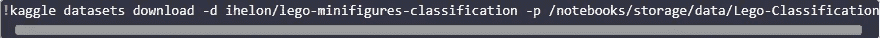

所以只需要基本的 bash 命令。我们下载了一个 zip 文件，我们可以在 jupyter 中使用 bash 对其进行解压缩，并将数据放在我们希望的位置。因此，我们将 Python Pathlib 包与 bash 结合使用！

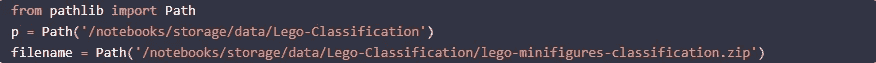

工作起来轻而易举！因此，我们将数据解压到“train”文件夹中，让我们利用 fastai 提供的众多便捷功能之一来看看数据是如何构造的。

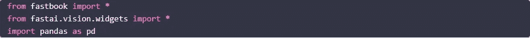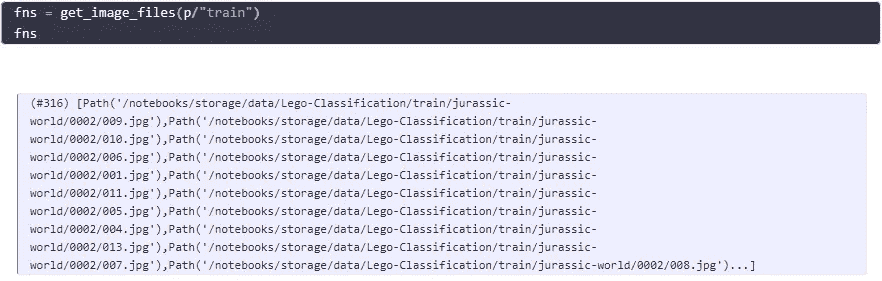

记住，我们把数据放入我们的目录'/笔记本/存储/数据/乐高-分类'。在快速浏览了我们的数据后，看起来数据存储如下:首先是我们图像的类型(惊奇/侏罗纪世界)，然后是人物的分类(0001/0002 等)。).在这些文件夹中，我们可以找到那个人物的许多不同的照片(001.jpg/002.jpg 等等)。让我们通过查看元数据来确认这一点。

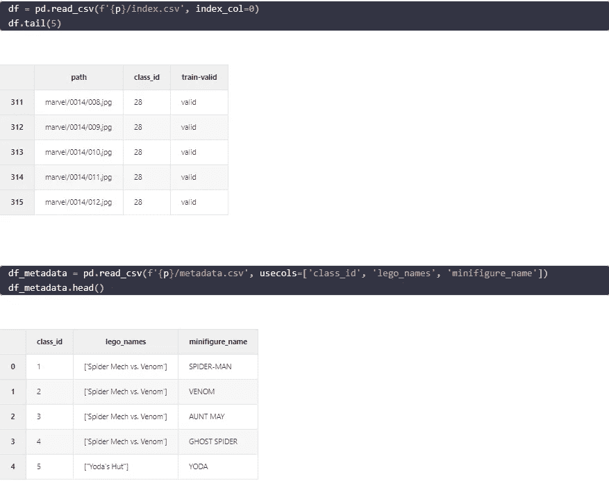

事实上，这就是这个数据集的结构。我们想要的是 fastai 的数据块可以轻松使用的数据结构。所以我们需要的是给我们文件名，标签和一个标签，哪个数据用于训练，哪个数据用于验证。幸运的是，我们可以通过组合元数据来得到这一点:

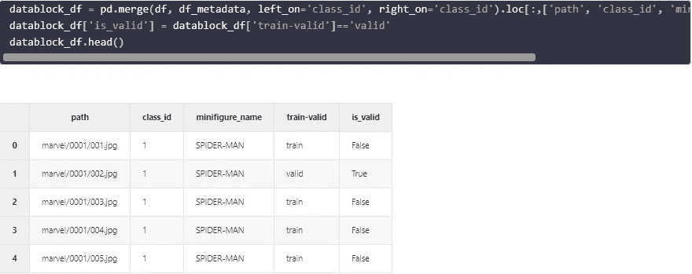

fastai 向我们简要介绍了在我们能够最佳利用数据块之前需要检查的内容:

```
what are the types of our inputs and targets? Images and labels.
where is the data? In a dataframe.
how do we know if a sample is in the training or the validation set? A column of our dataframe.
how do we get an image? By looking at the column path.
how do we know the label of an image? By looking at the column minifigure_name.
do we want to apply a function to a given sample? Yes, we need to resize everything to a given size.
do we want to apply a function to a batch after it's created? Yes, we want data augmentation.
```

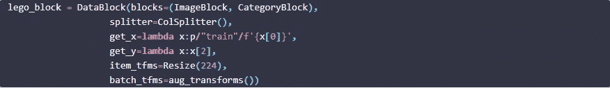

现在我们的数据块叫做 lego_block。看它是如何完美地搭配在一起的？

让我简单地解释一下我们的 lego_block 中的不同步骤在做什么:首先，我们告诉 lego_block 我们想要在什么上分割我们的数据(这里的缺省值是 col='is_valid ')，然后我们简单地放入我们的 path 列(x[0])并将其与我们的 path p 和所在的文件夹' train '合并。get_y 告诉 lego_block 在哪里可以找到我们的数据集中的标签(x[2])，然后我们使所有的图像大小相同，并对它们应用变换(查看 fastai 以了解更多信息)。

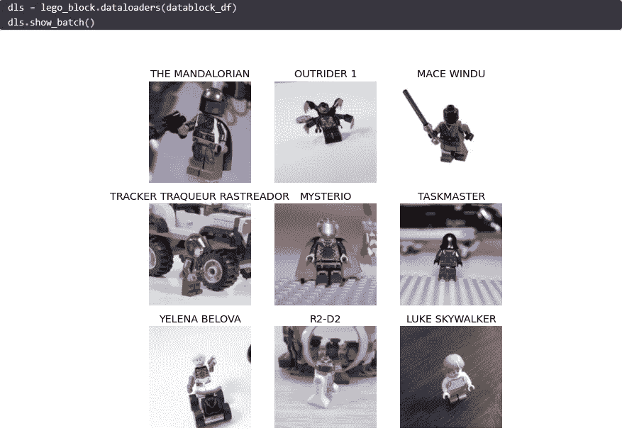

光荣！

fastai 试图让我们的生活更轻松。这个博客旨在向你们展示如何简单快速地获得一个优秀的分类器。在接下来的博客中，我将尝试更好地解释幕后发生的事情。但是现在，让我们享受一下使用 fastai 构建分类器的速度吧！

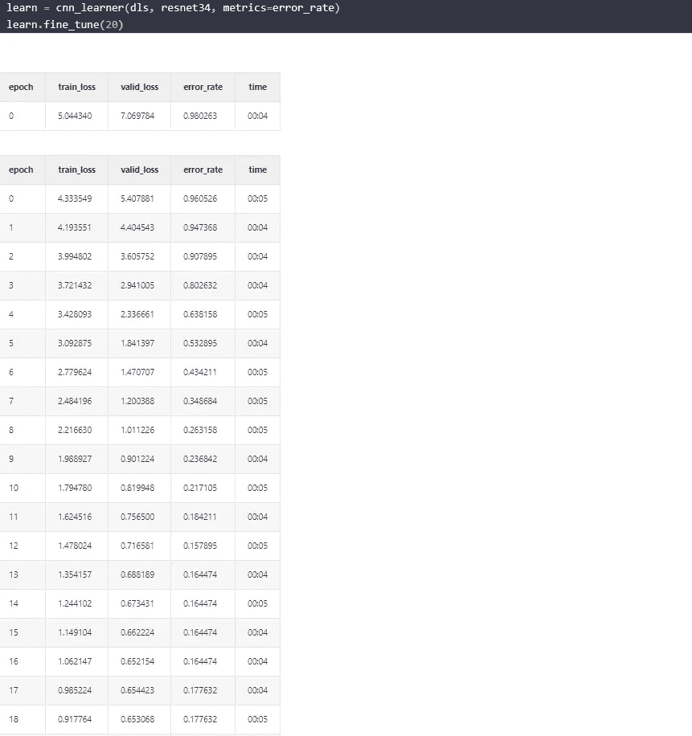

经过几个时期后，我们设法将错误率降低到 17%左右。我们能改进吗？我们当然可以。但首先，让我们来看看混淆矩阵:

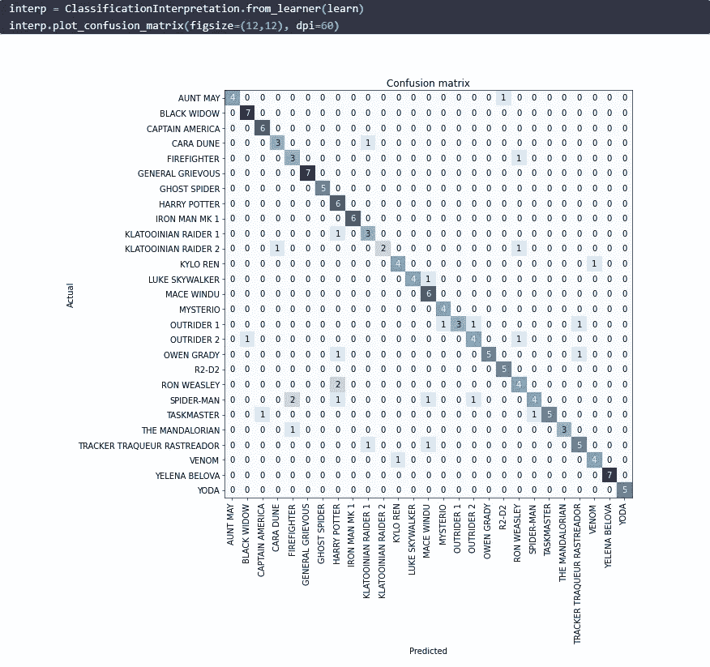

我觉得还不错。然而，看到罗恩·韦斯莱的照片并预测这是哈利·波特——我不知道这会给你的另一半留下多少印象。哦，亲爱的！有一次好老阿姨可能会预测是 R2D2。另一方面，美国队长 100%预测正确。

但是我们仍然可以尝试通过解冻权重来改进我们的模型，让模型变得更好。让我们来看看这个:

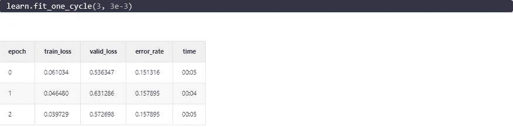

然后我们将解冻参数，并以稍低的学习速率学习:

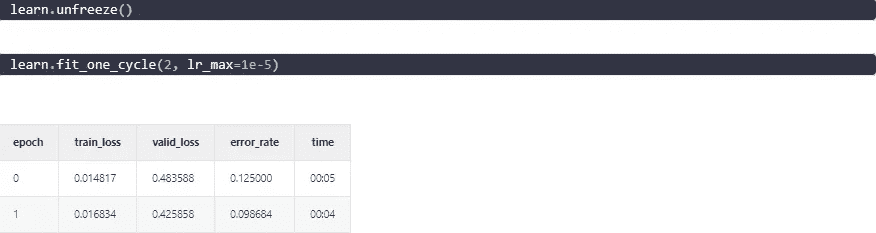

哇！只有 10%的错误率。我认为那是相当令人印象深刻的！让我们看看混淆矩阵:

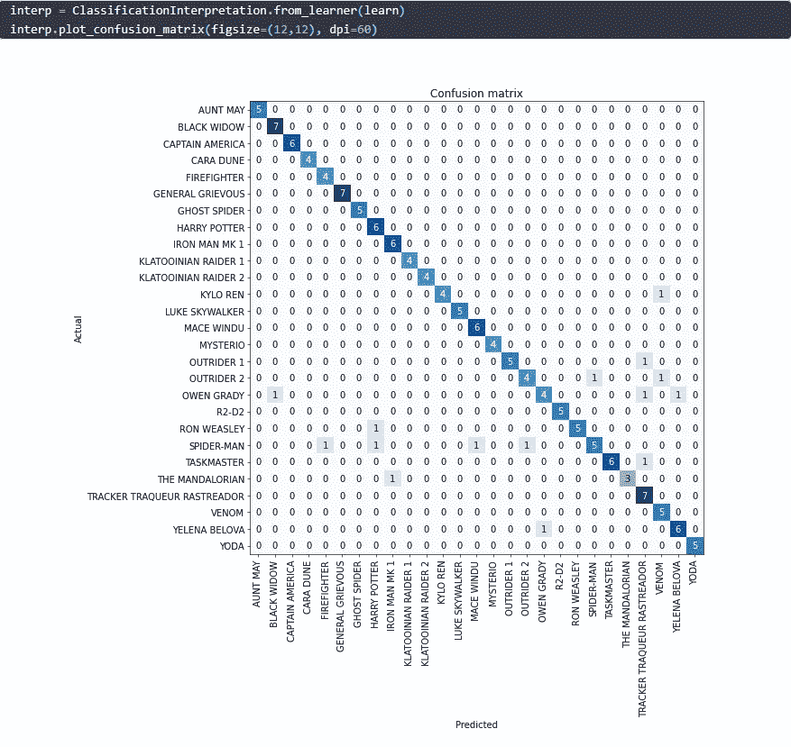

有了这些结果，我相信你会给你的另一半留下深刻印象！

这篇博文最初发表在我的个人博客:[https://lschmiddey . github . io/fast pages _/2020/09/16/Lego-classification . html](https://lschmiddey.github.io/fastpages_/2020/09/16/Lego-Classification.html)

拉塞