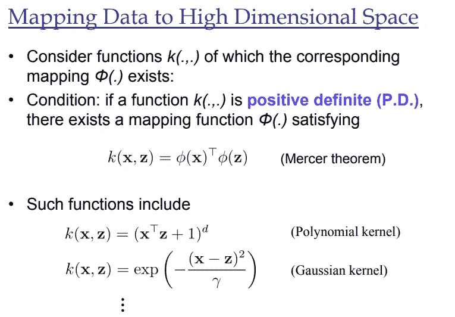
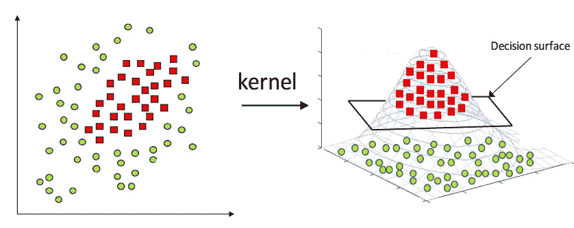

# SVM 的内核技巧

> 原文：<https://medium.com/analytics-vidhya/how-to-classify-non-linear-data-to-linear-data-bb2df1a6b781?source=collection_archive---------6----------------------->

> 使用 Mercer 定理提供的一些数学概念，内核技巧用于将非线性分类为线性。

什么是 SVM？

SVM 是一种监督学习算法，用于解决分类和回归问题，使用一种称为内核技巧的技术，可以转换数据并找到可能输出之间的最佳边界。

**什么是内核绝招？**

核技巧在支持向量机(SVM)模型中广泛使用，以桥接线性和非线性。它将非线性低维空间转换到高维空间，从而得到线性分类。因此，我们用一些额外的特征来投影数据，以便它可以转换到更高维度的空间。

让我们假设，如果我们想对红色方块和绿色圆点进行分类，这是不可能的，因为它是非线性的。在现实世界中，数据也是分散的，不可能将这些数据分开。因此，我们可以使用一个决策面，它既可以分类绿点，也可以分类红方块。核技巧只使用原始特征空间，因为当维数空间增加时，分类变得越来越复杂。

## SVM 涉及的步骤:-

I)收集数据并相应地绘制图表

ii)应用内核技巧

iii)学习分类数据的线性线

iv)投射回数据

> 总之，核技巧通过将低维空间转移到高维空间来将非线性分类转换成线性分类。在 Kernel Trick 中涉及到大量的数学知识来学习对数据进行分类的线性线。 ***梅塞定理*** 有助于将非线性数据点转换到更高维的空间。