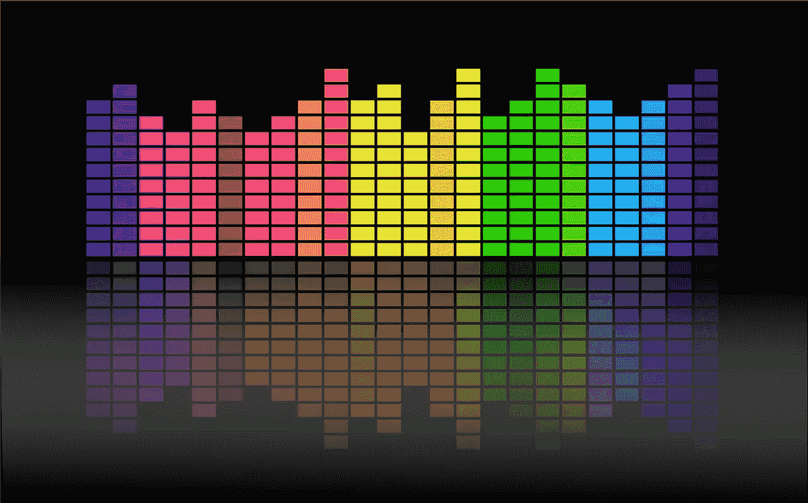
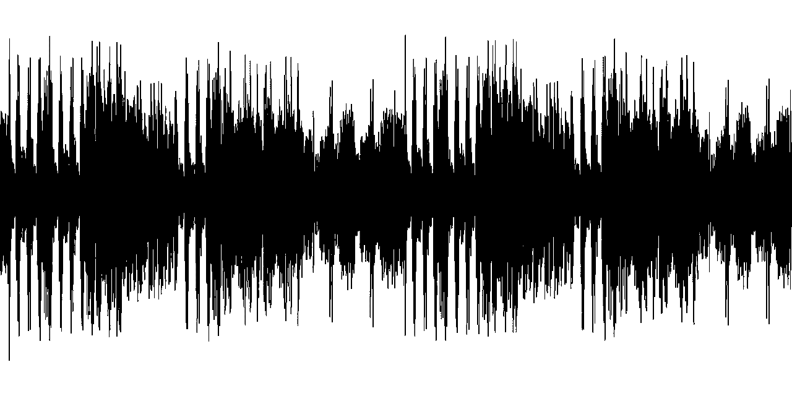

# 如何使用 Pytorch 对声音进行分类

> 原文：<https://medium.com/analytics-vidhya/how-to-classify-sounds-using-pytorch-27c9f2d4d714?source=collection_archive---------4----------------------->

在本文中，我将讨论如何准备声音或音频数据集，以便我们能够对它们进行分类。它可能有点长，但如果你能保持耐心，通读一遍，这将是非常有益的。



1.  首先我们将加载音频文件。从有 n 个声音文件的目录中，我们将首先使用 **torchaudio.load** 加载其中的 2-3 个。torchaudio 支持“**格式的声音文件。wav** 和 **.mp3** ，用于给出声音文件的波形和采样率。波形由数组格式的每帧声音的频率组成，而采样速率决定了可以表示波形的频率。

```
import torchaudio
waveform, sample_rate **=** torchaudio**.**load("_**PATH OF THE AUDIO FILE**_")
```



如果音频文件是其他格式，然后尝试谷歌提取出音频文件的波形，采样率。例如，如果你有。flac '音频文件你可以试试这个:→

```
import soundfile as sf
waveform, sample_rate = sf.read("_**PATH OF THE AUDIO FILE IN FLAC**_")
```

2.**将所有波形的形状标准化为一个尺寸**。加载文件后，使用 **waveform.size()[0]** 检查波形的形状。如果它的值大于 1，那么我们必须使用

```
from pydub import AudioSegmentwaveform = AudioSegment.from_mp3(_**PATH OF THE AUDIO FILE**_)
waveform = waveform.set_channels(1)
waveform = waveform.get_array_of_samples()
waveform = torch.tensor(waveform, dtype = torch.float)
waveform = torch.reshape(waveform, (1,waveform.shape[0]))
```

3.**将波形改为** **声谱图、梅尔声谱图或 MFCC 声谱图。**现在我们将使用以下方法将波形转换成频谱图(*随着时间变化的信号频谱的直观表示*

```
Spectrogram **=** torchaudio**.**transforms**.**Spectrogram()(waveform)
```

或者，梅尔声谱图(*声音的短期功率谱的表示，基于非线性* ***梅尔*** *频率标度*上对数功率谱的线性余弦变换)使用

```
Mel_Spectrogram **=** torchaudio**.**transforms**.**MelSpectrogram()(waveform)
```

或者，MFCC( *梅尔频率倒谱系数(****MFCC****)是共同构成梅尔频率倒谱的系数。梅尔频率倒谱是声音的短期功率谱的表示，基于对数功率谱在非线性梅尔频率标度上的线性余弦变换*，使用

```
n_fft **=** 400.0
frame_length **=** n_fft **/** sample_rate ***** 1000.0
frame_shift **=** frame_length **/** 2.0

params **=** {
    "channel": 0,
    "dither": 0.0,
    "window_type": "hanning",
    "frame_length": frame_length,
    "frame_shift": frame_shift,
    "remove_dc_offset": **False**,
    "round_to_power_of_two": **False**,
    "sample_frequency": sample_rate,
}
mfcc **=** torchaudio**.**compliance**.**kaldi**.**mfcc(waveform, ******params)
```

4.**最后，我们可以像这样使用以上 3 点创建数据集类**。*# 1 #先定义数据集类名*。

```
class **audio_classification**(**torch.utils.data.Dataset**):
```

*#2#定义类构造函数来定义 audio _ ids，在列表中定义它们的分类 class _ ids，并对它们应用扩充*

```
def __init__(self, ids, recording_id, class_id, required_columns, is_valid = 0):
        self.ids = ids
        self.audio_ids = audio_ids
        self.class_id = class_id
        self.required_columns = required_columns
        self.is_valid = is_valid
        if self.is_valid == 1:
            self.aug = *# transfoms for validation images*
        else:                  
            self.aug = *# transfoms for training images*
```

*#3#定义 __len__ 函数*

```
def __len__(self):
      return len(self.ids)
```

*#4#最后定义 __getitem__ 函数*

```
def __getitem__(self, index):
        filename = "**__PATH OF THE AUDIO__**"+ self.audio_ids[index] +"**__EXTENSION OF THE AUDIO FILE__**" waveform , _ = torchaudio**.**load(filename) ***# reshape to 1 channel if required***
        waveform = torch.reshape(waveform, (1, waveform.shape[0])) ***# Change the waveform to Spectrogram, Mel-Spectrogram or,MFCC***
        specgram = torchaudio.transforms.Spectrogram()(waveform)

        ***# convert 1 channel to 3 channels applying imagenet models***
        specgram = specgram.repeat(3, 1, 1)

        ***# Applying audio augmentations by converting to numpy array***
        specgram = np.transpose(specgram.numpy(), (1,2,0))
        specgram = self.aug(image = specgram)['image']

        ***#As torch accepts channels first so applying this***
        specgram = np.transpose(specgram,(2,0,1)).astype(np.float32)

        return {
            '***specgram***' : torch.tensor(specgram, dtype = torch.float)            '***label***' : torch.tensor(self.class_id[index], dtype = torch.float)
        }
```

*完成所有这些步骤后，这将完全成为一个图像分类问题。在此之后，我们可以定义数据加载器、模型、损失函数、优化器和训练&验证过程，并开始训练我们的模型，就像我们在图像分类问题中所做的那样。*


我希望你已经很好地理解了这篇文章，如果有任何与这篇文章相关的问题，请随时对这篇文章发表评论，直到那时享受学习。