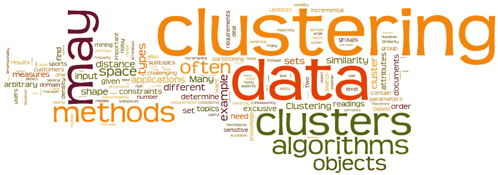
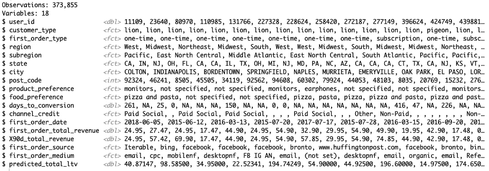
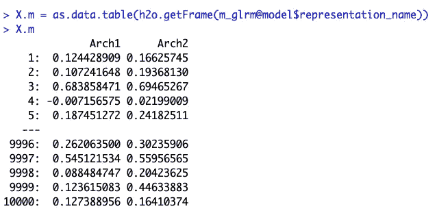
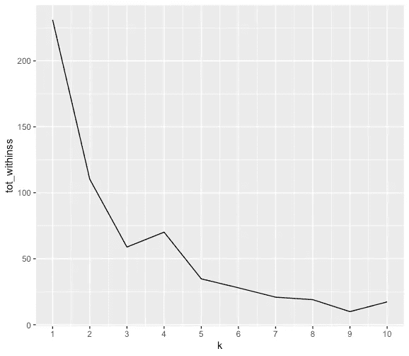
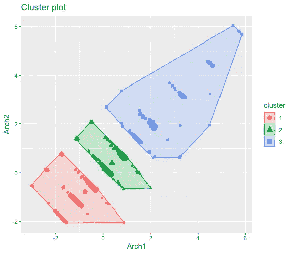
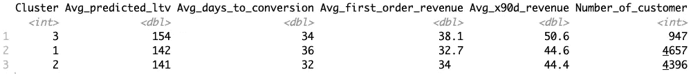

# 如何对高维混合数据类型的数据集进行聚类

> 原文：<https://medium.com/analytics-vidhya/how-to-cluster-dataset-with-high-dimensionality-and-mixed-datatypes-b2b0b9ee24d6?source=collection_archive---------11----------------------->

## 使用 GLRM 进行聚类分析和客户细分

**集群的挑战**

在对零售和电子商务客户数据进行聚类分析时，您通常会发现数据集杂乱无章、高维且包含许多分类变量。虽然有许多降维技术，但大多数都不能很好地处理包含许多分类变量的数据集。传统上，当特征不是干净的数值时，聚类方法会受到影响。例如，最流行的 KNN 算法只能处理数值变量。

**广义低秩模型**

由斯坦福大学的学生开发的广义低秩模型(GLRMs)(见 [Udell '16](https://web.stanford.edu/~boyd/papers/pdf/glrm.pdf) )提出了一种新的聚类框架来处理所有类型的数据，即使是混合数据类型。使用 GLRMs，可以将分类列转换为二进制列。对于其他技术来说，在这种类型的数据集上生成聚类被认为太麻烦了。

GLRM 的好处是:

*   减少所需的存储
*   启用数据可视化
*   消除噪音
*   估算缺失数据
*   简化数据处理

你可以找到更多关于 H2O GLRM 包装的信息。

**使用 GLRM 变换数据集**

我使用的数据集来自一个虚构的销售 cookie 订阅的电子商务公司。如您所见，它包含 18 个变量，其中许多是分类变量。

H2O 是一个具有 R 接口的开源机器学习框架，具有很好的并行实现 GLRM 的步骤:

1.  初始化集群`h2o.init()`
2.  存储输入数据`as.h2o()`
3.  使用`h2o.glrm()`启动一个 K=2 的 GLRM 模型(秩 2 模型)

GLRM 模型生成 X 和 Y 矩阵。x 矩阵已经通过调用:x . m = as . data . table(H2O . get frame(m _ glrm @ model $ re presentation _ name))获得

你可以看到 X 矩阵由两个原型组成。现在原始数据集已经简化为二维数值数据集。

**使用 K 均值算法进行聚类**

要确定分类的数量:

首先，我使用 map_dbl 运行许多 k 值不同的模型。

tot_withinss = map_dbl(1:10，function(k){
model = k means(x = x . m，centers = k)
model $ tot . withinss
})

其次，我生成了一个同时包含 k 和 tot_withinss 的数据帧。

elbow_df

第三，我画肘图。这里的肘点是 3。

然后，我使用 k-mean 算法创建了 3 个聚类，并用 factoextra 软件包绘制了这些聚类。

最后，我将聚类添加到原始数据集中，并使用聚类进行更多的分析和形成客户洞察力。例如，分类 3 的预测 LTV 最高，前 90 天的收入最高。更多 EDA 可以在我在 github 上的演示中找到。

你可以在 [Github](https://github.com/ellendeng/clustering_wGLRM) 上找到 R 代码，如果有任何问题，请随时在 [LinkedIn](https://www.linkedin.com/in/ellen-deng/) 上联系我。