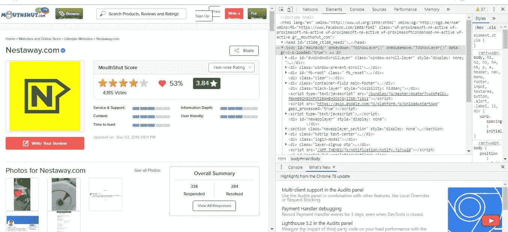
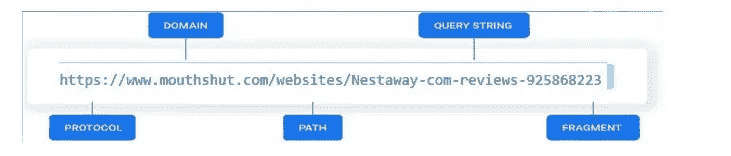
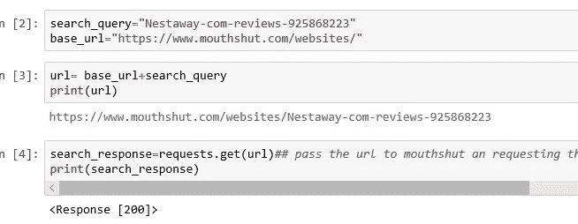
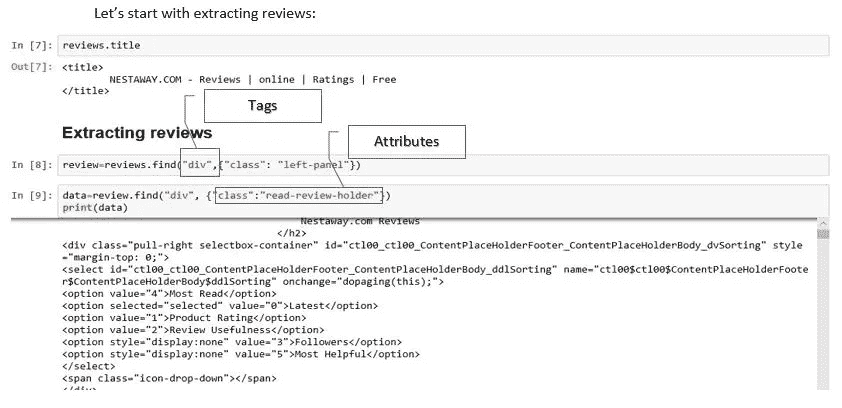
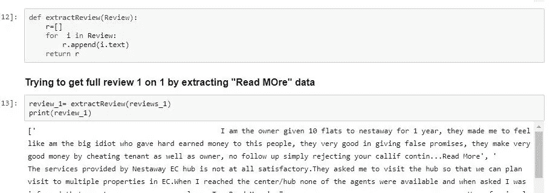

# 如何从一个网站收集数据？？

> 原文：<https://medium.com/analytics-vidhya/how-to-collect-data-from-a-website-27f44099120d?source=collection_archive---------15----------------------->

## 刮痧好玩！

你知道刮擦是提取或收集业务问题相关数据的一种形式吗！如何开始？从哪里开始？

如果你知道怎么做，你可以从任何网站上收集数据！

进入 *Chrome* →更多工具(用户账户旁边的图标)→开发者工具→查看导航器并探索它。

*你也想体验一下乐趣吗！*

*让我们玩得开心点*

在我们学院，当我们有一个寻找公司让学生安置的热潮时，我刚刚试图为我们的商业分析学生找到一家公司，与此同时，我们的教授建议我寻找一家“NESTAWAY”公司。

所以现在我要取消印度流行评论网站“[MOUTHSHUT.COM](https://www.mouthshut.com/)”的“[内斯特维](https://www.nestaway.com/welcome/owner?utm_source=Google&utm_medium=CPC&utm_term=CPC&utm_content=Owners&utm_campaign=RSA&gclid=Cj0KCQiAiZPvBRDZARIsAORkq7c0jPpcm8zidgvN0ULlYLRFYQouKBUi25t9SKSiwVq01OiL9COtypkaAtx_EALw_wcB)”评论，这是一个经过验证的评论平台，人们在这里试图说真话。

> 我们开始刮吧

> 为此，让我有完整的网址

> 让我们看看回应

如果反应良好，其状态和内容是什么

> 让我们从提取评论开始:

让我们试着写一个函数来完成这个-

有刮的乐趣！！

你可以在这里看到我的密码本！

 [## 木星-立即分享 Jupyter 笔记本电脑

### 即时分享 Juptyer 笔记本。Jovian 使 Jupyter 笔记本可共享、可评论和可复制。

jovian.ml](https://jovian.ml/nivyasreeavula/webscrapping-for-nestaway-form-mouthshut-com)