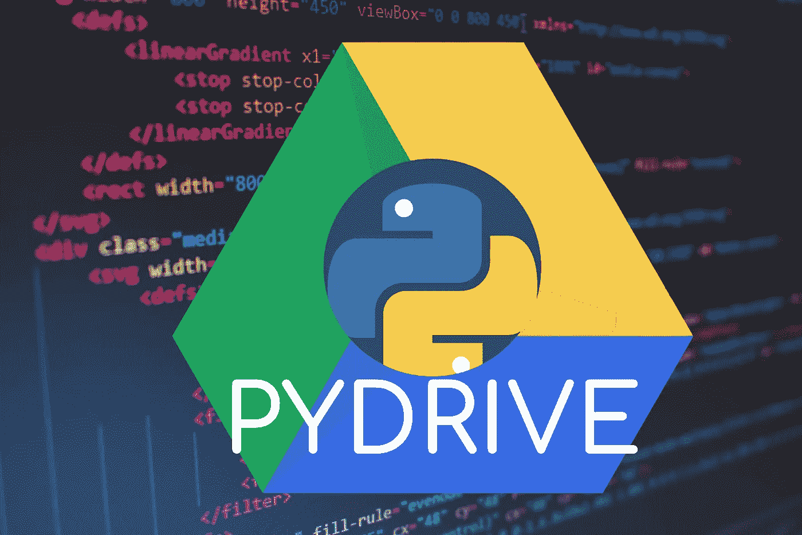

# 如何使用 PyDrive 将 Google Drive 连接到 Python

> 原文：<https://medium.com/analytics-vidhya/how-to-connect-google-drive-to-python-using-pydrive-9681b2a14f20?source=collection_archive---------0----------------------->

## 终极 PyDrive 教程

改编自 Florian Olivo 在 T2 Unsplash 上的照片

PyDrive 是 Google Drive API 的高级 Python 包装器。它允许你轻松地从 Python 脚本上传、下载和删除你的 Google Drive 中的文件。

## 在本文中，我们将涵盖:

*   从 Google Drive 获取 API 密钥