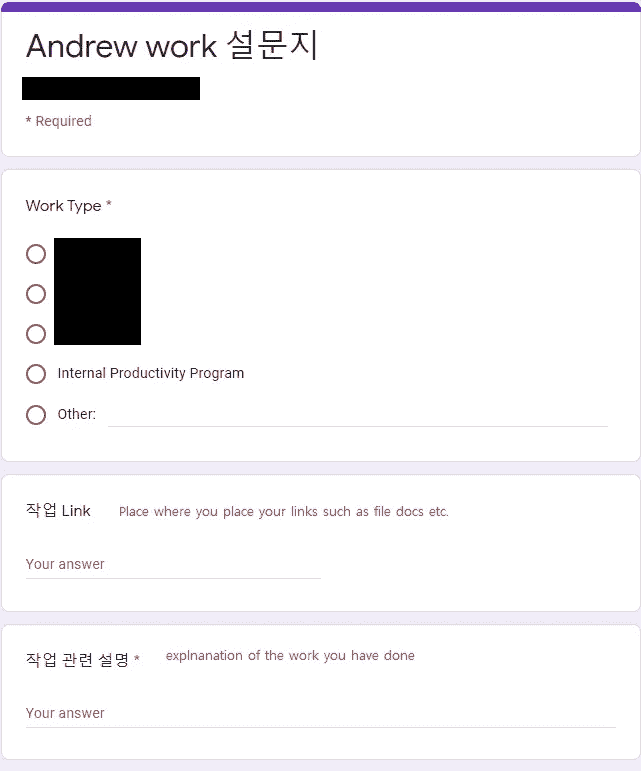
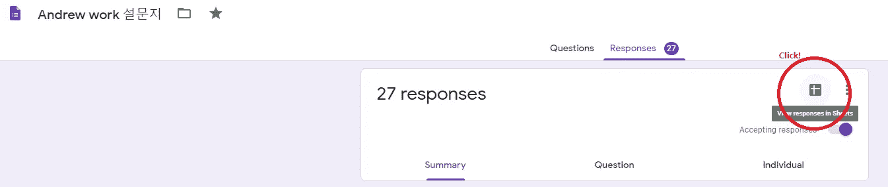
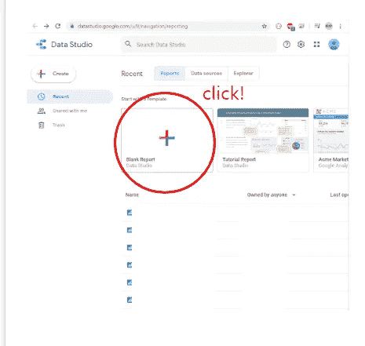
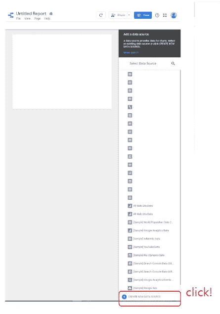
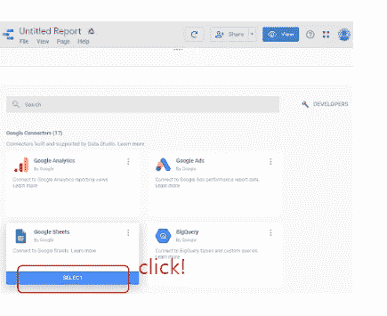
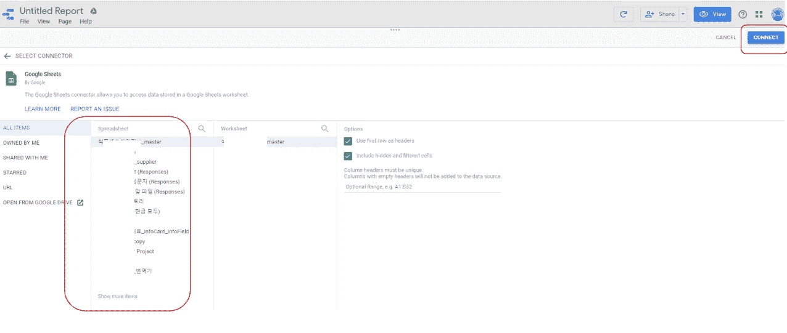
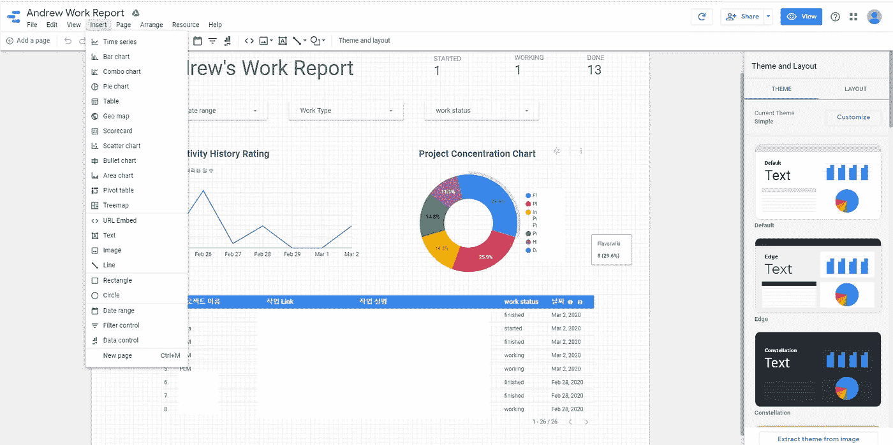
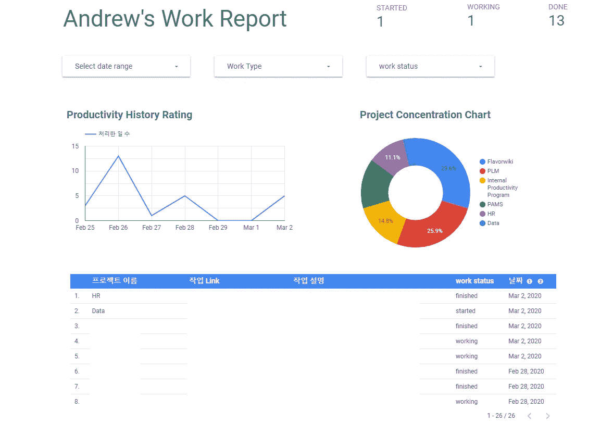

# 如何将 Google forms 与 Google Data Studio 连接起来创建一个简单的仪表板

> 原文：<https://medium.com/analytics-vidhya/how-to-connect-google-forms-w-google-data-studio-to-create-a-simple-dashboard-67285860faac?source=collection_archive---------8----------------------->

谷歌产品通常是免费使用的，如果你处理简单的数据，不需要走极端。没有成本，只有高效的仪表板

> **提醒:这只是一个关于连接 google forms 和 data studio 的软介绍教程。不包括图表配置的深度解释。**

由[卢克·切瑟](https://unsplash.com/@lukechesser?utm_source=medium&utm_medium=referral)在 [Unsplash](https://unsplash.com?utm_source=medium&utm_medium=referral) 上拍摄的照片

每个人都想创建自己的仪表板，帮助他们了解和跟踪自己的生产力。此外，我们必须考虑到生产力的度量是模糊的，人们有他们的版本可以遵循。

这是介绍。可以帮助你们开始通过谷歌表单和谷歌数据工作室探索数据的教程，通常是免费的。

***感谢谷歌！**

首先，我们收集数据…但以统一的方式。电子表格可能会创造太多的自由，这可能会阻止我们每天或每小时插入数据，所以我们将使用 [google forms](https://www.google.com/forms/about/) 。

你可以提出你认为合适的问题

其次，我们转到 from editor > responses，然后单击电子表格按钮，检查数据是否被正确保存。

> 注意:您可以随时更改电子表格中的结果，但这可能会影响您在做数据敏感项目时的数据完整性

单击电子表格按钮，检查信息是否正确保存

第三，转到 google [datastudio](https://datastudio.google.com/) 添加“空白报告”来创建仪表板。

单击空白报告

然后单击“新数据源”以添加到您的仪表板

创建新的数据源

然后选择电子表格来查找您的调查文件，

只要将光标悬停在 google sheet 上，您就会看到选择按钮亮起

然后单击与您的调查相关的文件名。

注意:通常以一个叫做'(响应)的后缀结尾

单击连接将它们导入到 google data studio

然后，google data studio 会自动解析您的数据，并将其连接到新的空白仪表板上。

第四，使用预先构建的图表、过滤器和表格。

快速提示:通常，我使用插入部分的所有工具。

收回了一些敏感数据

我建议探索以下特性:

1.  表格—只是一种组织数据的方式(您也可以在这里使用超链接)
2.  过滤控件—用于使用分类数据过滤数据
3.  文本—只是添加标签的简单文本
4.  记分卡-计算所有数据的总和或使用特定的过滤器

免费使用的结果还可以

Tada！我们完了。

友好个人备注:养成使用表单系统的习惯就好；到今年年底，你将有重要的个人数据需要分析，并添加到你的新年计划中。

感谢阅读，如果你对这个项目有任何问题，请在下面评论。我将尽力回答这个问题。