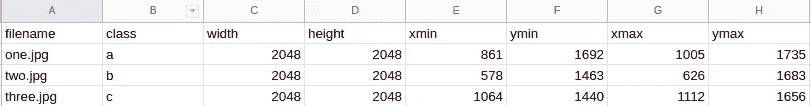

# 如何将 Tensorflow 对象检测 CSV 数据转换为 CoCo Json 格式

> 原文：<https://medium.com/analytics-vidhya/how-to-convert-tensorflow-object-detection-csv-data-to-coco-json-format-d0693d5b2f75?source=collection_archive---------7----------------------->

CSV 格式的 Tensorflow 对象检测数据包含每个实例的一行。



它包含每个图像的每个标签的边界框位置和类别标签。

它用于训练 tensorflow 对象检测模型和各种其他模型。

CoCo Json 格式最初是由 CoCo 对象检测竞赛规定的。它以 json 格式存储对象检测数据。json 包含以下四个字段

```
{"info": info,"images": [image],"annotations": [annotation],"licenses": [license],"categories": [category]}
```

对于检测器 2 下的训练对象检测模型，只有图像、类别和注释字段是必需的，信息和许可证字段可以忽略。

图像字段包含字典列表，每个图像一个字典。它将图像 id 分配给注释字段中使用的图像名称。对于一个单独的图像，其结构如下:

```
{"id": int,"width": int,"height": int,"file_name": str,"license": int,"flickr_url": str,"coco_url": str,"date_captured": datetime,}
```

对于 detectron2 的培训，只有 id、宽度、高度和文件名字段是必填的。

类别字段包含字典列表，每个类别一个字典。它将类别 id 分配给在注释字段中使用的类别名称。其单一类别的结构如下:

```
{"id": int,"name": str,"supercategory": str,}
```

注释字段包含字典列表，每个标签一个字典。我们必须为每个注释提供唯一的注释 id。我们必须提供相关的图像 id 和类别 id。对于检测任务，我们必须提供包围盒坐标及其面积。如果是训练例如分割，那么我们也必须在分割字段中提供用于遮罩的多边形，在对象检测任务的情况下，分割字段可以留空

```
annotation{"id": int,"image_id": int,"category_id": int,"segmentation": [], "area": float,"bbox": [x,y,width,height],"iscrowd": 0,}
```

因此，我使用以下代码将 tensorflow 对象检测 csv 数据转换为 Coco Json 格式

在第 9 行，我们读取了 csv 文件。需要为虚拟超级类别分配 id 0。我们使用虚拟类别作为其余类别超级类别。

然后，我们遍历每一行，并填充图像、类别和注释字段。

我已经用上面代码生成的 cocojson 数据训练了 detectron2 对象检测模型。