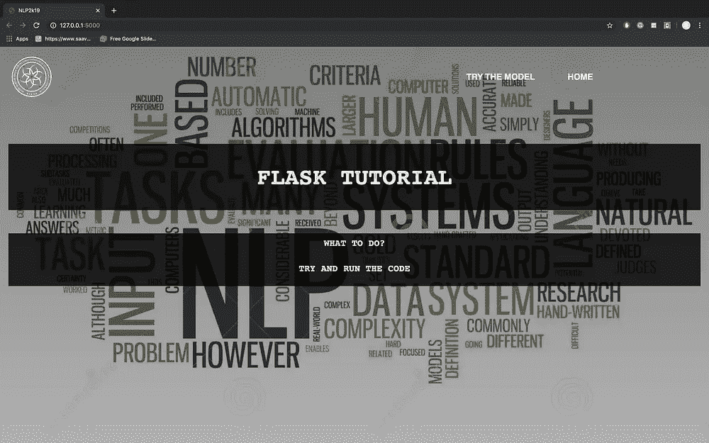
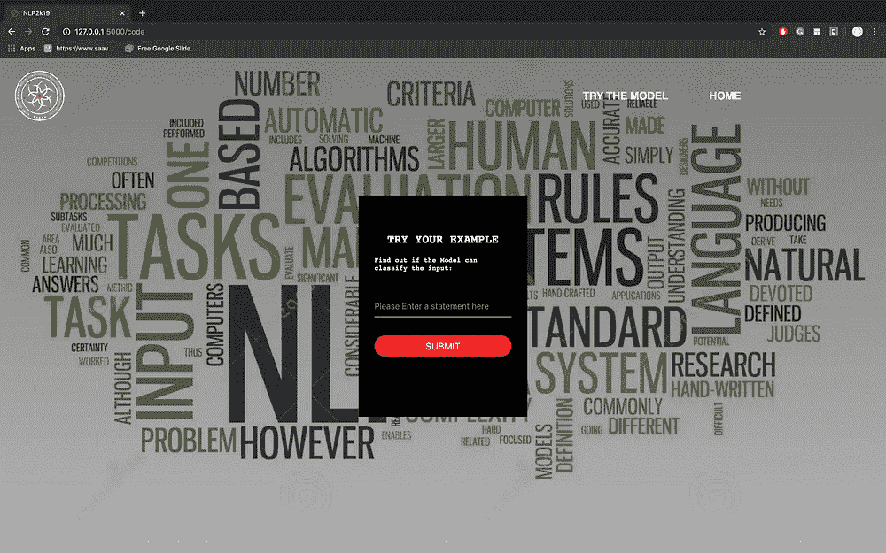
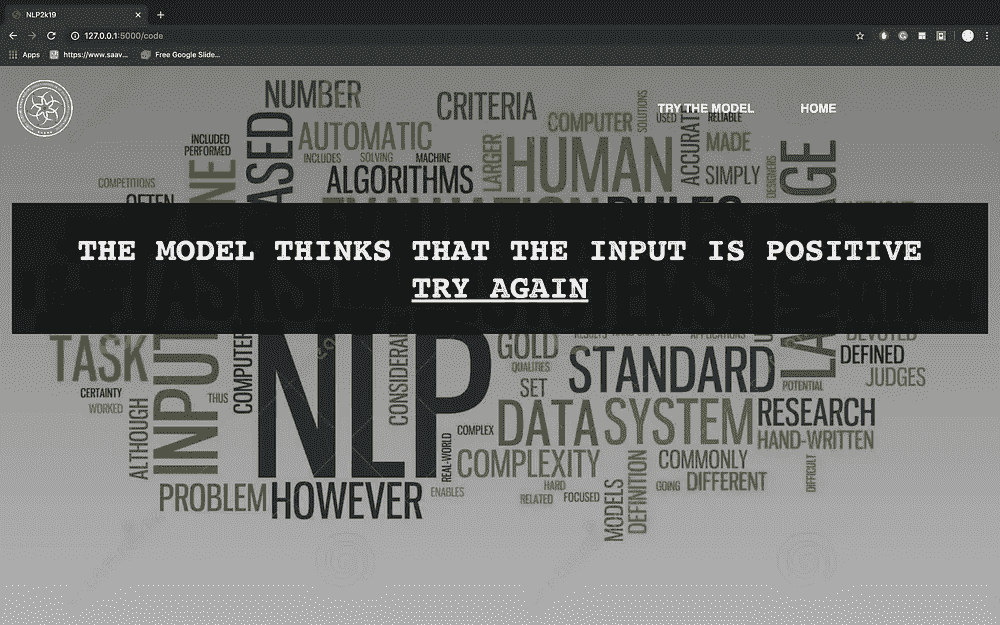
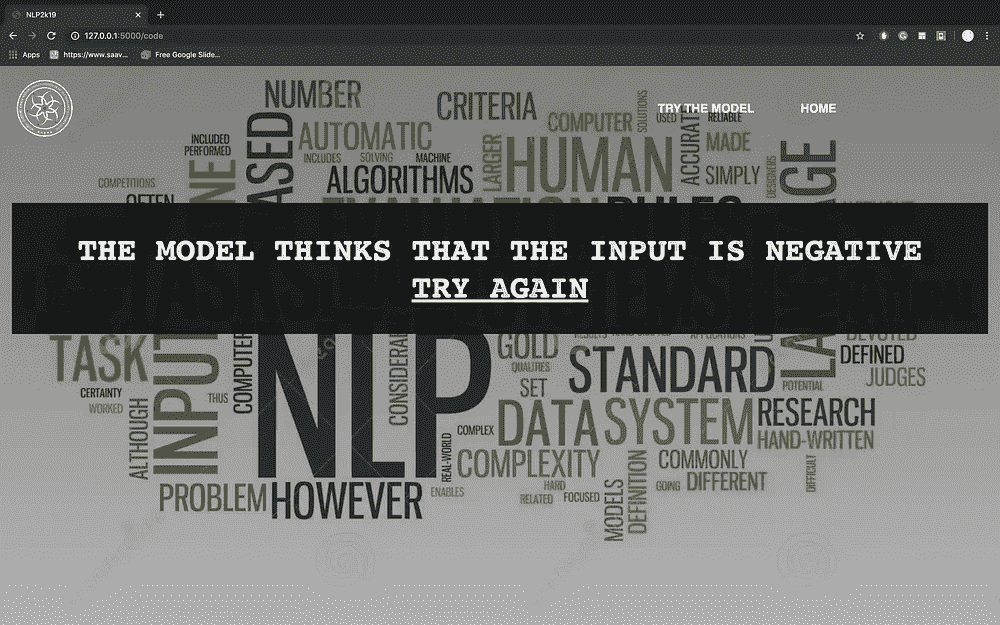

# 如何使用 Flask 创建一个基本的交互式 GUI 并运行深度学习 NLP 模型

> 原文：<https://medium.com/analytics-vidhya/how-to-create-a-basic-interactive-gui-and-running-deep-learning-nlp-model-using-flask-a9b77eb52682?source=collection_archive---------4----------------------->

## 烧瓶 API，IMDB 分类器

> 作者:Dhaiwat Kabaria | Utsav Jethva


马克·戴恩斯在 [Unsplash](https://unsplash.com?utm_source=medium&utm_medium=referral) 上的照片

现在做一个机器学习模型已经变得非常容易了。您可以在几分钟内创建您的 ML 模型。深度学习也变得越来越受欢迎，谷歌允许用户通过谷歌 Colab 的云免费使用 GPU。但是您创建的模型是离线创建的。想知道聊天机器人是如何在网站上操作的吗？科技巨头如何实时使用他们的 ML 模型？

互联网上有很多关于如何构建和优化 ML 模型的内容，但他们没有教授如何实时部署它们。

建立一个模型和实际上让人们在他们的产品和服务中使用它是有很大区别的。

在这篇博客中，我们将首先创建一个文本分类器，使用深度学习 NLP 模型来预测 IMDB 电影评论的情感。然后使用 Flask 在线部署它。

Flask 是用于构建 web 应用程序的 Python 微框架。这个 API 允许我们通过 HTTP 请求利用预测能力。

这有两个主要部分:

1)利用被标记为正面或负面的 IMBD 电影评论来离线训练深度学习分类器。

2)将经过训练的模型部署为服务用户的服务

# 制作 python 代码

我们将使用 IMDB 评论的 inbuild Keras 数据集对电影评论进行情感分析。我们将创建一个简单的 MLP 深度学习模型。数据集和模型的细节在这个[博客](https://machinelearningmastery.com/predict-sentiment-movie-reviews-using-deep-learning/)中给出。

为了了解我们的模型在训练期间是如何学习的，我们现在将在测试数据集上对它进行评估。

```
# Final evaluation of the modelscores = model.evaluate(X_test, y_test, verbose=0)print("Accuracy: %.2f%%" % (scores[1]*100))
```

训练完模型后，我们将保存我们的模型，以便以后使用。我们必须将我们的模型架构保存为. json 文件，并将它在训练过程中学习到的模型权重保存为. h5 文件。

```
model.save_weights('model_weights.h5')json_string = model.to_json()f = open("model_architecture.json",'w')f.write(json_string)f.close()
```

我们可以使用下面几行代码加载并使用保存的模型:

```
f = open("model_architecture.json",'r+')json_string = f.read()f.close()model = model_from_json(json_string)model.load_weights('model_weights.h5')model.compile(loss='binary_crossentropy', optimizer='adam', metrics=['accuracy'])
```

现在，我们将创建一个 python 后端文件，在部署期间与 flask 一起运行。

我们将创建一个名为 predict 的函数，它将从网页中获取输入，并在网页上再次显示其输出。在函数中，我们将使用先前保存的文件构建训练好的模型，并对其进行编译。然后将我们的输入转换成我们的模型接受的形式，然后预测情绪。

# 将模型转化为 Web 应用程序

在前一节中已经准备好了模型 的代码，我们将开发一个 web 应用程序，它由一个简单的 web 页面和一个允许我们输入消息的表单字段组成。在将消息提交给 web 应用程序后，它将在一个新页面上呈现它，这给我们一个垃圾邮件或非垃圾邮件的结果。

首先，我们使用以下命令安装依赖项，即“flask ”:

```
pip install Flask
```

一旦我们安装了 Flask，我们就创建了一个文件夹；在本例中，我们将其命名为 IMDB Classifier，这是文件夹中的目录树。我们将一边进行一边解释每个基本文件。

```
app.py
imdb_classifer.py
model_architecture.json
model_weights.h5
templates/
        home.html
        layout.html
        code.html
        outputs/
                Positive.html
                Negative.html
        includes/
                _form.html
                _navbar.html
static/
        css/
                style.css
                pic1.jpg
        pic/
                logow.png
```

## app.py

现在，我们需要创建一个基本的 python 文件(`app.py`)，其中包含将由 Python 解释器执行以运行 Flask web 应用程序的主要代码:

app.py

注意，我们需要导入 python 文件并调用我们需要在后端运行的 run 函数。这段代码接受表单中的输入，然后将用户重定向到相应的输出页面。

**layout.html**

一旦基本的 python 文件准备好了，我们需要制作 HTML 网页。我们使用一个`layout.html`文件，这样我们就不必一遍又一遍地重复代码的相同部分:

layout.html

**home.html**

home.html

**code.html**

code.html

**style.css**

在 layout.html 的头段，我们加载了`style.css`一个文件。CSS 决定了 HTML 文档的外观和感觉。`style.css`必须保存在一个名为 static 的子目录中，这是默认目录，Flask 在其中查找静态文件，如 CSS:

style.css

“包含”文件用于向网页添加额外的元素，如导航栏。它们是在其他网页中调用的部分代码:

_navbar.html

输出文件是根据 python 代码的输出调用的文件。这里我们使用两个输出文件，一个用于“正”，另一个用于“负”:

Positive.html

Negative.html

嗯，这是一个很大的代码，但我们几乎在那里！我们已经创建了所有需要的文件，现在让我们测试它。

完成以上所有操作后，您可以通过双击`app.py`或从终端执行命令来开始运行 API:

```
cd IMDB Classifier
python app.py
```

您应该得到以下输出:

```
Using TensorFlow backend.
 * Serving Flask app "app" (lazy loading)
 * Environment: production
 * Debug mode: on
 * Running on [http://127.0.0.1:5000/](http://127.0.0.1:5000/) (Press CTRL+C to quit)
```

现在，您可以打开网络浏览器并导航至 [http://127.0.0.1:5000/](http://127.0.0.1:5000/) 。我们应该看到一个简单的网站，内容如下:



输出图像

恭喜你！我们现在已经创建了一个基本的交互式 GUI，并使用 Flask 零成本运行深度学习 NLP 模型。如果你回头看，整个过程一点也不复杂。只要有一点点耐心和学习的欲望，任何人都可以做到。所有的开源工具让一切成为可能。

项目的所有文件都可以在这里找到[。祝您愉快！](https://drive.google.com/drive/folders/1QlSEIUR-bpGcLDUITV7-kR6fJ44bh_kJ?usp=sharing)

参考:

[https://machine learning mastery . com/predict-情操-电影-评论-使用-深度学习/](https://machinelearningmastery.com/predict-sentiment-movie-reviews-using-deep-learning/)

[](https://towardsdatascience.com/develop-a-nlp-model-in-python-deploy-it-with-flask-step-by-step-744f3bdd7776) [## 用 Python 开发一个 NLP 模型&用 Flask 逐步部署它

### Flask API，文档分类，垃圾邮件过滤器

towardsdatascience.com](https://towardsdatascience.com/develop-a-nlp-model-in-python-deploy-it-with-flask-step-by-step-744f3bdd7776)