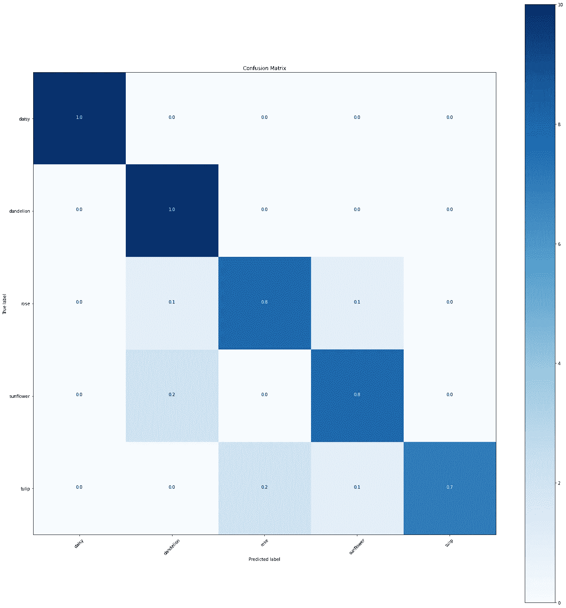
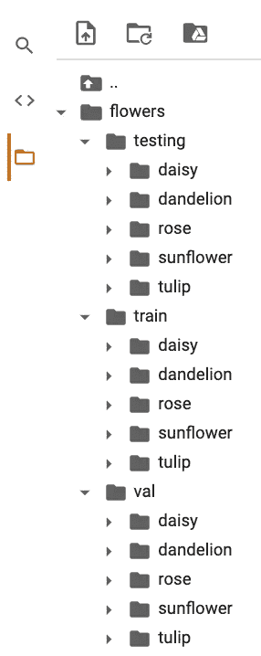
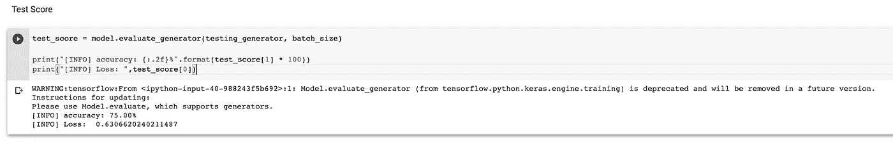
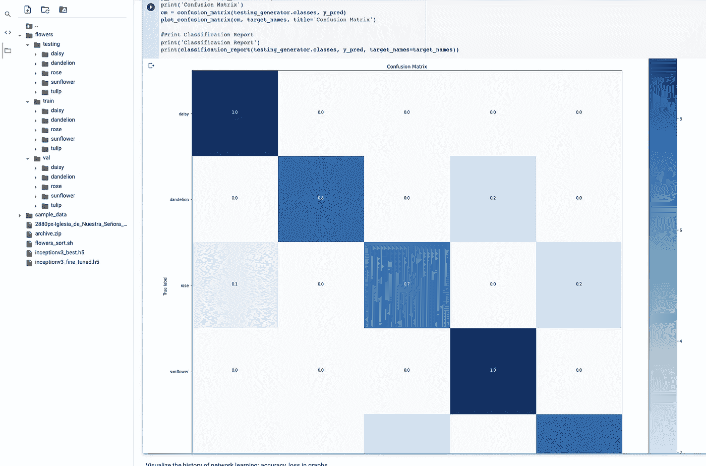

# 如何使用 matplotlib 在您的训练模型中使用测试结果创建混淆矩阵

> 原文：<https://medium.com/analytics-vidhya/how-to-create-a-confusion-matrix-with-the-test-result-in-your-training-model-802b1315d8ee?source=collection_archive---------4----------------------->



混淆矩阵(图片，作者 GIF)[https://github . com/oleks andr-g-rock/How _ to _ create _ confusion _ matrix/blob/main/1 _ eg-hee amk 8 mtmblkhymrpq . png](https://github.com/oleksandr-g-rock/How_to_create_confusion_matrix/blob/main/1_eg-HeEAMk8mtmblkHymRpQ.png)

# 简短摘要:

这篇文章与我的上一篇文章几乎相同，但变化不大:

[](https://oleksandrg.medium.com/image-classifications-flowers-recognition-58a5b0b1154f) [## 图像分类:花卉识别

### 如何创建图像分类:5 类花卉识别？最初需要:

oleksandrg.medium.com](https://oleksandrg.medium.com/image-classifications-flowers-recognition-58a5b0b1154f) 

如果你只想看看笔记本或者只是运行代码，请点击[这里](https://github.com/oleksandr-g-rock/How_to_create_confusion_matrix/blob/main/How_to_create_a_confusion_matrix.ipynb)

# 所以，我们开始吧:)

所以我只是解释如何创建一个混淆矩阵，如果你做一个图像分类模型。

首先，我们需要在数据集中创建 3 个文件夹(testing、train、val ),如屏幕截图所示:



(图片，作者 GIF)[https://github . com/oleks andr-g-rock/How _ to _ create _ confusion _ matrix/blob/main/1 _ 833 wrd 2 mhrefopxpekkzrq . png](https://github.com/oleksandr-g-rock/How_to_create_confusion_matrix/blob/main/1_833WRD2MhREFOPxPEkkzRQ.png)

每个文件夹中图像文件的大致数量:
测试— 5%
训练— 15%
val — 80%

因此，文件夹“train”将用于训练模型，文件夹“val”将用于显示每个时期的结果。和“测试”文件夹将只用于新图像中的测试模型。

所以首先，我们需要定义文件夹

```
# folders with train dir & val dirtrain_dir = '/content/flowers/train/'test_dir = '/content/flowers/val/'testing_dir = '/content/flowers/testing/'input_shape = (image_size, image_size, 3)
```

在下一步中，我们需要添加图像数据生成器，以便使用 shuffle 参数 FALSE 进行测试

```
testing_datagen = ImageDataGenerator(rescale=1\. / 255)testing_generator = testing_datagen.flow_from_directory(testing_dir,target_size=(image_size, image_size),batch_size=batch_size,**shuffle=False,**class_mode='categorical')
```

训练完模型后，我们应该运行下一个代码来检查测试数据的结果

```
test_score = model.evaluate_generator(testing_generator, batch_size)print("[INFO] accuracy: {:.2f}%".format(test_score[1] * 100))print("[INFO] Loss: ",test_score[0])
```

我们应该有这样的结果:



(图片，作者 GIF)[https://github . com/oleks andr-g-rock/How _ to _ create _ confusion _ matrix/blob/main/1 _ f 5 yfq 8j 7 ealwqnxdupsy _ w . png](https://github.com/oleksandr-g-rock/How_to_create_confusion_matrix/blob/main/1_F5yFq8j7eaLwQNXdUPsY_w.png)

并运行代码来显示您的训练模型中测试结果的混淆矩阵

```
#Plot the confusion matrix. Set Normalize = True/Falsedef plot_confusion_matrix(cm, classes, normalize=True, title='Confusion matrix', cmap=plt.cm.Blues):
    """
    This function prints and plots the confusion matrix.
    Normalization can be applied by setting `normalize=True`.
    """
    plt.figure(figsize=(20,20))plt.imshow(cm, interpolation='nearest', cmap=cmap)
    plt.title(title)
    plt.colorbar()tick_marks = np.arange(len(classes))
    plt.xticks(tick_marks, classes, rotation=45)
    plt.yticks(tick_marks, classes)if normalize:
        cm = cm.astype('float') / cm.sum(axis=1)[:, np.newaxis]
        cm = np.around(cm, decimals=2)
        cm[np.isnan(cm)] = 0.0
        print("Normalized confusion matrix")
    else:
        print('Confusion matrix, without normalization')
    thresh = cm.max() / 2.
    for i, j in itertools.product(range(cm.shape[0]), range(cm.shape[1])):
        plt.text(j, i, cm[i, j],
                 horizontalalignment="center",
                 color="white" if cm[i, j] > thresh else "black")
    plt.tight_layout()
    plt.ylabel('True label')
    plt.xlabel('Predicted label')#Print the Target names
from sklearn.metrics import classification_report, confusion_matrix
import itertools 
#shuffle=Falsetarget_names = []
for key in train_generator.class_indices:
    target_names.append(key)# print(target_names)#Confution MatrixY_pred = model.predict_generator(testing_generator)
y_pred = np.argmax(Y_pred, axis=1)
print('Confusion Matrix')
cm = confusion_matrix(testing_generator.classes, y_pred)
plot_confusion_matrix(cm, target_names, title='Confusion Matrix')#Print Classification Report
print('Classification Report')
print(classification_report(testing_generator.classes, y_pred, target_names=target_names))
```

我们应该有这样的结果:



混淆矩阵(图片，作者 GIF)[https://github . com/oleks andr-g-rock/How _ to _ create _ confusion _ matrix/blob/main/1 _ 0kcwx 9 fdz 9 QC-zo4k 5k tnq . png](https://github.com/oleksandr-g-rock/How_to_create_confusion_matrix/blob/main/1_0KCwX9fDz9qC-Zo4K5KTNQ.png)

# 结果:

我们通过 matplotlib 创建了混淆矩阵。
如果您只想查看笔记本或运行代码，请点击[此处](https://github.com/oleksandr-g-rock/How_to_create_confusion_matrix)