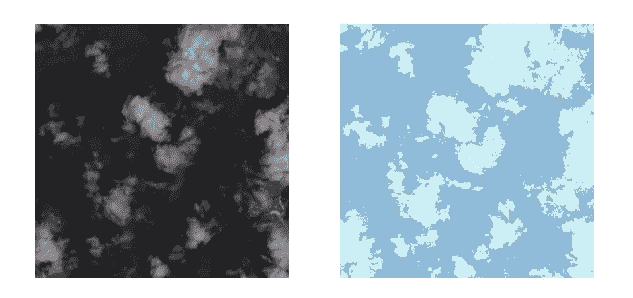

# 如何在 PyTorch 中为 Kaggle 的多波段卫星影像数据集从头开始创建自定义数据集/加载器

> 原文：<https://medium.com/analytics-vidhya/how-to-create-a-custom-dataset-loader-in-pytorch-from-scratch-for-multi-band-satellite-images-c5924e908edf?source=collection_archive---------1----------------------->

云分段

# 更新

关于课程**科学家 Python 入门** ( [可在 YouTube](https://youtu.be/oQaoj6LE5E4) ) 和其他类似文章的信息，请访问我的网站[cordmaur.carrd.co](http://cordmaur.carrd.co/)。

# 介绍