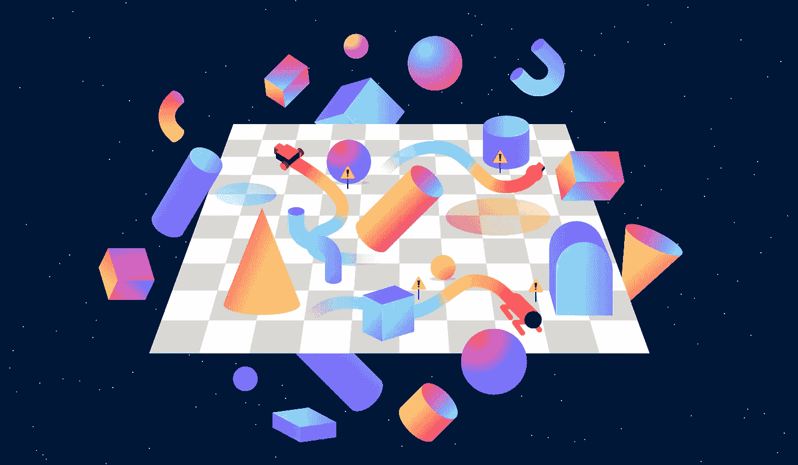

# 如何使用多个代理创建自定义的健身房环境

> 原文：<https://medium.com/analytics-vidhya/how-to-create-a-custom-gym-environment-with-multiple-agents-f368d13582ee?source=collection_archive---------1----------------------->

您想创建一个包含多个代理的自定义环境吗？你看过开放的人工智能视频，其中代理协作捉迷藏，并想做类似的事情？

OpenAI 的 **gym** 是迄今为止创建定制强化学习环境的最佳包。它附带了一些预构建的环境，但它也允许我们创建复杂的自定义环境…