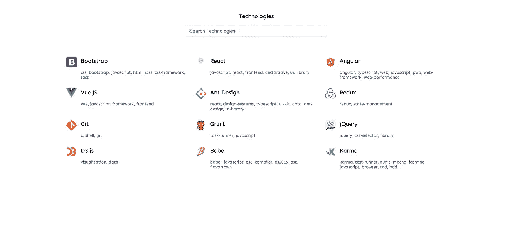
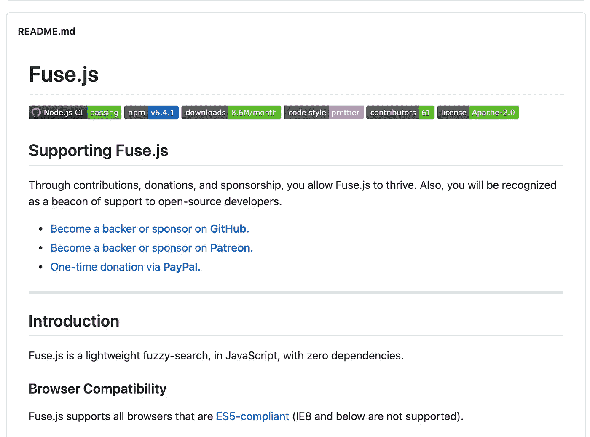

# 如何使用 Fuse 在 React JS 中创建模糊搜索？射流研究…

> 原文：<https://medium.com/analytics-vidhya/how-to-create-a-fuzzy-search-in-react-js-using-fuse-js-859f80345657?source=collection_archive---------3----------------------->


# **快速总结**

在实现客户端搜索时，一般我们会使用`indexOf`、`contains`等字符串比较方法。这些方法很好，但在现实世界中，人们可能会搜索到拼写错误、句子顺序错误等内容。**模糊搜索**将使我们能够解决那些问题。

# **模糊搜索**

模糊搜索或**近似字符串匹配**是一种字符串匹配技术，用于近似匹配字符串，而不是精确匹配。

好了，让我们构建应用程序。

我们将建立一个简单的页面，上面有一些文本和搜索框。



用于搜索演示的简单 React 应用程序

完整的源代码可以在[https://github.com/NaveenDA/fuzzy-search-react](https://github.com/NaveenDA/fuzzy-search-react)找到

# **常规搜索**

一般情况下，我们使用类似`indexOf,` `contains`等字符串比较法。这将很好地工作，但当我们搜索有拼写错误的单词时，它不会提供结果。

在这种情况下，我们搜索`name`和`tags`，将它们转换成小写，这样有助于搜索不区分大小写。


简单搜索示例

在这里，我试图搜索`react`和`rect`，但它只显示了`react`的结果，因为字符串比较方法以这种方式工作，为了使我们的搜索变得模糊，我们需要一个字符串比较算法

有大量的算法使它成为可能，甚至你不需要学习一个单一的使用它。

为了使搜索引擎成为模糊搜索引擎，我们将使用 [Fuse.js](https://fusejs.io/)



Fuse.js Github Repo

js 是一个强大的轻量级模糊搜索库，没有依赖性。

## 将 fuse.js 与搜索集成

令人惊讶的是，通过使一个非常小的将使我们的搜索成为一个模糊的搜索

```
const fuse = new Fuse(data, { 
     keys: ["name", "tags"]    
});    
const result = fuse.search(query);
```

结果对象包含过滤后的结果，甚至 fuse.js 为我们排序结果。

我们的最终结果


反应模糊搜索演示

请尝试这个演示[https://dq9ou.csb.app/](https://dq9ou.csb.app/)

# 外部链接

1.  Github 回购—[https://github.com/NaveenDA/fuzzy-search-react/](https://github.com/NaveenDA/fuzzy-search-react/)
2.  code sandbox—[https://dq9ou.csb.app/](https://dq9ou.csb.app/)
3.  fuse . js—[https://fusejs.io/](https://fusejs.io/)

**感谢坚持到最后:)**

附言👋嗨，我是纳文·达！如果你喜欢这个，可以考虑[在 Twitter](https://twitter.com/NaveenDA_) 上关注我，并与你的开发者朋友分享这个故事🐋😀