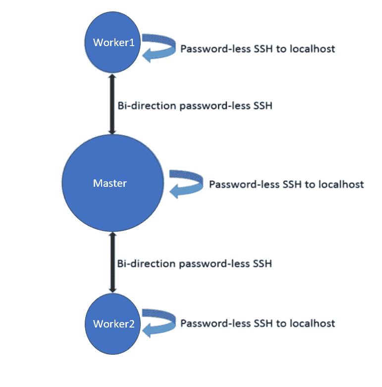

# 如何在 AWS 云中免费创建一个 Hadoop 集群？

> 原文：<https://medium.com/analytics-vidhya/how-to-create-a-hadoop-cluster-for-free-in-aws-cloud-a95154980b11?source=collection_archive---------4----------------------->

## 可以在 AWS 免费练习 Hadoop，Spark，Hive。

Hadoop 是一个在分布式环境中处理大数据的框架。 ***Hadoop 集群*** 是一组节点(比如虚拟机或容器)——一个主节点和剩余的工作节点——在它们之间分发数据并并行处理它们。

# 为什么要在 AWS 中创建集群？为什么不在您的本地机器上？

所有大数据框架和工具，如 ***Hadoop、Spark 和 Hive*** 都需要集群来运行。像脸书这样的大数据企业公司将在其集群中拥有数千个节点，因为要处理的数据量非常庞大。但是像你我这样的个体无法承受这么多的节点。事实上，我们仅限于本地机器。

为了学习和实践大数据工具，我们可以创建一个 ***独立*** 集群(一个只有一个节点的集群，该节点同时充当主节点和工作节点)并在其上运行程序。但是，根据您正在处理的数据的大小，您的本地机器可能会变得相当慢。

因此，在本文中，我将介绍如何减轻本地机器的负担，并利用 ***AWS 自由层 EC2 实例*** ***来创建一个 3 节点 Hadoop 集群*** 。


# 步骤 1:创建三个 AWS EC2 实例

*   创建 3 个 Amazon EC2 Ubuntu 实例。你可以在这里试用亚马逊免费等级
    [一年。](https://aws.amazon.com/free/)
*   当您在第 6 步创建实例时，确保您添加了一个类型为 ***的规则:所有流量，来源:任何地方。*** 如果不这样做，您将无法在 web 界面中检查集群的状态。
*   使用所需的安全组设置创建实例后，确保您可以访问机器。
*   如果使用 Linux 系统，使用*ssh–I PEM _ file path Ubuntu @ public _ IP*登录 EC2 实例。
*   如果您使用的是 Windows 系统，请按照此处的说明[使用 putty 访问 EC2。](https://dzone.com/articles/how-set-multi-node-hadoop)

# 步骤 2: Java 安装

*   使用以下命令安装 Java 并验证安装。

```
$ sudo apt update
$ sudo apt-get install default-jre
$ java -version
```

*   设置 JAVA_HOME 环境变量。如果需要详细步骤，请参考[此](https://askubuntu.com/questions/175514/how-to-set-java-home-for-java)链接。使用“echo $JAVA_HOME”命令验证设置。

# 步骤 3:设置无密码 SSH 登录

让我们为这 3 个节点命名，以避免混淆。

> 节点 1:工人 1
> 节点 2:工人 2
> 节点 3:主机

*   通过在两个节点上执行以下命令，生成公钥和私钥(在 Master 和 Worker1 上)。

```
ssh-keygen -t rsa -P '' -f ~/.ssh/id_rsa
```

*   将 Worker1 的文件 ***id_rsa.pub*** 的内容追加到 Master 中的文件 **authorized_keys** 中。
*   然后，将 Master 的文件 ***id_rsa.pub*** 的内容追加到 Worker1 中的文件 **authorized_keys** 中。
*   在 Worker1 上，测试您可以使用 Master 实例的私有和公共 ip 登录 Master 和 Worker1，而无需密码。

```
ssh <public-ip-of-master>
ssh <private-ip-of-master>
ssh <public-ip-of-worker1>
ssh <private-ip-of-worker1>
```

*   然后在 Master 上，测试您可以使用 Master 实例的私有和公共 ip 在没有密码的情况下登录 Master 和 Worker1。

```
ssh <public-ip-of-worker1>
ssh <private-ip-of-worker1>
ssh <public-ip-of-master>
ssh <private-ip-of-master>
```

*   完成上述步骤后，我们有了一个从主节点到 Worker1 的双向无密码 SSH 登录。
*   请重复这些步骤，在主服务器和工作服务器 2 之间建立相同的连接。集群的拓扑应该如下所示。



无密码 SSH 拓扑

# 步骤 4: Hadoop 安装和配置

*   **在所有 3 个节点上:**从[这里](http://apache.mirrors.lucidnetworks.net/hadoop/common/hadoop- 3.1.2/hadoop-3.1.2.tar.gz\)下载 Hadoop 并解压到相同的文件夹位置。

```
wget http://apache.mirrors.lucidnetworks.net/hadoop/common/hadoop-
3.1.2/hadoop-3.1.2.tar.gz
```

*   **在所有 3 个节点上:**在配置内的*“Hadoop installation folder/etc/Hadoop/core-site . XML”*文件中追加以下行。修改" *core-site.xml"* 文件中的主节点和工作节点，用你的主节点私有 ip 替换这个 ip。

```
<property>
<name>fs.default.name</name>
<value>hdfs://192.168.0.1:54310</value>
</property>
```

*   **仅在主节点上:**清空文件*Hadoop installation folder/etc/Hadoop/slaves*的内容，添加所有 workers 和主节点的私有 ip。这一步给出了可以作为 Hadoop master 的工作者的所有机器的列表。
    注意:您必须添加所有 3 个节点的 IP(包括主节点)。
*   **在所有 3 个节点上**:记得在*Hadoop installation folder/etc/Hadoop/Hadoop-env . sh*中设置 JAVA_HOME
*   **仅在主节点上:**在 *HadoopFolder/bin/* 文件夹中运行下面一行来格式化 HDFS 系统。

```
./hadoop namenode -format
```

*   **仅在主节点上:**在 *HadoopFolder/sbin/* 文件夹中运行以下行来启动您的集群。这需要一段时间。

```
./start-dfs.sh
```

*   通过在浏览器中输入“ *master_ public_ip:50070* ”来检查 Hadoop 集群的状态。如果你到达一个带有“ *Namenode 信息*的网页，你已经成功启动了 Hadoop。您应该列出了 3 个活动节点。
*   如果您在设置 Hadoop 时出现错误，建议删除 master 和所有 workers 中 */tmp* 中
    所有与 Hadoop 相关的文件。然后格式化节点和 *start-dfs.sh* 。

# 步骤 5: Spark 安装和配置

在所有节点上从[这里](https://downloads.apache.org/spark/spark-3.0.0-preview2/spark-3.0.0-preview2-bin-hadoop3.2.tgz)下载 Spark，并将其解压缩到相同的文件路径。

*   **仅在主节点:**在*spark folder/conf/slaves.template .*中添加 worker 和 master 节点的私有 ip，然后将 slaves . template 重命名为/slaves 即可生效。
*   **仅在主节点上:**在 *SparkFolder/sbin/* 文件夹中运行下面一行来启动 Spark master。

```
./start-all.sh
```

*   **仅在主节点:**在浏览器中输入*“master _ public _ IP:8080”*检查 Spark 主节点的状态。如果你进入一个网页*【星火大师】*那么你的大师已经开始了。
*   Spark Web Master UI 中应该列出了 3 个 workers。

# 感谢阅读！

如果你喜欢我的工作，想支持我…

1.  支持我的最好方式就是在[媒体](/@vinodhini-sd)上关注我。
2.  我在 LinkedIn 上分享关于#dataengineering #ml #mlops 的技巧、诀窍和见解。
3.  请随意鼓掌，这样我就知道这篇文章对你有多大帮助了。