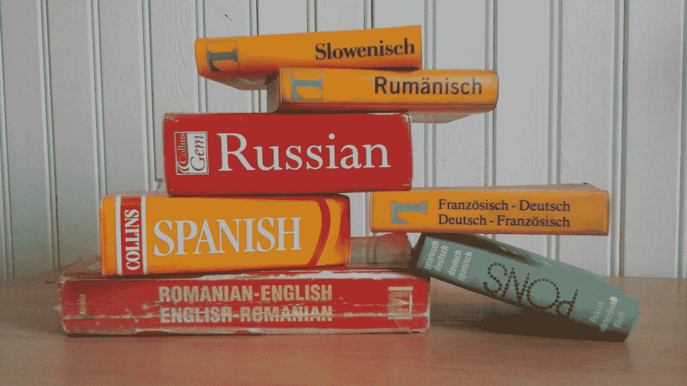

# 如何使用管道创建多语言词典

> 原文：<https://medium.com/analytics-vidhya/how-to-create-a-language-dictionary-92c654d5c78f?source=collection_archive---------24----------------------->

奈伊玛娅·阿利亚·斯莫尔* naeemahaz@gmail.com

语言词典是使用 python 中的 NLP 技术检查文档中拼写错误的正确方法。怎么会？使用模块 [recordlinkage](https://recordlinkage.readthedocs.io/en/latest/) 创建一个比较函数，或者使用 Jaccard 相似性方程编写一个函数。但这是以后的事了。

**请导入:**

> % %时间
> 
> %matplotlib 内联
> 
> 从 matplotlib 导入 pyplot 作为 plt
> 
> 导入时间
> 
> 随机导入 re
> 
> 随机导入
> 
> 导入字符串
> 
> 导入系统、类型、操作系统
> 
> 将 numpy 作为 np 导入
> 
> 进口熊猫作为 pd
> 
> 从 textblob 导入 Word
> 
> 从 nltk.tag 导入 pos_tag
> 
> 从 nltk 导入 word_tokenize
> 
> 从 textblob.taggers 导入 PatternTagger
> 
> 从 textblob.decorators 导入需要 _nltk_corpus
> 
> 从 textblob.utils 导入 tree2str，filter _ important
> 
> 从 textblob.base 导入 BaseNPExtractor
> 
> 从 textblob.wordnet 导入谓词
> 
> 从 textblob 导入 Word
> 
> 从空间导入显示
> 
> 导入 nltk
> 
> 从 nltk 导入单词 _ 标记化，位置 _ 标记，ne _ 块
> 
> 从 nltk 导入 RegexpParser
> 
> 从 nltk 导入树
> 
> 从 nltk.corpus 导入停用词
> 
> 从 nltk.stem.snowball 导入 SnowballStemmer
> 
> 从 nltk.tokenize 导入 RegexpTokenizer
> 
> 从 nltk.stem 导入 WordNetLemmatizer，PorterStemmer
> 
> 从 nltk.util 导入 ngrams
> 
> 从 nltk.stem 导入 PorterStemmer
> 
> 词干= PorterStemmer()
> 
> 从 nltk 导入三元模型
> 
> nltk.download('punkt ')
> 
> nltk.download('wordnet ')
> 
> stop = stopwords.words('英语')
> 
> 导入核心网
> 
> nlp = en_core_web_sm.load()
> 
> 从 spacy.language 导入语言
> 
> 从 spacy.pipeline 导入实体规则
> 
> ruler = EntityRuler(nlp)
> 
> nlp.add_pipe(标尺)
> 
> 从翻译导入翻译器
> 
> 从 spacy.lang.en 导入英语
> 
> 从 spacy.matcher 导入短语匹配器
> 
> 从 spacy . Token 导入文档，Span，Token
> 
> 从自动更正导入拼写器
> 
> 拼写者
> 
> 从文本 Blob 导入文本 blob
> 
> 进口空间

**生成单词列表:**

> 从 nltk.corpus 导入单词
> 
> word_list = words.words()
> 
> #保存修改文件。将文件保存到桌面。这是在 python 中修改文档时保存检查点的最佳方式。
> 
> word _ list . to _ CSV(r ' c:\ Users \ XXXXXXXX \ Desktop \ dict words lang . CSV '，index = False，header=True)

将文件保存在桌面上，然后上传到 Jupyter 笔记本或 Jupyter 实验室。将单词列表导入到 python 代码中。

让我们准备单词表。文本处理、单词标记、词汇化、位置、标签、dep、alpha 和停用词。

**单词标记:**将文本分割成单词、标点符号等的过程

**单词词条化:**是将待分析单词的词尾变化形式组合在一起的过程，通过单词的词条或词典形式来识别

**词类定位:**是将词类归类到词类中的过程

**单词标签:**是为单词分配语言信息的过程

**单词依存:**是分配句法依存标签的过程，这些标签描述了像主语或宾语这样的单个标记之间的关系

**单词 Alpha:** 识别单词是否是 Alpha 的过程

**停字:**识别停字的过程，例如(是，不是，这个)

**你可以这样做是空间:**

> % %时间
> 
> 令牌= []
> 
> 引理= []
> 
> pos = []
> 
> 标签= []
> 
> dep = []
> 
> alpha = []
> 
> stop = []
> 
> 对于 nlp.pipe 中的 doc(word list[' words ']。astype('unicode ')。值，batch_size=100，n_threads=4):
> 
> 如果文档被解析:
> 
> tokens . append([文档中 n 的 n . text])
> 
> lemma . append([n . lemma _ for n in doc])
> 
> 位置附加([n.pos_ for n in doc])
> 
> tag.append([n.tag_ for n in doc])
> 
> dep.append([n.dep_ for n in doc])
> 
> alpha . append([n . is _ alpha for n in doc])
> 
> stop . append([n . is _ stop for n in doc])
> 
> 否则:
> 
> #我们希望确保解析结果的列表具有
> 
> #原始数据帧的条目数相同，所以添加一些
> 
> #空白以防解析失败
> 
> tokens.append(无)
> 
> lemma.append(无)
> 
> 位置附加(无)
> 
> tag.append(无)
> 
> 附属附加(无)
> 
> alpha 附加(无)
> 
> stop.append(无)
> 
> 单词列表['标记'] =标记
> 
> 单词表['lemma'] = lemma
> 
> 单词表['pos'] = pos
> 
> 单词表['标签'] =标签
> 
> 单词表['dep'] = dep
> 
> 单词列表['alpha'] = alpha
> 
> 单词表['stop'] =停止

这花了我 1 分 40 秒来完成。*注意:如果您使用这个代码来分析一个文档，它将花费更长的时间。*

我喜欢做的是，把单词按列分组。

**获取形容词:**

> def get _ 形容词(文本):
> 
> blob = TextBlob(文本)
> 
> 返回 blob.tags 中的 word for (word，tag)if tag . starts with(" JJ ")]
> 
> 单词表['形容词'] =单词表['单词']。应用(get _ 形容词)

**获取动词:**

> def get_verbs(文本):
> 
> blob = TextBlob(文本)
> 
> 返回 blob.tags 中的 word for (word，tag)if tag . starts with(" VB ")]
> 
> 单词表['动词'] =单词表['单词']。应用(get_verbs)

**获取副词:**

> def get _ 副词(正文):
> 
> blob = TextBlob(文本)
> 
> 返回 blob.tags 中的 word for (word，tag)if tag . starts with(" RB ")]
> 
> 单词表['副词'] =单词表['单词']。应用(get _ 副词)

**获取名词:**

> def get _ 名词(文本):
> 
> blob = TextBlob(文本)
> 
> 返回 blob.tags 中的 word for (word，tag)if tag . starts with(" NN ")]
> 
> 单词列表['名词'] =单词列表['单词']。应用(get _ 名词)

**词情:**

理解一个词是否定的、肯定的还是中性的

> 单词表[['极性'，'主观性']] =单词表['单词']。应用(lambda 单词:pd。Series(TextBlob(words)。感悟))

**要清洗的字列:**

下面的代码将删除单词周围的括号。

> 单词列表['xxxx'] =单词列表['xxxx']。应用(λx:“，”。如果 isinstance(x，list) else x ),则联接(x)

翻译单词列表

你应该在第一行使用的是 **%%time** ，然后是翻译成单词的代码。关键字 **%%time** 将记录代码运行所需的时间。在我的系统上，翻译成西班牙语花了 4 小时 5 分 25 秒。我会使用 TextBlob 作为翻译。当你想正确翻译单词时，谷歌翻译是非常好的，但它并不总是工作，因为你需要与服务器连接，而服务器可能会关闭。

要获取语言代码，请前往[语言代码](https://cloud.google.com/translate/docs/languages)

> % %时间
> 
> translator = Translator()
> 
> word list[" Spanish words "]= word list[" words "]。map(lambda x:translator . translate(x，src="en "，dest="es ")。正文)

您可以创建一个翻译管道，以便将多种语言作为一个系列进行翻译:

> Spanish me = Translator(to _ lang = " es ")
> 
> French me = Translator(to _ lang = " fr ")
> 
> Italian me = Translator(to _ lang = " it ")
> 
> german me = Translator(to _ lang = " de ")
> 
> hindime = Translator(to_lang="hi ")
> 
> Chinese me = Translator(to _ lang = " zh ")
> 
> japanme = Translator(to_lang="ja ")
> 
> korenme = Translator(to_lang="ko ")
> 
> taglome = Translator(to_lang="tl ")
> 
> viteme = Translator(to_lang="vi ")
> 
> thaime = Translator(to_lang="th ")
> 
> russiame = Translator(to _ lang = " ru ")
> 
> 南非荷兰语= Translator(to_lang="af ")
> 
> % %时间
> 
> spanishme = []
> 
> frenchme = []
> 
> italianme = []
> 
> germanme = []
> 
> hindime = []
> 
> chineseme = []
> 
> japanme = []
> 
> korenme = []
> 
> 泰格乐= []
> 
> viteme = []
> 
> thaime = []
> 
> russiame = []
> 
> 南非荷兰语= []
> 
> 对于 nlp.pipe 中的 doc(word list[' words ']。astype('unicode ')。值，batch_size=100，n_threads=4):
> 
> Spanish me . append([Spanish me for n in doc])
> 
> French me . append([French me for n in doc])
> 
> Italian me . append([文档中 n 的 italianme)
> 
> german me . append([doc 中 n 的 germanme)
> 
> hindime . append([文档中 n 的 hindime)
> 
> Chinese me . append([Chinese me for n in doc])
> 
> Japan me . append([doc 中 n 的 japanme)
> 
> taglome . append([文档中 n 的 taglome)
> 
> vite me . append([vite me for n in doc])
> 
> thaime . append([thaime for n in doc])
> 
> russiame . append([doc 中 n 的 russiame)
> 
> Afrika ansme . append([文档中 n 的 afrikaansme)
> 
> word list[' spainish words ']= Spanish me
> 
> 单词表['法语单词'] =法语
> 
> wordlist[' Italian words ']= Italian me
> 
> 单词表
> 
> 单词列表['hindiwords'] = hindime
> 
> 单词表['中文单词'] =中文名称
> 
> wordlist[' japanh words ']= japanme
> 
> 单词表['koreanwords'] = korenme
> 
> 单词表
> 
> wordlist[' vittnamesewords ']= vite me
> 
> wordlist['thaiwords'] = thaime
> 
> word list[' Russian words ']= russiame
> 
> 单词表['南非荷兰语单词'] =南非荷兰语

根据您的系统，这可能需要一段时间来运行。对我的计算机系统来说，要把所有这些语言转换过来，至少需要 52 个小时。我给你的建议是，使用上面的代码，翻译两种语言，并在代码中添加一个计时器。从时间上，你就知道代码会运行多久。

完成后，将文件保存在桌面上。

> word _ list . to _ CSV(r ' c:\ Users \ XXXXXXXX \ Desktop \ dictwordslangnew . CSV '，index = False，header=True)