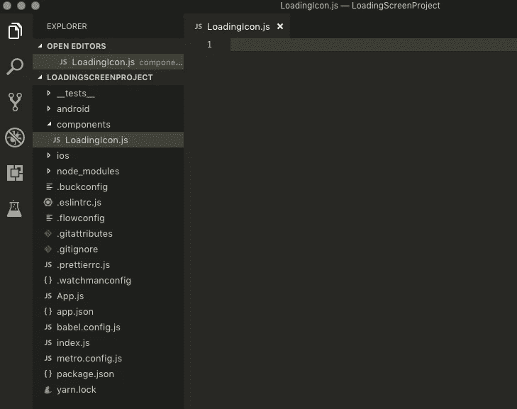
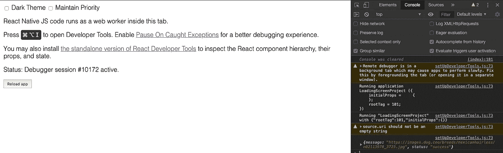

# 如何为你的 React 本地应用创建一个加载图标

> 原文：<https://medium.com/analytics-vidhya/how-to-create-a-loading-icon-for-your-react-native-app-20d50cbf5dc3?source=collection_archive---------1----------------------->

大家好，现在是周日下午，此时此刻英国天气晴朗但忧郁…所以我认为写一个关于如何为你的 React 本地应用创建一个简单的加载屏幕的教程会很酷。我们开始吧！


《思想者》雕像造型

您首先要做的是创建一个新的 React 本地项目。因此，打开您的终端，导航到您的计算机中您希望项目所在的位置/文件夹。使用下面的命令创建 React 本地项目。

```
react-native init MyAwesomeProjectNow
```

现在，在你选择的文本编辑器中打开这个项目，我喜欢使用 Visual Studio 代码，React Native 或 React 的一个众所周知的做法是有一个简洁的文件夹结构，因为这只是一个小教程，我们不会太担心，但是，在你的项目的根目录下创建一个名为“components”的文件夹，并在其中创建一个名为“LoadingIcon”的 js 文件。

所以现在你的项目应该看起来像下面的截图。



您需要输入到“LoadingIcon”文件中的前两段代码如下。

```
import React from 'react';import { ActivityIndicator } from 'react-native';
```

“从 react 导入 React”——用于将 React 的功能导入文件。

“从 react-native 导入{ ActivityIndicator }”—导入显示循环加载指示器动画的“activity indicator”组件。你可以用不同的颜色和尺寸定制这个动画。

因为我们不会在这个文件中使用 state，所以我们不需要创建一个类，而是创建一个等于“ActivityIndicator”组件的变量，所以它被称为“无状态组件”。下面是一个例子。

```
*const* LoadingIcon = ({ *isIconAnimating* }) *=>* <*ActivityIndicator* size="large" color="#0000ff" animating={*isIconAnimating*} />;
```

上面我已经创建了一个名为“LoadingIcon”的变量，并析构了参数，这样我就不必在组件中引用一个道具之前输入“props”了。

我传入了一个“ *isIconAnimating* 的属性，它等于“ActivityIndicator”组件中的引用方法“Animating”。“动画”是“真”或“假”值，如果为真，活动指示器将显示在屏幕上，但是，如果为假，活动指示器将不显示。

大小方法可以是“小”或“大”或者可以使用数字，但是，使用数字仅在 Android 上受支持。我更喜欢用“大”。

颜色方法是不言自明的，只定义活动指示器的颜色。

下一步是使用下面的代码简单地导出组件。

```
export default LoadingIcon;
```

因为常量“LoadingIcon”是我们导出的唯一函数，所以我们可以在“export”后使用“default”关键字。

下一步是将“LoadingIcon”函数导入到另一个文件中，并在组件的加载上显示加载图标。

找到名为“App.js”的组件，它应该包含应用程序的所有默认文本。现在使用下面的代码将你的加载图标导入到这个文件中。

```
import LoadingIcon from './components/LoadingIcon';
```

此外，您应该放弃默认的“App”常量变量和其中的代码，现在用下面的代码替换它。

```
*class* App extends React.*Component*{*constructor*(*props*){super(props);}render(){return(<*View*><*View* style={{justifyContent:'center'}}><*Text* style={{textAlign:'center',color:'black'}}>This is my home page!</*Text*></*View*></*View*>)}
}
```

此加载图标的主要用途之一是在数据等待加载到屏幕上时显示图标，供用户查看，这可能来自网站、数据库或 API。对于今天的教程，我将使用一个 API 作为例子来显示加载图标。这个 api 是完全免费使用的，你不需要一个 API 密匙，这个 API 可以获取我最喜欢的动物之一的随机图像，除了火烈鸟和骆驼…狗！

我们将获取一只狗的随机图像，因此您首先需要从“react-native”导入“image”组件。因此，您的 react-native 导入现在应该如下所示。

```
import {SafeAreaView,StyleSheet,ScrollView,View,Text,StatusBar,Image} from 'react-native';
```

接下来将状态添加到组件中(您需要将它添加到构造函数标记中)，您将需要两个状态，一个用于显示图标，另一个用于显示从 API 返回到 image 组件中的图像。下面是该状态的一个示例。

```
this.state = {iconAnimating:true,imageURL:''}
```

接下来添加生命周期组件方法“componentDidMount”。这种生命周期方法是在组件挂载后直接调用/运行的，它只是下面的代码。

```
componentDidMount(){}
```

这是我们将编写代码从我们的 API 获取数据的地方。我们将使用“fetch”来检索这些数据，然后将其转换成 json。在函数的“success”部分中，我们将 iconAnimating 的状态设置为 false，这是因为我们希望图标在组件加载时显示，并且只在我们成功从 API 中检索数据时隐藏，因此我们只会看到加载图标几秒钟，如果我们检索 10，000 条记录，我们会看到更长时间。

此外，我们将状态“imageURL”设置为“jsonResponse.message ”,因为“jsonResponse”是我设置的参数，它将包含从 API 成功返回的数据。该消息是用于访问返回的图像 url 的密钥。

```
fetch('https://dog.ceo/api/breeds/image/random').then(*response=>*response.json()).then(*jsonResponse=>*{*console*.log(jsonResponse);this.setState({iconAnimating:false,imageURL:jsonResponse.message});}).catch(*error=>*{*console*.log("Error loading dog data: " + error);})
```

如果你想看到“console.log”语句，那么你可以打开你的应用程序的模拟器，方法是在你正在使用的代码编辑器的终端中输入命令“react-native run-ios ”,然后当它打开时，在你的 mac 上按下“cmd”和“D ”,然后单击“debugging”或“start debugging ”,这将在你的默认浏览器上打开一个标签，你可以在那里检查控制台结果。



此外，因为我们现在已经编写了检索数据的方法，所以我们需要使用 image 组件来显示数据。下面是一个使用图像组件的例子。

```
<*Image* source={{uri:this.state.imageURL}} style={{width:350,height:300}}/>
```

我们将宽度设置为 350，高度设置为 300。此外，我们将图像源设置为状态值“imageURL ”,如果您还记得，我们之前将此状态设置为从 API 返回的 URL，因此此 URL 将显示在图像中，加载图标将在图像显示在模拟器上之前显示。

下面是我在模拟器上加载应用程序时得到的一个例子！


希望你从本教程中学到了一些东西，一如既往，我欢迎反馈和/或批评，因为我总是希望提高我的编码和文章写作能力。感谢您阅读本文，祝您愉快:)

如果你愿意，你可以通过这个链接支持——[buymeacoff.ee/angrycoder95](http://buymeacoff.ee/angrycoder95)