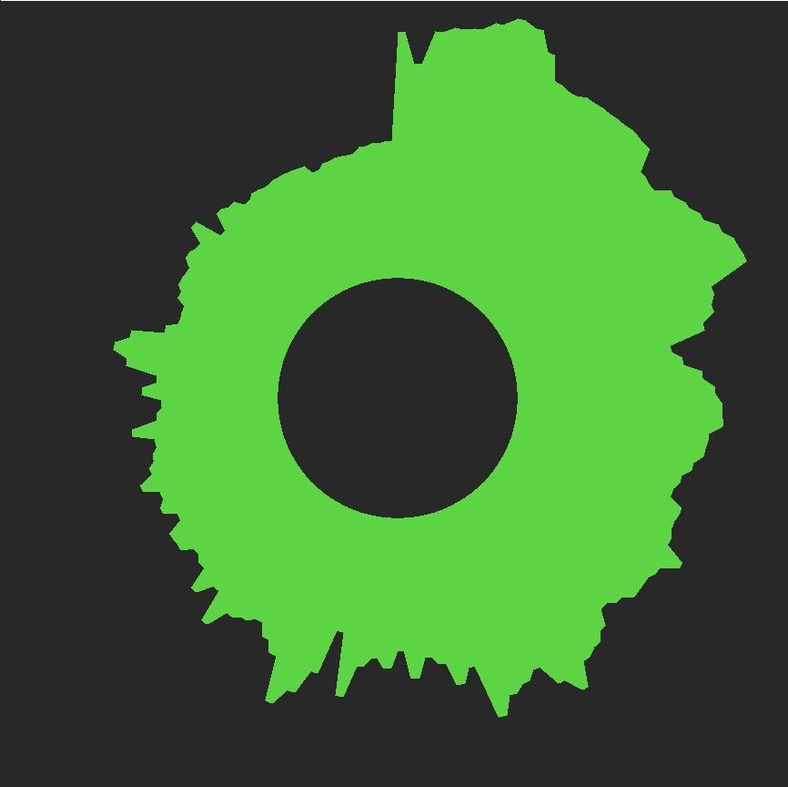
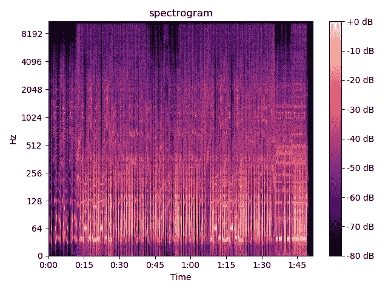

# 如何创建音乐可视化工具

> 原文：<https://medium.com/analytics-vidhya/how-to-create-a-music-visualizer-7fad401f5a69?source=collection_archive---------1----------------------->

我们都喜欢音乐。音乐可以是任何形式和种类，每个人都有不同的品味。共同的因素是我们都可以听音乐，但为什么只有当我们也能看到音乐时才听音乐呢？

这篇文章是关于我制作音乐可视化工具的经验。本文还将解释如何创建可视化工具。

[https://gitlab.com/avirzayev/music-visualizer](https://gitlab.com/avirzayev/music-visualizer)



# 怎样才能把音乐形象化？

我们需要知道音乐是如何组成的，以及如何将这些部分形象化。音乐是声音的组合。声音是我们的耳朵探测到的频繁振动。振动由频率和振幅——速度和响度——来定义。

最简单的方法就是画一排条形。每个条形代表一个频率。当音乐继续时，这些小节会上下移动，这取决于频率的幅度。

# 用 Python 实现

在开始编码之前，您需要安装一个图形库和一个声音分析器库。在我的项目中，我使用了 Pygame(图形)和 Librosa(声音)。

Librosa 有非常有用的功能，可以帮助我们分析声音。文档:【https://librosa.github.io/librosa/ 

下面是一段代码，它返回一个对应于某个时间的频率幅度的二维数组:

```
# getting information from the file
time_series, sample_rate = librosa.load(filename)# getting a matrix which contains amplitude values according to frequency and time indexes
stft = np.abs(librosa.stft(time_series, hop_length=512, n_fft=2048*4))# converting the matrix to decibel matrix
spectrogram = librosa.amplitude_to_db(stft, ref=np.max)
```

librosa.load()正在读取给定的文件，并保存有关该文件的信息以备后用。mple_rate 是每个周期采样的数量。time_series 是一个一维数组，表示获取每个样本的时间。

Libros.stft()返回一个包含频率和时间的二维数组。然后你可以看到我把这个数组从振幅转换成分贝。除非你想用分贝单位，否则这一步是不必要的。

> **短时傅立叶变换** ( **STFT** )，是一种傅立叶相关变换，用于确定随时间变化的信号局部的正弦频率和相位内容。(维基百科)

hop_length 是帧之间的样本数。n_fft 是每帧的样本数。我发现当增加 n_fft 时，结果变得更精确，我将其设置为默认值的 4 倍。

您还可以使用 matplotlib 查看 STFT 的结果:

```
librosa.display.specshow(self.spectrogram,
                         y_axis='log', x_axis='time')plt.title('Your title')
plt.colorbar(format='%+2.0f dB')
plt.tight_layout()
plt.show()
```



现在你可以看到每个时间和频率的分贝。0db 是最大声的。

您可以使用索引来访问数组的值。但是我们应该根据它的时间和频率来选择值。这段代码可能有所帮助:

```
frequencies = librosa.core.fft_frequencies(n_fft=2048*4)  # getting an array of frequencies# getting an array of time periodic
times = librosa.core.frames_to_time(np.arange(self.spectrogram.shape[1]), sr=sample_rate, hop_length=512, n_fft=2048*4)self.time_index_ratio = len(times)/times[len(times) - 1]self.frequencies_index_ratio = len(frequencies)/frequencies[len(frequencies)-1]
```

我把二维数组分成几个数组，这些数组表示某些索引的时间或频率。采样率是恒定的。因此，我们可以在时间和指数之间建立一个比率，频率也是如此。然后，我们把时间和频率乘以比率，我们得到指数:

```
def get_decibel(self, target_time, freq):return spectrogram[int(freq*frequencies_index_ratio)][int(target_time*self.time_index_ratio)]
```

现在我们只需要用我在开始提到的“移动条”来表示它。

创建一个代表我们的频率栏的类:

```
class AudioBar:def __init__(self, x, y, freq, color, width=50, min_height=10, max_height=100, min_decibel=-80, max_decibel=0):self.x, self.y, self.freq = x, y, freqself.color = colorself.width, self.min_height, self.max_height = width, min_height, max_heightself.height = min_heightself.min_decibel, self.max_decibel = min_decibel, max_decibelself.__decibel_height_ratio = (self.max_height - self.min_height)/(self.max_decibel - self.min_decibel)def update(self, dt, decibel):desired_height = decibel * self.__decibel_height_ratio + self.max_heightspeed = (desired_height - self.height)/0.1self.height += speed * dtself.height = clamp(self.min_height, self.max_height, self.height)def render(self, screen):pygame.draw.rect(screen, self.color, (self.x, self.y + self.max_height - self.height, self.width, self.height))
```

我创建了 x，y 坐标，条形的频率，颜色，以及高度和分贝的范围。我定义了一个高度和分贝之间的比率，以确定后来酒吧的高度。在 update()方法中，我获得了与当前分贝相对应的期望的条形高度，并设置了条形增长的速度。

```
bars = []
frequencies = np.arange(100, 8000, 100)for c in frequencies:
    bars.append(AudioBar(x, 300, c, (255, 0, 0), max_height=400, width=width))
    x += width
```

在这里，我创建了一个数组来保存条形。我创建了 80 个从 100Hz 到 8000Hz 的小节，步长为 100，并将它们添加到数组中。

然后，您只需运行一个 Pygame 窗口并绘制条形图:

```
t = pygame.time.get_ticks()
getTicksLastFrame = tpygame.mixer.music.load(filename)
pygame.mixer.music.play(0)# Run until the user asks to quit
running = True
while running:t = pygame.time.get_ticks()
    deltaTime = (t - getTicksLastFrame) / 1000.0
    getTicksLastFrame = t# Did the user click the window close button?
    for event in pygame.event.get():
        if event.type == pygame.QUIT:
            running = False# Fill the background with white
    screen.fill((255, 255, 255))for b in bars:
        b.update(deltaTime, get_decibel(pygame.mixer.music.get_pos()/1000.0, b.freq))
        b.render(screen)# Flip the display
    pygame.display.flip()# Done! Time to quit.
pygame.quit()
```

注意，我还使用 pygame.mixer 来播放音乐，并使用 pygame.mixer.music.get_pos()来访问时间

你做了一个音乐可视化工具！你可以在这里找到完整的代码:[https://git lab . com/avirzayev/medium-audio-visualizer-code/-/blob/master/main . py](https://gitlab.com/avirzayev/medium-audio-visualizer-code/-/blob/master/main.py)

# 扩展您的项目

本文介绍了创建简单音乐可视化工具的基础知识。您可以使用这个小例子来创建令人惊叹的可视化工具。

首先，通过用类包装代码来简化代码。创建一个用于音频分析的类会使代码更整洁，并帮助您避免再次编写相同的代码。

其次，你可以尝试用另一种方式来可视化你的代码。你可以把它们排成一个圆圈，而不是画一排横条。您还可以创建一些影响可视化工具外观的触发器。例如，您可以创建一个低音触发器，当有一定量的低音时，您可以让条形改变颜色。

总而言之，你可以创建奇妙的可视化工具，你可以用这篇文章来指导你。编码快乐！