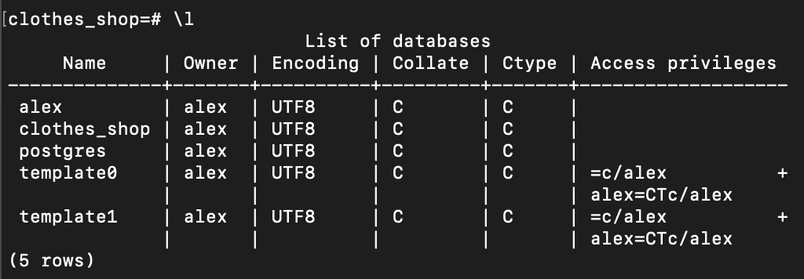
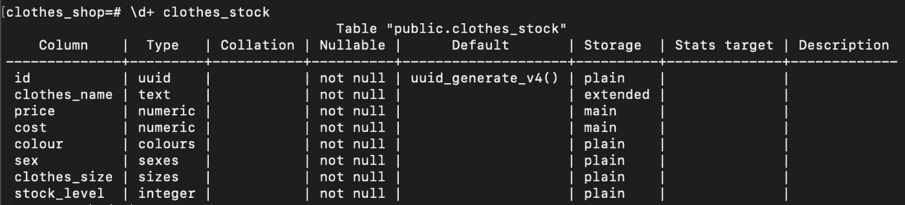
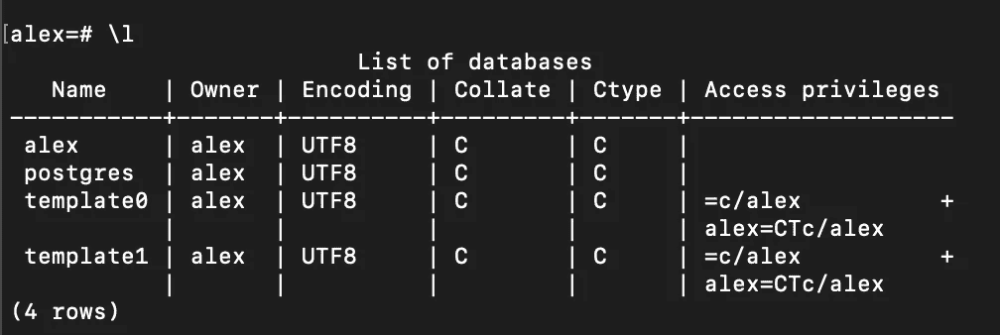

# 如何创建 Postgres 数据库

> 原文：<https://medium.com/analytics-vidhya/how-to-create-a-postgres-database-394b362abfbe?source=collection_archive---------30----------------------->


你好，你好，我的工程师同事们！

我最近整理了一个关于如何构建可伸缩 Python 应用程序的每周教程系列。第一集可以看这里:[https://youtu.be/0NcZjcGgkpE](https://youtu.be/0NcZjcGgkpE)

这篇文章是为了支持第 2 集，我们将为 Python 应用程序创建一个 Postgres 数据库。

我们将执行以下操作来设置数据库:

*   安装 postgres
*   创建 SQL 脚本:
*   创建一个“服装店”数据库
*   创建一个“衣服 _ 库存”表
*   为衣服类型、颜色、性别和尺寸创建一个类型
*   创建回滚 SQL 脚本
*   运行脚本并创建数据库

## **安装 Postgres**

如果你使用的是 Mac，最简单的方法就是使用自制软件(参见[https://brew.sh/](https://brew.sh/))一旦你在终端上安装了自制软件，你就可以运行下面的命令来安装 Postgres:

```
brew install postgresqlbrew services start postgres
```

然后，您应该能够在终端中运行`psql`

## 创建 SQL 脚本

对于这个项目，我们正在创建一个服装店，所以我们需要跟踪商店的库存，下面是我们将运行的脚本(ClothesShop.sql ):

```
CREATE DATABASE clothes_shop;

\c clothes_shop

CREATE TYPE colours AS ENUM ('blue', 'green', 'red', 'yellow');
CREATE TYPE sexes AS ENUM ('male', 'female');
CREATE TYPE sizes AS ENUM ('small', 'medium', 'large');

CREATE EXTENSION IF NOT EXISTS "uuid-ossp";

CREATE TABLE clothes_stock (
    id UUID NOT NULL DEFAULT uuid_generate_v4(),
    clothes_name TEXT NOT NULL,
    price *NUMERIC* NOT NULL,
    cost *NUMERIC* NOT NULL,
    colour colours NOT NULL,
    sex sexes NOT NULL,
    clothes_size sizes NOT NULL,
    stock_level *int* NOT NULL
);

INSERT INTO clothes_stock (clothes_name, price, cost, colour, sex, clothes_size, stock_level)
VALUES ('Red T-shirt', 1.99, 0.99, 'red', 'male', 'small', 100);
```

首先，我们创建名为“服装商店”的数据库。

然后，我们需要连接到数据库，以创建类型的颜色，性别和大小。

我们需要创建扩展“uuid-ossp ”,这样我们就可以使用函数 uuid_generate_v4()来自动生成我们的衣服库存 id。

然后我们创建“衣服库存”表并插入第一个商品。

您可以在终端中运行以下脚本:

```
psql -f ClothesShop.sql
```

现在，您应该能够看到新的数据库和表了。

在您的终端中键入以下内容:

```
psql clothes_shop
```

然后:

```
\l
```



数据库衣服 _ 商店已经创建

您可以使用以下代码查看表“衣服 _ 库存”的描述:

```
\d+ clothes_stock
```

然后，您应该会看到“衣服 _ 库存”表的描述:



## 创建回滚

最佳实践(除了对您的 SQL 脚本进行版本控制之外)是创建一个回滚脚本，这样如果出现问题，您可以回滚您的更改。在这个项目中，我们只有一个非常简单的数据库和表设置。

如果我们想要删除我们刚刚创建的内容，那么我们需要运行以下脚本(ClothesShopRollback.sql):

```
\c clothes_shop

DROP TABLE clothes_stock;

DROP TYPE IF EXISTS colours;
DROP TYPE IF EXISTS sexes;
DROP TYPE IF EXISTS sizes;

\c postgres

DROP DATABASE clothes_shop;
```

脚本中的第一步是连接到“衣服商店”数据库，然后我们希望以与创建它们相反的顺序删除它们(因此有术语回滚)。

我们删除表“衣服 _ 库存”(以及其中的任何商品)，然后删除我们为这个数据库创建的类型。

最后，我们切换到另一个数据库来删除数据库“衣服 _ 商店”,因为您不能删除当前连接的数据库。

要回滚脚本，请在终端中运行以下命令:

```
psql -f ClothesShopRollback.sql
```

您现在应该看不到数据库了:

在您的终端中运行以下命令:

```
psql
```

然后运行:

```
\l
```

您现在应该看到您的数据库不再存在:



数据库衣服商店不再存在

这就是本教程，我希望你觉得有用。如果您有任何问题，请随意评论，我会在下一个问题上与您联系！