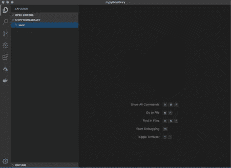
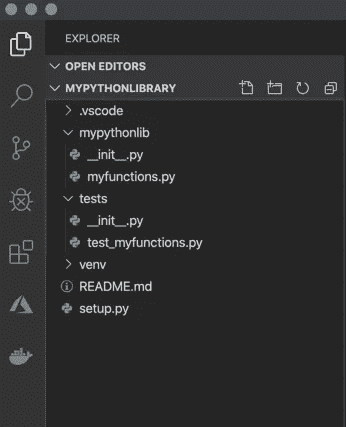

# 如何创建 Python 库

> 原文：<https://medium.com/analytics-vidhya/how-to-create-a-python-library-7d5aea80cc3f?source=collection_archive---------0----------------------->


照片由[伊尼基·德尔奥尔莫](https://unsplash.com/@inakihxz?utm_source=medium&utm_medium=referral)在 [Unsplash](https://unsplash.com?utm_source=medium&utm_medium=referral) 上拍摄

有没有想过创建一个 Python 库，不管是为你的团队工作还是为一些在线开源项目？在这个博客中，你将学会如何！

当您使用相同的工具时，本教程最容易理解，但是您也可以使用不同的工具。

本教程使用的工具有:
- Linux 命令提示符
- Visual Studio 代码

**第一步:创建一个目录，在其中放置你的库** 打开你的命令提示符，创建一个文件夹，在其中你将创建你的 Python 库。

记住:
——用`pwd`可以看到你现在的工作目录。
-使用`ls`您可以列出目录中的文件夹和文件。
-使用`cd <path>`你可以改变你当前所在的目录。
-使用`mkdir <folder>`您可以在工作目录中创建一个新文件夹。

在我的例子中，我将使用的文件夹是`mypythonlibrary`。将当前工作目录更改为您的文件夹。

**第二步:为你的文件夹创建一个虚拟环境** 在开始你的项目时，创建一个虚拟环境来封装你的项目总是一个好主意。虚拟环境由某个 Python 版本和一些库组成。

虚拟环境可以防止以后遇到依赖性问题。例如，在旧的项目中，您可能已经使用了旧版本的`numpy`库。一些曾经工作得很好的旧代码，一旦你更新了它的版本，就可能停止工作。也许`numpy`的某些部分不再与你程序的其他部分兼容。创建虚拟环境可以防止这种情况。当您与其他人协作，并且您希望确保您的应用程序在他们的计算机上运行时，它们也很有用，反之亦然。

(确保将当前工作目录更改为将要创建 Python 库的文件夹(`cd <path/to/folder>`)。)

输入
`> python3 -m venv venv`创建一个虚拟环境

一旦创建完毕，您现在必须使用
`> source venv/bin/activate`激活环境

激活虚拟环境会修改 PATH 和 shell 变量，以指向您创建的特定独立 Python 设置。PATH 是 Linux 和其他类似 Unix 的操作系统中的环境变量，它告诉 shell 在哪些目录中搜索可执行文件(即准备运行的程序)以响应用户发出的命令。命令提示符会改变，通过前置(`yourenvname`)来指示您当前所在的虚拟环境。

在您的环境中，确保您已经安装了 pip`wheel`、`setuptools`和`twine`。我们将需要它们来构建我们的 Python 库。
`> pip install wheel
> pip install setuptools
> pip install twine`

**第三步:在 Visual Studio 代码中创建一个文件夹结构** ，打开你的文件夹`mypythonlibrary`(或者你给你的文件夹起的任何名字)。它应该是这样的:



现在，您可以开始向项目中添加文件夹和文件。您可以通过命令提示符或 Visual Studio 代码本身来实现这一点。

1.  创建一个名为`setup.py`的空文件。这是创建 Python 库时最重要的文件之一！
2.  创建一个名为`README.md`的空文件。这是您可以编写 markdown 来为其他用户描述您的库内容的地方。
3.  创建一个名为`mypythonlib`的文件夹，或者您希望 Python 库在 pip 安装时被调用的名称。(如果要在以后发布，该名称在 pip 上应该是唯一的。)
4.  在`mypythonlib`中创建一个名为`__init__.py`的空文件。基本上，任何包含一个`__init__.py`文件的文件夹，在我们构建的时候都会包含在库中。大多数情况下，您可以将`__init__.py`文件留空。在导入时，`__init__.py`中的代码被执行，所以它应该只包含运行项目所需的最少量的代码。现在，我们将让它们保持原样。
5.  同样，在同一个文件夹中，创建一个名为`myfunctions.py`的文件。
6.  最后，在您的根文件夹中创建一个文件夹 tests。在内部，创建一个空的`__init__.py`文件和一个空的`test_myfunctions.py`。

您的设置现在应该看起来像这样:



**步骤 4:为您的库创建内容** 要将函数放入您的库中，您可以将它们放在`myfunctions.py`文件中。例如，将[哈弗辛函数](https://stackoverflow.com/questions/4913349/haversine-formula-in-python-bearing-and-distance-between-two-gps-points)复制到您的文件中:

```
from math import radians, cos, sin, asin, sqrtdef haversine(lon1: float, lat1: float, lon2: float, lat2: float) -> float:
    """
    Calculate the great circle distance between two points on the 
    earth (specified in decimal degrees), returns the distance in
    meters. All arguments must be of equal length. :param lon1: longitude of first place
    :param lat1: latitude of first place
    :param lon2: longitude of second place
    :param lat2: latitude of second place
    :return: distance in meters between the two sets of coordinates
    """
    # Convert decimal degrees to radians
    lon1, lat1, lon2, lat2 = map(radians, [lon1, lat1, lon2, lat2])

    # Haversine formula
    dlon = lon2 - lon1
    dlat = lat2 - lat1
    a = sin(dlat/2)**2 + cos(lat1) * cos(lat2) * sin(dlon/2)**2
    c = 2 * asin(sqrt(a))
    r = 6371 # Radius of earth in kilometers return c * r
```

这个函数将给出两个经纬度点之间的距离，单位为米。

无论何时你写任何代码，强烈建议你也为这些代码写测试。对于 Python 的测试，你可以使用库`pytest`和`pytest-runner`。在你的虚拟环境中安装库:
`> pip install pytest==4.4.1
> pip install pytest-runner==4.4`

让我们为哈弗辛函数创建一个小测试。复制以下内容，并将其放入`test_myfunctions.py`文件中:

```
from mypythonlib import myfunctionsdef test_haversine():
    assert myfunctions.haversine(52.370216, 4.895168, 52.520008,
    13.404954) == 945793.4375088713
```

最后，让我们创建一个`setup.py`文件，它将帮助我们构建库。限量版的`setup.py`大概是这样的:

```
from setuptools import find_packages, setupsetup(
    name='mypythonlib',
    packages=find_packages(),
    version='0.1.0',
    description='My first Python library',
    author='Me',
    license='MIT',
)
```

设置中的 name 变量包含您希望您的 package wheel 文件具有的任何名称。为了方便起见，我们将它命名为与文件夹相同的名称。

**设置您想要创建的包** 虽然原则上您可以不带任何参数地使用`find_packages()`，但这可能会导致包含不需要的包。例如，如果您在`tests/`目录中包含了一个`__init__.py`(我们确实这样做了)，就会发生这种情况。或者，您也可以使用 exclude 参数来显式地阻止在包中包含测试，但是这种方法不够健壮。让我们把它改成如下:

```
from setuptools import find_packages, setupsetup(
    name='mypythonlib',
    packages=find_packages(include=['mypythonlib']),
    version='0.1.0',
    description='My first Python library',
    author='Me',
    license'MIT',
)
```

**设置你的库需要的需求** 注意，当你的项目被别人作为依赖项安装时，pip 不使用`requirements.yml` / `requirements.txt`。通常，为此，您必须在您的`setup.py`文件中的`install_requires`和`tests_require`参数中指定依赖关系。

`Install_requires`应限于绝对需要的包列表。这是因为你不想让用户安装不必要的软件包。还要注意，您不需要列出标准 Python 库的包。

然而，由于我们到目前为止只定义了哈弗辛函数，并且它只使用数学库(在 Python 中总是可用的)，我们可以将该参数留空。

也许你能记得我们之前安装的`pytest`库。当然，您不希望将`pytest`添加到您在`install_requires`中的依赖项中:您的软件包的用户并不需要它。为了在运行测试时只自动安装*，您可以将以下内容添加到您的`setup.py`中:*

```
from setuptools import find_packages, setupsetup(
    name='mypythonlib',
    packages=find_packages(include=['mypythonlib']),
    version='0.1.0',
    description='My first Python library',
    author='Me',
    license='MIT',
    install_requires=[],
    setup_requires=['pytest-runner'],
    tests_require=['pytest==4.4.1'],
    test_suite='tests',
)
```

运行:
`> python setup.py pytest` 将执行存储在‘测试’文件夹中的所有测试。

**第五步:构建你的库** 现在所有的内容都在那里了，我们要构建我们的库。确保你现在的工作目录是`/path/to/mypythonlibrary` (所以是你项目的根文件夹)。在命令提示符下，运行:
`> python setup.py bdist_wheel`

您的车轮文件存储在现在创建的“dist”文件夹中。您可以使用
`> pip install /path/to/wheelfile.whl`来安装您的库

请注意，您也可以将您的库发布到工作场所的 intranet 上的内部文件系统，或者发布到官方的 PyPI 存储库，并从那里安装它。

一旦你安装了你的 Python 库，你可以使用
`import mypythonlib
from mypythonlib import myfunctions`来导入它