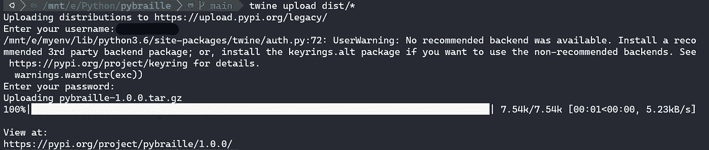

# 如何创建 python 包并发布到 PyPI

> 原文：<https://medium.com/analytics-vidhya/how-to-create-a-python-package-and-publish-to-pypi-7e1b548add14?source=collection_archive---------7----------------------->


python 包索引(PyPI)是由开源 python 社区贡献的 Python 包的存储库，以帮助他人。创建包的目的是什么？没有它们，我们将不得不依赖于通过复制/粘贴来共享代码，这是没有效率的。一个包可以包含从 API 获取数据、对输入进行操作等代码。让我们看一个我创建的将文本转换成盲文的 python 包的例子，以及发布到 PyPI 的步骤。

## **第一步:设置文件夹结构**

按照下面所示的格式创建一个文件夹结构。主包文件夹名称应该与您的包名称相同。包含代码的文件夹可以命名为任何名称。在这里，我保留了与主包文件夹相同的名称。

```
.
└── pybraille (main package folder)
    └── pybraille (folder that contains your code)
        └── your code here
```

## **第二步:添加你的代码**

将所有类或脚本文件放在包含代码的文件夹中，并添加 __init__。py 文件。__init__。py 文件应该包含导入语句，以便只公开您希望用户访问的必需的类和函数。`from pybraille.main import convertText, convertFile`

此外，您可以在 __init__ 中添加名为 __all__ 的列表。包含模块名称的 py 文件。这允许用户在遇到`from package import *`时导入 __all__ 变量中提到的所有模块名。
`__all__ = [‘convertText’, ‘convertFile’]`

## **第三步:创建安装文件**

在主包文件夹中创建一个 setup.py 文件。这个安装文件包含告诉 pip 如何安装软件包的信息。

*   find_packages()将自动查找主包文件夹中的所有包。
*   关键字是用户搜索 python 包时应映射到包的字符串列表。
*   分类器帮助 PyPI 中的用户根据特定标准进行过滤。
*   将版本号设置为低于 1.0.0，表示您的软件包不是稳定版本(如果适用)。

```
from setuptools import setup, find_packages
setup(
 name=’package name,
 version='package version',
 description='package description',
 url='Github Url', 
 author='Your name',
 author_email='Your email',
 classifiers=[
   'Development Status :: 5 - Production/Stable',
   'Intended Audience :: Education',
   'Operating System :: OS Independent',
   'License :: OSI Approved :: MIT License',
   'Programming Language :: Python :: 3',
   'Programming Language :: Python :: 3.5',
   'Programming Language :: Python :: 3.6',
   'Programming Language :: Python :: 3.7',
   'Programming Language :: Python :: 3.8',
 ],
 keywords=['python', 'braille', 'text to braille'],
 packages=find_packages()
)
```

## 步骤 4:测试设置

运行这个命令:`python setup.py sdist` 这会在文件夹中创建一堆文件。主文件将是在“dist”文件夹中创建的 tar.gz 文件，最终发布到 PyPI。

现在你可以在本地安装你的包，并使用命令
`pip install -e ./`测试它

安装完成后，您可以在主包文件夹中启动 python 终端，并测试您的包是否工作。


在本地测试您的包

## **第五步:添加所需文件**

要添加 gitignore 文件，我推荐使用这个网站:【https://www.toptal.com/developers/gitignore[。
在搜索栏中输入“Python ”,它会显示文本，你可以将其复制到 gitignore 文件中。](https://www.toptal.com/developers/gitignore)

选择许可证可能会令人困惑。你可以看看这个网站[https://choosealicense.com/](https://choosealicense.com/)来帮你选择执照。将复制的文本粘贴到一个文件中，并将其命名为 LICENSE.txt。

添加一个 README.md 文件来记录任何安装步骤以及如何使用库。要使这个自述文件成为 PyPI 下的正式文档，请将以下内容添加到 setup.py 文件中。

```
with open("README.md", "r") as rd:
  long_description = rd.read()setup(
...
  long_description=long_description,
  long_description_content_type="text/markdown",
...  
)
```

如果您有任何库依赖项，请将其添加到 setup.py 文件中

```
setup(
...
  install_requires=[
    "any-library ~= 1.0"
  ]
...  
)
```

通过运行以下命令，无论何时对 setup.py 文件进行更改，都可以在本地测试您的包:

```
python setup.py sdist
pip install -e ./
```

## **步骤 6:编写测试**

在将代码投入生产之前测试它总是更好的。因此，在主包文件夹下创建一个“tests”文件夹，并在那里添加您的测试。我在开发中使用“pytest”进行测试。


运行您的测试

您可以使用“tox”来针对多个 python 发行版测试您的代码。安装 tox 并在主包文件夹中创建一个 tox.ini 文件。

```
[tox]
envlist = py36, py37

[testenv]
deps = pytest
commands = pytest
```

envlist 指定了测试代码的不同发行版。使用`tox`命令运行测试。

## **第七步:发布**

最后，您的文件夹结构应该如下所示:

```
.
└── pybraille
    ├── build
    ├── dist
    │   └── pybraille-0.1.0.tar.gz
    ├── pybraille
    │   ├── main.py
    │   └── __init__.py
    ├── .gitignore
    ├── LICENSE.txt
    ├── README.md
    ├── setup.py
    └── tox.ini
```

当您准备好发布包时，运行`python setup.py sdist` 命令在 dist 文件夹中创建一个 tar.gz 文件。确保它不会抛出任何错误。


正在为您的包创建 dist

在 PyPI 网站([https://pypi.org/](https://pypi.org/))创建一个账户。

使用 twine 将您的包上传到 PyPI。首先安装 twine 包，然后使用下面的命令发布包:

```
twine upload dist/*
```

系统将提示您输入用户名和密码。如果上传成功，它会吐出你的包的网址。



正在将包上传到 PyPI

您的包已上传到 PyPI。👏 🎉 🎉现在每个人都可以从 PyPI 安装你的包了。