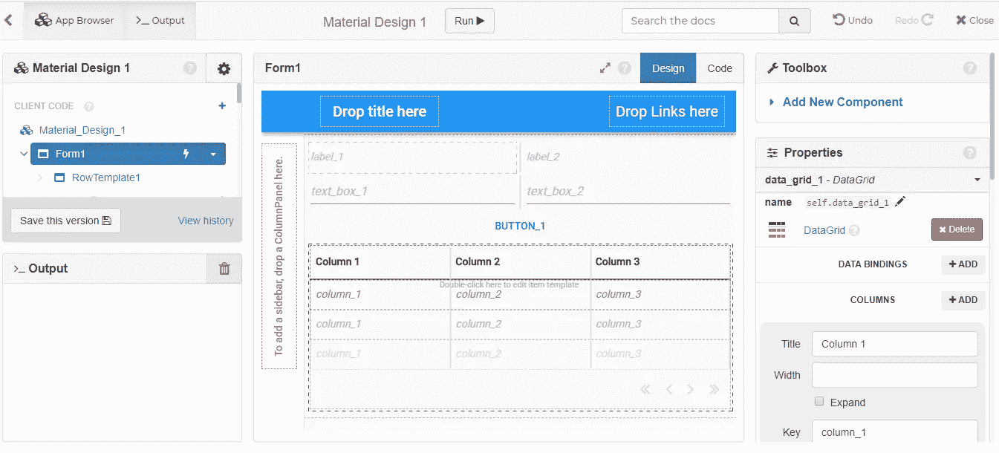

# 如何使用 python 为船只的 ETA API 创建一个简单的 web 应用程序？

> 原文：<https://medium.com/analytics-vidhya/how-to-create-a-simple-web-app-for-a-vessels-eta-api-using-python-db485182a8c2?source=collection_archive---------4----------------------->

# 1.埃塔和 API

预计到达时间或其他 ETA 是最常见的术语，用于了解船只何时到达其目的地，通常称为停靠港。与其他运输工具一样，时间是“估计”的，因为恶劣的天气条件、船只的速度性能等可能会造成延迟。ETA 对于货物和液体产品的及时交付以及苏伊士和巴拿马的运输是如此重要。

应用编程接口 [(API)](https://www.mulesoft.com/resources/api/what-is-an-api) 是最新的技术趋势之一，最大的优势是让两个不同的软件互相对话。现在，将 eta 和 API 混合在一起非常有趣，因为它给了我们开发自己的 web 应用程序的能力。我们还可以为我们的决策和用户需求选择必要的信息。

# 2.教程的工具

在本教程中，我将介绍一个简单的方法来创建一个简单的网络应用程序的船只预计到达时间的 API。API 的调用就是几行的事情，让我们的生活更轻松！

我将使用 [MarineTraffic API](http://marinetraffic.com/) 服务和一个基于 python 的可视化 web 应用构建器 [Anvil](http://anvil.works/) 作为它的 web 堆栈。

使用 Anvil 使事情变得更容易，因为我们可以专注于 python 代码的基础工作，而不用担心后端，这是一个很大的优势。Anvil 是一个免费增值产品，它允许我们试验我们的代码并发布我们的应用程序。

MarineTraffic 提供关于船只活动和船只在海港和港口的当前位置的实时信息。我正在使用 API 服务港口调用(EV01 ),它保存了船只的 ETA 信息，包括 MMSI 和 IMO 号码以及最后一个港口的详细信息。

对于 MarineTraffic API，用户需要购买配额或订阅(按月或按年)。虽然没有免费增值选项，但 MarineTraffic 的伟大之处在于我可以订阅一个 API，并且可以立即拥有它。

让我们开始潜水吧！

# 3.砧座设置

Anvil 应用程序包含以下内容:

*   用户界面，您可以在其中使用拖放构建器来设计您的界面
*   客户端 Python 代码，在 web 浏览器中运行
*   服务器端 Python 代码，连接到 Anvil 的服务器
*   一个内置的数据库(数据表)，它将您的数据存储在一个类似电子表格的表格中

我不会在如何开始上花费时间，更多信息可以在这里找到[。](https://anvil.works/docs/editor)

## 用户界面

砧有一个拖放生成器，这使得事情在界面上更容易。在我们的教程中，我们使用了以下[基本组件](https://anvil.works/docs/client/components/basic):

*   标签
*   正文框
*   纽扣
*   数据网格

通过拖放客户端代码>表单 1 一节中提到的必要组件，界面开始成形，如下所示。



对于每个组件，我们可以使用属性面板来更改所选组件的属性。正如您在下图中看到的，通过单击按钮，我们可以在文本属性字段中完成标题。同样，对于数据网格组件，您需要为每一列填写标题。我们将在下一节中更多地讨论从 API 服务中选择列。


当必要的标题准备好了，最终版本将看起来像下面的截图。您现在不需要担心接口中的代码。在下一节中，我将向您展示如何执行与服务器代码的必要连接。


## MarineTraffic API

现在我们已经完成了我们的界面，我正在介绍将用于 web 应用程序的 MarineTraffic API 服务。这是到达港口(VI07) 的[T3【预计到达时间】](https://www.marinetraffic.com/en/ais-api-services/documentation/api-service:vi07/_:5c9b624402b79f7ce7bfc73b795ea28e)并获取我们案例中特定船只的最新到达和离开时间。要调用 VI07 API，我们需要知道两件事:

*   即将到来的呼叫标识端口
*   血管编号

如何获取港口和船舶标识变得有点棘手，以下是如何快速访问它们的方法。在我们的教程中，我使用的是马耳他的集装箱船 CMA CGM COLUMBA 和港口 MARSAXLOKK。一旦您在 MarineTraffic 搜索了您想要的船只或港口，您会在 URL 中注意到它的 id。这里，黄色框表示它们在 URL 中的位置。


谈到 API 响应，MarineTraffic 有两个数据级别。这些都是简单和扩展的响应。扩展响应使用更多的信用。

对于我们的 web 应用程序，我们只需要当前端口的预计到达时间——简单的响应。


## 服务器代码

[请求库](https://requests.readthedocs.io/en/master/)是 Python 中发出 HTTP 请求的唯一标准。它消除了简单漂亮的 API 背后的请求复杂性。

由于请求已经安装在砧 python 框架中，导入库看起来如下:

```
import requests
```

在本教程中，我们还将导入下面的 python 库和对象。因为我们使用的是砧座数据表，所以我们只需要调用它们。

```
from anvil.tables import app_tables
import anvil.tables.query as q
import anvil.tables as tables
import anvil.server
import datetime
import requests
import json
```

HTTP 方法比如 GET 和 POST，决定了当你发出一个 HTTP 请求时你要执行的动作。

最常见的 HTTP 方法之一是 GET。GET 方法表示您正在尝试从指定的资源中获取或检索数据。为了发出 GET 请求，我们使用 requests.get()。

在示例中，我使用 API 简单响应:

*   端口 ID
*   船舶 ID
*   响应类型的 JSONO

端点 URL 如下:

```
response = requests.get(f"https://services.marinetraffic.com/en/api/etatoport/Enter your API key from MarineTraffic/portid:{port_id}/shipid:{ship_id}/protocol:jsono/msgtype:simple").json()[0]
```

我选择从端点 URL 中提取的数据列如下。还要注意，分配的键(来自 datagrid 组件——参见 Interface 一节)与简单响应表中相应的字段名相匹配。我们的响应存储在 Anvil 数据表中。

*   端口标识=端口标识
*   发货标识=发货标识
*   MMSI =回应['MMSI']
*   IMO =响应['IMO']
*   LAST _ PORT = response[' LAST _ PORT ']
*   最后一个端口标识=响应['最后一个端口标识']
*   LAST _ PORT _ UNLOCODE = response[' LAST _ PORT _ UNLOCODE ']
*   LAST _ PORT _ TIME = datetime . datetime . strptime(response[' LAST _ PORT _ TIME ']，" %Y-%m-%d %H:%M:%S ")
*   下一个端口名称=响应['下一个端口名称']
*   下一个端口解锁代码=响应['下一个端口解锁代码']
*   ETA _ CALC = datetime . datetime . strptime(响应['ETA_CALC']，" %Y-%m-%d %H:%M:%S ")

通过完成 GET 请求并选择适当的数据列，我们的服务器代码是:

```
@anvil.server.callable
def make_marine_request(port_id, ship_id):
  response = requests.get(f"https://services.marinetraffic.com/en/api/etatoport/Enter your API key from MarineTraffic/portid:{port_id}/shipid:{ship_id}/protocol:jsono/msgtype:simple").json()[0]

  app_tables.marine_test.add_row(
    PORT_ID=port_id,
    SHIP_ID=ship_id,
    MMSI=response['MMSI'],
    IMO=response['IMO'],
    LAST_PORT=response['LAST_PORT'],
    LAST_PORT_ID=response['LAST_PORT_ID'],
    LAST_PORT_UNLOCODE=response['LAST_PORT_UNLOCODE'],
    LAST_PORT_TIME=datetime.datetime.strptime(response['LAST_PORT_TIME'], "%Y-%m-%d %H:%M:%S"),
    NEXT_PORT_NAME=response['NEXT_PORT_NAME'],
    NEXT_PORT_UNLOCODE=response['NEXT_PORT_UNLOCODE'],
    ETA_CALC=datetime.datetime.strptime(response['ETA_CALC'], "%Y-%m-%d %H:%M:%S"),
    CREATED=datetime.datetime.utcnow()
  )

  return response @anvil.server.callable
def get_marine_api_records():
  return app_tables.marine_test.search(tables.order_by("CREATED", ascending=False))
```

## 客户代码

转到最后一步，最重要的是链接服务器和客户机代码，这样它们就可以相互通信。这通过以下方式实现:

*   在文本框中填写运输 ID 和港口 ID
*   点击按钮
*   将必要的 API 输入添加到数据表中。

为了实现这一点，我们调用 submit_button_click 函数。在 Anvil 中，其被称为[事件](https://anvil.works/docs/client/components#events)，同样位于按钮组件底部的属性:


对于船和港口 id，我们简单地将它们指定为文本框变量。

```
port_id = self.text_box_1.text
ship_id = self.text_box_2.text
```

现在，让我们在单击按钮时调用 make_marine_request 和 get_marine_api.records 服务器函数，并将用户输入传递给数据表。我们通过将服务器函数修饰为@anvil.server.callable，使其对客户端代码可用。

这意味着我们可以使用 anvil . server . call(' make _ marine _ request ')和 anvil . server . call(' get _ marine _ API _ records ')从客户端代码中调用它

现在我们可以从 submit_button_click 函数调用这两个服务器函数:

```
response = anvil.server.call('make_marine_request', port_id=port_id, ship_id=ship_id)
self.repeating_panel_1.items = anvil.server.call('get_marine_api_records')
```

更详细的例子可以在 Anvil 教程[“点击事件”](https://anvil.works/learn/tutorials/feedback-form/chapter-4)中找到。通过完成客户端代码步骤，我们的最终版本是:

```
from ._anvil_designer import GeneralTemplate
from anvil import *
import anvil.tables as tables
import anvil.tables.query as q
from anvil.tables import app_tables
import anvil.serverclass General(GeneralTemplate):
  def __init__(self, **properties):
    # Set Form properties and Data Bindings.
    self.init_components(**properties)

    self.repeating_panel_1.items = anvil.server.call('get_marine_api_records') # Any code you write here will run when the form opens. def button_1_click(self, **event_args):
    """This method is called when the button is clicked"""
    port_id = self.text_box_1.text
    ship_id = self.text_box_2.text
    response = anvil.server.call('make_marine_request', port_id=port_id, ship_id=ship_id)
    self.repeating_panel_1.items = anvil.server.call('get_marine_api_records') def text_box_1_pressed_enter(self, **event_args):
    """This method is called when the user presses Enter in this text box"""
    pass def text_box_2_pressed_enter(self, **event_args):
    """This method is called when the user presses Enter in this text box"""
    pass
```

一旦我们在 Anvil.works 中运行我们的 web 应用程序并填写必要的输入——集装箱船 CMA CGM COLUMBA 和马耳他的 MARSAXLOKK 港——我们就可以清楚地看到船只的预计到达时间。


# 4.最终注释

在本教程中，我介绍了如何通过调用船只预计到达时间 API 来创建一个简单的 web 应用程序。请自由提出你的问题。我很高兴听到你过得怎么样！