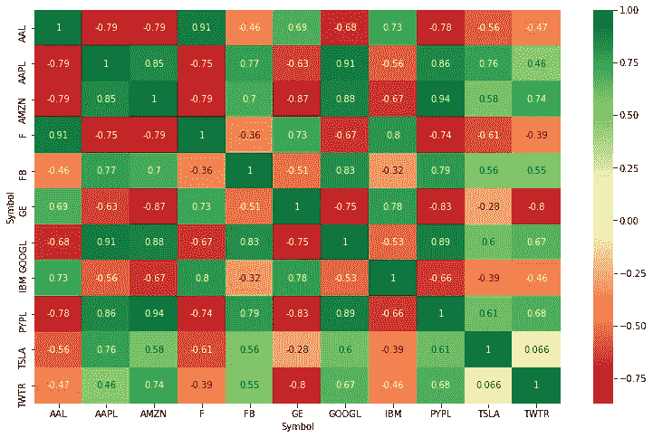

# 如何在 python 中创建股票相关性矩阵

> 原文：<https://medium.com/analytics-vidhya/how-to-create-a-stock-correlation-matrix-in-python-4f32f8cb5b50?source=collection_archive---------1----------------------->

在本教程中，我将带你通过一个简单的方法来相互关联各种股票。我们将使用 python 获取所选股票的价格，将它们放入一个干净的数据框架中，运行相关性，并可视化我们的结果。

1.  **导入库**

```
import numpy as np 
import pandas as pd 
# Used to grab the stock prices, with yahoo 
import pandas_datareader as web 
from datetime import datetime 
# To visualize the results 
import matplotlib.pyplot as plt import seaborn
```

**2。选择报价机列表并选择日期范围**

```
start = datetime(2017, 1, 1)
symbols_list = ['AAPL', 'F', 'TWTR', 'FB', 'AAL', 'AMZN', 'GOOGL', 'GE', 'TSLA', 'IBM', 'PYPL']#array to store prices
symbols=[]
```

**3。拉动股价，推进干净的数据框架**

```
#array to store prices
symbols=[]
for ticker in symbols_list:     
    r = web.DataReader(ticker, 'yahoo', start)   
    # add a symbol column   
    r['Symbol'] = ticker    
    symbols.append(r)# concatenate into df
df = pd.concat(symbols)
df = df.reset_index()
df = df[['Date', 'Close', 'Symbol']]
df.head()
df_pivot=df.pivot('Date','Symbol','Close').reset_index()
df_pivot.head()
```

**4。现在，我们可以进行关联。使用熊猫的“corr”函数计算每对股票之间的皮尔逊相关系数**

```
corr_df = df_pivot.corr(method='pearson')
#reset symbol as index (rather than 0-X)
corr_df.head().reset_index()
#del corr_df.index.name
corr_df.head(10)
```

**5。最后，我们可以绘制相关性的热图(使用 Seaborn 和 Matplotlib)来更好地可视化结果:**

```
plt.figure(figsize=(13, 8))
seaborn.heatmap(corr_df, annot=True, cmap=’RdYlGn’)
plt.figure()
```

