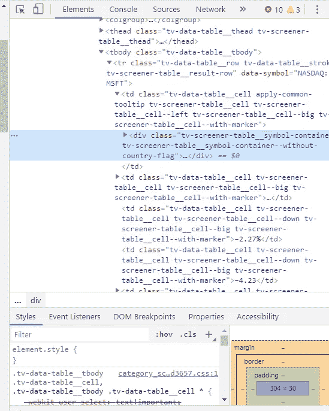
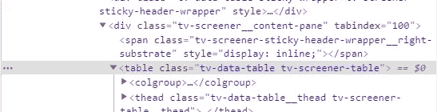

# 如何使用 Ruby 创建股市观察者？

> 原文：<https://medium.com/analytics-vidhya/how-to-create-a-stock-market-watcher-using-ruby-edcd2c69ee76?source=collection_archive---------21----------------------->


对于我写的第一篇文章，我决定写关于网络抓取以及我如何使用 Ruby 和 Nokogiri Gem 构建一个股市观察器。

首先遵循本指南的一些要求:

1.  红宝石
2.  HTML/CSS 基础知识

本指南的目的是展示你可以使用 Ruby 做什么，也许在那里你会找到更好/更专业的方法。

包含本指南中使用的完整代码的 repo 将在文章末尾链接。

我们开始吧

首先，设置您的环境，创建一个 ruby 文件，其中包含我们的 scrapper 代码。

在这种情况下，我将创建一个名为 stock_watcher.rb 的文件，并向其中添加以下代码。

```
#stock_watcher.rb
require ‘nokogiri’
require ‘open-uri’
```

这段代码需要一个名为 Nokogiri 的 Ruby Gem(帮助我们处理从网站提取的数据)和 open-uri 模块来从 web 中提取数据。

在此之后，我们需要定义我们将从哪里为我们的 scrapper 获取数据，在这里，您可以使用任何网站，对于本指南，我将使用 TradingView 数据。

现在定义了源，我们需要从页面中获取数据，Nokogiri 得到了一些有用的解析方法来帮助我们，我们将使用 Nokogiri::HTML 解析器，因为我们正在抓取 HTML 页面。

将以下代码添加到 stock_watcher.rb 中

```
#stock_watcher.rb
page = Nokogiri::HTML(URI.open(‘https://www.tradingview.com/markets/stocks-usa/market-movers-large-cap'))
```

这个简单的使用 URI 模块从 web 上获取数据，并使用 Nokogiri 解析它，它返回一个 Nokogiri::HTML::Document。

有了 page 对象，我们就有了一堆有用的方法。

现在我们必须使用我们的 HTML/CSS 确认来定义从页面上的什么地方获取数据。Chrome dev tools 是这里的好朋友。

出现问题的页面是[https://www . trading view . com/markets/stocks-USA/MARKET-movers-large-cap/](https://www.tradingview.com/markets/stocks-usa/market-movers-large-cap/)，这个页面向我们展示了按大盘股排序的美国股市公司。这个页面在主表上存储数据，正如你所看到的，我们需要找到一种方法来识别这个表。

Nokogiri 为我们提供了一个名为“css”的方法，让我们在 Nokogiri::HTML::文档中搜索特定的 CSS 规则，我们可以搜索特定的 CSS 类、id 等…

让我们尝试使用 Chrome inspect 工具找出表的类或 ID，只需右键单击任何表元素，然后进行检查，您会发现一个类似的窗口:



滚动一点直到你找到像这样的标签:



正如您所看到的，我们的表使用了“tv-data-table”类，该类将成为我们的目标类。

现在我们有了表类，将下面的代码添加到 stock_watcher.rb 中:

```
#stock_watcker.rb
table = page&.css(‘.tv-data-table’);
```

这段代码获取我们的 page 对象，找到一个分配了“tv-data-table”类的 HTML 元素，并返回一个 Nokogiri::XML::NodeSet。

我们从表中唯一需要的是表数据，表数据(td)存储在表行(tr)中。Nokogiri::XML::NodeSet 提供了更有用的方法，允许我们在其中搜索特定的键。

将以下代码添加到 stock_watcher.rb 中:

```
#stock_watcker.rb
rows = table.search(‘tr’);
```

这将返回另一个 Nokogiri::XML:NodeSet，其中包含来自包含“tr”的表的键和值的子集。

我们正在接近我们的目标。

现在将以下代码添加到 stock_wacher.rb 中:

```
#stock_watcher.rb
rows.each do |row|stock_content = row.search(‘td’).map { |td| td.text.strip }stock_content[0]&.gsub!(“\n\t\t\t\t\t\t\t\t\t”, “ “)end
```

现在，我们迭代 XML 子集，在本例中，是包含股票数据的行。然后，我们使用相同的方法 search 在每一行中搜索表数据(td ),它返回一个包含迭代行的所有数据的数组。我们需要剥离我们的文本，因为 Nokogiri 在我们的字符串中返回了大量无用的文本。

现在您可以使用这段代码，尝试使用“puts stock_content”在最后一段代码的 end 关键字之前打印您得到的股票内容，看看您得到了什么，它应该会返回类似下面的内容:

["MSFT 微软公司"，" 182.51 "，" 2.27% "，"-4.23 "，"买入"，" 1384.054B "，" 31.09 "，" 6.06 "，" 144000.00 "，"技术服务"]"

有了这些数据，谁来定义下一步应该做什么是你，有数以千计的可能性可以用它来做什么，我会给出几个例子:将数据存储在一个文件中供以后检查，将数据存储在一个数据库中供以后处理，甚至在另一个网站上显示数据(首先检查许可)，如果股票价格是你想要的价格，创建触发器。我说过，有很多可能性。

现在，为了完成本指南，我创建了一个类来处理我们从上一段代码中获得的数据。

首先，在同一个文件夹中创建另一个名为 stock.rb 的文件，并添加以下代码:

```
class Stockattr_reader :name, :last, :change_percentage, :change_value, :rating, :vol, :market_capdef initialize(stock_data)@name = stock_data[0]@last = stock_data[1]@change_percentage = stock_data[2]@change_value = stock_data[3]@rating = stock_data[4]@vol = stock_data[5]@market_cap = stock_data[6]endend
```

我不打算解释 Ruby 上的类是如何工作的，因为这不是本指南的目的。但基本上，该类接收我们在“stack_content”变量上获得数据，并优雅地存储它。

现在替换 stock_watcher.rb 文件中的整个代码，如下所示:

```
require ‘nokogiri’require ‘open-uri’require_relative ‘stock’page = Nokogiri::HTML(URI.open(‘https://www.tradingview.com/markets/stocks-usa/market-movers-large-cap'))table = page&.css(‘.tv-data-table’);rows = table.search(‘tr’);stock_arr = []rows.each do |row|stock_content = row.search(‘td’).map { |td| td.text.strip }stock_content[0]&.gsub!(“\n\t\t\t\t\t\t\t\t\t”, “ “)stock_arr << Stock.new(stock_content) if stock_content.length.positive?end
```

它需要我们的新类文件，创建一个名为 stock_arr 的新数组，并在其上存储每个新的 stock 对象。

如果你在 stock_arr 上打印第一个对象，你会得到这样的结果:" # <0x00007fffd443e2f8 microsoft="" corp.="">"

如您所见，这是存储股票的更好方式，您可以使用点符号访问其属性，如 stock.name、stock.last、stock.change_value 等…

感谢您阅读本指南，我希望它在某些方面对您有所帮助。

请随时通过以下社交媒体联系我:

推特:[https://twitter.com/iKazumaki](https://twitter.com/iKazumaki)

GitHub:[http://github.com/kazumaki/](http://github.com/kazumaki/)

领英:[https://www.linkedin.com/in/vcamposcarvalho/](https://www.linkedin.com/in/vcamposcarvalho/)

## 有用的链接:

完整的代码库:[https://github.com/kazumaki/stock-market-watcher](https://github.com/kazumaki/stock-market-watcher)

TradingView 网站:【https://www.tradingview.com/ T3

Nokogiri 文档:【https://nokogiri.org/rdoc/index.html 