# 如何使用 Node.js 和 Heroku 创建一个 Twitter Bot

> 原文：<https://medium.com/analytics-vidhya/how-to-create-a-twitter-bot-using-node-js-and-heroku-867891f44811?source=collection_archive---------13----------------------->


使用 Node.js 和 Heroku 的 Twitter bot

M 制作 twitter 机器人是使用 Twitter API 的众多用例之一。机器人可以用来增强你的业务，通过自动回复帮助客户，自动转发特定的条款，等等。

这篇文章是关于我如何使用 Node.js 创建`[The Data Science Bot](https://twitter.com/datasciencebot_)`的。

# 目录

1.  申请一个 Twitter 开发者账户
2.  在 twitter 上创建应用程序
3.  设置开发环境
4.  在 Node.js 中编写代码
5.  部署到 Heroku
6.  避免重复转发


没有再费周折

# 第一步:申请 Twitter 开发者账户

对我来说，这是最重要的一步，也可能是最困难的一步。

*   登录[推特](https://twitter.com)
*   前往 developers.twitter.com[点击“申请开发者账户”](https://developer.twitter.com/en/apply-for-access)
*   选择应用类型，即学生/企业/业余爱好者等。
*   提及你申请的目的。在这里尽可能具体一些。

## 在申请之前，请确保您已经通读了[开发者协议和政策](https://developer.twitter.com/en/developer-terms/agreement-and-policy)、[自动化规则](https://help.twitter.com/en/rules-and-policies/twitter-automation)和[Twitter 规则](https://help.twitter.com/en/rules-and-policies/twitter-rules)

> 不符合这些条件将导致你的申请被拒绝

**阅读关于[如何申请 twitter 开发者账户](/@sumedh.patkar19/beginners-guide-how-to-apply-for-a-twitter-developer-account-763cda3af109)的完整文章**

# 第二步:在 twitter 上创建应用

在您的 twitter 开发者账户获得批准后*执行此操作。*

*   在 apps.twitter.com 创建一个应用程序。填写所需的详细信息。
*   生成 API 密钥。点击您的应用详情并导航至`Keys and tokens`

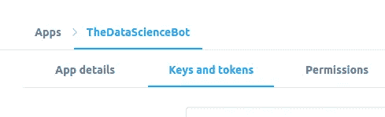

导航到“密钥和令牌”并单击“生成”

> *⚠️* ***警告*** *(任何情况下都不要泄露 API 密钥)。*

# 步骤 3:设置开发环境

确保您的 PC 上安装了 Node.js 和 npm。

对于 Ubuntu，使用以下命令安装

```
sudo apt install nodejs
sudo apt install npm
```

对于其他发行版，点击[此处](https://nodejs.org/en/)获取安装说明。

创建一个名为`your-botname`的目录。
在我的例子中，我把它命名为`the-datascience-bot`。

要初始化 git 环境并使用`npm`安装包`twit`，请在`your-botname`目录的中输入以下命令*:*

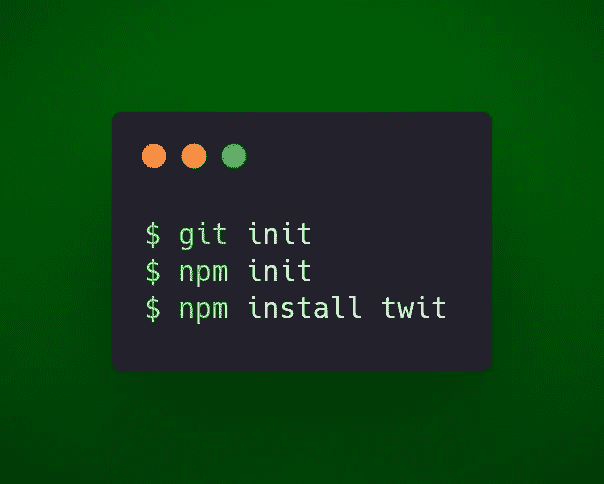

设置开发环境

恭喜你！您已经成功地设置了 Node.js 开发环境🎉🎉

# 第四步:编码

*   首先我们要认证`twit`。为此，我们将使用生成的 *API 键*链接我们的 twitter 应用和代码。

创建一个名为`config.js`的文件，并将下面的代码放入其中。

**config.js**

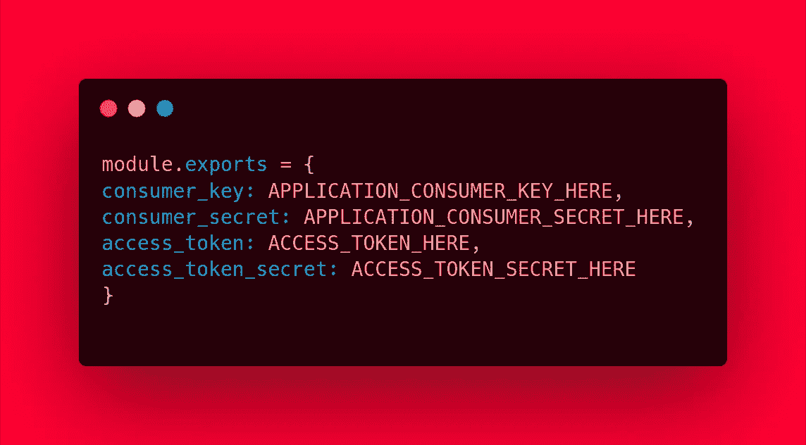

配置文件

把你的钥匙从你的 twitter 应用仪表板上复制下来。

*   接下来，我们在文件`bot.js`中编写机器人的代码。

这是代码。

**bot.js**

bot.js

我们来分解一下。

*   我们使用来自`config.js`的配置细节初始化 twit 对象
*   retweet 函数首先为给定的搜索查询调用`search/tweets` API 端点。在我的例子中，查询是 ***'#DataScience 或#DataVisualization'***
*   我们将以下参数传递给搜索 API

1.  `q`:搜索查询
2.  `result_type`:*‘混合’*最新的以及流行的旧推文
3.  `count`:一次检索的推文数量

*   检索到的 [JSON](https://developer.mozilla.org/en-US/docs/Learn/JavaScript/Objects/JSON) 对象有一个包含#DataScience 或#DataVisualization 的 tweets 列表。
*   然后，我们将每个 tweet IDs 传递给`statuses/retweet/:id` API 端点，后者转发该 tweet。
*   使用`setInterval`功能每分钟运行一次功能

> *详细的 API 参考指南为* [*搜索*](https://developer.twitter.com/en/docs/tweets/search/api-reference/get-search-tweets) *和* [*转发*](https://developer.twitter.com/en/docs/tweets/post-and-engage/api-reference/post-statuses-retweet-id) *。*

使用以下命令在本地测试 bot:

```
node bot.js
```

你的推特时间表应该显示转发。

如果不工作，尝试在控制台上调试。

# 步骤 5:部署到 Heroku

*   在 [Heroku](https://www.heroku.com/) 上创建一个账户
*   在 Heroku 上创建一个名为“你的机器人名”的应用程序

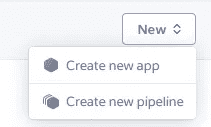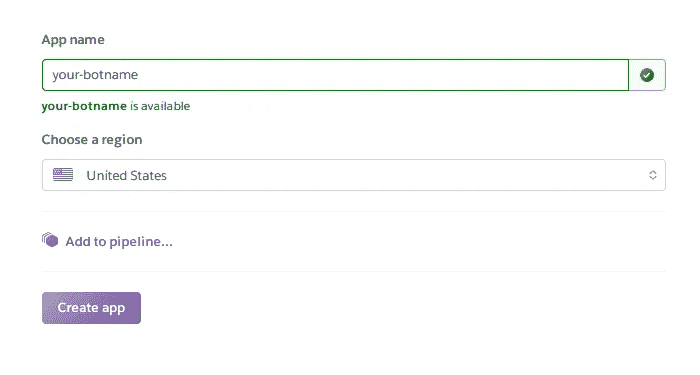

在 Heroku 上创建新的应用程序

> *确保您的本地项目目录的名称* ***与您的 Heroku 项目名称*** *完全相同。*

*   在你的电脑上安装 **heroku-cli**

如果你有一个基于 Ubuntu/Debian 的发行版，那么使用下面的命令来安装

```
curl https://cli-assets.heroku.com/install-ubuntu.sh | sh
```

对于其他环境，安装说明可在处找到

*   创建一个名为“Procfile”的文件，其代码如下

## Procfile

```
worker: node bot.js
```

*   登录 heroku CLI

```
$ heroku login
```

这将在 Heroku 上打开一个登录链接，你必须输入你的密码。

*   使用以下命令部署到 Heroku

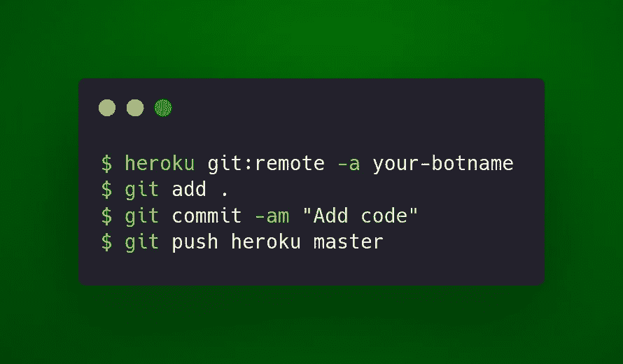

部署到 Heroku

## 最后一步

启动*`*worker*`*dyno*on*Heroku。**

*   **去[dashboard.heroku.com/apps](https://dashboard.heroku.com/apps)点击你的机器人应用。**
*   **然后，点击配置 Dynos**

**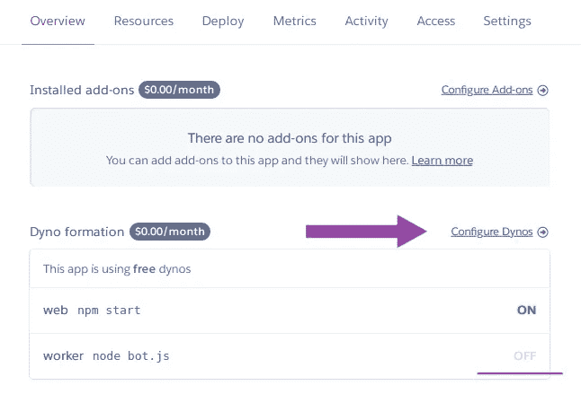**

**配置工作动态**

*   **启动`worker` dyno 并点击确认**

**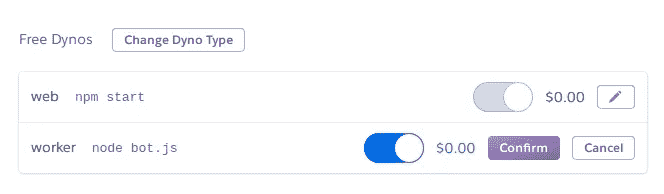**

**启动工作动力**

# **你的机器人准备好了！🎉🎉**

****

**准备服从！**

# **第六步:如何避免重复转发**

**在我们编写
`//more code here later..`的 for 循环中添加以下代码**

**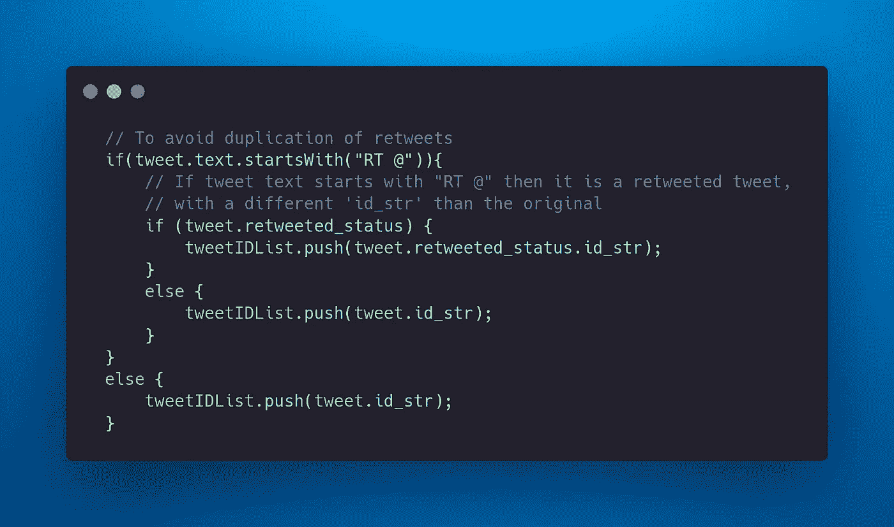**

**检查重复**

**然后在循环之外-**

**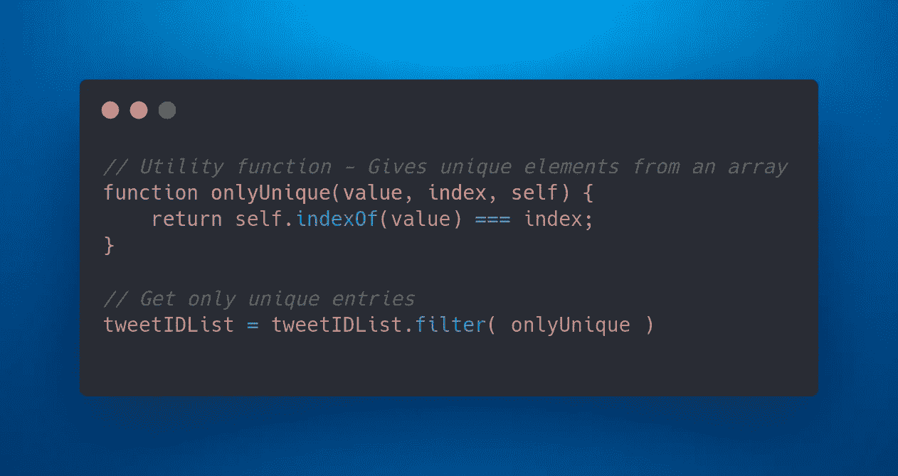**

**仅过滤唯一的 tweetIDs**

**实用函数`onlyUnique`也可以写在 retweet 函数之外。**

**这将让我们的机器人避免重复转发。**

*****上面代码的简短说明*****

*   **每条推文都有一个独特的属性`id_str`。
    如果你转发了某人的推文，它会有不同的`id_str`。**
*   **搜索 API 会找到原始推文和被转发的推文。**
*   **当我们调用`statuses/retweet/:id` API 端点时，它会转发所有的端点。**
*   **对于一个 Twitter 新手来说，看起来你的机器人已经转发了同样的东西两次或更多次。**

## **类似这样的东西👇**

**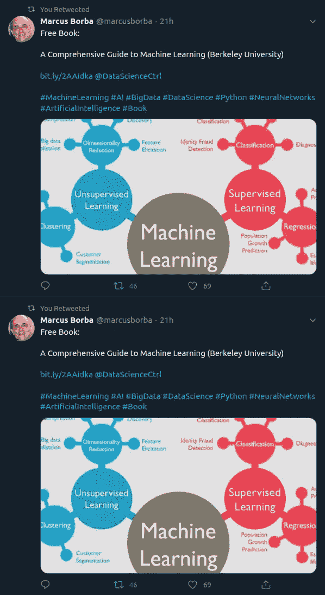**

**重复转发**

*   **如果推文以“RT @”开头，那么它是一条被转发的推文，与原始推文的`id_str`不同。我们获取**原始推文**的`id_str`，并使用`onlyUnique`函数过滤重复的推文**

> **使用 API 可以做更多的事情。查看 API 参考([https://developer.twitter.com/en/docs/api-reference-index](https://developer.twitter.com/en/docs/api-reference-index))了解更多细节。**

# **数据科学机器人**

****

**推特上的@datasciencebot_ 上**

**这是我创造的机器人**

**机器人转发带有标签[#数据科学](https://twitter.com/search?q=%23DataScience)和[#数据可视化](https://twitter.com/search?q=%23DataVisualization)的推文**

**这是我的机器人[https://twitter.com/datasciencebot_](https://twitter.com/datasciencebot_)的链接**

**请照此办理！:P**

# **源代码**

**完整的源代码可以在这里获得-**

**[](https://github.com/Sumedh-Patkar/the-datascience-bot) [## sume DH-pat kar/the-data science-bot

### 一个转发标签为#数据科学，#数据可视化解散的推特机器人 GitHub 拥有超过 50 个…

github.com](https://github.com/Sumedh-Patkar/the-datascience-bot)** 

**好吧，就这样！**

**这是我第一篇关于媒体的技术文章**

****

**我有吗？让我知道！:)**

**任何反馈都将不胜感激！**

**感谢阅读！😊**

****

**鳍。**